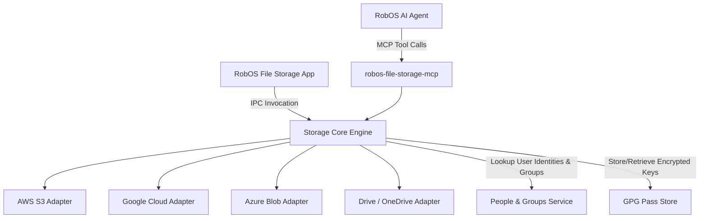

# Feature Spec: RobOS File Storage & MCP Agent-Driven File Sharing

- **Status**: Draft
- **Created Date**: 2026-09-03
- **Target Component**: Desktop Apps (`packages/file-storage`), MCP Server Tools, `packages/people-directory`, `packages/group-manager`
- **Author/Idea Source**: User Idea

## 1. Overview & Vision
Modern software teams handle diverse assets alongside source code: design specs, architecture diagrams, build artifacts, test datasets, logs, client documents, and media. These assets typically reside in heterogeneous cloud storage systems (AWS S3, Google Cloud Storage, Azure Blob Storage, Google Drive, Microsoft OneDrive, Nextcloud/WebDAV) accessed via complex SDK credentials, web consoles, or disjointed CLI tools.

This feature introduces the **RobOS File Storage App (`packages/file-storage`)** and an accompanying **MCP Storage & Sharing Engine**. RobOS File Storage acts as a unified, high-performance desktop wrapper over major cloud storage providers via SDK keys and OAuth tokens. 

Furthermore, by integrating with the **RobOS People & Groups directory**, **RobOS AI Agents (via MCP)** gain the ability to inspect files/folders, generate pre-signed share links, manage cloud access control lists (ACLs), and securely share assets directly with designated RobOS users and teams.

## 2. User Stories & Use Cases
- **As a** developer or DevOps engineer,
- **I want a** unified RobOS File Storage desktop app configured with my cloud storage credentials (AWS S3, GCS, Azure Blob, Google Drive, OneDrive),
- **So that** I can browse, upload, preview, and organize cloud buckets and folders without leaving the RobOS desktop environment.

- **As a** developer collaborating with an AI agent in RobOS,
- **I want to** instruct the agent: *"Upload the benchmark results to our team S3 bucket and share the folder with @sarah and the @qa-team"*,
- **So that** the AI agent leverages MCP tools and the People/Groups directory to upload the files and configure appropriate sharing permissions automatically.

- **As a** team member,
- **I want to** receive a notification and direct link in RobOS when a file or directory is shared with me by an AI agent or teammate,
- **So that** I can immediately access and download the asset.

## 3. Key Capabilities & Scope

### 3.1 RobOS File Storage Desktop App (`packages/file-storage`)
- **Multi-Provider Cloud Adapters**:
  - AWS S3 / S3-compatible (Cloudflare R2, MinIO, Wasabi)
  - Google Cloud Storage (GCS)
  - Azure Blob Storage
  - Google Drive & Microsoft OneDrive (via OAuth tokens from People/Groups identity integration)
  - WebDAV / Nextcloud / SFTP
- **Storage Explorer UI**:
  - Modern dark-themed file browser with breadcrumb navigation, search, and sorting.
  - In-app file previewing (Markdown, JSON, Images, PDF, Code, Log files).
  - Drag-and-drop file/folder upload and download progress tracking.
  - Multi-bucket / multi-account switcher in sidebar.

### 3.2 Secure Credential & Provider Configuration
- Guided connection wizard supporting:
  - AWS Access Key ID + Secret Key / AWS Profile / IAM Roles
  - Google Cloud Service Account JSON / Application Default Credentials
  - Azure Storage Connection String / SAS Tokens
  - Linked Cloud Accounts via RobOS Multi-Cloud Identity OAuth (Google Drive / OneDrive)
- All secrets encrypted via RobOS GPG pass store (`~/.password-store/robos/storage/`).

### 3.3 Agent-Driven File Sharing via MCP (`robos-file-storage-mcp`)
- Expose rich storage and sharing tools to AI agents:
  - `storage_list_files({ providerId, bucket, prefix })`
  - `storage_upload_file({ providerId, bucket, localPath, remotePath })`
  - `storage_download_file({ providerId, bucket, remotePath, localDestPath })`
  - `storage_generate_share_link({ providerId, bucket, remotePath, expiresInHours })`
  - `storage_share_with_user({ providerId, bucket, remotePath, userIdOrEmail, permissionLevel })`
  - `storage_share_with_group({ providerId, bucket, remotePath, groupId, permissionLevel })`

### 3.4 Integration with RobOS People & Groups
- People Directory and Group Manager provide user identity resolution (resolving `@username`, GitHub handle, Slack ID, or email to the appropriate cloud account/IAM identifier).
- When an asset is shared, RobOS generates a notification toast and updates the recipient's "Shared with Me" view in File Storage.

### Out of Scope
- Building a custom cloud storage backend (RobOS wraps existing enterprise cloud providers).
- Heavy real-time document co-editing (focus is on storage management, artifact delivery, and sharing).

## 4. Architectural & System Integration

- **Impacted Packages/Apps**:
  - `packages/file-storage` (new Electron desktop app)
  - `packages/people-directory` & `packages/group-manager` (sharing targets and identity lookup)
  - `packages/mcp-manager` (register and configure `robos-file-storage-mcp`)
  - `packages/robos-icons` (add `file-storage` icon)
  - `packages/robos-lib` (storage adapter abstractions and IPC registration)
- **IPC / Endpoints Required**:
  - `ipcMain.handle('storage:list-providers')`
  - `ipcMain.handle('storage:save-provider', { providerConfig })`
  - `ipcMain.handle('storage:list-objects', { providerId, bucket, prefix })`
  - `ipcMain.handle('storage:upload-object', { providerId, bucket, key, localPath })`
  - `ipcMain.handle('storage:download-object', { providerId, bucket, key, destinationPath })`
  - `ipcMain.handle('storage:create-share', { providerId, bucket, key, recipients, expiry })`
- **UI/UX Considerations**:
  - Dual-pane or tree-and-grid view of cloud buckets and files.
  - "Share" modal with user/group autocomplete powered by People Directory.
  - Transfer progress bar in bottom status bar.
- **Data & Configuration Storage**:
  - Provider profiles: `~/.config/robos/storage/providers.json`
  - Secrets: Encrypted in `~/.password-store/robos/storage/`

## 5. Proposed Implementation Plan

1. **Phase 1: Cloud Storage Adapter Engine & Secure Storage in `robos-lib`**
   - Implement provider abstraction layer for S3, GCS, Azure Blob, Google Drive, and OneDrive.
   - Wire credentials to GPG pass store.

2. **Phase 2: RobOS File Storage App (`packages/file-storage`)**
   - Build Electron application with bucket explorer, upload/download queue, and file previewers.
   - Register app in `robos-icons`, `APP_REGISTRY`, and `.desktop` files.

3. **Phase 3: MCP Storage Server (`robos-file-storage-mcp`)**
   - Expose file inspection, upload, download, and share link generation as MCP tools.
   - Test MCP tool invocations with Claude Code, Copilot, and Gemini agents.

4. **Phase 4: People & Groups Sharing Integration**
   - Integrate recipient resolution with People Directory and Group Manager.
   - Implement notification triggers when assets are shared with RobOS users.

## 6. Acceptance Criteria
- [ ] Users can configure AWS S3, Google Cloud Storage, Azure Blob, and Drive/OneDrive accounts via secure credential entry or OAuth.
- [ ] Users can browse buckets, upload/download files, preview supported media/text files, and generate signed URLs in `packages/file-storage`.
- [ ] RobOS AI agents can list files, upload build artifacts, and generate pre-signed share links via MCP tools.
- [ ] AI agents and users can target files and folders to share with specific RobOS users or groups from the People Directory.
- [ ] All credentials and access tokens are stored encrypted at rest.
