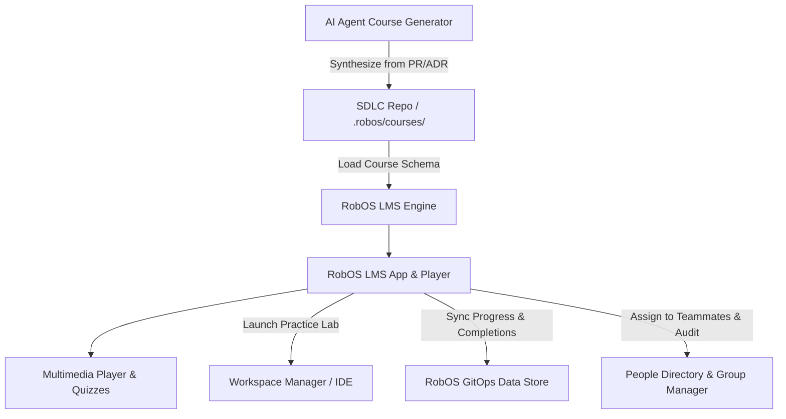

# Feature Spec: RobOS Learning Management System (LMS) & SDLC Course Player

- **Status**: Draft
- **Created Date**: 2026-09-03
- **Target Component**: Desktop Apps (`packages/robos-lms`), `packages/context-manager`, `packages/workspace-manager`, `packages/people-directory`
- **Author/Idea Source**: User Idea

## 1. Overview & Vision
During the software delivery lifecycle (SDLC), engineering teams and RobOS AI agents produce a wealth of knowledge artifacts: architectural decision records (ADRs), onboarding guides, post-mortems, PR video walkthroughs, and automated system explanations. However, this knowledge is often scattered and passively stored in git repositories or chat logs, leading to steep onboarding curves, recurring bugs, and poor knowledge retention across teams.

This feature introduces the **RobOS Learning Management System (LMS) & Course Player (`packages/robos-lms`)**. RobOS treats training and developer education as first-class SDLC artifacts (`.robos/courses/`). The LMS app provides an interactive, multimedia **Course Player** with progress tracking, interactive quizzes, video and terminal walkthrough playback, and live IDE practice labs. Furthermore, it provides team leads and engineering managers with classic LMS capabilities (course assignments, completion tracking, skill mastery paths, and team compliance auditing) backed by the RobOS GitOps data store and the People & Groups directory.

## 2. User Stories & Use Cases
- **As a** newly onboarded developer,
- **I want to** open the RobOS LMS player and take interactive courses generated directly from repository SDLC artifacts (codebase architecture deep-dives, PR walkthroughs, coding guidelines),
- **So that** I ramp up quickly with guided lessons, interactive code diffs, and live practice sandboxes.

- **As an** engineering manager or team lead,
- **I want to** assign onboarding courses and security/compliance training modules to specific teams or new hires and monitor completion progress via the People & Groups directory,
- **So that** I have full visibility into team skill readiness and compliance fulfillment.

- **As a** senior engineer or RobOS AI agent,
- **I want to** author or automatically synthesize structured course packages (`course.yaml` + Markdown lessons + interactive quizzes) as part of feature delivery,
- **So that** documentation becomes an engaging, verifiable learning curriculum rather than stale static text.

## 3. Key Capabilities & Scope

### 3.1 Declarative SDLC Course Artifact Specification
- Courses are stored declaratively within repositories under `.robos/courses/<course-slug>/` or shared cloud storage:
  - `course.yaml`: Metadata (title, description, version, estimated duration, difficulty, prerequisites, author, tags).
  - `modules/`: Chapter organization with Markdown lessons, embedded diagrams (Mermaid), and code snippets.
  - `media/`: Video recordings, audio narration tracks, and WebVTT captions (integrated with RobOS walkthrough recorder).
  - `quizzes/`: Formatted knowledge checks (multiple-choice, select-all, code gap-fill, bug spotters).
  - `labs/`: Practice workspace definitions (branch name, setup commands, seed breakpoint instructions).

### 3.2 Interactive Course Player (`packages/robos-lms`)
- **Modern Course Viewer**:
  - Structured chapter tree and progress bar with automatic position bookmarking.
  - Rich Markdown renderer with syntax highlighting, inline runnable code snippets, and zooming Mermaid diagrams.
  - Video and audio player with synchronized WebVTT transcript highlighting and variable playback speeds (0.75x–2x).
- **Interactive Knowledge Checks & Grading**:
  - Inline check-your-understanding questions throughout lessons.
  - End-of-module graded quizzes with immediate explanation feedback.
- **Hands-On Practice Labs**:
  - One-click "Launch Practice Workspace" button that interacts with `workspace-manager` / RobOS IDE plugin to spin up a pre-configured dev sandbox where the learner solves a hands-on coding task.

### 3.3 LMS Data Store & Progress Tracking
- **Local & GitOps State Management**:
  - User progress, quiz scores, completed lessons, and certificates stored in `~/.config/robos/lms/state.json` and syncable to `.robos/lms/` or central cloud storage.
  - Resume playback seamlessly across sessions.
- **Badges & Certifications**:
  - Award digital achievement badges upon course completion.
  - Exportable proof-of-completion records (JSON / PDF / SCORM xAPI-compliant events).

### 3.4 Team Management & People/Groups Integration
- **Manager Dashboard**:
  - Integration with `packages/people-directory` and `packages/group-manager`.
  - Assign courses and due dates to users or teams (e.g. `@backend-team`, `@new-hires`).
  - View team completion matrices, average quiz scores, and overdue training alerts.

### Out of Scope
- Hosting a standalone public web SaaS (RobOS LMS is a desktop OS/IDE-integrated application and GitOps artifact engine).
- Replacing heavyweight third-party enterprise HR LMS portals (though xAPI/SCORM export adapters bridge data to external systems).

## 4. Architectural & System Integration

- **Impacted Packages/Apps**:
  - `packages/robos-lms` (new Electron application)
  - `packages/context-manager` (AI course synthesis from repository history)
  - `packages/workspace-manager` (live practice workspace launcher)
  - `packages/people-directory` & `packages/group-manager` (learner assignment and team reporting)
  - `packages/robos-icons` (add `robos-lms` icon)
  - `packages/robos-lib` (course schema validator and progress store helpers)
- **IPC / Endpoints Required**:
  - `ipcMain.handle('lms:discover-courses')`
  - `ipcMain.handle('lms:get-course', { courseId })`
  - `ipcMain.handle('lms:update-progress', { courseId, lessonId, state, score })`
  - `ipcMain.handle('lms:launch-lab', { courseId, labId })`
  - `ipcMain.handle('lms:list-team-progress', { groupId })`
  - `ipcMain.handle('lms:assign-course', { courseId, targetUsers, targetGroups, dueDate })`
- **UI/UX Considerations**:
  - Dark-themed dual-pane interface: course outline/toc on left, content/media/quiz stream on right.
  - Distraction-free full-screen "Focus Learning" mode.
  - Gamified achievement badges and completion confetti celebration.
- **Data & Configuration Storage**:
  - Courses: `.robos/courses/` in git projects or `~/.config/robos/courses/`.
  - User State: `~/.config/robos/lms/progress.json`.

## 5. Proposed Implementation Plan

1. **Phase 1: Course Schema & GitOps Store (`robos-lib`)**
   - Define JSON Schema and TypeScript/JS validators for `course.yaml`, module structure, and quiz definitions.
   - Implement local progress storage and completion tracking backend.

2. **Phase 2: Core Course Player UI (`packages/robos-lms`)**
   - Build Electron application with lesson navigation, markdown content renderer, Mermaid support, and quiz widgets.
   - Implement video walkthrough player with caption synchronization.

3. **Phase 3: Interactive Practice Labs & IDE Integration**
   - Connect "Launch Lab" actions to `workspace-manager` and RobOS IDE plugin IPC to initialize isolated practice environments.

4. **Phase 4: Management Dashboard & People/Groups Integration**
   - Implement course assignment workflow, team completion dashboards, and notifications for pending training.

## 6. Acceptance Criteria
- [ ] Users can discover and open courses packaged in `.robos/courses/` repositories.
- [ ] The Course Player renders Markdown lessons, diagrams, code blocks, synchronized video walkthroughs, and interactive quizzes.
- [ ] User progress, bookmark positions, and quiz scores are persistently tracked and stored.
- [ ] Clicking "Launch Lab" opens an isolated practice workspace in the RobOS IDE / terminal.
- [ ] Team leads can assign courses to groups from the People Directory and inspect team completion rates.
