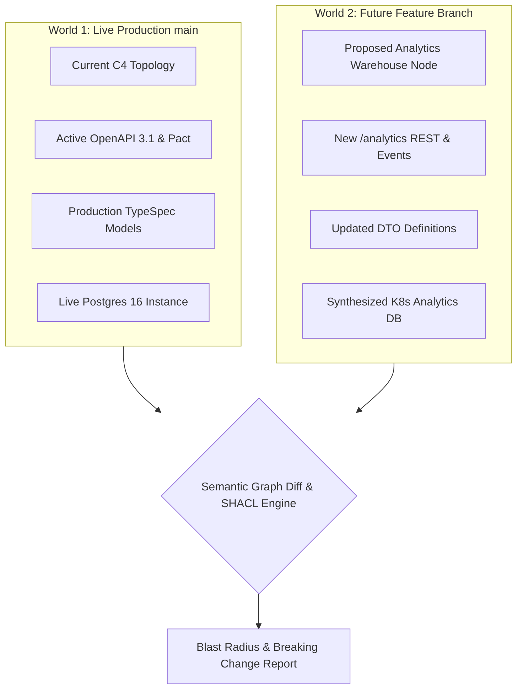
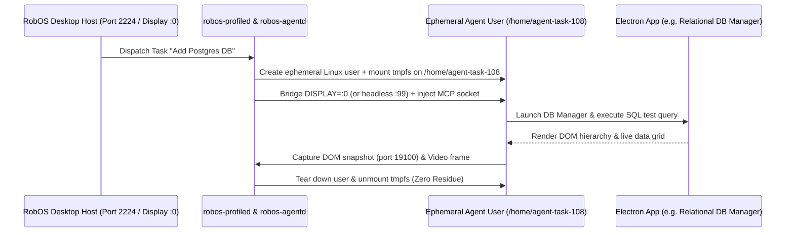
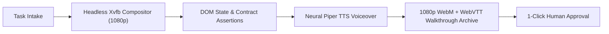
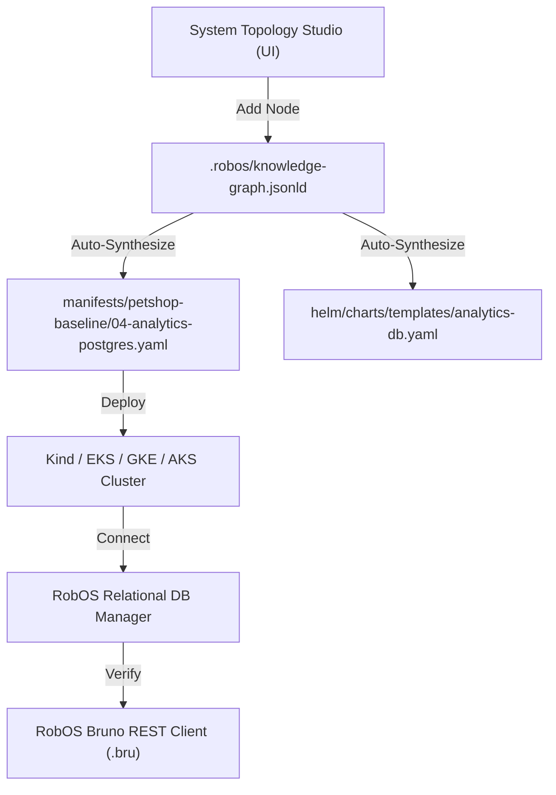
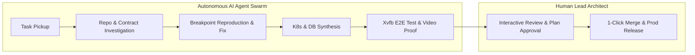

# RobOS

## The AI-Native Operating System for Software Engineering Teams
{: .fs-9 }

RobOS is a purpose-built developer operating system and desktop ecosystem engineered for **AI Agent Review-Based Software Development**. Autonomous AI agent swarms plan, write code, run deep unit and E2E tests, provision databases, and synthesize Kubernetes infrastructure — while human developers act as Lead Architects, Reviewers, and Approvers.

RobOS can be installed in two ways:
1. **Desktop Suite**: 30+ lightweight, zero-framework Electron developer applications running natively on your existing Linux, macOS, or Windows workstation.
2. **RobOS Ubuntu Distro**: A full-featured Ubuntu 26.04-based developer OS provisioned via QEMU/KVM or flashed directly to bare metal via Rufus/Etcher.

{: .fs-6 .fw-300 }

{: .note }
> **Pre-1.0 Production Architecture.** RobOS is built on open standards: **OASIS OSLC Core 3.0**, **W3C JSON-LD & SHACL**, **Spotify Backstage**, **C4 Architecture Model**, **Microsoft TypeSpec**, **Pact Consumer Contracts**, **Bruno REST Collections**, and **Model Context Protocol (MCP)**.

[⭐ Star on GitHub](https://github.com/nddipiazza/robos){: .btn .btn-primary .fs-5 .mb-4 .mb-md-0 .mr-2 target="_blank" rel="noopener" }
[Get Started]({{ site.baseurl }}){: .btn .fs-5 .mb-4 .mb-md-0 .mr-2 }
[System Architecture]({{ site.baseurl }}){: .btn .fs-5 .mb-4 .mb-md-0 .mr-2 }
[Browse 30+ Apps]({{ site.baseurl }}){: .btn .fs-5 .mb-4 .mb-md-0 }

---

## The Big Wins (What Sets RobOS Apart)

RobOS introduces 4 fundamental architectural breakthroughs that do not exist in traditional IDEs or operating systems:

<div style="display: grid; grid-template-columns: 1fr 1fr; gap: 1.5rem; margin: 2rem 0;">

<div style="background: #161b22; border-radius: 8px; padding: 1.5rem; border-top: 4px solid #00bcd4;">
<h3 style="margin-top: 0; color: #00bcd4;"><a href="#win-1-dual-state-sdlc-knowledge-graph" style="color: #00bcd4; text-decoration: none;">🧠 1. Dual-State SDLC Knowledge Graph</a></h3>
<p>Unlike flat code repositories, RobOS maintains a live linked-data knowledge graph (OASIS OSLC / JSON-LD / SHACL) modeling system topology, services, schemas, API contracts, repos, team ownership, and tasks. It tracks <strong>Dual-State Worlds</strong> (<code>main</code> as Live Production vs feature branches as Future State) with semantic blast-radius calculation.</p>
</div>

<div style="background: #161b22; border-radius: 8px; padding: 1.5rem; border-top: 4px solid #8b5cf6;">
<h3 style="margin-top: 0; color: #8b5cf6;"><a href="#win-2-ephemeral-agent-sessions--host-x11-bridging" style="color: #8b5cf6; text-decoration: none;">👤 2. Ephemeral Agent Sessions & Host X11 Bridging</a></h3>
<p>AI agents don't just run CLI subshells; they execute in isolated ephemeral Linux user accounts (<code>/home/agent-...</code>) backed by zero-residue <strong>tmpfs memory mounts</strong>. Agents bridge directly to host X11/Wayland displays to interact with UI applications, inspect rendered DOM snapshots, and test UI components visually.</p>
</div>

<div style="background: #161b22; border-radius: 8px; padding: 1.5rem; border-top: 4px solid #10b981;">
<h3 style="margin-top: 0; color: #10b981;"><a href="#win-3-autonomous-e2e-driven-dev--video-proof" style="color: #10b981; text-decoration: none;">🎥 3. Autonomous E2E Driven Development & Video Proof</a></h3>
<p>Every development task is validated with containerized <strong>Xvfb headless test fabrics</strong>. AI agents prove their implementations by generating high-resolution video walkthroughs, synchronized WebVTT narration subtitles (using local neural Piper TTS), and timestamped DOM assertions before requesting human review.</p>
</div>

<div style="background: #161b22; border-radius: 8px; padding: 1.5rem; border-top: 4px solid #f59e0b;">
<h3 style="margin-top: 0; color: #f59e0b;"><a href="#win-4-100-declarative-gitops-architecture--k8s-synthesis" style="color: #f59e0b; text-decoration: none;">⚡ 4. 100% Declarative GitOps & K8s Synthesis</a></h3>
<p>System topology, data sources, contracts, and work items are stored in standard human-readable <code>.robos/</code> files. When data sources or services are added in System Topology Studio, RobOS automatically synthesizes deployable <strong>Kubernetes manifests and Helm charts</strong> without manual YAML wrangling.</p>
</div>

</div>

---

## Detailed Breakdown of Core Architectural Breakthroughs

### Win 1: Dual-State SDLC Knowledge Graph

Traditional IDEs and AI coding tools only understand flat code files in the active directory. They have no concept of upstream dependencies, downstream microservices, database schemas, or API consumer contracts.

RobOS introduces a unified linked-data knowledge graph based on **OASIS OSLC Core 3.0** and **W3C JSON-LD & SHACL**:



#### How the Dual-State Engine Works:
1. **World 1 (Live Production `main`)**: Models the active running state of your software — deployed services, registered API contracts, active entity schemas, and live database topologies.
2. **World 2 (Future Feature Branch)**: Models the projected state of the world when the current task, pull request, or architectural spike is merged.
3. **Semantic Graph Diffing**: When an agent proposes a change, RobOS evaluates the graph delta. If a backend contract changes a required field, the engine flags affected frontend consumers and database migrations **before any code is written**.
4. **Standardized Git Storage**: The entire graph is stored in `.robos/knowledge-graph.jsonld` with zero proprietary database dependencies.

---

### Win 2: Ephemeral Agent Sessions & Host X11 Bridging

Traditional AI coding agents run in the developer's root user account or subshell, risking credential leaks, port collisions, and filesystem pollution.

RobOS creates **ephemeral, isolated Linux agent profiles** with direct X11/Wayland host display forwarding:



#### Key Technical Advantages:
- **Zero-Residue `tmpfs` RAM Mounts**: Agent home directories (`/home/agent-...`) exist purely in RAM memory. When the agent session terminates, the account is deleted and unmounted, leaving zero orphaned files.
- **Direct X11/Wayland Display Forwarding**: Agents are not blind CLI bots; they can launch real graphical Electron applications, render UI components, and interact with live desktop windows.
- **DOM Snapshot Debug Bridge**: Agents inspect live DOM trees via `packages/robos-lib/snapshot-cli.js` across dedicated IPC debug ports (`19100–19182`), ensuring pixel-accurate and DOM-verified visual tests.

---

### Win 3: Autonomous E2E Driven Development & Video Proof

LLMs can easily produce plausible-looking code that fails at runtime. RobOS enforces a strict standard: **no code change is presented for human review without automated end-to-end verification and video proof-of-work**.



#### How the Automated Verification Fabric Works:
1. **Headless Virtual Compositor (`Xvfb + Picom`)**: The entire test suite executes in a headless 1920x1080 virtual framebuffer with full hardware compositing emulation.
2. **Deterministic DOM Assertions**: Tests wait for DOM elements, verify table grids, test live SQL queries, and validate HTTP 200/201 response status codes.
3. **Synchronized Video & Subtitles**: Generates complete 1080p WebM video recordings with subtitle tracks synthesized via local, offline **Piper neural text-to-speech (TTS)**.
4. **Walkthrough Archive**: All demo recordings and transcripts are permanently archived to `~/.robos/development/walkthroughs/<slug>/` with timestamped historical logs.

---

### Win 4: 100% Declarative GitOps Architecture & K8s Synthesis

Many development platforms lock you into cloud databases or complex configuration systems. RobOS stores everything in standard, human-readable Git files under `.robos/`.



#### Automated Kubernetes & Cloud Lifecycle:
- **Instant Infrastructure Synthesis**: Adding a PostgreSQL, MySQL, Redis, or Kafka node in System Topology Studio automatically synthesizes deployable Kubernetes manifests and Helm chart templates.
- **Multi-Cluster Support**: Kube Studio natively connects to local Kind clusters or remote enterprise clouds (EKS, GKE, AKS) with live pod log streaming and ArgoCD GitOps sync.
- **Git-Backed Bruno REST Collections**: Microservices and APIs are automatically converted into `.bru` collection files for automated test execution without cloud vendor lock-in.

---

## AI Agent Review-Based Development

Traditional software development puts the burden of investigation, debugging, and initial coding on the human developer. **RobOS inverts this workflow**:



1. **AI Investigates & Reproduces**: When a task is picked up, the AI provisions an isolated workspace, reproduces the problem at a live breakpoint, and drafts a concrete architectural plan.
2. **Interactive Plan Review (`/grill-me`)**: The lead architect reviews the plan, grills the AI on edge cases, and adjusts requirements before any code is written.
3. **Autonomous Implementation & Verification**: The AI implements code, runs unit tests, updates API contracts, provisions databases, and runs headless E2E verifications.
4. **Human Final Approval**: The human reviews the PR, visual diffs, and narrated video walkthrough, then approves with 1 click.

---

## Visual Tour of the RobOS Suite

### System Topology & Knowledge Graph Studio
Visually map and manage your entire engineering architecture without writing tedious infrastructure boilerplate:
- **C4 Architecture Modeling (Levels 1–3)**: Zoom from high-level user personas and third-party SaaS systems (**Level 1: System Context**), into polyglot microservices, frontends, and databases (**Level 2: Containers**), down to internal controllers and domain modules (**Level 3: Components**).
- **Spotify Backstage Integration**: Automatically imports and synchronizes your team's `catalog-info.yaml` software catalogs so services, API contracts, and team ownership are always live and linked.
- **On-the-Fly Kubernetes & Helm Synthesis**: Whenever you add a new database (e.g. PostgreSQL, Redis, Kafka) or microservice to the canvas, RobOS automatically generates the ready-to-deploy Kubernetes StatefulSet/Deployment YAML manifests and Helm chart templates.


### RobOS Relational DB Manager (PostgreSQL, Oracle, MySQL)
Inspect live schemas, view data grids, run multi-tab SQL console queries with sub-millisecond latency, and generate DDL:


### RobOS Data Sources & Knowledge Graph Explorer
Manage SQL, NoSQL, Object Storage (S3), and Kafka streaming data sources with live connection testing:


### RobOS REST API Client (Bruno-Powered)
Git-backed REST collections, collection runners, environment matrices, and automated test assertions:


### Kube Studio & Cloud Infrastructure Navigator
Multi-cluster Kubernetes, ArgoCD GitOps, Helm release tracking, and automated container lifecycle management:


---

## Installation Options

### Option 1: Install as Desktop App Suite
Run the full suite of 30+ RobOS Electron applications on your existing operating system:
```bash
# Clone the repository
git clone https://github.com/nddipiazza/robos.git
cd robos

# Install dependencies and setup environment
node scripts/install-dev-deps.js

# Launch any application or developer harness
node packages/robos-test/lib/harness.js --app db-manager
node packages/robos-test/lib/harness.js --app topology-manager
node packages/robos-test/lib/harness.js --app dev-central
```

### Option 2: Install Full RobOS Ubuntu OS Distro
Build a bootable QEMU/KVM disk image or write a flashable USB drive for bare-metal deployment:
```bash
# Build disk image + cloud-init ISO
infra/desktop/build.sh

# Run virtual machine (16GB RAM, all host CPUs, SSH port 2224)
infra/desktop/run.sh
```

---

## Open-Source Standards Integrated

| Capability | Standard / Technology | How RobOS Integrates It |
|---|---|---|
| **Knowledge Graph** | [OASIS OSLC Core 3.0](https://open-services.net/), [W3C JSON-LD](https://www.w3.org/TR/json-ld11/) | Full system world state stored in `.robos/knowledge-graph.jsonld`. |
| **Architecture Topology** | [Backstage](https://backstage.io/), [C4 Model](https://c4model.com/) | Reads Backstage `catalog-info.yaml` and exports C4 Structurizr PlantUML. |
| **API Contracts** | [OpenAPI 3.1](https://www.openapis.org/), [Pact](https://pact.io/), [AsyncAPI](https://www.asyncapi.com/) | Contract-driven testing and consumer verification gates. |
| **Entity Schemas** | [Microsoft TypeSpec](https://typespec.io/), [Buf](https://buf.build/) | Single source of truth compiling to TypeScript, Java, and Go DTOs. |
| **REST Collections** | [UseBruno](https://www.usebruno.com/) | Git-backed `.bru` collections with zero cloud lock-in. |
| **Local Environments** | [Devcontainers](https://containers.dev/), [Docker](https://www.docker.com/) | Standardized `.devcontainer.json` workspace isolation. |
| **Agent Protocols** | [Model Context Protocol (MCP)](https://modelcontextprotocol.io/) | Claude Code, Antigravity, Copilot CLI, and Gemini tooling integrations. |
| **Neural TTS** | [Piper TTS](https://github.com/rhasspy/piper) | Offline neural text-to-speech for synchronized demo video voiceovers. |
