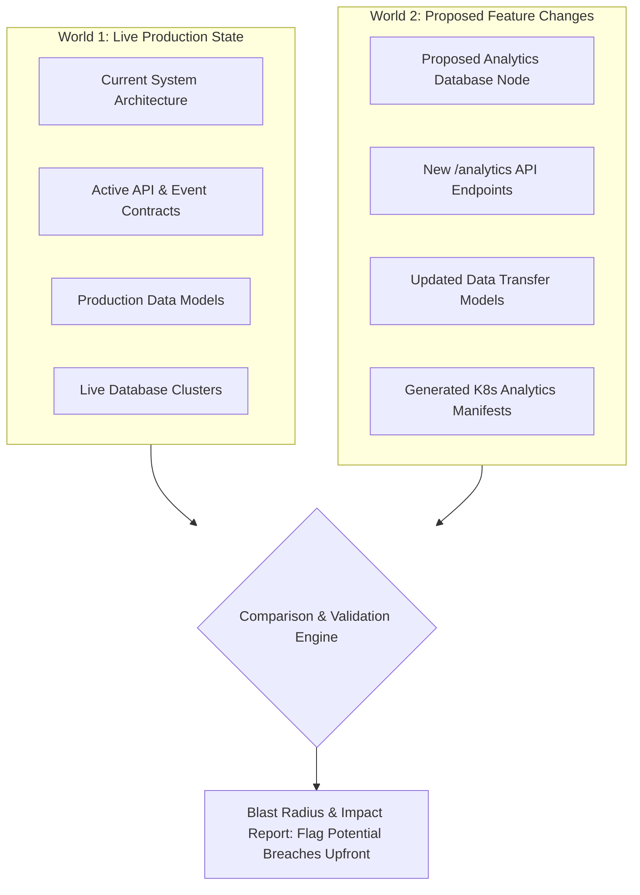
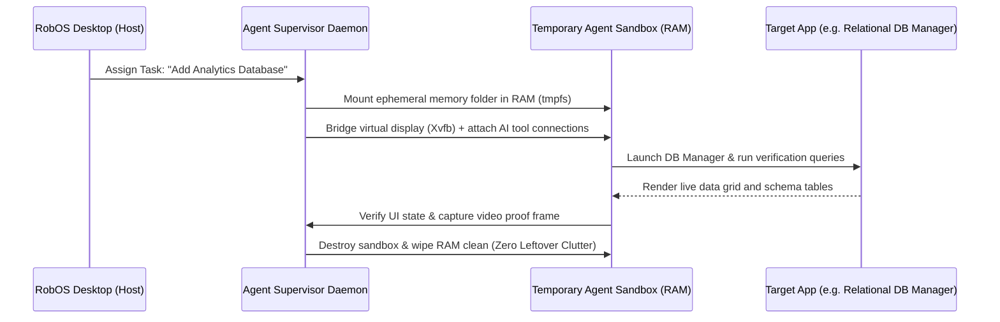
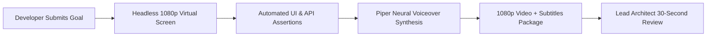

# RobOS

## The Developer Operating System for the AI Era: Where Agents Code and Humans Lead
{: .fs-9 }

The way software is built has fundamentally changed. Autonomous AI agents can now investigate complex bugs, scaffold multi-service architectures, write code across polyglot repositories, and spin up local infrastructure.

Yet our developer environments are still stuck in the past. Engineers are drowning in disconnected browser tabs, fragmented CLI tools, mystery YAML, and AI assistants that dump untested code onto local machines—leaving humans to spend hours untangling broken dependencies, mystery regressions, and invisible blast radiuses.

**RobOS was created to solve this.**

RobOS is a developer operating system and native 30+ desktop application suite engineered for **AI Agent Review-Based Software Development**. It flips the software delivery lifecycle: autonomous agent swarms handle the heavy lifting in isolated, clutter-free environments, while human developers step up into their true role: **Lead Architects, Reviewers, and Approvers**.

{: .fs-6 .fw-300 }

{: .note }
> **Built on Battle-Tested Open Standards.** RobOS invents no proprietary locks or closed SaaS silos. Everything is backed by plain-text files in your Git repository under `.robos/` and built on open industry standards: **OASIS OSLC 3.0**, **W3C JSON-LD**, **Spotify Backstage**, **C4 Architecture Model**, **Microsoft TypeSpec**, **Pact Consumer Contracts**, **Kubernetes & Helm**, and **Model Context Protocol (MCP)**.

[⭐ Star on GitHub](https://github.com/nddipiazza/robos){: .btn .btn-primary .fs-5 .mb-4 .mb-md-0 .mr-2 target="_blank" rel="noopener" }
[Get Started]({{ site.baseurl }}){: .btn .fs-5 .mb-4 .mb-md-0 .mr-2 }
[System Architecture]({{ site.baseurl }}){: .btn .fs-5 .mb-4 .mb-md-0 .mr-2 }
[Browse 30+ Apps]({{ site.baseurl }}){: .btn .fs-5 .mb-4 .mb-md-0 .mr-2 }
[Real-World Walkthroughs]({{ site.baseurl }}){: .btn .fs-5 .mb-4 .mb-md-0 }

<div style="margin: 1.5rem 0 0.5rem; display: flex; flex-wrap: wrap; gap: 0.5rem;">
  <a href="{{ site.baseurl }}" class="btn fs-3">🚀 New Company Setup</a>
  <a href="{{ site.baseurl }}" class="btn fs-3">🏢 Existing Company Setup</a>
  <a href="{{ site.baseurl }}" class="btn fs-3">✨ Develop a New App</a>
  <a href="{{ site.baseurl }}" class="btn fs-3">📥 Import Existing Apps</a>
</div>

---

## The Story: Why We Built RobOS

### The 3 Growing Pains of Modern AI Development

Today's AI coding tools are designed as simple add-ons: an autocomplete extension in your editor or a chat sidebar in a browser. While they generate code quickly, they introduce three severe bottlenecks:

1. **Context Blindness & Invisible Blast Radiuses**  
   An AI assistant looking at a single file or directory has no awareness of the surrounding system. It doesn't know that renaming a database column breaks a downstream analytics pipeline, or that modifying an API response payload violates a frontend contract. The developer is left to manually trace the ripple effects across dozens of repositories.

2. **Workstation Clutter & The Machine Pollution Problem**  
   When autonomous agents run shell commands directly in your home directory, they leave behind orphaned node modules, temporary build artifacts, stray Docker containers, and conflicting background processes. Worse, they risk exposing personal credentials or overwriting uncommitted work.

3. **Hallucinations & Review Fatigue ("Trust Me, It Works")**  
   Current agents claim "Task complete!" without proving anything. They don't verify if buttons click, if schemas migrate cleanly, or if containers start. Reviewing raw walls of AI-generated diffs without language servers, symbol lookup, or execution context forces developers into exhausting manual verification loops.

```
Traditional Workflow (The Typing Bottleneck):
[Developer Investigates Bug] ──▶ [Developer Writes Code] ──▶ [Developer Runs Tests] ──▶ [Developer Files PR]

RobOS Paradigm (Lead Architect & Reviewer):
[AI Swarm Investigates & Plans] ──▶ [Proactive Human Alignment & Plan Review] ──▶ [AI Executes in Isolated RAM]
                                                                                               │
[1-Click Merge & GitOps Deploy] ◀── [Lead Reviews in Native IDE + Proof Video] ◀── [AI Proves Work with E2E Video]
```

### The Solution: Agent Review-Based Development

RobOS turns the developer into a **Lead Architect**. You don't spend your day writing repetitive boilerplate or setting up test databases. Instead:

- **AI Agents Grounded in the Knowledge Graph**: Agents inspect the full architecture map, identify dependencies across microservices and schemas, reproduce bugs, and draft structured technical proposals.
- **Continuous Human-in-the-Loop Alignment**: Rather than making assumptions in a black box, RobOS workflows actively pick and probe at the human architect—clarifying ambiguities, challenging design trade-offs, and ensuring the lead engineer is intimately in the know before any code is generated.
- **Agents Execute in Ephemeral Sandboxes**: Code is written and tested in temporary memory environments that leave zero residue on your workstation.
- **AI Proves Its Work**: Agents execute real end-to-end tests on an isolated virtual screen, capturing high-definition video walkthroughs and neural voiceovers proving every assertion.
- **You Review With Full IDE Context**: Review pull requests in the dedicated RobOS PR Platform or jump straight into **IntelliJ IDEA** or **VS Code** with full AST navigation, symbol lookup, and local debugging tools.

---

## The 4 Architectural Pillars of RobOS

RobOS is built around 4 core innovations that separate a true AI-first operating system from traditional coding environments:

<div style="display: grid; grid-template-columns: 1fr 1fr; gap: 1.5rem; margin: 2rem 0;">

<div style="background: #161b22; border-radius: 8px; padding: 1.5rem; border-top: 4px solid #00bcd4;">
<h3 style="margin-top: 0; color: #00bcd4;">🧠 1. Dual-State Living Architecture</h3>
<p>RobOS maintains a linked knowledge graph comparing <strong>World 1 (Live Production)</strong> against <strong>World 2 (Your Feature Branch)</strong>. It calculates the exact blast radius of every change across microservices, schemas, and contracts <em>before</em> any code is merged.</p>
</div>

<div style="background: #161b22; border-radius: 8px; padding: 1.5rem; border-top: 4px solid #8b5cf6;">
<h3 style="margin-top: 0; color: #8b5cf6;">👤 2. Ephemeral In-Memory Agent Sandboxes</h3>
<p>AI agents run in isolated Linux profiles mounted in high-speed RAM (<code>tmpfs</code>) on private virtual X11 displays. When the task finishes, the memory is wiped clean with zero leftover temporary files, stray ports, or rogue background processes.</p>
</div>

<div style="background: #161b22; border-radius: 8px; padding: 1.5rem; border-top: 4px solid #10b981;">
<h3 style="margin-top: 0; color: #10b981;">🎥 3. Automated Video Proof-of-Work</h3>
<p>No code change reaches human review without automated visual proof. Agents run end-to-end verifications, click real buttons, query real databases, and record 1080p narrated videos so you can review complex features in under 30 seconds.</p>
</div>

<div style="background: #161b22; border-radius: 8px; padding: 1.5rem; border-top: 4px solid #f59e0b;">
<h3 style="margin-top: 0; color: #f59e0b;">⚡ 4. Zero-YAML Declarative GitOps</h3>
<p>System topology, data sources, and contracts are saved in clean, human-readable Git files under <code>.robos/</code>. Adding a database or service to your visual architecture automatically synthesizes ready-to-deploy <strong>Kubernetes manifests and Helm charts</strong>.</p>
</div>

</div>

### Pillar 1: Dual-State Living Architecture (Today vs. Tomorrow)

Traditional code editors only understand plain text files in a single folder. RobOS maintains a connected architecture knowledge graph based on **OASIS OSLC 3.0** and **W3C JSON-LD**:



- **World 1 (Live Production `main`)**: Tracks deployed services, active API contracts, and live database tables.
- **World 2 (Feature Branch)**: Models what the system will look like once your pull request or spike is merged.
- **Automated Blast Radius**: When an AI agent or developer modifies an endpoint or schema, RobOS immediately flags which downstream services, mobile apps, or web frontends are affected before coding even begins.
- **Continuous Documentation Sync**: When architecture nodes change, RobOS automatically prompts and synchronizes system documentation (`docs/`) and training curriculums in lockstep.

### Pillar 2: Ephemeral In-Memory Agent Sandboxes (Zero Machine Clutter)

Instead of letting agents execute commands directly in your primary desktop user account, RobOS dynamically spawns **hermetic, disposable agent sandboxes**:



- **Zero-Residue Storage**: Agent workspaces live entirely in high-speed RAM (`tmpfs`). When a task is complete or cancelled, the memory is reclaimed instantly.
- **Virtual Display Isolation**: Automated visual tests run on private headless displays (`Xvfb + Picom`), leaving your active monitor completely uninterrupted.
- **Live DOM & UI Inspection**: Dedicated debug ports (`19100–19183`) allow agents to inspect real DOM trees and verify user interfaces with sub-pixel precision.

### Pillar 3: Automated Video Proof-of-Work (AI Proves Its Code Works)

In RobOS, no code reaches human review on trust alone. Every pull request comes with an automated, verifiable **proof-of-work package**:



1. **Deterministic Assertions**: The test fabric waits for real DOM elements, tests interactive forms, queries live databases, and verifies HTTP status codes.
2. **Synchronized 1080p Video**: Records a smooth 1080p video demonstrating the application running end-to-end.
3. **Local Neural Voiceovers**: Generates spoken explanations using offline, private neural text-to-speech (Piper TTS) with synchronized WebVTT subtitles.
4. **Fast Approvals**: Lead architects watch a 30-second video walkthrough rather than spending 20 minutes manually cloning, building, and seeding test data.

### Pillar 4: Zero-YAML Declarative GitOps

RobOS stores your entire architecture in standard, human-readable Git files under `.robos/`. When you design or modify services visually, RobOS manages the underlying infrastructure automatically:

- **Instant Cloud Manifests**: Adding a PostgreSQL, MySQL, Redis, or Kafka node to the visual architecture canvas generates ready-to-deploy Kubernetes StatefulSets, Deployments, and Helm charts.
- **Local & Enterprise Clusters**: Connect to local Kind clusters for instant development, or target enterprise clouds (AWS EKS, Google Cloud GKE, Azure AKS) with real-time pod log streaming and ArgoCD GitOps sync.
- **Git-Backed API Testing**: API endpoints and test suites are stored directly in your repository as plain-text files, versioned alongside your application code.

---

## A Day in the Life: From Business Idea to Production

Here is how a real engineering team uses RobOS to deliver a new capability—from initial concept to verified production deployment:

### 1. Visual Architecture & Dependency Mapping
An engineer outlines a new requirement in the Task Planner. RobOS maps the dependency graph, visualizes services across C4 zoom levels (System Context, Container, Component), and calculates affected services before any code is written.


### 2. Multi-Protocol Data & API Management
The agent provisions the required data sources, establishes API contracts, and executes migration scripts. Engineers inspect database schemas, view live table data grids, and run multi-tab SQL console queries with sub-millisecond execution metrics.


### 3. Native In-IDE Pull Request Review
When the agent finishes implementation and video verification, the human lead architect opens the pull request. Review diffs and security audits inside the RobOS Agent Code Review Platform, or **open the project directly in your preferred IDE**:

- **IntelliJ IDEA Plugin**: Jumps straight to modified lines over the local IPC bridge (`port 63343`), loads run configurations, and integrates with the native JetBrains Pull Request tool window.
- **VS Code Integration**: Opens the pull request directly in VS Code (`vscode://github.vscode-pull-request-github/open-pr`) with full inline comments, symbol navigation, and language servers.


### 4. GitOps Cloud Deployment & Live Operations
Once approved with a single click, the change merges to `main`. Kube Studio tracks the rollout across Kubernetes clusters, displaying live container health, ArgoCD sync status, and streaming pod logs.


---

## The Complete Native Application Suite

RobOS provides over 30 native developer applications designed with zero web-framework bloat (Electron + vanilla JavaScript), sharing a unified dark theme and local system services:

### 🏗️ Architecture & Scaffolding
- **App Wizard**: Greenfield scaffolding and brownfield codebase ingestion across 6 application archetypes (`Microservice`, `DesktopApp`, `ConsoleApp`, `MobileApp`, `DataPipeline`, and `Library`).
- **System Topology Studio**: Interactive visual canvas for C4 architecture modeling, dependency mapping, and automatic Kubernetes/Helm manifest generation.
- **Group Manager**: Enterprise directory synchronization (Okta, Azure AD SCIM, Google Workspace, OpenLDAP) and declarative Team Topologies management (`.robos/teams.yaml`).
- **Dev Central**: Your daily developer dashboard with sprint tracking, PR health, calendar, AI standup notes, and blocker radar.

### 🗄️ Databases & Multi-Protocol Testing
- **Relational DB Manager**: Professional multi-database manager (PostgreSQL, MySQL, Oracle) with schema browsing, interactive data grids, and SQL consoles.
- **NoSQL DB Manager**: Document and key-value store manager for MongoDB and Redis with live TTL inspection.
- **REST API Client**: Git-backed API client storing plain-text `.bru` request files directly in your repository with automated contract synthesis.
- **gRPC Client**: Protobuf microservice testing client with server reflection and stream inspection.
- **GraphQL Client**: Interactive schema explorer, query editor, and variable runner.
- **Data Sources Explorer**: Centralized hub connecting relational databases, object stores (AWS S3), and Kafka streaming topics.

### 🔍 Code Review, Quality & Cloud Ops
- **Agent Code Review Platform**: Autonomous AI pull request auditor, semantic diff viewer, and IDE review bridge (IntelliJ IDEA & VS Code plugins).
- **Kube Studio**: Multi-cluster Kubernetes navigator, Helm release manager, and live container log streaming console.
- **CI Monitor**: Real-time pipeline monitoring with automated AI root-cause analysis for broken builds.
- **Deploy Tracker**: Multi-environment deployment tracking across Development, Staging, and Production with DORA metrics.

### 🤖 AI Orchestration & Developer Tools
- **Agents Manager & MCP Router**: Manage local AI agents (Claude Code, Google Antigravity, GitHub Copilot, Google Gemini) via standardized Model Context Protocol tools.
- **Knowledge Graph Explorer**: Dual-state linked data browser with SHACL validation and living documentation sync.
- **Contract Studio**: OpenAPI 3.1 and AsyncAPI contract designer with instant mock servers.
- **Pass Manager**: Encrypted local password and secret vault backed by GPG.

---

## Built on Battle-Tested Open Standards ("Reinvent Nothing!")

RobOS is built entirely on open, industry-standard specifications. Instead of inventing proprietary formats, RobOS connects proven technologies into a unified developer operating system:

| Standard / Technology | Industry Purpose | How RobOS Uses It |
|:---|:---|:---|
| **[OASIS OSLC Core 3.0](https://open-services.net/) & [W3C JSON-LD](https://www.w3.org/TR/json-ld11/)** | Global standard for linking software lifecycle data across disparate tools. | **Dual-State Knowledge Graph (`.robos/knowledge-graph.jsonld`)**: Links microservices, schemas, contracts, repositories, tasks, and training courses into a unified graph. Powers blast radius analysis and documentation synchronization. |
| **[Spotify Backstage](https://backstage.io/) (`catalog-info.yaml`)** | Industry-standard developer portal catalog for service and team ownership. | **Zero-Config Architecture Discovery**: Reads existing `catalog-info.yaml` files across Git repositories to automatically populate the visual topology canvas. |
| **[C4 Architecture Model](https://c4model.com/) & Structurizr** | Hierarchical architecture visualization framework across 4 zoom levels. | **Visual Topology Studio**: Renders software systems across Level 1 (Context), Level 2 (Containers & DBs), and Level 3 (Components) with exportable Structurizr diagrams. |
| **[Microsoft TypeSpec](https://typespec.io/) & [Buf / Protobuf](https://buf.build/)** | Single-source schema definition languages for domain models and DTOs. | **Schema Studio**: Define data models once in TypeSpec; RobOS automatically compiles matching TypeScript types, Java Records, and Go structs. |
| **[OpenAPI 3.1](https://www.openapis.org/) & [AsyncAPI](https://www.asyncapi.com/)** | Global specifications for RESTful APIs and asynchronous message streams. | **Contract Studio & Mock Servers**: Validates contracts with Spectral linting, powers local mock servers, and detects breaking changes upfront. |
| **[Pact](https://pact.io/) Consumer Contracts** | Consumer-driven contract testing framework guaranteeing service compatibility. | **Automated Merge Quality Gates**: Guarantees that code changes made by AI agents or developers do not break downstream consumers before merging. |
| **[Model Context Protocol (MCP)](https://modelcontextprotocol.io/)** | Universal open protocol connecting AI models to external developer tools. | **Unified Multi-Agent Tool Router**: Exposes system capabilities (Knowledge Graph, IDE Breakpoints, Kubernetes Deployments, Database Consoles) to Claude Code, Google Antigravity, Copilot CLI, and Gemini. |
| **[Kubernetes & Helm](https://kubernetes.io/)** | Cloud-native container orchestration and package management. | **Declarative GitOps Infrastructure**: Visual architecture nodes automatically generate deployable Kubernetes manifests and Helm charts stored in `.robos/`. |
| **[Piper Neural TTS](https://github.com/rhasspy/piper)** | Fast, lightweight, offline neural text-to-speech synthesis engine. | **Automated Video Proof-of-Work Voiceovers**: Synthesizes natural spoken voiceovers and WebVTT subtitles for all 1080p verification walkthroughs. |

---

## Installation & Getting Started

Choose the installation method that fits your workflow:

### ⭐️ Primary Option: Install on Your Current Ubuntu GNOME Desktop
Deploy all 30+ RobOS applications, GNOME desktop launchers, and shared libraries directly onto your existing Ubuntu machine (Ubuntu 22.04, 24.04, or 26.04):

```bash
# 1. Clone the repository
git clone https://github.com/nddipiazza/robos.git
cd robos

# 2. Audit and install developer dependencies
node scripts/install-dev-deps.js

# 3. Install all applications and desktop integration to /usr/local/share/robos/
sudo bash packages/desktop-shell/install.sh
```

### Option 2: Dedicated RobOS Ubuntu Distro (Virtual Machine or Bare Metal)
Build a complete bootable Ubuntu developer OS image (flashable to USB via Rufus or Etcher) or launch inside a local QEMU/KVM virtual machine:

```bash
# Build the disk image + cloud-init ISO
infra/desktop/build.sh

# Run local VM (16 GB RAM, all host CPUs, SSH port 2224, VNC port 5910)
infra/desktop/run.sh
```

### Option 3: Cross-Platform Roadmap
- **Linux (Available Now)**: Run all 30+ native Electron developer applications with Node.js 20+.
- **macOS (Coming Soon)**: Universal `.dmg` installer and Homebrew Cask with native Apple Silicon support and menu bar launcher.
- **Windows (Coming Soon)**: One-click installer with WSL2 integration for isolated agent memory sandboxes.

---

## Next Steps

- **[Get Started Guide]({{ site.baseurl }})**: Set up your development environment and launch your first RobOS app.
- **[App Development Flow]({{ site.baseurl }})**: Learn the complete end-to-end development cycle.
- **[System Architecture]({{ site.baseurl }})**: Dive deep into the 8 architectural pillars and the Dual-State Comparison Engine.
- **[Browse All 30+ Apps]({{ site.baseurl }})**: Explore the full catalog of RobOS developer tools.
- **[Real-World Walkthroughs]({{ site.baseurl }})**: Watch high-definition video walkthroughs of real-world engineering scenarios.
