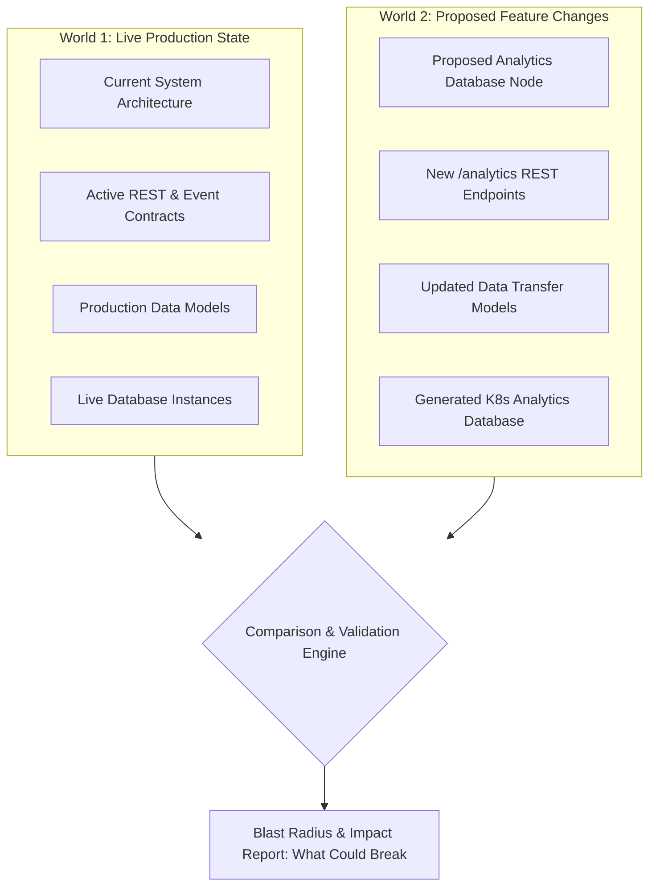
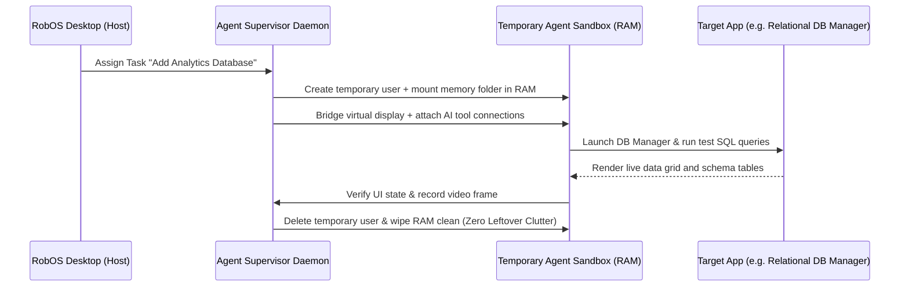
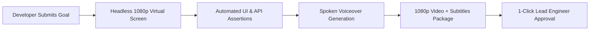
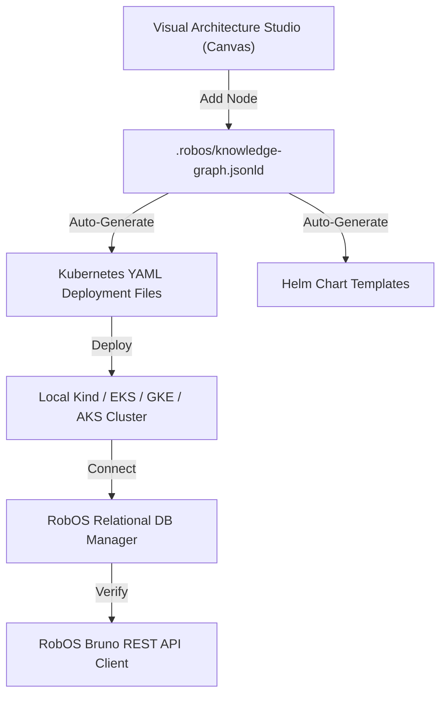
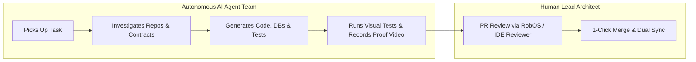

# RobOS

## The AI-First Operating System for Software Engineering Teams
{: .fs-9 }

RobOS is a complete developer operating system and desktop ecosystem engineered for **AI Agent Review-Based Software Development**. Autonomous AI agents plan, write code, run deep unit and visual tests, provision databases, and configure Kubernetes infrastructure — while human developers act as Lead Architects, Reviewers, and Approvers.

RobOS can be installed in two ways:
1. **Desktop Suite**: 30+ lightweight, native developer applications running on your existing Linux, macOS, or Windows desktop.
2. **RobOS Ubuntu Distro**: A full-featured Ubuntu-based developer OS that can be run in a virtual machine (QEMU/KVM) or installed directly onto physical hardware.

{: .fs-6 .fw-300 }

{: .note }
> **Built on Battle-Tested Open Standards.** RobOS invents no proprietary locks. It is built entirely on open specifications: **OASIS OSLC 3.0**, **W3C JSON-LD**, **Spotify Backstage**, **C4 Architecture Model**, **Microsoft TypeSpec**, **Pact Consumer Contracts**, **Bruno REST Collections**, and **Model Context Protocol (MCP)**.

[⭐ Star on GitHub](https://github.com/nddipiazza/robos){: .btn .btn-primary .fs-5 .mb-4 .mb-md-0 .mr-2 target="_blank" rel="noopener" }
[Get Started]({{ site.baseurl }}){: .btn .fs-5 .mb-4 .mb-md-0 .mr-2 }
[App Creation Flow]({{ site.baseurl }}){: .btn .fs-5 .mb-4 .mb-md-0 .mr-2 }
[System Architecture]({{ site.baseurl }}){: .btn .fs-5 .mb-4 .mb-md-0 .mr-2 }
[Browse 30+ Apps]({{ site.baseurl }}){: .btn .fs-5 .mb-4 .mb-md-0 }

---

## The 4 Big Wins (What Sets RobOS Apart)

RobOS introduces 4 major innovations that traditional code editors and operating systems cannot do:

<div style="display: grid; grid-template-columns: 1fr 1fr; gap: 1.5rem; margin: 2rem 0;">

<div style="background: #161b22; border-radius: 8px; padding: 1.5rem; border-top: 4px solid #00bcd4;">
<h3 style="margin-top: 0; color: #00bcd4;"><a href="#win-1-live-architecture--project-map" style="color: #00bcd4; text-decoration: none;">🧠 1. Live Architecture & Project Map (Today vs. Tomorrow)</a></h3>
<p>Unlike regular code editors that only see plain text files, RobOS maintains a live interactive map of your entire system (services, databases, API contracts, repos, and team ownership). It tracks two versions at once: <strong>Live Production</strong> (how things run today) vs <strong>Proposed Feature Branch</strong> (how things will look after your changes), instantly showing what other services could break.</p>
</div>

<div style="background: #161b22; border-radius: 8px; padding: 1.5rem; border-top: 4px solid #8b5cf6;">
<h3 style="margin-top: 0; color: #8b5cf6;"><a href="#win-2-clean-isolated-ai-workspaces" style="color: #8b5cf6; text-decoration: none;">👤 2. Clean, Isolated AI Workspaces (Zero Clutter)</a></h3>
<p>When AI agents work on code, they don't pollute your personal user account. Each agent gets a temporary workspace stored in high-speed RAM (memory). When the task finishes, the memory is wiped clean with zero leftover temporary files or rogue background processes.</p>
</div>

<div style="background: #161b22; border-radius: 8px; padding: 1.5rem; border-top: 4px solid #10b981;">
<h3 style="margin-top: 0; color: #10b981;"><a href="#win-3-automated-video-proof-of-work" style="color: #10b981; text-decoration: none;">🎥 3. Automated Video Proof-of-Work (AI Proves Its Code Works)</a></h3>
<p>AI assistants shouldn't just claim their code compiles. In RobOS, AI agents run real end-to-end tests on a virtual screen, record 1080p video walkthroughs, and synthesize spoken voiceovers explaining what they built before asking for your approval.</p>
</div>

<div style="background: #161b22; border-radius: 8px; padding: 1.5rem; border-top: 4px solid #f59e0b;">
<h3 style="margin-top: 0; color: #f59e0b;"><a href="#win-4-automatic-kubernetes--cloud-files" style="color: #f59e0b; text-decoration: none;">⚡ 4. Automatic Kubernetes & Cloud Files (No YAML Headaches)</a></h3>
<p>System topology, data sources, and contracts are saved in clean, human-readable Git files. When you add a new database or service in the visual architecture map, RobOS automatically generates ready-to-deploy <strong>Kubernetes manifests and Helm charts</strong> without manual YAML wrangling.</p>
</div>

</div>

---

## Detailed Breakdown of the 4 Core Innovations

### Win 1: Live Architecture & Project Map (Comparing Today vs. Tomorrow)

Traditional IDEs and AI coding tools only understand individual source files in a single folder. They have no idea what other microservices, database schemas, or API contracts depend on the file you are editing.

RobOS maintains a linked architecture knowledge graph based on open standards (**OASIS OSLC 3.0** and **W3C JSON-LD**):



#### How the Dual-State Comparison Works in Plain English:
1. **World 1 (Live Production `main`)**: Represents the active running state of your software — what services are deployed, what API endpoints exist, and what database tables are live.
2. **World 2 (Your Feature Branch)**: Represents what the system will look like once your new feature, pull request, or architectural spike is merged.
3. **Automated Impact Analysis (Blast Radius)**: Whenever you or an AI agent change an API endpoint or database column, RobOS calculates exactly which frontend apps or downstream services are affected **before any code is written**.
4. **Clean Git-Backed Files**: The entire architecture map is saved in plain text under `.robos/knowledge-graph.jsonld` inside your Git repository.

---

### Win 2: Clean, Isolated AI Workspaces (Zero Desktop Clutter)

Standard AI coding tools run commands directly inside your personal user profile, creating risks of credential leaks, port collisions, and cluttering your machine with orphaned processes.

RobOS spins up **temporary, isolated agent workspaces** backed by RAM memory:



#### Why This Matters to Developers:
- **Zero-Leftover RAM Mounts**: When an AI agent runs, its workspace lives in temporary system RAM (`tmpfs`). Once the task is finished, the memory is released completely.
- **Visual Desktop Bridging**: AI agents aren't just command-line bots; they can open graphical applications, test user interfaces, and verify that buttons and forms look right.
- **Accurate UI Inspection**: Agents inspect live visual elements through dedicated local inspection ports (`19100–19182`), ensuring test assertions verify real user interface state.

---

### Win 3: Automated Video Proof-of-Work (AI Proves Its Code Works)

AI models can easily produce code that looks correct at first glance but crashes at runtime. RobOS enforces a clear standard: **no code change is presented for human review without automated visual verification and video proof-of-work**.



#### How the Automated Verification Fabric Works:
1. **Headless Virtual Desktop (`Xvfb + Picom`)**: The entire test suite runs on an isolated 1920x1080 virtual display so your active screen is never hijacked.
2. **Real Visual & Network Tests**: Tests click real buttons, query real databases, and verify HTTP success responses.
3. **Recorded Video & Spoken Voiceovers**: Generates a 1080p video with spoken voiceover explanations (synthesized using offline, local neural text-to-speech) detailing every step of the verification.
4. **One-Click Approval Package**: The lead developer receives the video walkthrough, code diffs, and test results for 30-second review and approval.

---

### Win 4: Automatic Kubernetes & Cloud Files (No YAML Headaches)

Many modern platforms force you into proprietary cloud consoles. RobOS stores your entire architecture in standard, human-readable Git files under `.robos/`.



#### Automated Cloud Infrastructure:
- **Instant Deployment Files**: Adding a PostgreSQL, MySQL, Redis, or Kafka node to your visual architecture canvas automatically generates ready-to-deploy Kubernetes YAML manifests and Helm charts.
- **Works with Local and Cloud Clusters**: Connect to local Kind clusters on your laptop or enterprise clouds (AWS EKS, Google Cloud GKE, Azure AKS) with live container log streaming and GitOps sync.
- **Git-Backed API Collections**: REST endpoints and microservices are automatically saved as plain text `.bru` files for easy testing with the open-source Bruno REST client.

---

## AI Agent Review-Based Development

Traditional software engineering forces developers to spend 80% of their day tracking down bugs, configuring environments, and writing repetitive boilerplate. **RobOS flips this model**:



1. **AI Investigates & Implements**: When a ticket is assigned, the AI spins up an isolated workspace, investigates the contracts and code, implements the solution, and generates automated tests (with an optional breakpoint debugging feature for runtime inspection).
2. **Developer Reviews the Plan (`/grill-me`)**: The lead engineer reviews the proposal, asks questions, and clarifies edge cases before code changes are finalized.
3. **Automated Verification**: The AI runs automated tests across unit, integration, and Pact contract suites, packaging a proof-of-work video walkthrough.
4. **Human PR Review & IDE Integration**: The developer reviews the PR using the **Agent Code Review Platform** or **optionally opens the project in IntelliJ IDEA / VS Code** using RobOS to review with full IDE context in tow, then approves and merges with 1 click.

---

## Visual Tour of the RobOS Suite

### System Topology & Visual Architecture Studio
Visually design and manage your entire system architecture without writing tedious infrastructure boilerplate:
- **C4 Architecture Zoom (Levels 1–3)**: Zoom from high-level user personas (**Level 1: System Context**), down into microservices and databases (**Level 2: Containers**), to internal code modules (**Level 3: Components**).
- **Backstage Catalog Integration**: Automatically synchronizes your team's `catalog-info.yaml` software catalogs so services, API contracts, and team ownership are always up to date.
- **Instant Kubernetes & Helm Generation**: Adding a new database or service to the canvas automatically creates the Kubernetes deployment YAML and Helm charts.


### RobOS Relational DB Manager (PostgreSQL, Oracle, MySQL)
Inspect live database schemas, view data grids, run multi-tab SQL console queries with sub-millisecond latency, and generate database creation scripts:


### RobOS Data Sources & Database Hub
Connect and inspect SQL, NoSQL, Object Storage (AWS S3), and Kafka streaming data sources with live connection testing:


### RobOS REST API Client (Bruno-Powered)
Git-backed REST collections, batch test runners, environment matrices, and automated response assertions:


### Kube Studio & Cloud Infrastructure Navigator
Multi-cluster Kubernetes, ArgoCD GitOps sync status, Helm release management, and live container log streaming:


---

## Installation Options

### ⭐️ Primary Option: Install on Current Ubuntu GNOME Desktop
Install all 30+ RobOS desktop applications, GNOME launchers, and shared libraries directly onto your existing Ubuntu machine (Ubuntu 22.04, 24.04, or 26.04):
```bash
# Clone the repository
git clone https://github.com/nddipiazza/robos.git
cd robos

# Audit & install dependencies
node scripts/install-dev-deps.js

# Install all apps and desktop integration to /usr/local/share/robos/
sudo bash packages/desktop-shell/install.sh
```

### Option 2: Install Full RobOS Ubuntu OS Distro (Bare Metal & Virtual Machine)
Build a dedicated bootable ISO image (flashable to USB via Rufus or Etcher) or run inside a local QEMU/KVM virtual machine:
```bash
# Build disk image + cloud-init ISO
infra/desktop/build.sh

# Run virtual machine (16GB RAM, all host CPUs, SSH port 2224)
infra/desktop/run.sh
```

### Option 3: Cross-Platform Desktop App Suite (Windows & macOS Coming Soon)
- **Linux (Available Now)**: Run all 30+ Electron developer apps directly with Node.js 20+.
- **macOS / OS X (Coming Soon)**: Universal `.dmg` installer and Homebrew Cask with native Apple Silicon (M1–M4) support.
- **Windows (Coming Soon)**: One-click installer with WSL2 integration for isolated agent workspaces.

---

## Open-Source Standards Integrated ("Reinvent Nothing!")

RobOS is built entirely on established, battle-tested open standards. Instead of inventing proprietary formats, RobOS connects leading open-source specifications into a cohesive operating system:

| Standard / Technology | Industry Purpose | What RobOS Uses It For |
|:---|:---|:---|
| **[OASIS OSLC Core 3.0](https://open-services.net/) & [W3C JSON-LD](https://www.w3.org/TR/json-ld11/)** | Global standard for linking software development lifecycle data across tools. | **Live Architecture Knowledge Graph (`.robos/knowledge-graph.jsonld`)**: Links microservices, schemas, contracts, Git repositories, and tasks into a unified graph. Powers visual comparisons between Live Production (`main`) and Future feature states. |
| **[Spotify Backstage](https://backstage.io/) (`catalog-info.yaml`)** | Industry-standard developer portal format for tracking service ownership. | **Zero-Config Architecture Discovery**: Automatically reads your existing Backstage `catalog-info.yaml` files across Git repositories to populate the visual architecture canvas without manual entry. |
| **[C4 Architecture Model](https://c4model.com/) & Structurizr** | Hierarchical architecture visualization framework across 4 zooming levels. | **Visual Architecture Studio & Blast Radius Inspector**: Renders software architectures across Level 1 (System Context), Level 2 (Containers & DBs), and Level 3 (Components), and exports C4 Structurizr diagrams. |
| **[Microsoft TypeSpec](https://typespec.io/) & [Buf / Protobuf](https://buf.build/)** | Single-source schema definition languages for domain models and data objects. | **Data Model Studio (`schema-studio`)**: Define data models once in TypeSpec; RobOS automatically generates matching TypeScript, Java Records, and Go structs. |
| **[OpenAPI 3.1](https://www.openapis.org/) & [AsyncAPI](https://www.asyncapi.com/)** | Global standards for documenting RESTful APIs and asynchronous message streams. | **Contract Studio & Mock Servers (`contract-studio`)**: Edit and validate API contracts, run local mock servers, and detect breaking API changes before code generation. |
| **[Pact](https://pact.io/) Consumer Contracts** | Consumer-driven contract testing framework guaranteeing microservice compatibility. | **Automated Merge Quality Gates**: Guarantees that changes made by AI agents or developers do not break downstream consumers before pull requests can be merged. |
| **[UseBruno](https://www.usebruno.com/) (`.bru`)** | Git-backed, open-source REST client storing plain-text `.bru` files in repositories. | **REST API Client & Test Runner**: Automatically creates `.bru` test files from OpenAPI specs, runs batch tests, and tracks endpoint latency with zero cloud lock-in. |
| **[Devcontainers](https://containers.dev/) & [Docker / Kind](https://kind.sigs.k8s.io/)** | Standardized container specifications for isolated developer environments. | **One-Click Workspaces & Local Test Fabrics**: Automatically spins up local Kind Kubernetes clusters with pre-seeded databases and mock dependencies for instant testing. |
| **[Model Context Protocol (MCP)](https://modelcontextprotocol.io/)** | Universal open protocol connecting AI models to external tools and databases. | **Universal AI Tool Router (`robos-mcp-router`)**: Exposes system capabilities (Knowledge Graph, IDE Breakpoints, Kubernetes Deployments, Database Console) to Claude Code, Google Antigravity, Copilot CLI, and Gemini. |
| **[Piper Neural TTS](https://github.com/rhasspy/piper)** | Fast, lightweight, offline neural text-to-speech synthesis engine. | **Automated Video Proof-of-Work Voiceovers**: Generates natural voiceovers and subtitle tracks for all 1080p demo walkthrough videos generated during testing. |
| **DBeaver & DataGrip SQL Paradigms** | Professional multi-database management interfaces with schema explorers and data grids. | **Relational DB Manager (`db-manager`)**: Multi-tab SQL query consoles, table data grids, fast execution metrics, and DDL generators for PostgreSQL, MySQL, and Oracle. |
