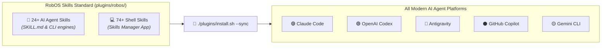

# RobOS

## Knowledge Graph-First Application Generation: Build the KGraph, Auto-Generate the Apps
{: .fs-9 }

The way software is built has fundamentally changed. Just as an OpenAPI contract automatically generates a typed REST web service client, a RobOS Knowledge Graph adhering to our schema enables full applications to become, for all intents and purposes, **auto-generated**.

Autonomous AI agent swarms can now investigate complex bugs, scaffold multi-service architectures, write code across polyglot repositories, and spin up local infrastructure. Yet traditional developer environments are still stuck in the past—engineers are drowning in disconnected browser tabs, fragmented CLI tools, mystery YAML, and AI assistants that dump untested code onto local machines, leaving humans to spend hours untangling broken dependencies and invisible blast radiuses.

**RobOS was created to solve this.**

RobOS is the developer operating system and native 30+ desktop application suite engineered for **Knowledge Graph-First (KGraph-First) Application Generation and Agent Review-Based Software Development**. Human engineers act as **Lead System Architects** designing and evolving the Knowledge Graph, while autonomous agent swarms synthesize source code, databases, and infrastructure in isolated, clutter-free environments.

{: .fs-6 .fw-300 }

<div style="margin: 2rem 0; border: 1px solid #1e293b; border-radius: 12px; overflow: hidden; background: #0b101b; box-shadow: 0 10px 40px rgba(0,0,0,0.6);">
  
  <div style="padding: 0.75rem 1.25rem; font-size: 0.85rem; color: #94a3b8; border-top: 1px solid #1e293b; background: #0d1424; text-align: center;">
    <strong>The 4-Stage Lifecycle</strong>: 1) Human Lead Architect & KGraph Blueprint ──▶ 2) RobOS Synthesis Engine & Autonomous Swarms ──▶ 3) Ephemeral In-Memory Sandbox Verification ──▶ 4) Agent Review & Human Approval. <em>(Click image to zoom full screen)</em>
  </div>
</div>

{: .note }
> **Built on Battle-Tested Open Standards.** RobOS invents no proprietary locks or closed SaaS silos. Everything is backed by plain-text files in your Git repository under `.robos/` and built on open industry standards: **OASIS OSLC 3.0**, **W3C JSON-LD**, **Spotify Backstage**, **C4 Architecture Model**, **Microsoft TypeSpec**, **Pact Consumer Contracts**, **Kubernetes & Helm**, and **Model Context Protocol (MCP)**.

[⭐ Star on GitHub](https://github.com/nddipiazza/robos){: .btn .btn-primary .fs-5 .mb-4 .mb-md-0 .mr-2 target="_blank" rel="noopener" }
[Get Started]({{ site.baseurl }}){: .btn .fs-5 .mb-4 .mb-md-0 .mr-2 }
[RobOS Big Wins]({{ site.baseurl }}){: .btn .fs-5 .mb-4 .mb-md-0 .mr-2 }
[SDLC Knowledge Graph]({{ site.baseurl }}){: .btn .fs-5 .mb-4 .mb-md-0 .mr-2 }
[KGraph Schemas]({{ site.baseurl }}){: .btn .fs-5 .mb-4 .mb-md-0 .mr-2 }
[Day in the Life]({{ site.baseurl }}){: .btn .fs-5 .mb-4 .mb-md-0 .mr-2 }
[System Architecture]({{ site.baseurl }}){: .btn .fs-5 .mb-4 .mb-md-0 .mr-2 }
[Browse 30+ Apps]({{ site.baseurl }}){: .btn .fs-5 .mb-4 .mb-md-0 .mr-2 }
[RobOS Skills]({{ site.baseurl }}){: .btn .fs-5 .mb-4 .mb-md-0 .mr-2 }
[Real-World Walkthroughs]({{ site.baseurl }}){: .btn .fs-5 .mb-4 .mb-md-0 }

<div style="margin: 1.5rem 0 0.5rem; display: flex; flex-wrap: wrap; gap: 0.5rem;">
  <a href="{{ site.baseurl }}" class="btn fs-3">🌐 SDLC Knowledge Graph</a>
  <a href="{{ site.baseurl }}" class="btn fs-3">📐 KGraph Schemas</a>
  <a href="{{ site.baseurl }}" class="btn fs-3">🏆 RobOS Big Wins</a>
  <a href="{{ site.baseurl }}" class="btn fs-3">🚀 New Company Setup</a>
  <a href="{{ site.baseurl }}" class="btn fs-3">🏢 Existing Company Setup</a>
  <a href="{{ site.baseurl }}" class="btn fs-3">✨ Develop a New App</a>
  <a href="{{ site.baseurl }}" class="btn fs-3">📥 Import Existing Apps</a>
  <a href="{{ site.baseurl }}" class="btn fs-3">⚡ RobOS Skills</a>
</div>

---

## The Story: Why We Built RobOS

### The 3 Growing Pains of Modern AI Development

Today's AI coding tools are designed as simple add-ons: an autocomplete extension in your editor or a chat sidebar in a browser. While they generate code quickly, they introduce three severe bottlenecks:

1. **Context Blindness & Invisible Blast Radiuses**  
   An AI assistant looking at a single file or directory has no awareness of the surrounding system. It doesn't know that renaming a database column breaks a downstream analytics pipeline, or that modifying an API response payload violates a frontend contract. The developer is left to manually trace the ripple effects across dozens of repositories.

2. **Workstation Clutter & The Machine Pollution Problem**  
   When autonomous agents run shell commands directly in your home directory, they leave behind orphaned node modules, temporary build artifacts, stray Docker containers, and conflicting background processes. Worse, they risk exposing personal credentials or overwriting uncommitted work.

3. **Hallucinations & Review Fatigue ("Trust Me, It Works")**  
   Current agents claim "Task complete!" without proving anything. They don't verify if buttons click, if schemas migrate cleanly, or if containers start. Reviewing raw walls of AI-generated diffs without language servers, symbol lookup, or execution context forces developers into exhausting manual verification loops.

<div style="margin: 2rem 0; border: 1px solid #1e293b; border-radius: 12px; overflow: hidden; background: #0b101b; box-shadow: 0 10px 40px rgba(0,0,0,0.6);">
  
  <div style="padding: 0.75rem 1.25rem; font-size: 0.85rem; color: #94a3b8; border-top: 1px solid #1e293b; background: #0d1424; text-align: center;">
    <strong>The Typing Bottleneck</strong>: Huge streams of user stories, feature requests, and architecture requirements funneling down into a lone developer manually typing code character-by-character amid repetitive boilerplate and syntax errors.
  </div>
</div>

### The Solution: KGraph-First Application Generation & Agent Review

RobOS turns the developer into a **Lead Architect**. Just as OpenAPI specifications automatically generate REST client SDKs, your RobOS Knowledge Graph enables full applications to become **auto-generated**. You don't spend your day writing repetitive boilerplate or setting up test databases. Instead:

- **KGraph as the Executable Master Blueprint**: You model your system in the Knowledge Graph. RobOS compiles and synthesizes the codebase, data entities, controllers, and Kubernetes manifests automatically.
- **AI Agents Grounded in the Knowledge Graph**: Agents inspect the full architecture map, identify dependencies across microservices and schemas, reproduce bugs, and draft structured technical proposals.
- **Continuous Human-in-the-Loop Alignment**: Rather than making assumptions in a black box, RobOS workflows actively pick and probe at the human architect—clarifying ambiguities, challenging design trade-offs, and ensuring the lead engineer is intimately in the know before any code is generated.
- **Agents Execute in Ephemeral Sandboxes**: Code is written and tested in temporary memory environments that leave zero residue on your workstation.
- **AI Proves Its Work**: Agents execute real end-to-end tests on an isolated virtual screen, capturing high-definition video walkthroughs and neural voiceovers proving every assertion.
- **You Review With Full IDE Context**: Review pull requests in the dedicated RobOS PR Platform or jump straight into **IntelliJ IDEA** or **VS Code** with full AST navigation, symbol lookup, and local debugging tools.

---

## RobOS Big Wins: Core Innovations & Strategic Advantages

Traditional IDEs and AI tools give you autocompletions and popups. RobOS gives you an **autonomous engineering operating system and native developer application suite** anchored around 10 core breakthroughs:

<div style="display: grid; grid-template-columns: repeat(auto-fit, minmax(320px, 1fr)); gap: 1.25rem; margin: 2rem 0;">

<!-- 1. Video Proof of Work -->
<div style="background: #161b22; border-radius: 8px; padding: 1.25rem; border-top: 4px solid #10b981; display: flex; flex-direction: column; justify-content: space-between;">
<div>
<h3 style="margin-top: 0; color: #10b981; font-size: 1.1rem;">🎥 1. Video Proof-of-Work</h3>
<p style="margin-bottom: 0.75rem; font-size: 0.92rem; color: #c9d1d9;">No code reaches human review without automated visual proof: 1080p narrated video walkthroughs and Piper TTS neural voiceovers verifying every UI and API assertion.</p>
</div>
<a href="{{ site.baseurl }}" style="color: #10b981; font-weight: 600; font-size: 0.88rem;">Explore Full Guide →</a>
</div>

<!-- 2. Interactive Planning & 66+ Templates -->
<div style="background: #161b22; border-radius: 8px; padding: 1.25rem; border-top: 4px solid #14b8a6; display: flex; flex-direction: column; justify-content: space-between;">
<div>
<h3 style="margin-top: 0; color: #14b8a6; font-size: 1.1rem;">📋 2. Interactive Planning & 66+ Templates</h3>
<p style="margin-bottom: 0.75rem; font-size: 0.92rem; color: #c9d1d9;">Interactive web form templates across Web APIs, Frontend SPAs, games, libraries, and cloud infra, with custom template builders and bidirectional GitHub Issues & Jira synchronization.</p>
</div>
<a href="{{ site.baseurl }}" style="color: #14b8a6; font-weight: 600; font-size: 0.88rem;">Explore Full Guide →</a>
</div>

<!-- 3. Universal Web & API Clients -->
<div style="background: #161b22; border-radius: 8px; padding: 1.25rem; border-top: 4px solid #06b6d4; display: flex; flex-direction: column; justify-content: space-between;">
<div>
<h3 style="margin-top: 0; color: #06b6d4; font-size: 1.1rem;">🌐 3. Universal Web & API Clients</h3>
<p style="margin-bottom: 0.75rem; font-size: 0.92rem; color: #c9d1d9;">RobOS provides native web clients and management GUIs for REST (Git-backed <code>.bru</code> collections), Protobuf gRPC, GraphQL introspection, and real-time streaming protocols synchronized with architecture contracts.</p>
</div>
<a href="{{ site.baseurl }}" style="color: #06b6d4; font-weight: 600; font-size: 0.88rem;">Explore Full Guide →</a>
</div>

<!-- 4. Unified Data Sources GUI -->
<div style="background: #161b22; border-radius: 8px; padding: 1.25rem; border-top: 4px solid #ec4899; display: flex; flex-direction: column; justify-content: space-between;">
<div>
<h3 style="margin-top: 0; color: #ec4899; font-size: 1.1rem;">🗄️ 4. Unified Data Sources GUI</h3>
<p style="margin-bottom: 0.75rem; font-size: 0.92rem; color: #c9d1d9;">Native data source client and management GUI across Relational (PostgreSQL, MySQL, Oracle), NoSQL (MongoDB, Redis), Search, and Cloud Object Stores directly connected to the Knowledge Graph.</p>
</div>
<a href="{{ site.baseurl }}" style="color: #ec4899; font-weight: 600; font-size: 0.88rem;">Explore Full Guide →</a>
</div>

<!-- 5. Agent-Agnostic Open Framework -->
<div style="background: #161b22; border-radius: 8px; padding: 1.25rem; border-top: 4px solid #38bdf8; display: flex; flex-direction: column; justify-content: space-between;">
<div>
<h3 style="margin-top: 0; color: #38bdf8; font-size: 1.1rem;">🤖 5. Agent-Agnostic Open Framework</h3>
<p style="margin-bottom: 0.75rem; font-size: 0.92rem; color: #c9d1d9;">Built on open global standards (OSLC, W3C JSON-LD, SHACL, MCP) implemented in the open. Zero algorithm lock-in: dynamically dispatches the right agent to the right task for optimal value and cost.</p>
</div>
<a href="{{ site.baseurl }}" style="color: #38bdf8; font-weight: 600; font-size: 0.88rem;">Explore Full Guide →</a>
</div>

<!-- 6. Ephemeral In-Memory Sandboxes -->
<div style="background: #161b22; border-radius: 8px; padding: 1.25rem; border-top: 4px solid #3b82f6; display: flex; flex-direction: column; justify-content: space-between;">
<div>
<h3 style="margin-top: 0; color: #3b82f6; font-size: 1.1rem;">👤 6. Ephemeral In-Memory Sandboxes</h3>
<p style="margin-bottom: 0.75rem; font-size: 0.92rem; color: #c9d1d9;">Agents execute in isolated Linux profiles mounted in high-speed RAM (<code>tmpfs</code>) on private virtual displays. Zero leftover files, zero stray ports, and complete credential isolation.</p>
</div>
<a href="{{ site.baseurl }}" style="color: #3b82f6; font-weight: 600; font-size: 0.88rem;">Explore Full Guide →</a>
</div>

<!-- 7. DevOps Integrations & GPG Password Store -->
<div style="background: #161b22; border-radius: 8px; padding: 1.25rem; border-top: 4px solid #eab308; display: flex; flex-direction: column; justify-content: space-between;">
<div>
<h3 style="margin-top: 0; color: #eab308; font-size: 1.1rem;">☁️ 7. DevOps Security & Password Store</h3>
<p style="margin-bottom: 0.75rem; font-size: 0.92rem; color: #c9d1d9;">Onboarding wizards for 25+ providers across 7 categories. Zero plaintext secrets in Git: credentials are encrypted directly into the UNIX password store (<code>pass</code>) with GPG.</p>
</div>
<a href="{{ site.baseurl }}" style="color: #eab308; font-weight: 600; font-size: 0.88rem;">Explore Full Guide →</a>
</div>

<!-- 8. KGraph-First App Generation & Modular Architecture -->
<div style="background: #161b22; border-radius: 8px; padding: 1.25rem; border-top: 4px solid #00bcd4; display: flex; flex-direction: column; justify-content: space-between;">
<div>
<h3 style="margin-top: 0; color: #00bcd4; font-size: 1.1rem;">🧬 8. KGraph-First App Generation</h3>
<p style="margin-bottom: 0.75rem; font-size: 0.92rem; color: #c9d1d9;">Auto-generates full applications across 9 archetypes from schema-validated, modular namespaced package stores (<code>.robos/kgraphs/</code>) with multi-repo composition and Git-tag version pinning.</p>
</div>
<a href="{{ site.baseurl }}" style="color: #00bcd4; font-weight: 600; font-size: 0.88rem;">Explore Full Guide →</a>
</div>

<!-- 9. Dual-State SDLC Knowledge Graph -->
<div style="background: #161b22; border-radius: 8px; padding: 1.25rem; border-top: 4px solid #8b5cf6; display: flex; flex-direction: column; justify-content: space-between;">
<div>
<h3 style="margin-top: 0; color: #8b5cf6; font-size: 1.1rem;">🧠 9. Dual-State SDLC Knowledge Graph</h3>
<p style="margin-bottom: 0.75rem; font-size: 0.92rem; color: #c9d1d9;">Compares <strong>World 1 (Production <code>main</code>)</strong> against <strong>World 2 (Feature Branch)</strong> for pre-code blast radiuses. Provides <strong>multi-level agent context inheritance</strong> (Global, Company, Org, Team, Repo) to eliminate duplicate skills.</p>
</div>
<a href="{{ site.baseurl }}" style="color: #8b5cf6; font-weight: 600; font-size: 0.88rem;">Explore Full Guide →</a>
</div>

<!-- 10. Declarative GitOps Storage -->
<div style="background: #161b22; border-radius: 8px; padding: 1.25rem; border-top: 4px solid #f59e0b; display: flex; flex-direction: column; justify-content: space-between;">
<div>
<h3 style="margin-top: 0; color: #f59e0b; font-size: 1.1rem;">⚡ 10. 100% Declarative GitOps Storage</h3>
<p style="margin-bottom: 0.75rem; font-size: 0.92rem; color: #c9d1d9;">System topology, data sources, and contracts live in clean Git files under <code>.robos/</code>. Modifying architecture automatically synthesizes ready-to-deploy Kubernetes manifests and Helm charts.</p>
</div>
<a href="{{ site.baseurl }}" style="color: #f59e0b; font-weight: 600; font-size: 0.88rem;">Explore Full Guide →</a>
</div>

</div>

<div style="text-align: center; margin: 1.5rem 0 2.5rem;">
  <a href="{{ site.baseurl }}" class="btn btn-primary fs-5">Explore All 10 RobOS Big Wins in Depth →</a>
</div>

---

## A Day in the Life: From Business Idea to Production

RobOS coordinates its 30+ native applications into an orchestrated lifecycle—taking a raw business requirement through automated planning, visual architecture, contract design, ephemeral agent implementation, multi-protocol verification, and IDE review, all the way to live cloud operations.

<div style="margin: 2rem 0; border: 1px solid #1e293b; border-radius: 12px; overflow: hidden; background: #0b101b; box-shadow: 0 10px 40px rgba(0,0,0,0.6);">
  
  <div style="padding: 0.75rem 1.25rem; font-size: 0.85rem; color: #94a3b8; border-top: 1px solid #1e293b; background: #0d1424; text-align: center;">
    <strong>The Complete Application Lifecycle Flowchart</strong>: How native RobOS apps connect from planning through production. <em>(Click image to zoom full screen)</em>
  </div>
</div>

<div style="text-align: center; margin: 1.5rem 0 2.5rem;">
  <a href="{{ site.baseurl }}" class="btn btn-primary fs-5">Explore A Day in the Life in Depth →</a>
</div>

---

## The Complete Native Application Suite

RobOS provides over 30 native developer applications designed with zero web-framework bloat (Electron + vanilla JavaScript), sharing a unified dark theme and local system services:

### 🏗️ Architecture & Scaffolding
- **App Wizard**: Greenfield scaffolding and brownfield codebase ingestion across 9 application archetypes (`Microservice`, `FrontEndApp`, `DesktopApp`, `PCGame`, `MobileGame`, `ConsoleApp`, `MobileApp`, `DataPipeline`, and `Library`).
- **System Topology Studio**: Interactive visual canvas for C4 architecture modeling, dependency mapping, and automatic Kubernetes/Helm manifest generation.
- **Group Manager**: Enterprise directory synchronization (Okta, Azure AD SCIM, Google Workspace, OpenLDAP) and declarative Team Topologies management (`.robos/teams.yaml`).
- **Dev Central**: Your daily developer dashboard with sprint tracking, PR health, calendar, AI standup notes, and blocker radar.

### 🗄️ Databases & Multi-Protocol Testing
- **Relational DB Manager**: Professional multi-database manager (PostgreSQL, MySQL, Oracle) with schema browsing, interactive data grids, and SQL consoles.
- **NoSQL DB Manager**: Document and key-value store manager for MongoDB and Redis with live TTL inspection.
- **REST API Client**: Git-backed API client storing plain-text `.bru` request files directly in your repository with automated contract synthesis.
- **gRPC Client**: Protobuf microservice testing client with server reflection and stream inspection.
- **GraphQL Client**: Interactive schema explorer, query editor, and variable runner.
- **Data Sources Explorer**: Centralized hub connecting relational databases, object stores (AWS S3), and Kafka streaming topics.

### 🔍 Code Review, Quality & Cloud Ops
- **Agent Code Review Platform**: Autonomous AI pull request auditor, semantic diff viewer, and IDE review bridge (IntelliJ IDEA & VS Code plugins).
- **Kube Studio**: Multi-cluster Kubernetes navigator, Helm release manager, and live container log streaming console.
- **CI Monitor**: Real-time pipeline monitoring with automated AI root-cause analysis for broken builds.
- **Deploy Tracker**: Multi-environment deployment tracking across Development, Staging, and Production with DORA metrics.

### 🤖 AI Orchestration & Developer Tools
- **Agents Manager & MCP Router**: Manage local AI agents (Claude Code, Google Antigravity, GitHub Copilot, Google Gemini) via standardized Model Context Protocol tools.
- **Knowledge Graph Explorer**: Modular multi-file package browser (`.robos/kgraphs/`), multi-repo dependency manager with Git-tag versioning, DevOps onboarding wizards across 7 categories, and SHACL validation.
- **Contract Studio**: OpenAPI 3.1 and AsyncAPI contract designer with instant mock servers.
- **Pass Manager**: Encrypted local password and secret vault backed by GPG (`pass`), integrated with KGraph DevOps integrations for zero-plaintext secret references (`robos:PassCredential`).

---

## RobOS Skills: Cross-Agent AI Capabilities & Shell Marketplace

In addition to 30+ native applications and the SDLC Knowledge Graph, RobOS introduces a standardized cross-platform **Skills Standard** that empowers autonomous AI coding agents—Claude Code, OpenAI Codex, Google Antigravity, GitHub Copilot, and Gemini CLI—to execute complex software engineering operations deterministically with zero hallucination.

Instead of writing vendor-locked prompt instructions, RobOS skills are packaged as open, plain-text markdown specifications (`SKILL.md`) and companion CLI engines stored in `plugins/robos/skills/` and `.agents/skills/`.



### Key Skill Capabilities
- **Enterprise Knowledge Graph Ingestion (`import-company-kgraph`)**: Extracts complete company repository inventories from HTTP REST endpoints (Spotify Backstage), AWS S3 buckets, local directories, or Git forge URLs, classifying components across 9 archetypes and auto-synthesizing OpenAPI 3.1 contracts.
- **Living Documentation Synchronization (`sync-kgraph-docs`)**: Automatically updates system architecture diagrams, user guides, and API specs whenever Knowledge Graph objects are updated in `.robos/`.
- **Greenfield App Generation (`create-robos-app`)**: Scaffolds production-grade desktop applications with complete IPC bridges, Lucide icons, and DOM snapshot debug servers.
- **Automated E2E Proof-of-Work (`e2e-driven-dev`, `record-demo`)**: Runs headless tests and captures 1080p narrated video walkthroughs with neural voiceovers (Piper TTS) and WebVTT captions.
- **VM Lifecycle Management (`build-vm`, `start-vm`, `deploy-to-vm`)**: Provisions cloud-init developer virtual machines with zero manual steps.
- **74+ Desktop Shell Macros**: Instant parameterized shell commands for Git, Docker, network diagnostics, and memory inspections via `<robos-ai-textarea>` and the **Skills Manager** application.

<div style="text-align: center; margin: 1.5rem 0 2.5rem;">
  <a href="{{ site.baseurl }}" class="btn btn-primary fs-5">Explore the Complete RobOS Skills Guide & Catalog →</a>
</div>

---

## Built on Battle-Tested Open Standards ("Reinvent Nothing!")

RobOS is built entirely on open, industry-standard specifications. Instead of inventing proprietary formats, RobOS connects proven technologies into a unified developer operating system:

| Standard / Technology | Industry Purpose | How RobOS Uses It |
|:---|:---|:---|
| **[OASIS OSLC Core 3.0](https://open-services.net/) & [W3C JSON-LD](https://www.w3.org/TR/json-ld11/)** | Global standard for linking software lifecycle data across disparate tools. | **Packaged Dual-State Knowledge Graph (`.robos/kgraphs/`)**: Modular, namespaced multi-file package stores and multi-repo Git-tag versioned dependencies. Links microservices, schemas, contracts, repos, devops credentials, and eLearning courses into a unified graph. Powers blast radius analysis and living documentation synchronization. |
| **[Spotify Backstage](https://backstage.io/) (`catalog-info.yaml`)** | Industry-standard developer portal catalog for service and team ownership. | **Zero-Config Architecture Discovery**: Reads existing `catalog-info.yaml` files across Git repositories to automatically populate the visual topology canvas. |
| **[C4 Architecture Model](https://c4model.com/) & Structurizr** | Hierarchical architecture visualization framework across 4 zoom levels. | **Visual Topology Studio**: Renders software systems across Level 1 (Context), Level 2 (Containers & DBs), and Level 3 (Components) with exportable Structurizr diagrams. |
| **[Microsoft TypeSpec](https://typespec.io/) & [Buf / Protobuf](https://buf.build/)** | Single-source schema definition languages for domain models and DTOs. | **Schema Studio**: Define data models once in TypeSpec; RobOS automatically compiles matching TypeScript types, Java Records, and Go structs. |
| **[OpenAPI 3.1](https://www.openapis.org/) & [AsyncAPI](https://www.asyncapi.com/)** | Global specifications for RESTful APIs and asynchronous message streams. | **Contract Studio & Mock Servers**: Validates contracts with Spectral linting, powers local mock servers, and detects breaking changes upfront. |
| **[Pact](https://pact.io/) Consumer Contracts** | Consumer-driven contract testing framework guaranteeing service compatibility. | **Automated Merge Quality Gates**: Guarantees that code changes made by AI agents or developers do not break downstream consumers before merging. |
| **[Model Context Protocol (MCP)](https://modelcontextprotocol.io/)** | Universal open protocol connecting AI models to external developer tools. | **Unified Multi-Agent Tool Router**: Exposes system capabilities (Knowledge Graph, IDE Breakpoints, Kubernetes Deployments, Database Consoles) to Claude Code, Google Antigravity, Copilot CLI, and Gemini. |
| **[Kubernetes & Helm](https://kubernetes.io/)** | Cloud-native container orchestration and package management. | **Declarative GitOps Infrastructure**: Visual architecture nodes automatically generate deployable Kubernetes manifests and Helm charts stored in `.robos/`. |
| **[Piper Neural TTS](https://github.com/rhasspy/piper)** | Fast, lightweight, offline neural text-to-speech synthesis engine. | **Automated Video Proof-of-Work Voiceovers**: Synthesizes natural spoken voiceovers and WebVTT subtitles for all 1080p verification walkthroughs. |

---

## Installation & Getting Started

Choose the installation method that fits your workflow:

### ⭐️ Primary Option: Install on Your Current Ubuntu GNOME Desktop
Deploy all 30+ RobOS applications, GNOME desktop launchers, and shared libraries directly onto your existing Ubuntu machine (Ubuntu 22.04, 24.04, or 26.04):

```bash
# 1. Clone the repository
git clone https://github.com/nddipiazza/robos.git
cd robos

# 2. Audit and install developer dependencies
node scripts/install-dev-deps.js

# 3. Install all applications and desktop integration to /usr/local/share/robos/
sudo bash packages/desktop-shell/install.sh
```

### Option 2: Dedicated RobOS Ubuntu Distro (Virtual Machine or Bare Metal)
Build a complete bootable Ubuntu developer OS image (flashable to USB via Rufus or Etcher) or launch inside a local QEMU/KVM virtual machine:

```bash
# Build the disk image + cloud-init ISO
infra/desktop/build.sh

# Run local VM (16 GB RAM, all host CPUs, SSH port 2224, VNC port 5910)
infra/desktop/run.sh
```

### Option 3: Cross-Platform Roadmap
- **Linux (Available Now)**: Run all 30+ native Electron developer applications with Node.js 20+.
- **macOS (Coming Soon)**: Universal `.dmg` installer and Homebrew Cask with native Apple Silicon support and menu bar launcher.
- **Windows (Coming Soon)**: One-click installer with WSL2 integration for isolated agent memory sandboxes.

---

## Next Steps

- **[Get Started Guide]({{ site.baseurl }})**: Set up your development environment and launch your first RobOS app.
- **[App Development Flow]({{ site.baseurl }})**: Learn the complete end-to-end development cycle.
- **[System Architecture]({{ site.baseurl }})**: Dive deep into the 8 architectural pillars and the Dual-State Comparison Engine.
- **[Browse All 30+ Apps]({{ site.baseurl }})**: Explore the full catalog of RobOS developer tools.
- **[Real-World Walkthroughs]({{ site.baseurl }})**: Watch high-definition video walkthroughs of real-world engineering scenarios.
- **[💡 Explore the Ideas Store on GitHub](https://github.com/nddipiazza/robos/tree/main/docs/ideas)**: Browse raw idea notes, community feature proposals, and structured architecture specs.
