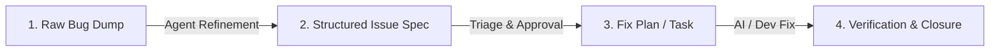

# Issue Knowledgebase & Registry

Welcome to the RobOS Issue Knowledgebase! This directory stores raw bug reports, structured issue specifications, and tracking status for system defects.

## Workflow Pipeline

1. **Inbox / Raw Issues (`docs/issues/inbox/`)**: Dump quick notes, bug reports, audio transcripts, or rough issue details here.
2. **Refined Issue Specs (`docs/issues/reported/`)**: Agents refine raw reports into structured specifications using `TEMPLATE.md`.
3. **Fix & Resolution**: Once verified and fixed, status is updated and linked to commits or PRs.

## Directory Structure

- `inbox/`: Storage for quick notes, raw text dumps, and unformatted bug reports.
- `reported/`: Detailed, standardized `.md` issue specifications generated by AI agents.
- `TEMPLATE.md`: Standard issue specification template used by AI agents.

## Reported Issues Registry

| Issue ID | Title | Status | Severity | Target Components | Raw Note | Issue Spec |
|----------|-------|--------|----------|-------------------|----------|------------|
| **ISSUE-001** | Bypass Ubuntu 26.04 initial setup popups | Triaged | Medium | `infra/desktop/cloud-init`, `gnome-initial-setup` | [raw note](inbox/desktop-ui-and-gnome-bugs.txt) | [issue spec](reported/ISSUE-001-ubuntu-26-firstboot-popups.md) |
| **ISSUE-002** | Switching to GNOME desktop reverts to Electron after 1 min | Triaged | High | `desktop-shell`, session watchdog daemon | [raw note](inbox/desktop-ui-and-gnome-bugs.txt) | [issue spec](reported/ISSUE-002-gnome-desktop-reverts-electron.md) |
| **ISSUE-003** | Display resize does not properly resize top taskbar | Triaged | Medium | `desktop-shell`, panel CSS/autofit | [raw note](inbox/desktop-ui-and-gnome-bugs.txt) | [issue spec](reported/ISSUE-003-display-resize-taskbar-width.md) |
| **ISSUE-004** | Display resize does not reposition App Menu icon | Triaged | Medium | `desktop-shell`, launcher positioning | [raw note](inbox/desktop-ui-and-gnome-bugs.txt) | [issue spec](reported/ISSUE-004-display-resize-app-menu-reposition.md) |
| **ISSUE-005** | App Menu icon click does nothing | Triaged | High | `desktop-shell`, `app-launcher`, IPC click handler | [raw note](inbox/desktop-ui-and-gnome-bugs.txt) | [issue spec](reported/ISSUE-005-app-menu-click-unresponsive.md) |

## Working with AI Agents

### Report an Issue
You can ask your AI agent:
> *"Report an issue: [describe bug or paste log output]"*

or use the slash command:
> `/report-issue [description or path to raw note file]`
