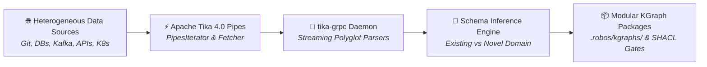

# RobOS KGraph Crawler
{: .no_toc }

> [!NOTE]
> **Implementation Evolution**: The crawler architecture described here is officially realized and superseded by the **[RobOS Kgraph Parse Portal](./kgraph-parse-portal.html)** (`packages/kgraph-parse-portal`), a heavy-scale connectors webapp and desktop application fronting a **Luxir C++ search index**, contextual MIME disambiguation, and **Apache Tika 4.0 streaming `tika-grpc`**.

Systematic schema inference, automated package generation, and multi-source ingestion powered by Apache Tika 4.0 Pipes, `tika-grpc`, and contextual Linux filesystem classification.
{: .fs-6 .fw-300 }

## Table of contents
{: .no_toc .text-delta }

1. TOC
{:toc}

---

## What is the RobOS KGraph Crawler?

The **RobOS KGraph Crawler** is the continuous ingestion and discovery engine for the RobOS Dual-State SDLC Knowledge Graph. While RobOS provides desktop applications and IDE bridges for developers to interact with architectural assets, modern enterprises contain vast repositories of legacy code, active databases, event streams, API contracts, and infrastructure manifests that evolve every second.

Manually declaring every database table, Kafka topic, REST endpoint, and Kubernetes deployment in Knowledge Graph package manifests (`.robos/kgraphs/<package-id>/package.jsonld`) is impractical at enterprise scale.

**The RobOS KGraph Crawler automates this completely:**

1. **Systematic Ingestion of Any Data Source**: Crawls local filesystems, multi-repo Git forges (GitHub, GitLab, Gitea, Bitbucket), relational and NoSQL databases, message brokers, cloud infrastructure, and unstructured documentation.
2. **Apache Tika 4.0 Pipes Architecture**: Integrates the battle-tested, industrial-strength Tika 4.0 Pipes pipeline (`PipesIterator` &rarr; `Fetcher` &rarr; `Parser` &rarr; `Emitter`) with native RobOS components.
3. **High-Throughput Streaming via `tika-grpc`**: Connects to the asynchronous, non-blocking `tika-grpc` daemon over HTTP/2, streaming documents and extracted metadata across process boundaries with zero workstation memory leaks or parser crashes.
4. **Dynamic Schema Inference & Package Auto-Generation**: Automatically classifies discovered assets. If an entity matches an existing RobOS schema package, it updates it; if an entirely novel domain is encountered, it **dynamically synthesizes a new modular KGraph schema package** with W3C SHACL shape constraints linked to standard ontologies via `robos:refersFrom`.



---

## Core Pillars & Innovations

### 1. Native RobOS Pipes Subsystems
Rather than treating content extraction as generic full-text indexing, RobOS equips Apache Tika 4.0 Pipes with custom, SDLC-aware iterators, fetchers, and emitters:
- **`RobOSKGraphPipesIterator`**: Scans existing Knowledge Graph packages to find unverified edges, stale contracts, and external references that need re-crawling.
- **`RobOSDataSourceIterator`**: Queries `robos:Database`, `robos:NoSQLDatabase`, and `robos:MessageBroker` nodes to systematically emit extraction tuples for every table, collection, or topic.
- **`RobOSWorkspaceIterator`**: Crawls local directories, monorepos, and git submodules with smart architectural filters.
- **`RobOSDatabaseFetcher` & `RobOSWorkspaceFetcher`**: Safely retrieve data using credentials unlocked on-the-fly from the local UNIX `pass` GPG store (`robos:hasCredential`), ensuring zero plaintext secret leaks.
- **`RobOSKGraphEmitter`**: Serializes entities directly into OSLC JSON-LD 1.1 records, passing them through a strict W3C SHACL shape validation gate before writing to `.robos/kgraphs/<pkg>/package.jsonld`.

### 2. Autonomous Schema Inference & Package Synthesis
A major limitation of traditional crawler engines is rigid schema coupling: if a crawler encounters data outside its predefined schema, it either drops the data or dumps it as unstructured blobs.

The RobOS KGraph Crawler introduces **Domain-Aware Schema Inference**:
- When the crawler extracts an entity, it evaluates the entity against all W3C SHACL shapes in RobOS.
- If a shape matches (e.g. an OpenAPI YAML matches `robos:Microservice` and `MicroserviceShape`), the entity is emitted into `.robos/kgraphs/services/package.jsonld`.
- If the entity represents a **novel domain** (such as IoT telemetry devices, ML model weight registries, or specialized ERP configurations), the crawler:
  1. Derives an RDF class (e.g., `robos:MLModelRegistry`).
  2. Resolves its upstream canonical vocabulary using `robos:refersFrom` (e.g., `schema:SoftwareApplication` or `ml:Model`).
  3. Synthesizes a valid W3C SHACL shape specification (`Shape.jsonld`).
  4. Scaffolds a new package directory `.robos/kgraphs/<new-domain>/package.jsonld`.
  5. Registers the new package in `.robos/kgraph.yaml`.
  6. Automatically compiles living documentation in `docs/schemas/<new-domain>.md`.

### 3. High-Throughput Streaming with `tika-grpc`
Apache Tika 4.0 introduces `tika-grpc`, a high-performance gRPC streaming server. The RobOS KGraph Crawler communicates with `tika-grpc` over bidirectional gRPC channels:
- **Process Isolation**: Faulty parsers or corrupt files (such as malformed PDFs or massive 500MB SQL dumps) crash only the isolated gRPC worker, never interrupting the RobOS crawler harness or desktop apps.
- **Zero-Copy Streaming**: Large payloads stream in 64KB chunks directly between the fetcher, gRPC parser, and emitter.
- **Polyglot Parsing**: Out-of-the-box extraction for over 1,400 file formats, programming language ASTs, OpenAPI YAML/JSON, Protobuf `.proto`, GraphQL, SQL DDLs, Dockerfiles, and cloud configuration files.

---

## Comprehensive Documentation Guide

Explore the in-depth guides in this documentation section:

| Document | Description |
|:---|:---|
| [**Architecture & Pipeline**]({{ '/kgraph-crawler/architecture.html' | relative_url }}) | Deep-dive into the Tika 4.0 Pipes lifecycle, `FetchEmitTuple` routing, error resilience, and C4 component diagrams. |
| [**Custom Iterators & Fetchers**]({{ '/kgraph-crawler/pipes-iterators-fetchers.html' | relative_url }}) | Specification and XML/YAML configuration for RobOS custom iterators, fetchers, and UNIX `pass` GPG credential bridging. |
| [**Emitters & Schema Inference**]({{ '/kgraph-crawler/emitters-and-schema-inference.html' | relative_url }}) | How the crawler classifies entities, emits validated JSON-LD, dynamically creates new schema packages, and synthesizes SHACL shapes. |
| [**tika-grpc Streaming Service**]({{ '/kgraph-crawler/tika-grpc-service.html' | relative_url }}) | Protobuf contracts, high-throughput gRPC streaming daemon setup, sidecar deployment, and concurrency controls. |
| [**Datasources Crawling Guide**]({{ '/kgraph-crawler/datasources-guide.html' | relative_url }}) | Practical recipes for crawling Git repos, Relational/NoSQL DBs, Kafka brokers, REST/gRPC/GraphQL APIs, and Kubernetes clusters. |

---

## Quick Start Example: Ingesting a Local Polyglot Workspace

Run a crawling session against a local workspace using the RobOS CLI or embedded crawler runner:

```bash
# Start the tika-grpc daemon (if not already running)
robos crawler daemon start --port 50051

# Execute a crawl against a multi-service workspace
robos crawler run \
  --iterator workspace \
  --path ~/source/enterprise-platform \
  --include "*.yaml,*.json,*.proto,Dockerfile,pom.xml,package.json" \
  --emitter kgraph \
  --infer-schemas
```

### Crawl Output & Verification
```text
[INFO] RobOS KGraph Crawler initialized with tika-grpc @ localhost:50051
[INFO] Iterating workspace: ~/source/enterprise-platform (482 files discovered)
[INFO] Fetched & parsed 482 files via tika-grpc in 1.42s
[INFO] Entity Classification:
  ├── 14 Microservices -> .robos/kgraphs/services/package.jsonld (Matches MicroserviceShape)
  ├── 3 Relational DBs -> .robos/kgraphs/core-platform/package.jsonld (Matches DatabaseShape)
  ├── 2 Kafka Brokers  -> .robos/kgraphs/core-platform/package.jsonld (Matches MessageBrokerShape)
  └── 1 Novel Domain Discovered: "mlops-pipeline"
      ├── Inferred RDF Class: robos:MLPipeline (refersFrom: schema:SoftwareApplication)
      ├── Synthesized SHACL Shape: MLPipelineShape
      ├── Scaffolding .robos/kgraphs/mlops-pipeline/package.jsonld
      └── Registered package in .robos/kgraph.yaml
[INFO] Running W3C SHACL Validation (kgraph-validate)...
[SUCCESS] 0 violations found across 20 new nodes in 4 packages.
[INFO] Synchronized aggregated graph (.robos/knowledge-graph.jsonld)
[INFO] Updated living documentation: docs/schemas/mlops-pipeline.md
```
