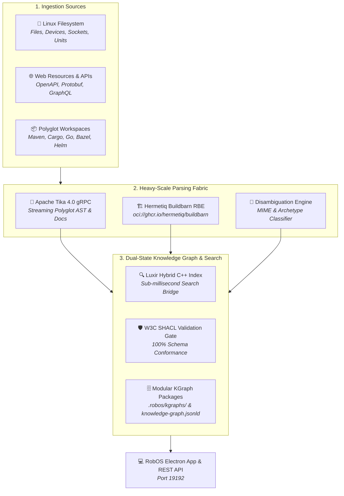

# RobOS Kgraph Parse Portal
{: .no_toc }

Heavy-scale connectors web application and headless parsing portal fronting a high-performance **Luxir C++ search index**, **Hermetiq Buildbarn Helm charts (`oci://ghcr.io/hermetiq/buildbarn`)** for Remote Build Execution (RBE), and **Apache Tika 4.0 streaming `tika-grpc`**.
{: .fs-6 .fw-300 }

## Table of contents
{: .no_toc .text-delta }

1. TOC
{:toc}

---

## What is the RobOS Kgraph Parse Portal?

The **RobOS Kgraph Parse Portal** (`packages/kgraph-parse-portal`) is the industrial-strength resource ingestion gateway and connectors engine for the RobOS Dual-State SDLC Knowledge Graph. It allows developers, platform architects, and autonomous AI agents to point at **any web resource or Linux filesystem location** and extract a validated, SHACL-compliant Knowledge Graph package in W3C RDF JSON-LD 1.1 format.

It supersedes preliminary crawler drafts by fusing four cutting-edge infrastructure layers:



---

## Core Pillars & Architectural Foundations

### 1. Universal Linux Filesystem Ingestion
In RobOS, **any file on a Linux operating system finds itself represented in the Knowledge Graph in a meaningful, evidence-backed way**. The portal crawls directory trees and system roots, attaching cryptographically verifiable `robos:evidence` to every extracted node:
- **Repository context**: Git repository name or filesystem root.
- **Relative path**: Normalized path within the workspace.
- **Line number**: Defaulting to `1` or AST declaration line.
- **Working tree status**: `clean` vs `modified`.
- **Cryptographic SHA-256**: Real-time hash generated from file content.

#### Linux System Virtual Nodes
Beyond regular source files, the portal classifies Linux operating system primitives:
- **ELF Executables & Dynamic Shared Libraries**: Detected via `\x7fELF` magic headers (`robos:BinaryExecutable`, `robos:SharedLibrary`).
- **Systemd Unit Files**: Mapped into `robos:SystemdService`.
- **Unix Domain IPC Sockets**: Mapped into `robos:LinuxSocket`.
- **Named Pipes (FIFO)**: Mapped into `robos:LinuxNamedPipe`.
- **Block & Character Devices**: `/dev/sd*`, `/dev/nvme*`, and tty nodes represented as `robos:LinuxDeviceNode`.

---

### 2. Contextual MIME & Archetype Disambiguation Engine
A standard MIME type such as `application/json` or `text/yaml` conveys zero architectural intent on its own. The Kgraph Parse Portal features a disambiguation engine that inspects path context, file names, dependencies, and AST heuristics:

| Raw Pattern | Raw MIME | Disambiguated Meaning | Target RobOS Shape |
|:---|:---|:---|:---|
| `package.json` | `application/json` | Node.js Manifest & Scripts | `robos:SourceArtifact` |
| `tsconfig.json` | `application/json` | TypeScript Compiler Config | `robos:SourceArtifact` |
| `openapi.yaml` / `.json` | `text/yaml` | REST API Contract | `robos:Contract` (`protocol: OpenAPI`) |
| `*.proto` | `text/x-protobuf` | Microservice RPC Protocol | `robos:ProtobufContract` |
| `*.graphql` / `*.gql` | `application/graphql`| GraphQL Schema Contract | `robos:GraphQLContract` |
| `Chart.yaml` | `application/x-yaml` | Helm Chart Definition | `robos:GitOpsDeployment` |
| `values.yaml` | `application/x-yaml` | Helm Deployment Values | `robos:GitOpsDeployment` |
| `*.service` | `text/plain` | Linux Systemd Daemon Unit | `robos:SystemdService` |
| `.feature` | `text/x-gherkin` | BDD Feature Specification | `robos:GherkinFeature` |
| `README.md` | `text/markdown` | Architecture Overview Page | `robos:DocumentationPage` |
| `ADR-*.md` | `text/markdown` | Architecture Decision Record | `robos:ArchitectureDecisionRecord` |
| `MODULE.bazel` | `text/plain` | Bazel Monorepo Workspace | `robos:BuildSystem` |
| `project.godot` | `text/plain` | Godot 4 Game Engine | `robos:PCGame` |

#### Directory Archetype Detection
When pointed at any directory, the classifier automatically discovers the root build system:
- **Maven**: Detected via `pom.xml` (`robos:Microservice`, `language: Java`).
- **Gradle**: Detected via `build.gradle`, `build.gradle.kts`, `settings.gradle`.
- **Cargo**: Detected via `Cargo.toml` (`language: Rust`).
- **Go Modules**: Detected via `go.mod` (`language: Go`).
- **Python**: Detected via `pyproject.toml`, `setup.py`, `Pipfile`.
- **Node.js**: Automatically differentiates between Electron apps, React/Next.js SPAs, Vue/Nuxt apps, and Express/Fastify services.
- **Bazel & Buck2**: Detected via `MODULE.bazel` or `.buckconfig`.

---

### 3. Apache Tika 4.0 Streaming `tika-grpc` Protocol
The portal interfaces with the **Apache Tika 4.0** streaming `tika-grpc` daemon running on `localhost:50051`. 
- **Zero-Copy Streaming**: Large files and multi-megabyte specifications stream across process boundaries over gRPC without clogging Node.js event loop memory.
- **AST Symbol Extraction**: Extracts classes, interfaces, RPC stubs, functions, methods, and message types for TypeScript, Python, Java, Go, Rust, and Protobuf.
- **Resilient Offline Fallback**: When running in offline or test environments where the external Tika daemon is not running, the portal seamlessly switches to an embedded offline polyglot engine without error.

---

### 4. Hermetiq Buildbarn Helm Charts & Remote Build Execution (RBE)
For enterprise monorepos and heavy document parsing at scale, local CPU cores quickly bottleneck. The Kgraph Parse Portal directly orchestrates **Hermetiq Buildbarn Helm charts** hosted at:
```text
oci://ghcr.io/hermetiq/buildbarn
```

#### Architecture of Hermetiq Buildbarn RBE
1. **`bb-storage`**: Provides high-throughput Content Addressable Storage (CAS) and Action Cache (AC) with SSD or S3 backends.
2. **`bb-scheduler`**: Manages execution queues, worker priorities, and concurrency.
3. **`bb-worker`**: Executes remote compile and parse actions in zero-pollution Docker or Linux chroot sandboxes.
4. **`bb-frontend`**: Exposes the standard Remote Execution API v2 (`REAPI_v2`) endpoint (`:8980`).

#### Quick Deploy via Helm
```bash
# Generate customized values.yaml via Parse Portal UI or API
helm upgrade --install buildbarn oci://ghcr.io/hermetiq/buildbarn \
  --namespace buildbarn \
  --create-namespace \
  -f buildbarn-values.yaml
```

The portal can also automatically register the cluster into the RobOS Knowledge Graph under `robos:RemoteExecutionCluster`, satisfying W3C SHACL shape `urn:robos:shape:RemoteExecutionClusterShape`.

---

### 5. Luxir C++ Hybrid Search Index Bridge
The portal bridges all parsed nodes directly into **Luxir**, the ultra-fast C++ search index embedded in RobOS. 
- **Sub-millisecond Search**: Full-text and faceted search across extracted AST symbols, paths, file sizes, MIME types, and SHACL classes.
- **Dual Indexing**: Writes documents both to the live C++ Luxir server (when online at port 8983) and a fast in-memory resilient fallback cache.

---

## REST API Reference

The Kgraph Parse Portal provides a REST API on port `19192` (configurable via `ROBOS_PARSE_PORT`):

### `GET /api/v1/status`
Returns daemon statuses, Tika gRPC connectivity, Luxir index counts, and Buildbarn RBE configuration.

### `POST /api/v1/parse`
Parses a single document, code snippet, or file path.
```json
{
  "filePath": "petstore.proto",
  "content": "syntax = \"proto3\"; service PetService { rpc GetPet(Id) returns (Pet); }"
}
```

### `POST /api/v1/crawl`
Crawls a Linux directory recursively and returns extracted KGraph nodes.
```json
{
  "directoryPath": "/home/ndipiazza/source/robos/packages/kgraph-parse-portal",
  "maxDepth": 5,
  "package": "core-platform"
}
```

### `POST /api/v1/ingest`
Crawls a Linux directory and immediately commits all nodes to the RobOS Dual-State Knowledge Graph store via `SDLCKnowledgeGraphStore.addNode()`, guarded by the W3C SHACL shape validator.

### `GET /api/v1/search?q={query}&type={targetClass}`
Queries the Luxir search index.

### `POST /api/v1/rbe/values`
Generates customized Kubernetes Helm values for Hermetiq's Buildbarn chart (`oci://ghcr.io/hermetiq/buildbarn`).

---

## Running the Application

### Via RobOS App Launcher
Open the **App Launcher** (Super key or Panel grid) and select **KGraph Parse Portal**.

### Via Terminal
```bash
# Start the web and REST API server
node packages/kgraph-parse-portal/server.js

# Or launch the full Electron desktop UI
electron packages/kgraph-parse-portal
```
