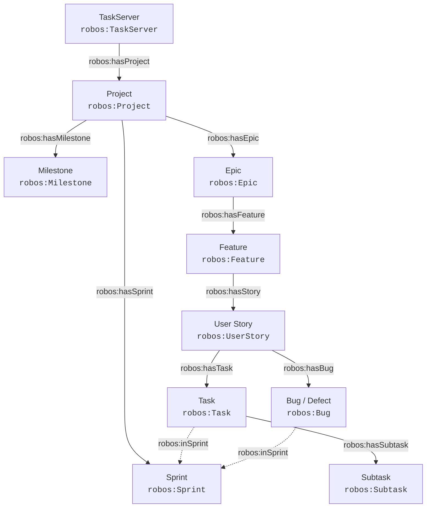

# The RobOS SDLC Knowledge Graph
{: .no_toc }

The master architectural blueprint, modular packaging system, and dual-state semantic engine powering AI-first software delivery in RobOS.
{: .fs-6 .fw-300 }

## Table of contents
{: .no_toc .text-delta }

1. TOC
{:toc}

---

## What is the SDLC Knowledge Graph?

In traditional software development, institutional knowledge about an engineering organization is scattered across dozens of disconnected silos: architecture diagrams in Confluence or Miro, API contracts in SwaggerHub or Postman, team rosters in Workday or Okta, cloud credentials in password managers or local `.env` files, and issue tickets in Jira or GitHub.

When an AI coding agent or new engineer joins the team, they have **zero holistic context**. They cannot know that changing a column in a database migration breaks a downstream analytics job, or that changing an authentication header violates an API contract.

**RobOS solves this through the SDLC Knowledge Graph (KGraph).**

The Knowledge Graph is a live, machine-readable, plain-text semantic graph that models every asset, service, dependency, contract, team, and credential across your entire software delivery lifecycle. Rather than locking this data in a proprietary SaaS database, RobOS stores the graph directly inside your Git repositories using open web standards:

- **OASIS OSLC Core 3.0** (Open Services for Lifecycle Collaboration) for requirements, change requests, and quality assurance.
- **W3C JSON-LD 1.1** (Linked Data) for cross-repository URI references and semantic triples.
- **W3C SHACL** (Shapes Constraint Language) for structural schema validation and automated quality gates.
- **Spotify Backstage & C4 Model** for component registries and software architecture topologies.
- **UNIX Password Store (`pass`) & GPG** for zero-plaintext secret management.

<div style="margin: 2rem 0; border: 1px solid #1e293b; border-radius: 12px; overflow: hidden; background: #0b101b; box-shadow: 0 10px 40px rgba(0,0,0,0.6);">
  
  <div style="padding: 0.75rem 1.25rem; font-size: 0.85rem; color: #94a3b8; border-top: 1px solid #1e293b; background: #0d1424; text-align: center;">
    <strong>Living Architecture Engine</strong>: How modular package stores and multi-repo composition power the dual-state engine to deliver instant blast radius analysis, grounded AI coding agents, automated living docs, and verified code ownership. <em>(Click image to zoom full screen)</em>
  </div>
</div>

---

## 1. Dual-State Architecture (World 1 vs. World 2)

Traditional developer tools only see the files currently sitting on your hard drive. RobOS operates on a **Dual-State Engine** that continuously compares two distinct graph realities:

1. **World 1 (Live Baseline / `main`)**: The production architecture, stable schemas, and deployed microservices currently running in production.
2. **World 2 (Feature Branch / In-Progress Work)**: The proposed architectural changes, newly synthesized services, modified schemas, and updated endpoints in an active pull request or developer workspace.

When an AI agent or developer makes changes, RobOS calculates the semantic difference between World 1 and World 2 before any code is merged. If a proposed change introduces a breaking schema change or violates an OpenAPI contract, RobOS instantly highlights the affected downstream nodes and prevents regressions.

| Architecture Knowledge Graph Explorer (World 1: Production Baseline) | Dual-State Visual Difference Engine (World 1 vs. World 2 Diff) |
|:---:|:---:|
|  |  |

---

## 2. Modular Packaging & Standard Namespaces

As organizations scale to hundreds of microservices, storing the entire architecture in a single monolithic file causes merge conflicts and performance degradation. 

RobOS decomposes the Knowledge Graph into **modular, namespaced package stores** under [`.robos/kgraphs/<package-id>/package.jsonld`](https://github.com/nddipiazza/robos/tree/main/.robos/kgraphs) indexed by [`.robos/kgraph.yaml`](https://github.com/nddipiazza/robos/blob/main/.robos/kgraph.yaml). Each package represents a logical domain with independent lifecycle versioning:

| Package ID & Live Source | Namespace Prefix | Purpose & Managed Entities |
|:---|:---|:---|
| [**`core-platform`**](https://github.com/nddipiazza/robos/blob/main/.robos/kgraphs/core-platform/package.jsonld) | `robos.core` | System architecture, C4 container topology, relational and NoSQL databases (`robos:Database`, `robos:NoSQLDatabase`), Kafka message brokers (`robos:MessageBroker`), MCP servers (`robos:MCPServer`), and distributed build systems. |
| [**`organization`**](https://github.com/nddipiazza/robos/blob/main/.robos/kgraphs/organization/package.jsonld) | `robos.org` | Team Topologies (`stream-aligned`, `platform`, `enabling`, `complicated-subsystem`), human architects, AI agent personas (`robos:AgentPersona`), Git project organizations (`robos:GitProjectOrganization`), and enterprise directory sync. |
| [**`services`**](https://github.com/nddipiazza/robos/blob/main/.robos/kgraphs/services/package.jsonld) | `robos.services` | Backend microservices, OpenAPI 3.1 REST contracts, Protobuf gRPC stubs (`robos:ProtobufContract`), GraphQL schemas (`robos:GraphQLContract`), and BDD verification features. |
| [**`applications`**](https://github.com/nddipiazza/robos/blob/main/.robos/kgraphs/applications/package.jsonld) | `robos.apps` | Single-page web apps, desktop apps, mobile apps, PC games, mobile games, and console CLI tools. |
| [**`devops`**](https://github.com/nddipiazza/robos/blob/main/.robos/kgraphs/devops/package.jsonld) | `robos.devops` | Kubernetes clusters (`robos:KubernetesCluster`), cloud environments (`robos:Environment`), GitOps deployments (`robos:GitOpsDeployment`), CI/CD pipelines (`robos:CICDPipeline`), container registries, OAuth apps, DNS domains, and secure GPG password store credentials. |
| [**`learning`**](https://github.com/nddipiazza/robos/blob/main/.robos/kgraphs/learning/package.jsonld) | `robos.learning` | Interactive developer eLearning courses, hands-on architectural labs, and architectural modules. |
| [**`documentation`**](https://github.com/nddipiazza/robos/blob/main/.robos/kgraphs/documentation/package.jsonld) | `robos.docs` | Living documentation pages (`robos:DocumentationPage`), visual flow diagrams (`robos:FlowDiagram`) with dual Mermaid text and AI illustrations, Architecture Decision Records (`robos:ArchitectureDecisionRecord` / `robos:ADR`), interactive guided walkthroughs (`robos:InteractiveWalkthrough`), and verified code snippets (`robos:CodeSnippet`). |
| [**`testing`**](https://github.com/nddipiazza/robos/blob/main/.robos/kgraphs/testing/package.jsonld) | `robos.testing` | First-class Gherkin features (`robos:GherkinFeature`), backgrounds (`robos:GherkinBackground`), business rules (`robos:GherkinRule`), scenarios (`robos:Scenario`), outlines (`robos:ScenarioOutline`), examples tables (`robos:ExamplesTable`), step definitions (`robos:StepDefinition`), data tables (`robos:DataTable`), docstrings (`robos:DocString`), test plans (`robos:TestPlan`), test suites (`robos:TestSuite`), execution records (`robos:TestExecutionRecord`), and 16+ major testing frameworks (`robos:TestingLibrary`). |

### Backwards-Compatible Aggregation

While each package is stored in its own isolated file, RobOS automatically maintains an aggregated view in [`.robos/knowledge-graph.jsonld`](https://github.com/nddipiazza/robos/blob/main/.robos/knowledge-graph.jsonld) whenever packages are saved, alongside canonical definitions in [`.robos/ontology.jsonld`](https://github.com/nddipiazza/robos/blob/main/.robos/ontology.jsonld) and team structures in [`.robos/teams.yaml`](https://github.com/nddipiazza/robos/blob/main/.robos/teams.yaml). This ensures existing scripts, Backstage catalog importers, and legacy tools continue to function without changes.

| SDLC Graph Telemetry & Packages Bar | Modular Package Stores (8 Namespaces) |
|:---:|:---:|
|  |  |

---

## 3. Multi-Repo Composition & Git-Tag Versioning

Modern enterprise architectures rarely reside in a single Git repository. Teams frequently depend on shared domain models, corporate identity policies, and infrastructure contracts maintained in separate repositories.

RobOS provides **first-class multi-repository composition**:

1. **Remote Repository Registry**: Developers and squads can register external GitHub or GitLab repositories directly in the Knowledge Graph repository registry.
2. **SemVer Git-Tag Pinning**: Every remote dependency is pinned to an immutable semantic version Git tag (e.g. `v1.2.0`, `v2.4.1`).
3. **Automated Local Caching**: Remote knowledge graph packages are fetched and cached into `~/.robos/cache/kgraphs/<repo-id>@<git-tag>/` with on-demand synchronization.
4. **Namespace Filtering**: In the `robos-graph` desktop explorer, developers can filter the active view by package namespace (`robos.services`, `robos.apps`, `robos.devops`) to focus exclusively on their team's domain.

| Multi-Repo Registry & Git-Tag Versioning | Package Namespace Filter (`robos.services`) |
|:---:|:---:|
|  |  |

---

## 4. DevOps Account Integrations & GPG Password Store (`pass`)

A major engineering challenge is integrating external cloud infrastructure and CI/CD tools without leaking sensitive credentials into version control. 

RobOS includes an interactive **DevOps Integration Hub** covering **7 major categories and 25+ providers**:

- **Source Control**: GitHub, GitLab, Bitbucket, Gitea, Azure Repos
- **Cloud Infrastructure**: AWS, Google Cloud (GCP), Microsoft Azure, Red Hat OpenShift, Cloudflare, DigitalOcean
- **CI/CD & GitOps**: Jenkins, Buildkite, GitHub Actions, GitLab CI, ArgoCD
- **Package & Artifact Registries**: JFrog Artifactory, Sonatype Nexus, NPM, Docker Hub, GitHub Packages (GHCR), AWS ECR
- **Containers & Virtualization**: Docker Engine, Podman, Kubernetes, VMware vSphere, Proxmox
- **OAuth & Identity**: Okta, Auth0, Keycloak, GitHub OAuth, Microsoft Entra (Azure AD)
- **Domains & DNS**: GoDaddy, Cloudflare DNS, AWS Route 53, Namecheap

### The Zero-Plaintext Security Standard

RobOS enforces a strict architectural guarantee: **Sensitive tokens, private keys, and passwords NEVER appear in the Knowledge Graph or Git history.**

Instead, RobOS integrates directly with the UNIX standard password store (`pass`):

```
┌──────────────────────────────────────┐       ┌─────────────────────────────────────────────────────────┐
│     robos:DevOpsIntegration Node     │       │                robos:PassCredential Node                │
│ ──────────────────────────────────── │       │ ─────────────────────────────────────────────────────── │
│ @id: urn:robos:devops:cloud:aws:prod │──────▶│ @id: urn:robos:pass:devops:cloud:aws:prod:secretKey     │
│ robos:provider: "aws"                │       │ robos:passPath: "devops/cloud/aws/prod/secretAccessKey" │
│ robos:endpointUrl: "us-east-1"       │       │ robos:managedByPass: true                               │
└──────────────────────────────────────┘       └────────────────────────────┬────────────────────────────┘
                                                                            │ (GPG Encrypted on Local Disk)
                                                                            ▼
                                               ┌─────────────────────────────────────────────────────────┐
                                               │ ~/.password-store/devops/cloud/aws/prod/secretAccessKey │
                                               │ [GPG Encrypted Ciphertext — Zero Plaintext in Git]      │
                                               └─────────────────────────────────────────────────────────┘
```

1. When configuring an integration in the onboarding wizard, fields marked with `🔒 GPG Pass Encrypted` are encrypted using the developer's GPG keyring and written to `~/.password-store/devops/<category>/<provider>/<account-slug>/<key>.gpg`.
2. The Knowledge Graph creates a first-class `robos:PassCredential` reference node declaring only the safe path `robos:passPath`.
3. The parent `robos:DevOpsIntegration` node references the credential via `robos:hasCredential`.
4. **Pre-Flight Connection Probing**: Before saving, RobOS runs a live connection probe (`⚡ Test Connection`) to authenticate credentials against provider endpoints.

| DevOps Hub & Active Accounts | Onboarding Wizard (7 Categories & 25+ Providers) |
|:---:|:---:|
|  |  |

| Dynamic Config Form with GPG Pass Badges | Active Accounts & Pass Credentials View |
|:---:|:---:|
|  |  |

---

## 5. High-Density Resource Nodes Explorer & Collapsible Grouping

As organizations register dozens of microservices, frontends, contracts, and DevOps integrations, the SDLC Resource Nodes panel in the desktop explorer can easily grow to over 100 items. To eliminate vertical clutter and enhance navigation speed, RobOS features a redesigned **high-density collapsible explorer**:

- **Collapsible Package Accordions**: Nodes are grouped by package domain (`services`, `applications`, `devops`, `core-platform`, `organization`, `learning`) by default, complete with chevrons, namespace indicators (`robos.services`), and real-time count badges.
- **Dynamic Category Grouping Mode**: With a single click (`🏷️ Type`), developers can re-group the entire hierarchy into semantic categories: Microservices & Containers, Front End Applications, Desktop Apps, API Contracts, BDD Features, DevOps Integrations, and Pass Credentials.
- **Single-Row Horizontal Filter Chip Track**: Rather than wrapping 16 filter pills across multiple rows and consuming vertical height, filters are consolidated into a smooth, single-row horizontally scrollable chip track (`overflow-x: auto`), freeing up over 100px of vertical workspace.
- **High-Density Node Cards**: Each node item features a category-coded left accent border (`var(--accent)` for microservices, green for BDD, purple for frontends, amber for credentials), clear typography, repository subtext, and compact metadata badges.
- **Real-Time Search & Reset**: Instant filtering across titles, URIs, packages, and repositories. Matching groups automatically expand while non-matching groups hide, and an integrated `×` button resets search in 1 click.

| Package Grouping Mode (`robos.services`) | Category Grouping Mode (Microservices & Contracts) |
|:---:|:---:|
|  |  |

| Instant Search & Matching Group Expansion | Single-Row Horizontal Filter Chip Track |
|:---:|:---:|
|  |  |

---

## 6. Blast Radius Tracing & SHACL Quality Gates

When an engineer or AI agent updates a service interface, RobOS uses W3C SHACL shape validation and semantic graph traversal to calculate the **blast radius** of the change:

- **AST & Contract Mutation Detection**: Identifies whether added or modified properties break consumer expectations.
- **Microservice Dependency Graph**: Traverses upstream and downstream HTTP, gRPC, and Kafka connections to list every impacted component.
- **Automated Living Documentation Sync**: Whenever nodes in the Knowledge Graph change, RobOS alerts AI agents to discern documentation impacts and automatically update project plans, OpenAPI manifests, and markdown walkthroughs.

| Blast Radius Tracing & Impact Analysis | Polyglot Service Architecture Map |
|:---:|:---:|
|  |  |

---

## 7. Importing Company Knowledge Graph Entries with AI Agent (`import-company-kgraph`)

When migrating an existing company, organization, or division into RobOS, institutional catalogs are frequently stored in corporate developer portals (Spotify Backstage, internal REST APIs), centralized **AWS S3** bucket inventories, or local filesystem clones.

RobOS equips autonomous AI agents with the **`import-company-kgraph`** skill to discover, analyze, and convert any source into standard, validated OSLC JSON-LD Knowledge Graph entries:

<div style="margin: 2rem 0; border: 1px solid #1e293b; border-radius: 12px; overflow: hidden; background: #0b101b; box-shadow: 0 10px 40px rgba(0,0,0,0.6);">
  
  <div style="padding: 0.75rem 1.25rem; font-size: 0.85rem; color: #94a3b8; border-top: 1px solid #1e293b; background: #0d1424; text-align: center;">
    <strong>Enterprise Knowledge Graph Ingestion Pipeline</strong>: How import-company-kgraph ingests HTTP, S3, FileSystem, and Git forge inventories into validated OSLC JSON-LD and C4 architecture nodes. <em>(Click image to zoom full screen)</em>
  </div>
</div>

### Ingestion CLI Commands
AI agents or developers can execute the companion engine directly:
```bash
# Ingest from an AWS S3 bucket inventory
node plugins/robos/skills/import-company-kgraph/scripts/import-company-kgraph.js \
  --source s3://acme-cloud-governance/sdlc-catalog/enterprise-repos.json \
  --company-name "Acme Global" \
  --company-slug "acme" \
  --import-to-robos

# Ingest from an internal HTTP REST API endpoint / Backstage catalog
node plugins/robos/skills/import-company-kgraph/scripts/import-company-kgraph.js \
  --source https://developer.internal.acme.com/api/catalog.json \
  --company-name "Acme Global" \
  --output ./acme-kgraph.jsonld

# Ingest from local filesystem repository folder
node plugins/robos/skills/import-company-kgraph/scripts/import-company-kgraph.js \
  --source /home/developer/source/repos \
  --company-name "Acme Global" \
  --import-to-robos
```

### Automatic Classification Across All 9 Multi-App Archetypes
The engine inspects build manifests (`package.json`, `pom.xml`, `go.mod`, `Cargo.toml`, etc.) and repository names, classifying components into:
- **`robos:Microservice`** — Backend web services with auto-synthesized OpenAPI 3.1 YAML contracts.
- **`robos:FrontEndApp`** — Web SPAs and SSR portals (React, Next.js, Vue, Svelte).
- **`robos:DesktopApp`** — Workstation desktop apps (Electron, Tauri).
- **`robos:PCGame` / `robos:MobileGame`** — Desktop and mobile video games (Unreal, Unity, Godot).
- **`robos:ConsoleApp`** — Command-line tools (Cobra, Clap, Commander).
- **`robos:DataPipeline`** — Stream/ETL jobs (Kafka Streams, Spark, Celery).
- **`robos:Library`** — Reusable SDKs and shared packages.

---

## 8. Git Project Organizations & Organization-Wide Agent Rules

In enterprise environments and open-source ecosystems, software projects do not exist in isolation. Hundreds of repositories are governed by organizational policies, common licensing requirements, compliance standards, and architectural conventions.

RobOS establishes **`robos:GitProjectOrganization`** (alias **`robos:GitOrganization`**) as a first-class schema object in the `organization` package store (`robos.org`). 

### Dual-State Metadata & Policy Inheritance

A Git Project Organization captures both external forge metadata and living internal policies:

1. **Forge Metadata**: Tracks public or enterprise forge state: handle/slug (`robos:orgName`), forge type (`robos:forgeType` e.g., GitHub, GitLab, Bitbucket), URL, avatar, member count, repository count, and member repository lists (`robos:hasRepository`).
2. **Documentation Context (`robos:documentation`)**: Preserves canonical documentation hubs (`docsUrl`), documentation paths (`docsPaths`), corporate/foundation licensing (`license`), and high-level architectural guidelines (`architectureGuidelines`).
3. **Organization-Wide Agent Rules (`robos:agentRules`)**: Declares standard rules, constraints, and severity levels (e.g., license header requirements, consensus tracing, dependency hygiene) enforced across all child repositories.

<div style="margin: 2rem 0; border: 1px solid #1e293b; border-radius: 12px; overflow: hidden; background: #0b101b; box-shadow: 0 10px 40px rgba(0,0,0,0.6);">
  
  <div style="padding: 0.75rem 1.25rem; font-size: 0.85rem; color: #94a3b8; border-top: 1px solid #1e293b; background: #0d1424; text-align: center;">
    <strong>Hierarchical Context & Agent Rules Inheritance</strong>: How Git Project Organizations cascade documentation, licensing guidelines, and agent rules to member repositories without duplicate configuration. <em>(Click image to zoom full screen)</em>
  </div>
</div>

### Automatic Rule Inheritance for AI Agents

Whenever an AI agent is dispatched to investigate an issue, craft a feature, or perform code review in any repository, RobOS automatically computes the effective organizational rules via `store.getEffectiveAgentRulesForRepository(repoUrlOrSlug)` and documentation via `store.getEffectiveDocumentationForRepository(repoUrlOrSlug)`.

Rules are dynamically resolved across three pathways:
- **Repository URL slug match**: Resolving `https://github.com/apache/kafka` -> organization `apache`.
- **Direct linkage**: Checking if a component declares `robos:inOrganization: urn:robos:git-org:apache`.
- **Organization repository roster**: Checking if the organization lists the repository in `robos:hasRepository`.

### Eliminating Duplicate Skills Across Repositories

In traditional workflows, maintaining agent rules across 350+ repositories requires copying `.cursorrules`, `CLAUDE.md`, or custom skill manifests into every single repo. With RobOS Knowledge Graph inheritance:
- **Zero Redundancy**: Rules, guidelines, and skills are declared once at the Global (`robos.core`), Company, Organization (`robos.org`), or Team level.
- **Immediate Propagation**: Modifying a rule in `urn:robos:git-org:apache` or `urn:robos:team:core-platform` instantly governs every downstream agent session across all repositories without committing any changes to child repos.

### Canonical Example: Apache Software Foundation (`package.jsonld`)

> 🔗 **Live KGraph Entry**: View this organization node live in the project repository: [`.robos/kgraphs/organization/package.jsonld`](https://github.com/nddipiazza/robos/blob/main/.robos/kgraphs/organization/package.jsonld)

```json
{
  "@id": "urn:robos:git-org:apache",
  "@type": [
    "robos:GitProjectOrganization",
    "robos:GitOrganization",
    "schema:Organization",
    "oslc:Resource"
  ],
  "dcterms:title": "Apache Software Foundation",
  "dcterms:description": "The Apache Software Foundation provides software for the public good, with over 350 open-source projects and initiatives.",
  "robos:orgName": "apache",
  "robos:url": "https://github.com/apache",
  "robos:forgeType": "github",
  "robos:avatarUrl": "https://avatars.githubusercontent.com/u/47359?s=200&v=4",
  "robos:visibility": "public",
  "robos:isEnterprise": false,
  "robos:verified": true,
  "robos:defaultBranch": "main",
  "robos:memberCount": 1100,
  "robos:repoCount": 350,
  "robos:hasRepository": [
    "github.com/apache/kafka",
    "github.com/apache/spark",
    "github.com/apache/lucene",
    "github.com/apache/airflow",
    "github.com/apache/arrow"
  ],
  "robos:documentation": {
    "docsUrl": "https://www.apache.org/dev/",
    "docsPaths": [
      "docs/index.md",
      "README.md",
      "CONTRIBUTING.md",
      "GOVERNANCE.md",
      "SECURITY.md"
    ],
    "architectureGuidelines": "The Apache Way: vendor-neutral open governance, consensus-driven decisions, public mailing list discussions, and reproducible builds.",
    "license": "Apache-2.0"
  },
  "robos:agentRules": [
    {
      "ruleId": "RULE-APACHE-001",
      "title": "ASF License Header & Notice Verification",
      "severity": "mandatory",
      "description": "Every source file must contain the standard Apache 2.0 license header. Agents must NEVER introduce GPL or copyleft dependencies into ASF codebases.",
      "ruleFile": "AGENTS.md",
      "enforcement": "pre-commit"
    },
    {
      "ruleId": "RULE-APACHE-002",
      "title": "Public Discussion & Consensus Tracing",
      "severity": "mandatory",
      "description": "All architectural alterations and pull requests generated by agents must cite a valid dev@ mailing list discussion thread or associated Apache Jira/GitHub issue.",
      "ruleFile": "docs/governance.md",
      "enforcement": "agent-review"
    }
  ],
  "robos:agentRulesDoc": "AGENTS.md",
  "robos:package": "organization",
  "robos:namespace": "robos.org"
}
```

### SHACL Shape Conformance

Every `robos:GitProjectOrganization` is validated against `urn:robos:shape:GitProjectOrganizationShape`, ensuring mandatory title, forge URL, organization handle/slug, and forge type are present before mutations are committed to the graph.

---

## 9. Foundational SDLC Domains: Data, AI Agents, Cloud GitOps & Contracts

To provide a complete, unbroken digital twin of modern software development, RobOS models the 4 foundational operational domains of software engineering as first-class, SHACL-validated citizens:

### 1. Data Infrastructure & Storage (`core-platform`)

Databases and message brokers are modeled directly within the platform architecture, allowing microservices to declare relational bindings and event-driven topologies:

- **Relational Databases (`robos:Database` / `robos:RelationalDatabase`)**:
  - Enforced by `urn:robos:shape:DatabaseShape`.
  - Properties: `dcterms:title`, `robos:engine` (e.g. `postgresql`, `mysql`, `sqlite`, `oracle`), `robos:databaseName`, `robos:host`, `robos:port`, and optional migration framework `robos:schemaMigration` (Flyway, Liquibase, Prisma).
  - Credentials link to GPG password vault via `robos:hasCredential`.
- **NoSQL Databases & Cache Stores (`robos:NoSQLDatabase` / `robos:CacheStore`)**:
  - Enforced by `urn:robos:shape:NoSQLDatabaseShape`.
  - Properties: `dcterms:title`, `robos:engine` (e.g. `redis`, `mongodb`, `cassandra`, `dynamodb`), `robos:host`, `robos:port`.
- **Message Brokers & Event Streams (`robos:MessageBroker` / `robos:EventBus`)**:
  - Enforced by `urn:robos:shape:MessageBrokerShape`.
  - Properties: `dcterms:title`, `robos:brokerType` (`kafka`, `rabbitmq`, `sqs`, `nats`), `robos:endpoint`, `robos:topics`.
- **Semantic Edges**:
  - `robos:usesDatabase`: Declares that a microservice queries and persists to a database.
  - `robos:publishesTo` / `robos:subscribesTo`: Declares event stream publishers and consumer groups.

> 🔗 **Live KGraph Entry**: View this database node live in the project repository: [`.robos/kgraphs/core-platform/package.jsonld`](https://github.com/nddipiazza/robos/blob/main/.robos/kgraphs/core-platform/package.jsonld)

```json
{
  "@id": "urn:robos:db:acme-orders-postgres",
  "@type": ["oslc_am:Resource", "robos:Database", "robos:RelationalDatabase"],
  "dcterms:title": "Acme Orders PostgreSQL Primary Cluster",
  "robos:engine": "postgresql",
  "robos:databaseName": "orders_db",
  "robos:host": "postgres.internal.acme.corp",
  "robos:port": 5432,
  "robos:schemaMigration": "flyway",
  "robos:package": "core-platform"
}
```

### 2. AI Agent Personas & Model Context Protocol (`organization` & `core-platform`)

RobOS eliminates generic, ungrounded AI prompts by modeling specialized agent personas and runtime MCP servers in the Knowledge Graph:

- **AI Agent Personas (`robos:AgentPersona` / `robos:AIAgent`)**:
  - Enforced by `urn:robos:shape:AgentPersonaShape`.
  - Properties: `dcterms:title`, `robos:role` (e.g. "Autonomous Pull Request Auditor", "Architecture Guardian", "SRE Incident Triager"), `robos:systemPrompt` (directive), `robos:modelPreference` (Claude Sonnet 5, Gemini 2.5 Pro), and squad assignment (`robos:assignedTeam`).
- **Model Context Protocol Servers (`robos:MCPServer` / `robos:ToolProvider`)**:
  - Enforced by `urn:robos:shape:MCPServerShape`.
  - Properties: `dcterms:title`, `robos:transport` (`stdio`, `sse`), `robos:command` or `robos:endpointUrl`, `robos:toolsProvided` (e.g. `["ast_search", "symbol_lookup", "query_nodes"]`).
- **Semantic Edge**:
  - `robos:usesMCPServer`: Connects an AI Agent Persona to the specific MCP tool servers it is authorized to call.

> 🔗 **Live KGraph Entry**: View this persona node live in the project repository: [`.robos/kgraphs/organization/package.jsonld`](https://github.com/nddipiazza/robos/blob/main/.robos/kgraphs/organization/package.jsonld)

```json
{
  "@id": "urn:robos:agent:pr-reviewer",
  "@type": ["oslc:Person", "robos:AgentPersona", "robos:AIAgent"],
  "dcterms:title": "RobOS Autonomous PR Code Reviewer",
  "robos:role": "Autonomous Pull Request Auditor",
  "robos:systemPrompt": "Audit pull request diffs against architectural rules, OpenAPI specs, and SHACL shapes.",
  "robos:modelPreference": "claude-sonnet-5",
  "robos:assignedTeam": "urn:robos:team:core-platform",
  "robos:usesMCPServer": ["urn:robos:mcp:context-engine", "urn:robos:mcp:kgraph-navigator"],
  "robos:package": "organization"
}
```

### 3. Cloud Infrastructure, Kubernetes & GitOps Deployments (`devops`)

Multi-cluster Kubernetes management (integrated with **Kube Studio**) and GitOps sync engines (ArgoCD, Flux):

- **Kubernetes Clusters (`robos:KubernetesCluster` / `robos:K8sCluster`)**:
  - Enforced by `urn:robos:shape:KubernetesClusterShape`.
  - Properties: `dcterms:title`, `robos:provider` (`eks`, `gke`, `aks`, `k3s`, `minikube`), `robos:apiEndpoint`, `robos:clusterContext`, `robos:namespaces`, `robos:inEnvironment`.
- **Environments (`robos:Environment` / `robos:DeploymentEnvironment`)**:
  - Enforced by `urn:robos:shape:EnvironmentShape`.
  - Properties: `dcterms:title`, `robos:environmentType` (`production`, `staging`, `development`, `test`), `robos:tier` (`tier-1`, `tier-2`).
- **GitOps Deployments (`robos:GitOpsDeployment` / `robos:ArgoCDApplication`)**:
  - Enforced by `urn:robos:shape:GitOpsDeploymentShape`.
  - Properties: `dcterms:title`, `robos:gitopsEngine` (`argocd`, `flux`), `robos:sourceRepo`, `robos:targetCluster`, `robos:targetNamespace`, `robos:syncPolicy`.
- **CI/CD Pipelines (`robos:CICDPipeline` / `robos:Pipeline`)**:
  - Enforced by `urn:robos:shape:CICDPipelineShape`.
  - Properties: `dcterms:title`, `robos:platform` (`github-actions`, `gitlab-ci`), `robos:workflowFile`, `robos:stages`.

> 🔗 **Live KGraph Entry**: View this Kubernetes cluster node live in the project repository: [`.robos/kgraphs/devops/package.jsonld`](https://github.com/nddipiazza/robos/blob/main/.robos/kgraphs/devops/package.jsonld)

```json
{
  "@id": "urn:robos:cluster:prod-us-east-eks",
  "@type": ["c4:DeploymentNode", "robos:KubernetesCluster"],
  "dcterms:title": "Production US-East AWS EKS Cluster",
  "robos:provider": "eks",
  "robos:apiEndpoint": "https://k8s-api.us-east-1.eks.amazonaws.com",
  "robos:clusterContext": "arn:aws:eks:us-east-1:123456789012:cluster/prod-us-east",
  "robos:inEnvironment": "urn:robos:env:production",
  "robos:package": "devops"
}
```

### 4. Expanded API Contracts: Protobuf gRPC & GraphQL (`services`)

RobOS elevates Protobuf interface definitions and GraphQL SDL schemas alongside OpenAPI 3.1 REST contracts:

- **Protobuf gRPC Contracts (`robos:ProtobufContract` / `robos:GRPCContract`)**:
  - Enforced by `urn:robos:shape:ProtobufContractShape`.
  - Properties: `dcterms:title`, `robos:protocol: "grpc-protobuf"`, `robos:specFile` (e.g. `proto/orders/v1/orders.proto`), `robos:packageName`, `robos:rpcMethods`.
- **GraphQL Schema Contracts (`robos:GraphQLContract` / `robos:GraphQLSchema`)**:
  - Enforced by `urn:robos:shape:GraphQLContractShape`.
  - Properties: `dcterms:title`, `robos:protocol: "graphql"`, `robos:specFile` (e.g. `schemas/catalog.graphql`), `robos:schemaType` (`federated-subgraph`, `monolithic`).

---

## 10. Video Walkthroughs & Proof of Work

All Knowledge Graph workflows are validated end-to-end with automated, headless 1080p video recordings and simulated DOM interactions:

### SDLC Resource Nodes Redesign Walkthrough
<video controls preload="metadata" width="100%" style="border-radius: 8px; border: 1px solid #30363d; margin: 16px 0;">
  <source src="{{ '/assets/videos/kgraph-nodes-redesign-final.webm' | relative_url }}" type="video/webm">
  Your browser does not support the video tag.
</video>

### Multi-Package & Multi-Repo Walkthrough
<video controls preload="metadata" width="100%" style="border-radius: 8px; border: 1px solid #30363d; margin: 16px 0;">
  <source src="{{ '/assets/videos/multi-package-repo-final.webm' | relative_url }}" type="video/webm">
  Your browser does not support the video tag.
</video>

### DevOps Integrations & Password Store Walkthrough
<video controls preload="metadata" width="100%" style="border-radius: 8px; border: 1px solid #30363d; margin: 16px 0;">
  <source src="{{ '/assets/videos/devops-integrations-final.webm' | relative_url }}" type="video/webm">
  Your browser does not support the video tag.
</video>

---

## 10. How to Explore the KGraph Locally

### Launch the Desktop GUI
Open the RobOS Knowledge Graph Explorer from your terminal or app launcher:
```bash
# In the RobOS desktop shell:
robos-graph
```

### Inspect Packages via Node.js CLI
```javascript
const { SDLCKnowledgeGraphStore, KGraphPackageManager, DevOpsIntegrationManager } = require('/usr/local/share/robos/robos-graph');

const store = new SDLCKnowledgeGraphStore();
console.log('Registered Packages:', store.listPackages().map(p => p.id));
console.log('Registered Repositories:', store.listRepos().map(r => r.name));
console.log('Active DevOps Integrations:', store.listDevOpsIntegrations().map(i => i['dcterms:title']));
```

### Run Automated End-to-End Walkthrough Demos
```bash
# Run the SDLC Resource Nodes Redesign walkthrough
xvfb-run -a -s "-screen 0 1920x1080x24" node packages/robos-test/demos/kgraph-nodes-redesign-demo.js

# Run the Multi-Package & Multi-Repo Knowledge Graph walkthrough
xvfb-run -a -s "-screen 0 1920x1080x24" node packages/robos-test/demos/multi-package-repo-demo.js

# Run the DevOps Account Integrations & GPG Password Store walkthrough
xvfb-run -a -s "-screen 0 1920x1080x24" node packages/robos-test/demos/devops-integrations-demo.js

# Run the automated unit & GUI test suite
node --test --test-concurrency=1 \
  packages/robos-test/tests/sdlc-graph/multi-package-repo.test.js \
  packages/robos-test/tests/sdlc-graph/devops-integrations.test.js \
  packages/robos-test/tests/sdlc-graph/bulk-repo-import.test.js \
  packages/robos-test/tests/sdlc-graph/robos-graph.test.js \
  packages/robos-test/tests/sdlc-graph/elearning-doc-sync.test.js \
  packages/robos-test/tests/remote-execution/remote-execution-kgraph.test.js \
  packages/robos-test/tests/remote-execution/smoke.test.js
```

---

## 9. Remote Execution Clusters (REAPI v2) & Monorepo Build Systems

Modern monorepos and polyglot architectures rely on distributed compilation, remote action caching, and test execution engines. Rather than locking RobOS into any single proprietary vendor or hardcoding specific tools, RobOS anchors build cluster management in the open-source **Remote Execution API (REAPI v2)** standard (`build.bazel.remote.execution.v2`), standardized by the Linux Foundation and Bazel community.

### Open-Standard Ontologies & SHACL Constraints

1. **`robos:RemoteExecutionCluster`** (`devops` package: `robos.devops`):
   - Captures distributed build execution clusters, content-addressable storage (CAS), action caches, and worker pools.
   - Strictly enforced by `urn:robos:shape:RemoteExecutionClusterShape`.
   - **Provider Independence**: Supports **Buildbarn** (`bb-storage`, `bb-scheduler`, `bb-worker`, `bb-runner`, `bb-browser`), **NativeLink** (Rust), **BuildGrid** (Python), and **BuildBuddy** via the `robos:provider` attribute. Switching providers requires zero schema alterations.

2. **`robos:BuildSystem`** (`core-platform` package: `robos.platform`):
   - Captures monorepo and polyglot build tools: **Bazel** (`.bazelrc`), Meta **Buck2** (`.buckconfig`), Apache **Maven** (`pom.xml`), **Gradle** (`build.gradle.kts`), Rust **Cargo** (`Cargo.toml`), **Go Modules** (`go.mod`), **pnpm** (`pnpm-workspace.yaml`), and **CMake** (`CMakeLists.txt`).
   - Links client repositories to REAPI distributed build clusters via `robos:hasRemoteExecution`.
   - Formally anchored upstream via `robos:refersFrom: "https://schema.org/SoftwareApplication"`.
   - Strictly enforced by `urn:robos:shape:BuildSystemShape`.

### Upstream Schema Provenance (`robos:refersFrom`)

RobOS establishes complete semantic traceability and provenance for all 91 schema definitions. Every SHACL constraint shape and generated node includes an optional canonical reference `robos:refersFrom` (aliased with `rdfs:isDefinedBy` / `rdfs:seeAlso`) pointing to the upstream specification from which the concept originates:

- **W3C & Schema.org**: `https://schema.org/SoftwareApplication`, `https://schema.org/WebApplication`, `https://schema.org/VideoGame`, `https://schema.org/Organization`, `https://schema.org/Person`, `https://schema.org/Dataset`, `https://schema.org/DataCatalog`.
- **OASIS OSLC (Open Services for Lifecycle Collaboration)**:
  - Architecture Management (OSLC AM): `http://open-services.net/ns/am#Resource` (Microservices, Desktop Apps, Console Apps).
  - Requirements Management (OSLC RM): `http://open-services.net/ns/rm#Requirement` (Epics, Features, User Stories, Gherkin Features).
  - Change Management (OSLC CM): `http://open-services.net/ns/cm#ChangeRequest` (Tasks, Subtasks, Bugs, Pull Requests).
  - Quality Management (OSLC QM): `http://open-services.net/ns/qm#TestPlan`, `http://open-services.net/ns/qm#TestSuite`, `http://open-services.net/ns/qm#TestCase` (Scenarios, Outlines), `http://open-services.net/ns/qm#TestExecutionRecord`.
  - Core & Configuration Management: `http://open-services.net/ns/core#ServiceProvider`, `http://open-services.net/ns/config#ConfigurationItem`.
- **C4 Model**: `https://c4model.com/ns#Container`, `https://c4model.com/ns#Component`, `https://c4model.com/ns#System`.
- **Cucumber & Gherkin Reference**: `https://cucumber.io/docs/gherkin/reference/#background`, `https://cucumber.io/docs/gherkin/reference/#rule`, `https://cucumber.io/docs/gherkin/reference/#scenario-outline`, `https://cucumber.io/docs/gherkin/reference/#examples`, `https://cucumber.io/docs/gherkin/reference/#data-tables`, `https://cucumber.io/docs/gherkin/reference/#doc-strings`, `https://cucumber.io/docs/cucumber/step-definitions/`.

**Cardinal Agent Generation Rule**:
When autonomous agents generate or extend KGraph schemas or instances, they ground their representations in these upstream canonical references, maintaining interoperability while expanding upon them with RobOS-specific SDLC properties.

### JSON-LD Node Example

> 🔗 **Live KGraph Entry**: View this remote execution cluster node live in the project repository: [`.robos/kgraphs/devops/package.jsonld`](https://github.com/nddipiazza/robos/blob/main/.robos/kgraphs/devops/package.jsonld)

```json
{
  "@id": "urn:robos:remote-execution:acme-buildbarn-cluster",
  "@type": ["robos:RemoteExecutionCluster", "robos:RemoteBuildCluster", "oslc:Resource"],
  "dcterms:title": "Acme Production Buildbarn REAPI Cluster",
  "robos:protocol": "REAPI_v2",
  "robos:provider": "buildbarn",
  "robos:instanceName": "main",
  "robos:executionEndpoint": "grpc://re-execution.buildbarn.internal:8980",
  "robos:casEndpoint": "grpc://re-cas.buildbarn.internal:8980",
  "robos:actionCacheEndpoint": "grpc://re-cas.buildbarn.internal:8980",
  "robos:browserEndpoint": "http://re-browser.buildbarn.internal:7984",
  "robos:workerPools": [
    {
      "name": "linux-x86_64-large",
      "osFamily": "linux",
      "isa": "x86-64",
      "containerImage": "docker://gcr.io/cloud-marketplace/google/debian11:latest",
      "concurrency": 64
    }
  ],
  "robos:package": "devops",
  "robos:namespace": "robos.devops"
}
```

### Autonomous Client Configuration Synthesis

From the single source of truth in the Knowledge Graph, the companion desktop application (**Remote Execution Studio**) synthesizes:
- **Bazel `.bazelrc` flags**: `--remote_executor`, `--remote_cache`, `--remote_instance_name`, `--remote_default_exec_properties`, `--remote_download_minimal`.
- **Buck2 `.buckconfig` settings**: `[buck2_re_client]` with `engine_address`, `cas_address`, `action_cache_address`.
- **Buildbarn Component Configurations**: Generates validated JSON configurations for `bb-storage`, `bb-scheduler`, `bb-worker`, `bb-runner`, and `bb-browser`.
- **NativeLink Configuration**: Generates validated `nativelink.json` configurations for Rust-powered edge caching.

---

## 10. Universal Application Backing Audit (Zero Unbacked Data)

In RobOS, **all application operational data across the 30+ desktop app suite is 100% backed by the SDLC Knowledge Graph (`SDLCKnowledgeGraphStore`)**. No application maintains orphaned or isolated configuration states.

### Audited App Data & Ontological Mapping

| RobOS Application | Managed Domain Data | KGraph Ontological Type | Package Store | SHACL Constraint Shape | Credential Security |
|:---|:---|:---|:---|:---|:---|
| **Relational DB Manager (`db-manager`)** | SQL connections, schemas, DDL | `robos:Database`, `robos:RelationalDatabase` | `core-platform` | `DatabaseShape` | UNIX `pass` URN |
| **NoSQL DB Manager (`nosql-manager`)** | Redis & MongoDB datastores | `robos:NoSQLDatabase`, `robos:CacheStore`, `robos:DocumentStore` | `core-platform` | `NoSQLDatabaseShape` | UNIX `pass` URN |
| **Data Sources (`data-sources`)** | Knowledge Graph data source endpoints | `robos:DataSource`, `robos:Database`, `robos:StorageStore` | `core-platform` | `DatabaseShape` | UNIX `pass` URN |
| **MCP Manager (`mcp-manager`)** | Model Context Protocol servers | `robos:MCPServer`, `robos:ToolProvider` | `core-platform` | `MCPServerShape` | Local process / SSE |
| **Kube Studio (`kube-studio`)** | Kubernetes clusters & GitOps deployments | `robos:KubernetesCluster`, `robos:GitOpsDeployment` | `devops` | `KubernetesClusterShape`, `GitOpsDeploymentShape` | Kubeconfig / mTLS |
| **Task Servers (`task-servers`)** | Jira & GitHub task servers | `robos:TaskServer` | `organization` | `TaskServerShape` | UNIX `pass` URN |
| **Context Manager (`context-manager`)** | AI context repositories & files | `robos:ContextSource` | `core-platform` | `ContextSourceShape` | Git forge URN |
| **Agents Manager (`agents-manager`)** | Autonomous AI agent personas & directives | `robos:AgentPersona`, `robos:AIAgent` | `organization` | `AgentPersonaShape` | Token reference |
| **Remote Execution Studio (`remote-execution-studio`)** | Distributed REAPI v2 clusters & build configs | `robos:RemoteExecutionCluster`, `robos:BuildSystem` | `devops`, `core-platform` | `RemoteExecutionClusterShape`, `BuildSystemShape` | mTLS / pass |

### Universal Backing Architectural Principles

1. **Single Source of Truth**: All applications query and persist entities through `SDLCKnowledgeGraphStore`, ensuring updates in one tool (e.g. adding a PostgreSQL database in `db-manager`) immediately reify in the architecture map, blast radius analyzer, and living documentation.
2. **Local Fast Cache Mirroring**: Applications maintain fast local caches under `~/.config/robos/` for offline latency, while automatically reconciling and synchronizing bidirectional state with `.robos/kgraphs/` on startup and mutation.
3. **Zero Plaintext Credentials**: Sensitive API tokens, private keys, and passwords are never written to the Knowledge Graph. All credential fields strictly reference first-class `urn:robos:credential:...` nodes backed by UNIX `pass`.
4. **100% SHACL Validation Gate**: Every entity created or updated by any RobOS application must pass W3C SHACL shape validation before being added to the graph, preventing schema drift or incomplete entity definitions.

---

## 11. Child Schema Elements & Entity Hierarchies

RobOS models complex software engineering architectures as interconnected parent-child hierarchies. Every top-level node in the Knowledge Graph decomposes into granular, first-class child schema elements governed by dedicated W3C SHACL constraint shapes:

### 1. Work Item & Task Server Hierarchy

A `robos:TaskServer` (e.g. Jira instance, GitHub Issues) hosts `robos:Project` boards, which decompose into structured agile work items:



| Entity Class | Governing Shape | Key Properties | Parent Predicate |
|:---|:---|:---|:---|
| **`robos:Milestone`** | `MilestoneShape` | `targetDate`, `status` | `robos:inProject` |
| **`robos:Sprint`** | `SprintShape` | `startDate`, `endDate`, `status` | `robos:inProject` |
| **`robos:Epic`** | `EpicShape` | `title`, `description` | `robos:inProject` |
| **`robos:Feature`** | `FeatureShape` | `title`, `status` | `robos:inEpic`, `robos:inProject` |
| **`robos:UserStory`** | `UserStoryShape` | `acceptanceCriteria`, `storyPoints`, `status` | `robos:inFeature`, `robos:inEpic` |
| **`robos:Task`** | `TaskShape` | `priority`, `status`, `assignedDeveloper`, `assignedAgent` | `robos:inStory`, `robos:inSprint` |
| **`robos:Subtask`** | `SubtaskShape` | `title`, `status` | `robos:parentTask` |
| **`robos:Bug`** | `BugShape` | `severity`, `status` | `robos:inSprint`, `robos:parentWorkItem` |

### 2. Git Organization & Source Control Hierarchy

A `robos:GitProjectOrganization` (e.g. `github.com/apache`) aggregates member repositories, branches, pull requests, and commit records:

- **`robos:GitRepository`** (`GitRepositoryShape`): Repository URL, default branch, language stack.
- **`robos:GitBranch`** (`GitBranchShape`): Branch name, parent repository, head commit SHA.
- **`robos:PullRequest`** (`PullRequestShape`): PR number, source branch, target branch, status (`open`, `merged`, `closed`).
- **`robos:GitCommit`** (`GitCommitShape`): Commit SHA hash, message snippet, committer identity.
- **`robos:GitTag`** (`GitTagShape`): Release version tag name, target commit SHA.

### 3. Microservices & API Service Decomposition

A `robos:Microservice` contains granular architectural child nodes:

- **`robos:APIEndpoint`** (`APIEndpointShape`): Path pattern (`/api/v1/orders/{id}`), HTTP method (`GET`, `POST`), request/response schema.
- **`robos:DataModel`** (`DataModelShape`): Core entity data transfer object (DTO) or domain entity name (`OrderDto`).
- **`robos:ServiceDependency`**: Outbound service link with mock proxy URL, timeout, and fallback circuit breaker.

### 4. Databases & Data Schema Elements

Relational and NoSQL datastores decompose into schemas, tables, and columns:

- **`robos:DatabaseSchema`** (`DatabaseSchemaShape`): Logical schema/namespace within the database (`public`, `auth`).
- **`robos:DatabaseTable`** (`DatabaseTableShape`): Relational table name (`orders`, `users`).
- **`robos:DatabaseColumn`** (`DatabaseColumnShape`): Column name, storage data type (`varchar(255)`, `bigint`), primary/foreign key flags.
- **`robos:DatabaseIndex`** (`DatabaseIndexShape`): Table index name and indexed columns.
- **`robos:NoSQLCollection`** (`NoSQLCollectionShape`): Document collection or keyspace name in MongoDB or Redis.

### 5. Event Streaming & Model Context Protocol

- **`robos:MessageTopic`** (`MessageTopicShape`): Stream topic or queue on a `MessageBroker` (`order-events-v1`).
- **`robos:ConsumerGroup`** (`ConsumerGroupShape`): Active consumer group reading from a topic.
- **`robos:MCPTool`** (`MCPToolShape`): Tool name and input parameter schema exposed by a `MCPServer`.
- **`robos:MCPResource`** (`MCPResourceShape`): URI template and mime-type exposed by a `MCPServer`.
- **`robos:MCPPrompt`** (`MCPPromptShape`): Reusable prompt template exposed by a `MCPServer`.

### 6. Kubernetes Infrastructure & CI/CD Stages

- **`robos:KubernetesNamespace`** (`KubernetesNamespaceShape`): Namespace name on a Kubernetes cluster.
- **`robos:KubernetesDeployment`** (`KubernetesDeploymentShape`): Container image, replicas, and pod spec.
- **`robos:KubernetesService`** (`KubernetesServiceShape`): Networking service name and type (`ClusterIP`, `LoadBalancer`).
- **`robos:KubernetesIngress`** (`KubernetesIngressShape`): Ingress hostname routing rules.
- **`robos:PipelineStage`** (`PipelineStageShape`): Sequential execution stage in a CI/CD pipeline (`build`, `test`, `deploy`).
- **`robos:PipelineJob`** (`PipelineJobShape`): Execution job within a pipeline stage (`unit-tests`, `e2e-tests`).
- **`robos:PipelineStep`** (`PipelineStepShape`): Atomic command step within a pipeline job.

---

## Next Steps

- **[🌐 Browse Live Knowledge Graph Packages on GitHub](https://github.com/nddipiazza/robos/tree/main/.robos/kgraphs)**: Inspect the modular JSON-LD package stores, ontology schemas, and GitOps models live in the repository.
- **[📐 Complete KGraph Schemas & Ontologies]({{ site.baseurl }})**: Explore the full 3-tier specification of all 79+ SHACL constraint shapes across the 7 standard RobOS package stores.
- **[RobOS Main Wins]({{ site.baseurl }})**: Discover core architectural advantages powering RobOS.
- **[A Day in the Life with RobOS]({{ site.baseurl }})**: Experience the end-to-end SDLC workflow from concept to deployment.
- **[💡 Explore the Ideas Store on GitHub](https://github.com/nddipiazza/robos/tree/main/docs/ideas)**: View raw idea dumps, community feature proposals, and structured architecture specs.

