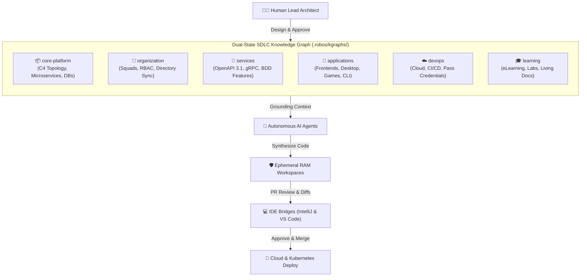
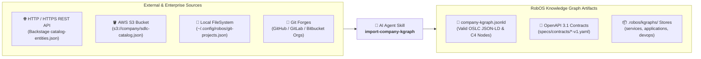

# The RobOS SDLC Knowledge Graph
{: .no_toc }

The master architectural blueprint, modular packaging system, and dual-state semantic engine powering AI-first software delivery in RobOS.
{: .fs-6 .fw-300 }

## Table of contents
{: .no_toc .text-delta }

1. TOC
{:toc}

---

## What is the SDLC Knowledge Graph?

In traditional software development, institutional knowledge about an engineering organization is scattered across dozens of disconnected silos: architecture diagrams in Confluence or Miro, API contracts in SwaggerHub or Postman, team rosters in Workday or Okta, cloud credentials in password managers or local `.env` files, and issue tickets in Jira or GitHub.

When an AI coding agent or new engineer joins the team, they have **zero holistic context**. They cannot know that changing a column in a database migration breaks a downstream analytics job, or that changing an authentication header violates an API contract.

**RobOS solves this through the SDLC Knowledge Graph (KGraph).**

The Knowledge Graph is a live, machine-readable, plain-text semantic graph that models every asset, service, dependency, contract, team, and credential across your entire software delivery lifecycle. Rather than locking this data in a proprietary SaaS database, RobOS stores the graph directly inside your Git repositories using open web standards:

- **OASIS OSLC Core 3.0** (Open Services for Lifecycle Collaboration) for requirements, change requests, and quality assurance.
- **W3C JSON-LD 1.1** (Linked Data) for cross-repository URI references and semantic triples.
- **W3C SHACL** (Shapes Constraint Language) for structural schema validation and automated quality gates.
- **Spotify Backstage & C4 Model** for component registries and software architecture topologies.
- **UNIX Password Store (`pass`) & GPG** for zero-plaintext secret management.



---

## 1. Dual-State Architecture (World 1 vs. World 2)

Traditional developer tools only see the files currently sitting on your hard drive. RobOS operates on a **Dual-State Engine** that continuously compares two distinct graph realities:

1. **World 1 (Live Baseline / `main`)**: The production architecture, stable schemas, and deployed microservices currently running in production.
2. **World 2 (Feature Branch / In-Progress Work)**: The proposed architectural changes, newly synthesized services, modified schemas, and updated endpoints in an active pull request or developer workspace.

When an AI agent or developer makes changes, RobOS calculates the semantic difference between World 1 and World 2 before any code is merged. If a proposed change introduces a breaking schema change or violates an OpenAPI contract, RobOS instantly highlights the affected downstream nodes and prevents regressions.

| Architecture Knowledge Graph Explorer | Dual-State Visual Difference Engine |
|:---:|:---:|
|  |  |

---

## 2. Modular Packaging & Standard Namespaces

As organizations scale to hundreds of microservices, storing the entire architecture in a single monolithic file causes merge conflicts and performance degradation. 

RobOS decomposes the Knowledge Graph into **modular, namespaced package stores** under `.robos/kgraphs/<package-id>/package.jsonld` indexed by `.robos/kgraph.yaml`. Each package represents a logical domain with independent lifecycle versioning:

| Package ID | Namespace Prefix | Purpose & Managed Entities |
|:---|:---|:---|
| **`core-platform`** | `robos.core` | System architecture, C4 container topology, relational and NoSQL databases, Kafka brokers, and base infrastructure. |
| **`organization`** | `robos.org` | Team Topologies (`stream-aligned`, `platform`, `enabling`, `complicated-subsystem`), human architects, AI agent personas, and directory sync (Okta, Azure AD, LDAP). |
| **`services`** | `robos.services` | Backend microservices, OpenAPI 3.1 REST contracts, Protobuf gRPC stubs, GraphQL schemas, and BDD verification features. |
| **`applications`** | `robos.apps` | Single-page web apps, desktop apps, mobile apps, PC games, mobile games, and console CLI tools. |
| **`devops`** | `robos.devops` | Connected cloud accounts (AWS, GCP, Azure), CI/CD pipelines, container registries, OAuth apps, DNS domains, and secure GPG password store credentials. |
| **`learning`** | `robos.learning` | Interactive developer eLearning courses, hands-on architectural labs, and living documentation sync. |

### Backwards-Compatible Aggregation

While each package is stored in its own isolated file, RobOS automatically maintains an aggregated view in `.robos/knowledge-graph.jsonld` whenever packages are saved. This ensures existing scripts, Backstage catalog importers, and legacy tools continue to function without changes.

| SDLC Graph Telemetry & Packages Bar | Modular Package Stores (6 Namespaces) |
|:---:|:---:|
|  |  |

---

## 3. Multi-Repo Composition & Git-Tag Versioning

Modern enterprise architectures rarely reside in a single Git repository. Teams frequently depend on shared domain models, corporate identity policies, and infrastructure contracts maintained in separate repositories.

RobOS provides **first-class multi-repository composition**:

1. **Remote Repository Registry**: Developers and squads can register external GitHub or GitLab repositories directly in the Knowledge Graph repository registry.
2. **SemVer Git-Tag Pinning**: Every remote dependency is pinned to an immutable semantic version Git tag (e.g. `v1.2.0`, `v2.4.1`).
3. **Automated Local Caching**: Remote knowledge graph packages are fetched and cached into `~/.robos/cache/kgraphs/<repo-id>@<git-tag>/` with on-demand synchronization.
4. **Namespace Filtering**: In the `robos-graph` desktop explorer, developers can filter the active view by package namespace (`robos.services`, `robos.apps`, `robos.devops`) to focus exclusively on their team's domain.

| Multi-Repo Registry & Git-Tag Versioning | Package Namespace Filter (`robos.services`) |
|:---:|:---:|
|  |  |

---

## 4. DevOps Account Integrations & GPG Password Store (`pass`)

A major engineering challenge is integrating external cloud infrastructure and CI/CD tools without leaking sensitive credentials into version control. 

RobOS includes an interactive **DevOps Integration Hub** covering **7 major categories and 25+ providers**:

- **Source Control**: GitHub, GitLab, Bitbucket, Gitea, Azure Repos
- **Cloud Infrastructure**: AWS, Google Cloud (GCP), Microsoft Azure, Red Hat OpenShift, Cloudflare, DigitalOcean
- **CI/CD & GitOps**: Jenkins, Buildkite, GitHub Actions, GitLab CI, ArgoCD
- **Package & Artifact Registries**: JFrog Artifactory, Sonatype Nexus, NPM, Docker Hub, GitHub Packages (GHCR), AWS ECR
- **Containers & Virtualization**: Docker Engine, Podman, Kubernetes, VMware vSphere, Proxmox
- **OAuth & Identity**: Okta, Auth0, Keycloak, GitHub OAuth, Microsoft Entra (Azure AD)
- **Domains & DNS**: GoDaddy, Cloudflare DNS, AWS Route 53, Namecheap

### The Zero-Plaintext Security Standard

RobOS enforces a strict architectural guarantee: **Sensitive tokens, private keys, and passwords NEVER appear in the Knowledge Graph or Git history.**

Instead, RobOS integrates directly with the UNIX standard password store (`pass`):

```
┌──────────────────────────────────────┐       ┌─────────────────────────────────────────────────────────┐
│     robos:DevOpsIntegration Node     │       │                robos:PassCredential Node                │
│ ──────────────────────────────────── │       │ ─────────────────────────────────────────────────────── │
│ @id: urn:robos:devops:cloud:aws:prod │──────▶│ @id: urn:robos:pass:devops:cloud:aws:prod:secretKey     │
│ robos:provider: "aws"                │       │ robos:passPath: "devops/cloud/aws/prod/secretAccessKey" │
│ robos:endpointUrl: "us-east-1"       │       │ robos:managedByPass: true                               │
└──────────────────────────────────────┘       └────────────────────────────┬────────────────────────────┘
                                                                            │ (GPG Encrypted on Local Disk)
                                                                            ▼
                                               ┌─────────────────────────────────────────────────────────┐
                                               │ ~/.password-store/devops/cloud/aws/prod/secretAccessKey │
                                               │ [GPG Encrypted Ciphertext — Zero Plaintext in Git]      │
                                               └─────────────────────────────────────────────────────────┘
```

1. When configuring an integration in the onboarding wizard, fields marked with `🔒 GPG Pass Encrypted` are encrypted using the developer's GPG keyring and written to `~/.password-store/devops/<category>/<provider>/<account-slug>/<key>.gpg`.
2. The Knowledge Graph creates a first-class `robos:PassCredential` reference node declaring only the safe path `robos:passPath`.
3. The parent `robos:DevOpsIntegration` node references the credential via `robos:hasCredential`.
4. **Pre-Flight Connection Probing**: Before saving, RobOS runs a live connection probe (`⚡ Test Connection`) to authenticate credentials against provider endpoints.

| DevOps Hub & Active Accounts | Onboarding Wizard (7 Categories & 25+ Providers) |
|:---:|:---:|
|  |  |

| Dynamic Config Form with GPG Pass Badges | Active Accounts & Pass Credentials View |
|:---:|:---:|
|  |  |

---

## 5. High-Density Resource Nodes Explorer & Collapsible Grouping

As organizations register dozens of microservices, frontends, contracts, and DevOps integrations, the SDLC Resource Nodes panel in the desktop explorer can easily grow to over 100 items. To eliminate vertical clutter and enhance navigation speed, RobOS features a redesigned **high-density collapsible explorer**:

- **Collapsible Package Accordions**: Nodes are grouped by package domain (`services`, `applications`, `devops`, `core-platform`, `organization`, `learning`) by default, complete with chevrons, namespace indicators (`robos.services`), and real-time count badges.
- **Dynamic Category Grouping Mode**: With a single click (`🏷️ Type`), developers can re-group the entire hierarchy into semantic categories: Microservices & Containers, Front End Applications, Desktop Apps, API Contracts, BDD Features, DevOps Integrations, and Pass Credentials.
- **Single-Row Horizontal Filter Chip Track**: Rather than wrapping 16 filter pills across multiple rows and consuming vertical height, filters are consolidated into a smooth, single-row horizontally scrollable chip track (`overflow-x: auto`), freeing up over 100px of vertical workspace.
- **High-Density Node Cards**: Each node item features a category-coded left accent border (`var(--accent)` for microservices, green for BDD, purple for frontends, amber for credentials), clear typography, repository subtext, and compact metadata badges.
- **Real-Time Search & Reset**: Instant filtering across titles, URIs, packages, and repositories. Matching groups automatically expand while non-matching groups hide, and an integrated `×` button resets search in 1 click.

| Package Grouping Mode (`robos.services`) | Category Grouping Mode (Microservices & Contracts) |
|:---:|:---:|
|  |  |

| Instant Search & Matching Group Expansion | Single-Row Horizontal Filter Chip Track |
|:---:|:---:|
|  |  |

---

## 6. Blast Radius Tracing & SHACL Quality Gates

When an engineer or AI agent updates a service interface, RobOS uses W3C SHACL shape validation and semantic graph traversal to calculate the **blast radius** of the change:

- **AST & Contract Mutation Detection**: Identifies whether added or modified properties break consumer expectations.
- **Microservice Dependency Graph**: Traverses upstream and downstream HTTP, gRPC, and Kafka connections to list every impacted component.
- **Automated Living Documentation Sync**: Whenever nodes in the Knowledge Graph change, RobOS alerts AI agents to discern documentation impacts and automatically update project plans, OpenAPI manifests, and markdown walkthroughs.

| Blast Radius Tracing & Impact Analysis | Polyglot Service Architecture Map |
|:---:|:---:|
|  |  |

---

## 7. Importing Company Knowledge Graph Entries with AI Agent (`import-company-kgraph`)

When migrating an existing company, organization, or division into RobOS, institutional catalogs are frequently stored in corporate developer portals (Spotify Backstage, internal REST APIs), centralized **AWS S3** bucket inventories, or local filesystem clones.

RobOS equips autonomous AI agents with the **`import-company-kgraph`** skill to discover, analyze, and convert any source into standard, validated OSLC JSON-LD Knowledge Graph entries:



### Ingestion CLI Commands
AI agents or developers can execute the companion engine directly:
```bash
# Ingest from an AWS S3 bucket inventory
node plugins/robos/skills/import-company-kgraph/scripts/import-company-kgraph.js \
  --source s3://acme-cloud-governance/sdlc-catalog/enterprise-repos.json \
  --company-name "Acme Global" \
  --company-slug "acme" \
  --import-to-robos

# Ingest from an internal HTTP REST API endpoint / Backstage catalog
node plugins/robos/skills/import-company-kgraph/scripts/import-company-kgraph.js \
  --source https://developer.internal.acme.com/api/catalog.json \
  --company-name "Acme Global" \
  --output ./acme-kgraph.jsonld

# Ingest from local filesystem repository folder
node plugins/robos/skills/import-company-kgraph/scripts/import-company-kgraph.js \
  --source /home/developer/source/repos \
  --company-name "Acme Global" \
  --import-to-robos
```

### Automatic Classification Across All 9 Multi-App Archetypes
The engine inspects build manifests (`package.json`, `pom.xml`, `go.mod`, `Cargo.toml`, etc.) and repository names, classifying components into:
- **`robos:Microservice`** — Backend web services with auto-synthesized OpenAPI 3.1 YAML contracts.
- **`robos:FrontEndApp`** — Web SPAs and SSR portals (React, Next.js, Vue, Svelte).
- **`robos:DesktopApp`** — Workstation desktop apps (Electron, Tauri).
- **`robos:PCGame` / `robos:MobileGame`** — Desktop and mobile video games (Unreal, Unity, Godot).
- **`robos:ConsoleApp`** — Command-line tools (Cobra, Clap, Commander).
- **`robos:DataPipeline`** — Stream/ETL jobs (Kafka Streams, Spark, Celery).
- **`robos:Library`** — Reusable SDKs and shared packages.

---

## 8. Video Walkthroughs & Proof of Work

All Knowledge Graph workflows are validated end-to-end with automated, headless 1080p video recordings and simulated DOM interactions:

### SDLC Resource Nodes Redesign Walkthrough
<video controls preload="metadata" width="100%" style="border-radius: 8px; border: 1px solid #30363d; margin: 16px 0;">
  <source src="{{ '/assets/videos/kgraph-nodes-redesign-final.webm' | relative_url }}" type="video/webm">
  Your browser does not support the video tag.
</video>

### Multi-Package & Multi-Repo Walkthrough
<video controls preload="metadata" width="100%" style="border-radius: 8px; border: 1px solid #30363d; margin: 16px 0;">
  <source src="{{ '/assets/videos/multi-package-repo-final.webm' | relative_url }}" type="video/webm">
  Your browser does not support the video tag.
</video>

### DevOps Integrations & Password Store Walkthrough
<video controls preload="metadata" width="100%" style="border-radius: 8px; border: 1px solid #30363d; margin: 16px 0;">
  <source src="{{ '/assets/videos/devops-integrations-final.webm' | relative_url }}" type="video/webm">
  Your browser does not support the video tag.
</video>

---

## 9. How to Explore the KGraph Locally

### Launch the Desktop GUI
Open the RobOS Knowledge Graph Explorer from your terminal or app launcher:
```bash
# In the RobOS desktop shell:
robos-graph
```

### Inspect Packages via Node.js CLI
```javascript
const { SDLCKnowledgeGraphStore, KGraphPackageManager, DevOpsIntegrationManager } = require('/usr/local/share/robos/robos-graph');

const store = new SDLCKnowledgeGraphStore();
console.log('Registered Packages:', store.listPackages().map(p => p.id));
console.log('Registered Repositories:', store.listRepos().map(r => r.name));
console.log('Active DevOps Integrations:', store.listDevOpsIntegrations().map(i => i['dcterms:title']));
```

### Run Automated End-to-End Walkthrough Demos
```bash
# Run the SDLC Resource Nodes Redesign walkthrough
xvfb-run -a -s "-screen 0 1920x1080x24" node packages/robos-test/demos/kgraph-nodes-redesign-demo.js

# Run the Multi-Package & Multi-Repo Knowledge Graph walkthrough
xvfb-run -a -s "-screen 0 1920x1080x24" node packages/robos-test/demos/multi-package-repo-demo.js

# Run the DevOps Account Integrations & GPG Password Store walkthrough
xvfb-run -a -s "-screen 0 1920x1080x24" node packages/robos-test/demos/devops-integrations-demo.js

# Run the automated unit & GUI test suite
node --test --test-concurrency=1 \
  packages/robos-test/tests/sdlc-graph/multi-package-repo.test.js \
  packages/robos-test/tests/sdlc-graph/devops-integrations.test.js \
  packages/robos-test/tests/sdlc-graph/bulk-repo-import.test.js \
  packages/robos-test/tests/sdlc-graph/robos-graph.test.js \
  packages/robos-test/tests/sdlc-graph/elearning-doc-sync.test.js
```

