# RobOS Model Flow

This document provides a comprehensive visual reference for the RobOS model flow — the end-to-end system that automates the Software Delivery Lifecycle using event-driven workflows, AI agents, and role-based dashboards.

The model flow is the core design that every RobOS feature serves. Each diagram below shows a different view of the same system.

---

## 1. High-Level System Flow

The complete lifecycle from requirements through deployment, showing how the four user roles interact with RobOS.

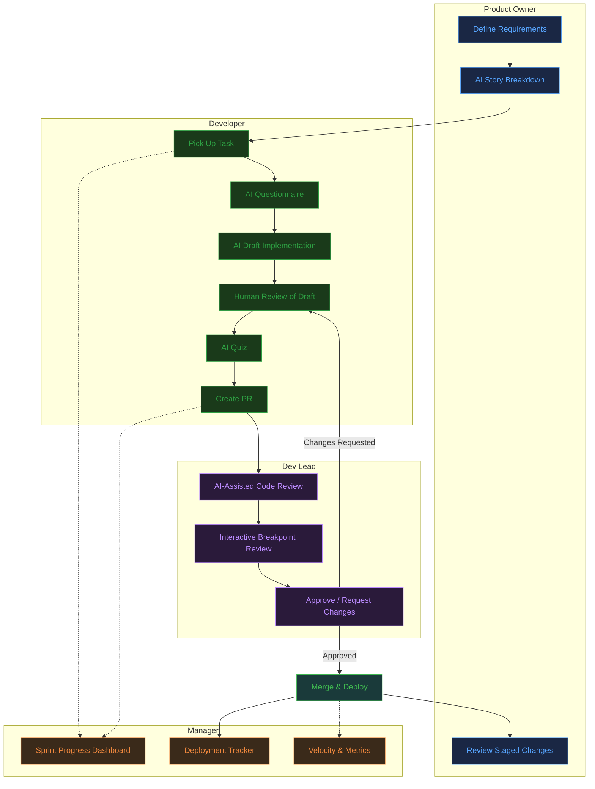

---

## 2. Work Item Hierarchy & Lifecycle

RobOS manages four work item types, each with a distinct lifecycle. Items nest: Releases contain Epics, Epics contain Stories and Bugs.

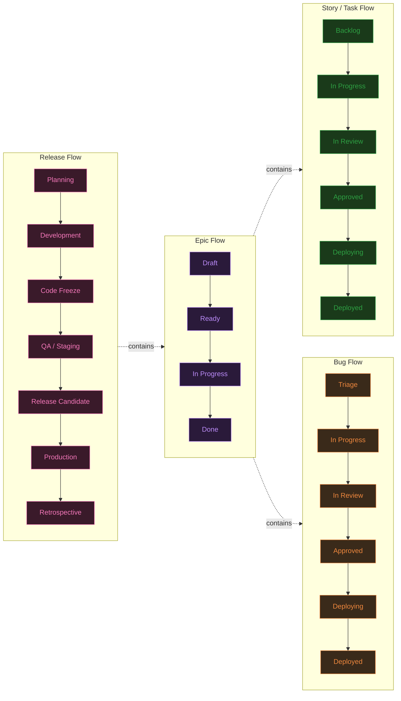

---

## 3. AI-Assisted Task Workflow (Detail)

The core developer workflow — from picking up a task to deployment. This is the heart of the model flow.

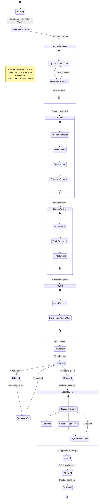

---

## 4. Event Bus & Automatic Status Transitions

Every task status transition is driven by events, not manual updates. The Event Bus receives events from apps, the Rule Engine matches them to workflow transitions, and the Action Registry fires notifications and status updates.

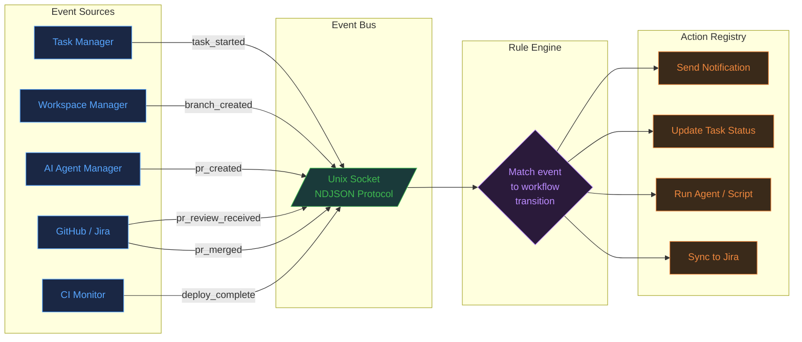

### Event-to-Transition Mapping

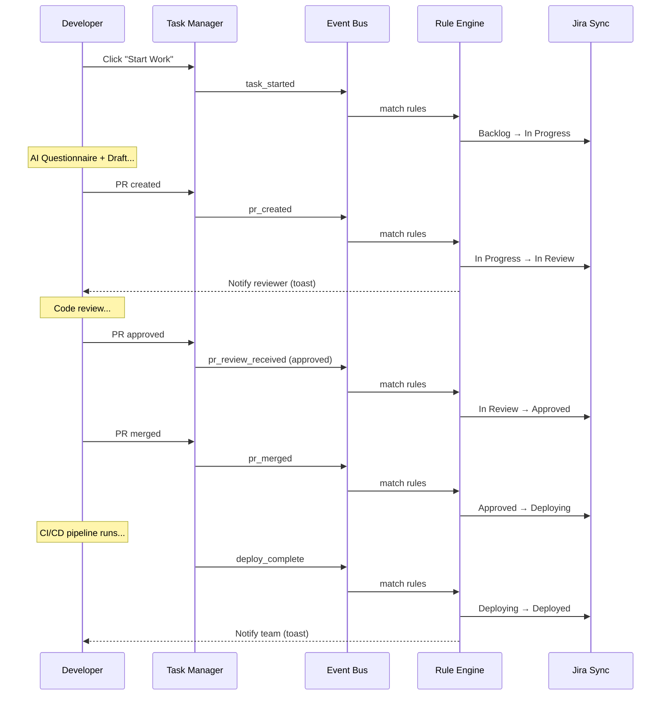

---

## 5. Notification Flow

Events flow through the system and produce role-targeted notifications at each stage.

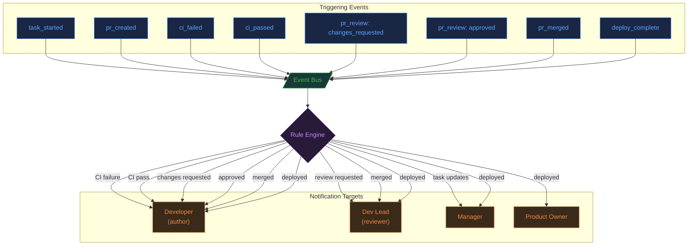

---

## 6. App Involvement by Workflow Phase

Which RobOS apps participate in each phase of the model flow.

```mermaid
flowchart TB
    subgraph Phase1["Phase 1: Setup & Config"]
        A1[Task Servers]
        A2[Workflow Studio]
        A3[Git Projects]
        A4[Pass Manager]
        A5[Security Setup]
    end

    subgraph Phase2["Phase 2: Requirements"]
        B1[Task Manager]
        B2[Context Manager]
    end

    subgraph Phase3["Phase 3: Onboarding"]
        C1[Git Projects]
        C2[Dev Tools]
        C3[Pass Manager]
        C4[Security Setup]
    end

    subgraph Phase4["Phase 4: Development"]
        D1[Task Manager]
        D2[Workspace Manager]
        D3[AI Agent Manager]
        D4[Dev Central]
    end

    subgraph Phase5["Phase 5: Review"]
        E1[PR Review Board]
        E2[Toast Daemon]
        E3[Notifications]
    end

    subgraph Phase6["Phase 6: Deploy"]
        F1[CI Monitor]
        F2[Toast Daemon]
    end

    subgraph Phase7["Phase 7: Dashboards"]
        G1[Manager Dashboard]
        G2[Dev Central]
        G3[Work Journal]
    end

    subgraph Background["Always Running"]
        H1[Event Bus]
        H2[Rule Engine]
        H3[Agent Scheduler]
        H4[Toast Daemon]
    end

    Phase1 --> Phase2 --> Phase3 --> Phase4 --> Phase5 --> Phase6 --> Phase7
    Background -.->|drives| Phase4
    Background -.->|drives| Phase5
    Background -.->|drives| Phase6

    classDef setup fill:#1a2744,stroke:#58a6ff,color:#58a6ff
    classDef req fill:#2a1a3a,stroke:#bc8cff,color:#bc8cff
    classDef onboard fill:#1a3a1a,stroke:#2ea043,color:#2ea043
    classDef dev fill:#3a2a1a,stroke:#f0883e,color:#f0883e
    classDef review fill:#3a1a2a,stroke:#f778ba,color:#f778ba
    classDef deploy fill:#1a3a3a,stroke:#3fb950,color:#3fb950
    classDef dash fill:#2a2a1a,stroke:#d29922,color:#d29922
    classDef bg fill:#0d1117,stroke:#484f58,color:#484f58

    class A1,A2,A3,A4,A5 setup
    class B1,B2 req
    class C1,C2,C3,C4 onboard
    class D1,D2,D3,D4 dev
    class E1,E2,E3 review
    class F1,F2 deploy
    class G1,G2,G3 dash
    class H1,H2,H3,H4 bg
```

---

## 7. Role-Based Perspectives

Each role experiences the same lifecycle from a different vantage point.

### Product Owner Perspective

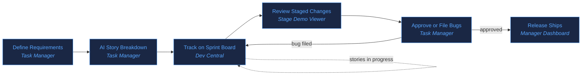

### Developer Perspective

```mermaid
flowchart LR
    D1["Pick Up Task<br/><i>Task Manager</i>"] --> D2["Workspace Auto-Provisions<br/><i>Workspace Manager</i>"] --> D3["AI Questionnaire<br/><i>Agent Manager</i>"]
    D3 --> D4["AI Drafts Code<br/><i>Agent Manager</i>"] --> D5["Review in IDE<br/><i>Dev Tools</i>"] --> D6["AI Quiz<br/><i>Agent Manager</i>"]
    D6 --> D7["PR Created<br/><i>Agent Manager</i>"] --> D8["CI Passes<br/><i>CI Monitor</i>"] --> D9["Code Review<br/><i>PR Review Board</i>"]
    D9 -->|changes requested| D5
    D9 -->|approved| D10["Merge & Deploy<br/><i>CI Monitor</i>"]
    D10 --> D11["Story Deployed<br/><i>Task Manager</i>"]

    classDef dev fill:#1a3a1a,stroke:#2ea043,color:#2ea043
    class D1,D2,D3,D4,D5,D6,D7,D8,D9,D10,D11 dev
```

### Dev Lead Perspective

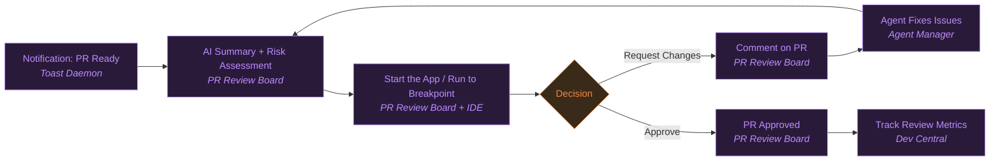

### Manager Perspective

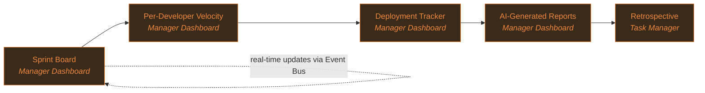

---

## 8. End-to-End Timeline (Model Problem)

A concrete timeline showing Acme Inc's developer Alex working story BBF-3 through the complete flow.

```mermaid
gantt
    title BBF-3: Worker Config Form — Full Lifecycle
    dateFormat HH:mm
    axisFormat %H:%M

    section Setup
    Pick up task + auto-provision workspace    :done, setup, 09:00, 15m

    section AI Workflow
    AI Questionnaire (2 questions)              :done, quest, 09:15, 5m
    AI Draft (5 files created)                  :done, draft, 09:20, 25m
    Human Review in IDE                         :done, review, 09:45, 45m
    AI Quiz                                     :done, quiz, 10:30, 15m

    section PR Lifecycle
    PR #12 created + CI runs                    :done, pr, 10:45, 45m
    Dev Lead review                             :done, dlrev, 11:30, 170m
    Changes requested (memoize fix)             :done, fix, 13:00, 30m
    Re-review + approval                        :done, approve, 13:30, 50m

    section Deploy
    Merge to main                               :done, merge, 14:20, 5m
    CI/CD: build + npm publish                  :done, deploy, 14:25, 15m
    Deployed as v1.3.0                          :milestone, shipped, 14:40, 0m
```

---

## 9. Customizable Workflow Engine

All workflows are defined as YAML in the RobOS Distributed Config Store (git-backed) and editable via Workflow Studio. This diagram shows the relationship between configuration and runtime.

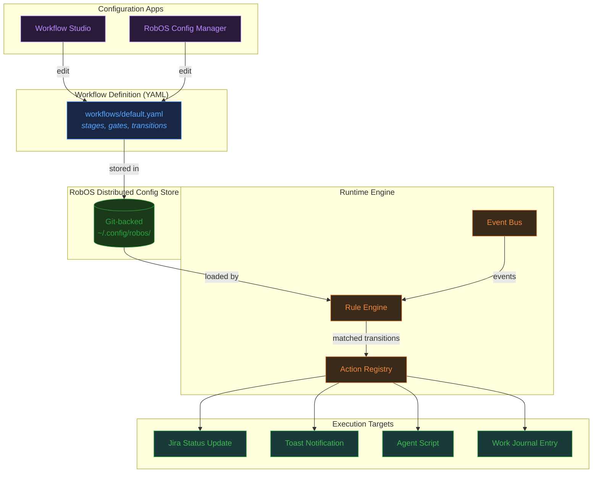

### Default Story Workflow Stages

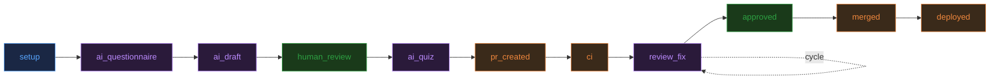

---

## 10. Data Flow: What Connects to What

How the major system components exchange data.

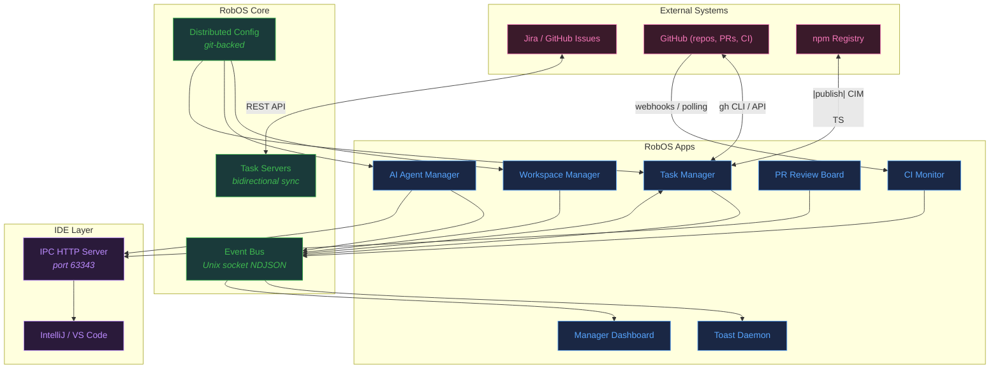

---

## Related Documentation

| Document | Description |
|----------|-------------|
| [model-problem.md](model-problem.md) | Complete end-to-end walkthrough using the Acme Inc / Buildbarn Forms scenario |
| [workflow-examples.md](workflow-examples.md) | Detailed workflow for each work item type (Release, Epic, Story, Bug) |
| [user-types-and-use-cases.md](user-types-and-use-cases.md) | Use cases for each of the four user roles |
| [project-plan/README.md](project-plan/README.md) | Implementation plan with epic dependency diagram |
