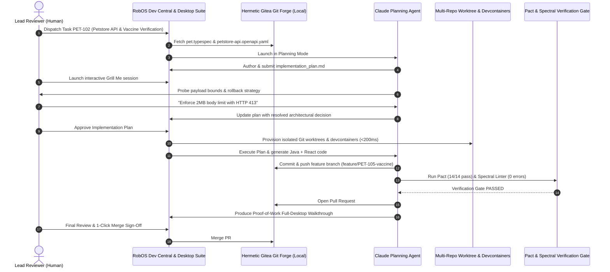

# RobOS Model Problem: Acme Inc Builds Acme Petshop

This document walks through RobOS end-to-end using the iconic open-source benchmark application: **Acme Petshop** (inspired by the canonical OpenAPI / Swagger Petstore). Acme Inc adopts RobOS to design, build, test, and ship a modern, distributed, polyglot Petstore & Veterinary Clinic platform.

The architecture comprises three synchronized repositories:
1. **`petstore-api`** (Backend): Java 21, Spring Boot 3.3, Maven, PostgreSQL 16 REST microservice (`/pets`, `/orders`, `/inventory`, `/vaccines`).
2. **`petstore-web`** (Frontend): Node.js 20, React 18, Vite, Tailwind CSS, Monaco editor, multi-step adoption wizard and checkout portal.
3. **`petstore-common`** (Reusable Library): Shared TypeSpec domain models (`pet.typespec`), Java Jackson DTOs, TypeScript Zod schemas, OpenAPI 3.1 contracts, Pact consumer-provider contracts, and Protobuf event schemas.

Every phase — company setup, developer onboarding, schema authoring, task planning with **Grill Me**, multi-repo worktree orchestration, contract testing, proof-of-work review, and deploy — happens inside RobOS against a **Hermetic Local Gitea Git Forge**.

---

## 1. Cast of Characters & Team Topologies

| Person / Agent | Role | Team Topology | RobOS User Profile |
|----------------|------|---------------|-------------------|
| **Dana** | Engineering Manager | Platform Team | Manager — dashboards, workflow config, task server admin |
| **Pat** | Product Architect | Enabling Team | Product Owner — requirements, TypeSpec & OpenAPI contracts |
| **Jordan** | Lead Reviewer | Stream-Aligned Team | Dev Lead — architecture sign-off, Grill Me interview, PR merge |
| **Alex** | Senior Developer | Stream-Aligned Team | Developer — implementation, multi-repo worktrees |
| **Claude Agent** | AI Planning Swarm | Autonomous Worker | Agent — Planning Mode authoring, Zod & Spring Boot generation |

---

## 2. Multi-Repo Architecture & Git Repositories

All repositories are hosted on the hermetic local **Gitea Git Forge** (`http://127.0.0.1:3000`):

```
+-----------------------------------------------------------------------------------+
|                              ACME PETSHOP PLATFORM                                |
+-----------------------------------------------------------------------------------+
|                                                                                   |
|   1. REUSABLE CORE LIBRARY: petstore-common                                       |
|      - Git URL: http://127.0.0.1:3000/acme-org/petstore-common.git                 |
|      - TypeSpec Domain Models: .robos/entities/pet.typespec                       |
|      - Shared DTOs: Java Jackson DTOs & TypeScript Zod Schemas                    |
|      - Contracts: OpenAPI 3.1 & Pact Consumer-Provider Matrices                   |
|      - Protobuf Events: PetAdoptionEvent, InventoryUpdateProto                    |
|                                                                                   |
|   2. JAVA BACKEND SERVICE: petstore-api                                           |
|      - Git URL: http://127.0.0.1:3000/acme-org/petstore-api.git                    |
|      - Runtime: Java 21, Spring Boot 3.3, Maven, PostgreSQL 16                     |
|      - Devcontainer: mcr.microsoft.com/devcontainers/java:21 (port 8080, 5432)   |
|      - Endpoints: GET/POST /api/v1/pets, POST /api/v1/orders, GET /inventory     |
|      - Feature Delta (PET-105): Rabies Vaccination Verification Gateway           |
|                                                                                   |
|   3. NODE.JS WEB FRONTEND: petstore-web                                           |
|      - Git URL: http://127.0.0.1:3000/acme-org/petstore-web.git                    |
|      - Runtime: Node.js 20, React 18, Vite, Tailwind CSS (port 5173)              |
|      - Devcontainer: mcr.microsoft.com/devcontainers/typescript-node:20          |
|      - Features: Multi-step adoption wizard, shopping cart, Monaco config         |
|                                                                                   |
+-----------------------------------------------------------------------------------+
```

---

## 3. End-to-End Review-First Workflow



---

## 4. Phase-by-Phase Developer Journey

### Phase 1: System Topology & Catalog
Pat and Dana define the system architecture in **System Topology Manager**, visualizing the C4 Container model connecting React Web (`petstore-web`) to Spring Boot REST (`petstore-api`) and PostgreSQL.

### Phase 2: Schema & Contract Authoring
Pat writes `pet.typespec` in **Entity Schema Studio**, automatically generating Java 21 Jackson DTOs and TypeScript Zod schemas. In **API Contract Studio**, Stoplight Spectral verifies OpenAPI 3.1 compliance and Pact consumer contracts pass 14/14 checks.

### Phase 3: Task Planning & Grill Me
Jordan dispatches `PET-102` to the Claude Agent in **Task Planner**. The agent operates in Planning Mode, generating an `implementation_plan.md`. Jordan launches **Grill Me**, answering probing design questions on payload limits and transactional rollbacks.

### Phase 4: Multi-Repo Worktrees & Hermetic Execution
Alex and the AI agent use **Workspace Orchestrator** to spin up coordinated Git worktrees across `petstore-api`, `petstore-web`, and `petstore-common` in `<200ms`, connecting to local Java 21 and Node 20 devcontainers.

### Phase 5: Verification & Dev Central Sign-Off
All 14/14 Pact contract tests and Spectral lint rules pass. The agent generates a timestamped proof-of-work video. In **Dev Central**, Jordan performs 1-Click Sign-Off & Merge, merging PR #42 to `main` on the hermetic Gitea forge.
