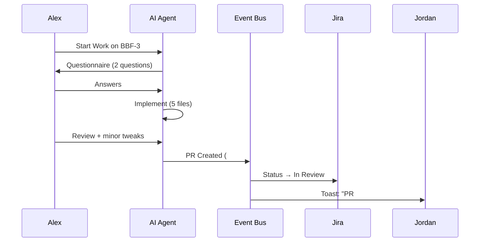

# Phase 4: Developer Works a Task
{: .no_toc }

Alex picks up BBF-3 (Worker Config Form). AI asks questions, writes code, and creates a PR.
{: .fs-6 .fw-300 }

## Table of contents
{: .no_toc .text-delta }

1. TOC
{:toc}

---

## 4.1 — Alex Picks Up the Story

 **App: Task Manager**

Alex picks up story BBF-3. The moment Alex clicks **"Start Work"**, a cascade of automation fires:

1. **Jira status → `In Progress`** (automatic, via Task Servers bidirectional sync)
2. **Branch created**: `feat/bbf-3-worker-config-form` off `main`
3. **Workspace provisioned**: repo checked out to the new branch, `npm install` runs, Storybook starts
4. **IDE opens**: WebStorm/VS Code launches with the workspace, navigated to `src/components/`
5. **Event Bus publishes**: `task_started` event → Work Journal records it

The Task Manager UI updates in real-time for the entire team:

```
BBF-3: Worker Config Form
Status: In Progress ●
Assignee: Alex
Branch: feat/bbf-3-worker-config-form
Started: 2026-03-21 09:15
```

---

## 4.2 — AI Questionnaire

 **App: AI Agent Manager**

The AI agent reviews the task context — proto definitions, existing form components, ROBOS.md — and asks clarifying questions **before writing any code**:

> **Agent:** "The `WorkerConfiguration` message has nested `BuildExecutor` and `MountConfiguration`. Should I render these as inline fieldsets, tab panels, or collapsible sections?"

**Alex:** "Collapsible sections."

> **Agent:** "The `concurrency` field accepts a `Runner` proto oneof — `LocalRunner`, `RemoteRunner`, `MergeRunner`. Should I render a type selector dropdown?"

**Alex:** "Yes, like a discriminated union form."

{: .note }
The questionnaire stage ensures AI understands developer intent before spending time on implementation. This typically takes 2-5 minutes and saves hours of rework.

---

## 4.3 — AI Draft

The agent implements the solution:

| File | Purpose |
|:-----|:--------|
| `src/components/WorkerConfigForm.tsx` | Main form with collapsible sections |
| `src/components/RunnerTypeSelector.tsx` | Discriminated union for Runner oneof |
| `src/components/PlatformMatcher.tsx` | Platform dropdown component |
| `src/components/__tests__/WorkerConfigForm.test.tsx` | 23 unit tests |
| `src/stories/WorkerConfigForm.stories.tsx` | 3 Storybook stories |

---

## 4.4 — Human Review & PR Creation

Alex reviews the draft in the IDE, makes minor tweaks, and the agent creates a pull request:

> **PR #12:** `feat(worker): add WorkerConfigForm with runner type selection`
>
> Resolves BBF-3. Adds collapsible-section worker config form with discriminated union runner type selector and platform matcher dropdown.

**The moment the PR is created:**
- **Jira status → `In Review`** (automatic — `pr_created` event triggers the workflow transition)
- **Reviewers assigned**: Jordan is auto-assigned (configured per-repo)
- **Notification sent**: Jordan gets a toast notification


