# Phase 1: Company & Environment Setup
{: .no_toc }

Dana (Dev Manager) provisions the team and configures the development infrastructure. This phase is captured in **five published videos** (01–05) — each linked from the corresponding section below.
{: .fs-6 .fw-300 }

## Table of contents
{: .no_toc .text-delta }

1. TOC
{:toc}

---

## Cast of users

Each role logs in as a separate Linux user on the same RobOS VM. Each user has their own RobOS desktop login, `~/.config/robos/` profile, and GPG/SSH keys (initialized via the **Security Setup** app on first login).

| User | Login | Role in RobOS |
|:-----|:------|:--------------|
| Dana | `dana@acme` | Manager — dashboards, workflow config, task server admin |
| Pat | `pat@acme` | Product Owner — requirements, epic/story creation, staging review |
| Jordan | `jordan@acme` | Dev Lead — code review, architecture decisions, PR approvals |
| Alex | `alex@acme` | Developer — task implementation, AI-assisted coding |

---

## 1.1 — Dana sets up RobOS for Acme

 **Apps:** Task Servers · Workflow Studio · Git Projects · RobOS Preferences

📺 **[Video 01 — Dana sets up RobOS for Acme]({{ site.baseurl }})**

<div style="position: relative; padding-bottom: 56.25%; height: 0; overflow: hidden; max-width: 100%; margin: 1rem 0; border-radius: 8px;">
  <iframe
    src="https://www.youtube-nocookie.com/embed/jB1YQYEA-jA"
    title="RobOS Model Problem · 01 — Dana sets up RobOS for Acme"
    frameborder="0"
    allow="accelerometer; autoplay; clipboard-write; encrypted-media; gyroscope; picture-in-picture"
    allowfullscreen
    style="position: absolute; top: 0; left: 0; width: 100%; height: 100%; border-radius: 8px;"></iframe>
</div>

In one sitting, Dana hooks RobOS up to Jira, designs the workflow every ticket will follow, and registers the two repos the team will work on.

### Jira (Task Servers)

📺 **Deep-dive:** [Dana — Task Servers (Jira via Pass Manager)](https://youtu.be/vygBUoocpbg)

<div style="position: relative; padding-bottom: 56.25%; height: 0; overflow: hidden; max-width: 100%; margin: 1rem 0; border-radius: 8px;">
  <iframe
    src="https://www.youtube-nocookie.com/embed/vygBUoocpbg"
    title="RobOS Model Problem · Dana — Task Servers"
    frameborder="0"
    allow="accelerometer; autoplay; clipboard-write; encrypted-media; gyroscope; picture-in-picture"
    allowfullscreen
    style="position: absolute; top: 0; left: 0; width: 100%; height: 100%; border-radius: 8px;"></iframe>
</div>

Dana opens **Task Servers** and configures Jira as the team's task tracking system:

1. **Stash the API token in Pass Manager** — credentials never live in plain-text config
2. **Add connection** — Jira Cloud instance `acme.atlassian.net`
3. **Reference the pass entry by path** — Task Servers reads the token directly from the password store
4. **Project keys** — list the keys (e.g. `KAN`) the team uses, so RobOS can enumerate them
5. **Test the connection**, then **Save**

Initial sync pulls all existing Jira issues into RobOS. Bidirectional sync stays enabled. Every other RobOS app — Issue Manager, Task Board, Dev Central, PR Review, Manager Dashboard — reads from this one task server.

| Jira Status | RobOS Stage |
|:------------|:------------|
| To Do | `backlog` |
| In Progress | `in_progress` |
| In Review | `in_review` |
| Deploying | `deploying` |
| Done | `deployed` |

### Repos (Git Projects)

Dana adds the two repositories the team will work on:

| Repository | Purpose |
|:-----------|:--------|
| `buildbarn-forms` | React + TypeScript component library — parses proto schemas and generates validated configuration forms |
| `buildbarn-forms-proto` | Protobuf definitions for all Buildbarn configuration messages (worker, storage, scheduler, browser) |

Each repo carries a `ROBOS.md` that tells AI agents and the onboarding system how to set up, build, and test the project:

```markdown
# ROBOS.md — buildbarn-forms

## Prerequisites
- Node.js 20+
- protoc (protobuf compiler) 25+
- GitHub CLI (gh) authenticated

## Local Dev Setup
1. npm install
2. npm run proto:generate
3. npm run dev    # Start Storybook on :6006

## Test
npm test         # Jest unit tests
npm run test:e2e # Playwright component tests
```

---

## 1.2 — Dana installs the team toolchain

 **App:** Dev Tools

📺 **[Video 02 — Dana installs the team toolchain]({{ site.baseurl }})**

<div style="position: relative; padding-bottom: 56.25%; height: 0; overflow: hidden; max-width: 100%; margin: 1rem 0; border-radius: 8px;">
  <iframe
    src="https://www.youtube-nocookie.com/embed/0QWB7I5e9Mw"
    title="RobOS Model Problem · 02 — Dana installs the team toolchain"
    frameborder="0"
    allow="accelerometer; autoplay; clipboard-write; encrypted-media; gyroscope; picture-in-picture"
    allowfullscreen
    style="position: absolute; top: 0; left: 0; width: 100%; height: 100%; border-radius: 8px;"></iframe>
</div>

Before Dana can authenticate agents or use any AI feature, the CLI tools must be in place. Dev Tools is RobOS's package-style installer for developer software: pick what the team needs, it gets staged centrally, and every workspace inherits the same versions. **This step unblocks 1.3 (Agents) which unblocks every AI-powered step that follows.**

---

## 1.3 — Dana configures RobOS Agents

 **App:** Agents Manager

📺 **[Video 03 — Dana configures RobOS Agents]({{ site.baseurl }})**

<div style="position: relative; padding-bottom: 56.25%; height: 0; overflow: hidden; max-width: 100%; margin: 1rem 0; border-radius: 8px;">
  <iframe
    src="https://www.youtube-nocookie.com/embed/ZubntVBA6Pw"
    title="RobOS Model Problem · 03 — Dana configures RobOS Agents"
    frameborder="0"
    allow="accelerometer; autoplay; clipboard-write; encrypted-media; gyroscope; picture-in-picture"
    allowfullscreen
    style="position: absolute; top: 0; left: 0; width: 100%; height: 100%; border-radius: 8px;"></iframe>
</div>

Dev tools are installed. Now RobOS needs an active AI agent before Dana can use any AI-powered feature — including the AI textareas in People Manager and Group Manager. Dana opens Agents Manager, logs in to GitHub Copilot, explores session management and custom CLI parameters, and pins Copilot as the **default AI Agent** for the team.

**Steps:**

1. Open App Launcher → **Agents Manager** — GitHub Copilot shows not logged in; Codex and Claude are already authenticated.
2. **Login** to GitHub Copilot via the Agents panel.
3. Open a **Copilot terminal** and show session resume and custom CLI parameters.
4. Name the session **"Dana's Session"** to demonstrate named sessions.
5. Set **GitHub Copilot as the default AI Agent** — every AI textarea in RobOS now routes through it.

Every AI-powered feature — People Manager, Group Manager, Issue Manager, Workflow Studio, Git Projects, Dev Central — is now active for the whole team. **This step blocks every later episode.**

---

## 1.4 — Dana sets up People Manager

 **App:** People Manager

📺 **[Video 04 — Dana sets up People Manager]({{ site.baseurl }})**

<div style="position: relative; padding-bottom: 56.25%; height: 0; overflow: hidden; max-width: 100%; margin: 1rem 0; border-radius: 8px;">
  <iframe
    src="https://www.youtube-nocookie.com/embed/ZdvQwFQwwbg"
    title="RobOS Model Problem · 04 — Dana sets up People Manager"
    frameborder="0"
    allow="accelerometer; autoplay; clipboard-write; encrypted-media; gyroscope; picture-in-picture"
    allowfullscreen
    style="position: absolute; top: 0; left: 0; width: 100%; height: 100%; border-radius: 8px;"></iframe>
</div>

People Manager is where every RobOS user gets created — name, email, role, GitHub login, the "this is me" marker. The hero feature: an AI textarea that creates one or more users from a plain-English prompt or an at-mentioned external file (a roster, a contractor list, an org chart).

Dana drops the team roster into the AI prompt and gets every user from the document created in one shot.

---

## 1.5 — Dana sets up Group Manager

 **App:** Group Manager

📺 **[Video 05 — Dana sets up Group Manager]({{ site.baseurl }})**

<div style="position: relative; padding-bottom: 56.25%; height: 0; overflow: hidden; max-width: 100%; margin: 1rem 0; border-radius: 8px;">
  <iframe
    src="https://www.youtube-nocookie.com/embed/mxnPjiJ0G8I"
    title="RobOS Model Problem · 05 — Dana sets up Group Manager"
    frameborder="0"
    allow="accelerometer; autoplay; clipboard-write; encrypted-media; gyroscope; picture-in-picture"
    allowfullscreen
    style="position: absolute; top: 0; left: 0; width: 100%; height: 100%; border-radius: 8px;"></iframe>
</div>

Group Manager owns the developer side of every team:

- **Git Projects** — which repos a group owns
- **Software Installations** — toolchains per group
- **Onboarding steps** — the AI's runbook for new joiners
- **Secrets** — per-group credential vault (`GITHUB_TOKEN`, `NPM_TOKEN`, `JIRA_API_TOKEN`)
- **CI management** — environments visible in RobOS CI
- **Members** — who's on the team and what role
- **Workspaces** — RobOS Workspaces owned by the group

Same hero pattern as People Manager: an AI textarea drafts a whole group — repos, members, software, onboarding steps — from a prompt or an @-mentioned external file.

---

## 1.6 — Dana defines the task workflow

 **App:** Workflow Studio

📺 *Captured at the end of [Video 01]({{ site.baseurl }}) — once the team, repos, agent, and toolchain are in place, Dana defines how every ticket moves.*

Dana defines the task workflow that all stories and bugs will follow. Every transition is **event-driven** — when a PR is created, the task automatically moves to `in_review`. No manual status updates needed.

```yaml
story:
  stages:
    - id: backlog
      name: Backlog
      transitions: [in_progress]

    - id: in_progress
      name: In Progress
      auto_enter: task_assigned_and_branch_created
      transitions: [in_review]

    - id: in_review
      name: In Review
      auto_enter: pr_created
      transitions: [approved]

    - id: approved
      name: Approved
      auto_enter: pr_approved
      transitions: [deploying]

    - id: deploying
      name: Deploying
      auto_enter: pr_merged
      transitions: [deployed]

    - id: deployed
      name: Deployed
      auto_enter: deploy_pipeline_completed
```

Events flow through the **Event Bus** and the **Rule Engine** matches them to status transitions.

```mermaid
%%{init: {'theme': 'dark'}}%%
graph LR
    A[Backlog] -->|Start Work| B[In Progress]
    B -->|PR Created| C[In Review]
    C -->|PR Approved| D[Approved]
    D -->|PR Merged| E[Deploying]
    E -->|Deploy Complete| F[Deployed]

    style A fill:#6b7280,stroke:#374151,color:#fff
    style B fill:#3b82f6,stroke:#2563eb,color:#fff
    style C fill:#f59e0b,stroke:#d97706,color:#fff
    style D fill:#22c55e,stroke:#16a34a,color:#fff
    style E fill:#8b5cf6,stroke:#7c3aed,color:#fff
    style F fill:#10b981,stroke:#059669,color:#fff
```



This is the **last** thing Dana does in Phase 1: it codifies the contract every later step enforces. Pat's stories (Phase 2) get authored against these stages, Jordan's CI gates (1.6 of his arc) fire the transitions, and Alex's task workspaces (Phase 3) provision themselves the moment a ticket lands in `in_progress`.

---

## What's next

With Phase 1 complete, RobOS knows the people, the groups, the repos, the workflow, the AI agent, and the toolchain. Pat takes over in **[Phase 2: Requirements]({{ site.baseurl }})** to break the rewrite into ten engineering stories.

For the full 20-episode video series — Pat's epic breakdown, Jordan's CI/CD setup, Alex's onboarding, and the ten engineering phases — see the **[Video Production Plan]({{ site.baseurl }})**.
