# Phase 1: Company & Environment Setup
{: .no_toc }

Dana (Dev Manager) provisions the team and configures the development infrastructure.
{: .fs-6 .fw-300 }

## Table of contents
{: .no_toc .text-delta }

1. TOC
{:toc}

---

## 1.1 — Create RobOS Users

Dana provisions the RobOS VM and creates accounts for the team. Each user gets a RobOS desktop login, `~/.config/robos/` profile, and GPG/SSH keys via the **Security Setup** app on first login.

| User | Login | Role in RobOS |
|:-----|:------|:--------------|
| Dana | `dana@acme` | Manager — dashboards, workflow config, task server admin |
| Pat | `pat@acme` | Product Owner — requirements, epic/story creation, staging review |
| Jordan | `jordan@acme` | Dev Lead — code review, architecture decisions, PR approvals |
| Alex | `alex@acme` | Developer — task implementation, AI-assisted coding |

Each user's **RobOS Preferences** stores their role, notification preferences, and AI model settings.

---

## 1.2 — Dana Sets Up Jira

 **App: Task Servers**

Dana opens the Task Servers app and configures Jira as the team's task tracking system:


1. **Add connection**: Jira Cloud instance `acme.atlassian.net`
2. **Authenticate**: OAuth 2.0 flow — Dana authorizes RobOS to access the Jira project
3. **Map project**: Jira project `BBF` (Buildbarn Forms) to RobOS project
4. **Map statuses**: Jira statuses to RobOS workflow stages:

| Jira Status | RobOS Stage |
|:------------|:------------|
| To Do | `backlog` |
| In Progress | `in_progress` |
| In Review | `in_review` |
| Deploying | `deploying` |
| Done | `deployed` |

{:style="counter-reset:none"}
5. **Sync**: Initial sync pulls all existing Jira issues into RobOS. Bidirectional sync enabled.

---

## 1.3 — Dana Creates the Task Workflow

 **App: Workflow Studio**

Dana defines the task workflow that all stories and bugs will follow. Every transition is **event-driven** — when a PR is created, the task automatically moves to `in_review`. No manual status updates needed.


```yaml
story:
  stages:
    - id: backlog
      name: Backlog
      transitions: [in_progress]

    - id: in_progress
      name: In Progress
      auto_enter: task_assigned_and_branch_created
      transitions: [in_review]

    - id: in_review
      name: In Review
      auto_enter: pr_created
      transitions: [approved]

    - id: approved
      name: Approved
      auto_enter: pr_approved
      transitions: [deploying]

    - id: deploying
      name: Deploying
      auto_enter: pr_merged
      transitions: [deployed]

    - id: deployed
      name: Deployed
      auto_enter: deploy_pipeline_completed
```

These events flow through the **Event Bus** and the **Rule Engine** matches them to status transitions.

```mermaid
graph LR
    A[Backlog] -->|Start Work| B[In Progress]
    B -->|PR Created| C[In Review]
    C -->|PR Approved| D[Approved]
    D -->|PR Merged| E[Deploying]
    E -->|Deploy Complete| F[Deployed]

    style A fill:#6b7280,stroke:#374151,color:#fff
    style B fill:#3b82f6,stroke:#2563eb,color:#fff
    style C fill:#f59e0b,stroke:#d97706,color:#fff
    style D fill:#22c55e,stroke:#16a34a,color:#fff
    style E fill:#8b5cf6,stroke:#7c3aed,color:#fff
    style F fill:#10b981,stroke:#059669,color:#fff
```



---

## 1.4 — Jordan Sets Up Git Projects

 **App: Git Projects**

Jordan (Dev Lead) adds the two repositories:

| Repository | Purpose |
|:-----------|:--------|
| buildbarn-forms | React + TypeScript component library — parses proto schemas and generates validated configuration forms |
| buildbarn-forms-proto | Protobuf definitions for all Buildbarn configuration messages (worker, storage, scheduler, browser) |

For each repo, Jordan writes a `ROBOS.md` file that tells AI agents and the onboarding system how to set up, build, and test the project:

```markdown
# ROBOS.md — buildbarn-forms

## Prerequisites
- Node.js 20+
- protoc (protobuf compiler) 25+
- GitHub CLI (gh) authenticated

## Local Dev Setup
1. npm install
2. npm run proto:generate
3. npm run dev    # Start Storybook on :6006

## Test
npm test         # Jest unit tests
npm run test:e2e # Playwright component tests
```

Jordan also configures **project secrets** via Pass Manager — `GITHUB_TOKEN`, `NPM_TOKEN`, and `JIRA_API_TOKEN` — which will be auto-distributed to developers during onboarding.
