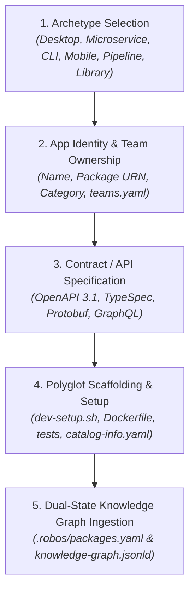

# New App Development Wizard
{: .no_toc }

How application developers use the guided RobOS App Wizard (`packages/app-wizard`) to build new applications from scratch across all 6 multi-app archetypes: Desktop Applications, Microservices & Web APIs, Console CLIs, Mobile Apps, Data Pipelines, and Libraries.
{: .fs-6 .fw-300 }

## Table of contents
{: .no_toc .text-delta }

1. TOC
{:toc}

---

## Overview: Fast Scaffolding Across 6 Archetypes

Creating a new application in a modern enterprise typically requires stitching together boilerplate code, Dockerfiles, dev setup scripts, CI pipelines, and API contract specifications by hand.

The **RobOS App Wizard** (`packages/app-wizard`) eliminates boilerplate friction by guiding the developer through a 4-step wizard tailored to the application's architectural archetype:



---

## Supported Multi-App Archetypes

RobOS categorizes software into 6 distinct archetypes, each with tailored scaffolding templates, mock test runners, and runtime environments:

| Archetype | URN Format | Supported Stacks | What RobOS Scaffolds |
|:---|:---|:---|:---|
| **`robos:Microservice`** | `urn:robos:microservice:<slug>` | Java Spring Boot, Node/Express, Go Gin, Python FastAPI | OpenAPI 3.1 spec, Prism mock server, `Dockerfile`, `dev-setup.sh`, Pact contract gates |
| **`robos:DesktopApp`** | `urn:robos:desktop-app:<slug>` | Electron, Tauri, Qt / C++ | `.desktop` entry, snapshot port registry (`19100+`), Lucide icon, window manager configs |
| **`robos:ConsoleApp`** | `urn:robos:console-app:<slug>` | Go Cobra, Rust Clap, Python Click, Node Commander | CLI argument parser, man pages, shell auto-completion, executable binary release scripts |
| **`robos:MobileApp`** | `urn:robos:mobile-app:<slug>` | React Native, Flutter, iOS Swift, Android Kotlin | Mobile project config, simulator runner, deep link URI schemes, mobile mock server |
| **`robos:DataPipeline`** | `urn:robos:pipeline:<slug>` | Apache Kafka Streams, Celery, Apache Spark | AsyncAPI schema, event topics, consumer/producer configs, local broker docker-compose |
| **`robos:Library`** | `urn:robos:library:<slug>` | TypeScript/NPM, Python/PyPI, Rust/Crates, Java/Maven | Multi-target build configs, semantic release pipeline, documentation generator |

---

## Step-by-Step Wizard Flow

### Step 1: Archetype Selection
The developer launches the App Wizard from the desktop launcher or terminal:
```bash
node packages/robos-test/lib/harness.js --app app-wizard
```
Select one of the 6 archetype cards (e.g. *Microservice / Web API*).

### Step 2: App Identity & Team Ownership
* **Application Name**: Human-readable name (e.g., *Payment Gateway API*).
* **Package Slug & URN**: Standardized identifier (e.g., `payment-gateway-api` → `urn:robos:microservice:payment-gateway-api`).
* **Technology Stack**: Choose language and runtime (e.g., *Java 21 / Spring Boot 3*).
* **Team Ownership**: Assign the component directly to a team defined in `.robos/teams.yaml` (e.g., *Core Platform Team*).

### Step 3: Contract & API Specification
Before generating code, RobOS promotes contract-first development:
* Select specification format: **OpenAPI 3.1**, **Microsoft TypeSpec**, **Protobuf gRPC**, or **GraphQL**.
* Define initial endpoints (e.g. `POST /v1/payments`, `POST /v1/refunds`).
* RobOS validates the contract using **Spectral** linting to prevent breaking syntax.

### Step 4: Polyglot Scaffolding & Generation
Clicking **Scaffold Application** triggers the polyglot generator:
1. **Backstage Catalog Manifest (`catalog-info.yaml`)**:
   ```yaml
   apiVersion: backstage.io/v1alpha1
   kind: Component
   metadata:
     name: payment-gateway-api
     title: "Payment Gateway API"
     tags: [microservice, java-21-spring-boot-3]
   spec:
     type: microservice
     lifecycle: experimental
     owner: platform-team
   ```
2. **Automated Dev Setup (`dev-setup.sh`)**:
   An executable, zero-friction developer setup script that audits SDKs, pulls encrypted credentials, and verifies dependencies.
3. **Container Configuration (`Dockerfile`)**:
   Multi-stage container definition ready for local Docker or Kubernetes deployment.
4. **Starter Tests**:
   Unit test harness and consumer contract test definitions.
5. **Knowledge Graph Ingestion**:
   Appends package to `.robos/packages.yaml` and links into `.robos/knowledge-graph.jsonld`.

---

## E2E Walkthrough & Proof of Work

See the complete, live end-to-end walkthrough video, audio narration, and verification logs:
* [👉 **New App Development Wizard Walkthrough Video & Proof-of-Work**]({{ site.baseurl }}#step-19-develop-a-new-app--robos-app-creation-wizard)
