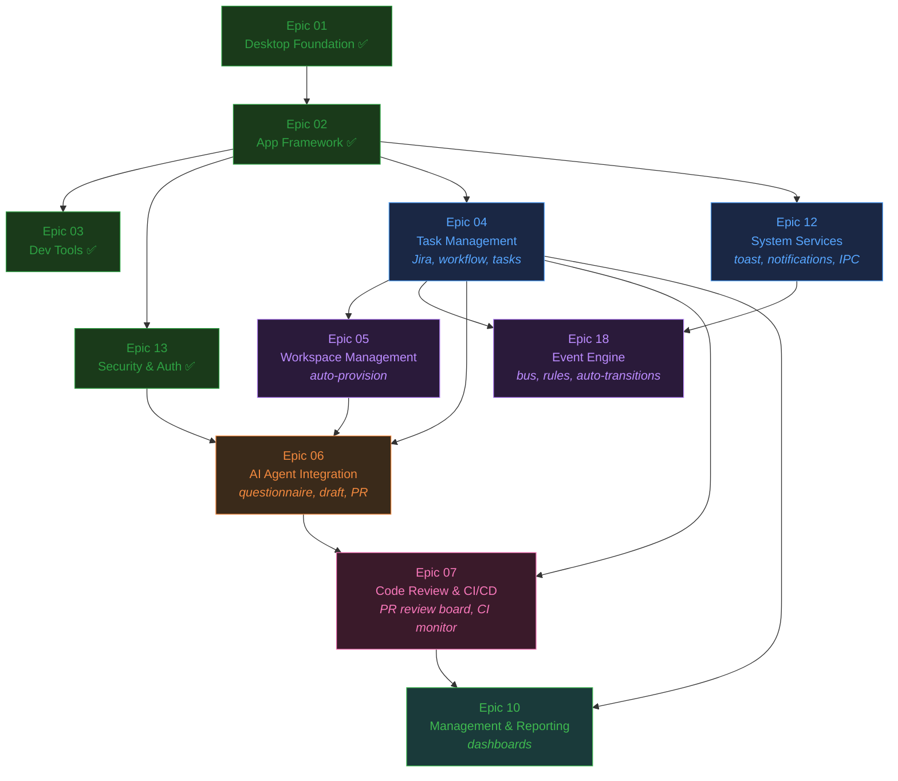

# RobOS Project Plan

## Release: v1.0 — RobOS AI-Assisted Engineering OS

19 epics, 119 stories, ~539 story points.

The plan is organized around the **Model Problem** (see [model-problem.md](../model-problem.md)) — Acme Inc using RobOS to build the buildbarn-forms project. The MVP delivers every phase of that scenario end-to-end. Post-MVP epics add depth (knowledge graph, voice, MCP, packaging).

---

## MVP — Model Problem End-to-End

**11 epics (4 done), 7 to build. Ordered by dependency wave.**

### Wave 0: Foundation (Done)

| # | Epic | Stories | Status |
|---|------|---------|--------|
| 01 | [Desktop Foundation](epic-01-desktop-foundation/epic.md) | 8 | **Done** |
| 02 | [App Framework](epic-02-app-framework/epic.md) | 7 | **Done** |
| 03 | [Dev Tools](epic-03-dev-tools/epic.md) | 5 | **Done** |

### Wave 1: Core Infrastructure (parallel)

No dependencies between these three — build simultaneously.

| # | Epic | Stories | Model Problem Phase | What It Delivers |
|---|------|---------|---------------------|------------------|
| 13 | [Security & Auth](epic-13-security-auth/epic.md) | 4 | Phase 1.1, 1.4, 3 | **Done** — Security Setup (GPG/SSH keys), Pass Manager (secrets distribution) |
| 04 | [Task Management](epic-04-task-management/epic.md) | 8 | Phase 1.2, 1.3, 2, 4.1 | Task Servers (Jira config), Workflow Studio, Task Manager (CRUD, AI breakdown, status tracking) |
| 12 | [System Services](epic-12-system-services/epic.md) | 7 | Phase 5, 6 | Desktop Manager (IPC hub), Toast Daemon (notifications), Notifications app, CLI tools |

### Wave 2: Workspace & Events (parallel, depends on Wave 1)

| # | Epic | Stories | Model Problem Phase | What It Delivers |
|---|------|---------|---------------------|------------------|
| 05 | [Workspace Management](epic-05-workspace-management/epic.md) | 6 | Phase 3.2, 4.1 | Auto-provision workspace (clone, branch, install, start dev server) |
| 18 | [Event Engine](epic-18-event-engine/epic.md) | 6 | Phase 5, 6, 7 | Event Bus, Rule Engine, auto status transitions, event-driven notifications |

### Wave 3: AI Agents (depends on Wave 2)

| # | Epic | Stories | Model Problem Phase | What It Delivers |
|---|------|---------|---------------------|------------------|
| 06 | [AI Agent Integration](epic-06-ai-agent-integration/epic.md) | 8 | Phase 4.2, 4.3, 4.4 | AI Agent Manager (questionnaire, draft, PR creation, review-fix cycles) |

### Wave 4: Code Review & CI (depends on Wave 3)

| # | Epic | Stories | Model Problem Phase | What It Delivers |
|---|------|---------|---------------------|------------------|
| 07 | [Code Review & CI/CD](epic-07-code-review-ci/epic.md) | 6 | Phase 5.2, 6 | PR Review Board (AI summary, breakpoint review, "start the app"), CI Monitor |

### Wave 5: Dashboards (depends on Wave 4)

| # | Epic | Stories | Model Problem Phase | What It Delivers |
|---|------|---------|---------------------|------------------|
| 10 | [Management & Reporting](epic-10-management-reporting/epic.md) | 4 | Phase 8 | Manager Dashboard (sprint board, velocity, deploy tracker), Dev Central dashboards |

### MVP Dependency Diagram



### MVP Critical Path

The longest dependency chain determines the minimum calendar time:

```
Epic 02 (done) → Epic 04 (Task Mgmt) → Epic 05 (Workspace) → Epic 06 (AI Agents) → Epic 07 (Code Review) → Epic 10 (Dashboards)
```

Everything else runs in parallel with this chain. Epic 12, 13, and 18 are off the critical path — they can slip without delaying the overall MVP, as long as they finish before their downstream consumer needs them.

---

## Post-MVP — Depth & Polish

These epics add capabilities that enrich the platform but aren't required for the model problem scenario.

| # | Epic | Stories | What It Adds |
|---|------|---------|-------------|
| 08 | [Engineering Knowledge Graph](epic-08-ekgraph/epic.md) | 6 | Structured company knowledge, auto-context for AI agents |
| 09 | [Voice & Input](epic-09-voice-input/epic.md) | 4 | Voice dictation in all AI text areas, offline STT |
| 15 | [First-Class MCP Server Support](epic-15-mcp-servers/epic.md) | 11 | MCP tool/resource servers for AI agents |
| 17 | [Work Journal](epic-17-work-journal/epic.md) | 9 | Auto-captured developer activity journal |
| 16 | [App Test Framework](epic-16-test-framework/epic.md) | 8 | Scenario-based Electron app testing |
| 14 | [Developer Experience & Testing](epic-14-developer-experience/epic.md) | 4 | Dev harness improvements, DX polish |
| 11 | [Release & Packaging](epic-11-release-packaging/epic.md) | 5 | Package RobOS for distribution |
| 19 | [OAuth Provider Integration](epic-19-oauth-providers/epic.md) | 3 | OAuth PKCE flows, token storage, provider config UI |
| 25 | [RobOS Desktop Agents](epic-25-desktop-agents/epic.md) | 7 | Sub-agent Linux user sessions, socket tunneling, desktop streaming, Proof of Work verification |
| 26 | [Dual-Context eLearning & Interactive Reviewer](epic-26-elearning-and-interactive-reviewer/epic.md) | 5 | Dual-context Prod vs Proposed knowledge, eLearning generator, RobOS Reviewer app with "Teach Me" and "Show Me" DevTools MCP presentation |
| 27 | [Contract-Driven Project Graph & Agent Deployment Engine](epic-27-contract-driven-project-graph/epic.md) | 5 | Git-tracked `.robos/project-graph.json-ld`, Project Graph Studio app (`packages/project-graph`), universal repo dumper CLI, contract-driven agent loop & test gates |

Post-MVP epics can be prioritized in any order once the MVP ships. Suggested first picks:
- **Epic 17 (Work Journal)** — auto-capture is low effort and high visibility
- **Epic 08 (EKGraph)** — makes AI agents significantly smarter with company context
- **Epic 15 (MCP Servers)** — unlocks extensible AI tool integration
- **Epic 25 (RobOS Desktop Agents)** — full visual sub-user Linux sessions & Proof of Work
- **Epic 26 (Interactive Reviewer)** — dual-context eLearning and live browser demos
- **Epic 27 (Contract-Driven Project Graph)** — contract-driven project knowledge graphs & test gates

---

## Full Epic Overview

| # | Epic | Stories | Status | MVP? | Wave |
|---|------|---------|--------|------|------|
| 01 | [Desktop Foundation](epic-01-desktop-foundation/epic.md) | 8 | **Done** | ✅ | 0 |
| 02 | [App Framework](epic-02-app-framework/epic.md) | 7 | **Done** | ✅ | 0 |
| 03 | [Dev Tools](epic-03-dev-tools/epic.md) | 5 | **Done** | ✅ | 0 |
| 04 | [Task Management](epic-04-task-management/epic.md) | 8 | Not started | ✅ | 1 |
| 05 | [Workspace Management](epic-05-workspace-management/epic.md) | 6 | Not started | ✅ | 2 |
| 06 | [AI Agent Integration](epic-06-ai-agent-integration/epic.md) | 8 | Not started | ✅ | 3 |
| 07 | [Code Review & CI/CD](epic-07-code-review-ci/epic.md) | 6 | Not started | ✅ | 4 |
| 08 | [Engineering Knowledge Graph](epic-08-ekgraph/epic.md) | 6 | Not started | | Post |
| 09 | [Voice & Input](epic-09-voice-input/epic.md) | 4 | Not started | | Post |
| 10 | [Management & Reporting](epic-10-management-reporting/epic.md) | 4 | Not started | ✅ | 5 |
| 11 | [Release & Packaging](epic-11-release-packaging/epic.md) | 5 | Not started | | Post |
| 12 | [System Services](epic-12-system-services/epic.md) | 7 | Not started | ✅ | 1 |
| 13 | [Security & Authentication](epic-13-security-auth/epic.md) | 4 | **Done** | ✅ | 1 |
| 14 | [Developer Experience & Testing](epic-14-developer-experience/epic.md) | 4 | Not started | | Post |
| 15 | [First-Class MCP Server Support](epic-15-mcp-servers/epic.md) | 11 | Not started | | Post |
| 16 | [App Test Framework](epic-16-test-framework/epic.md) | 8 | Not started | | Post |
| 17 | [Work Journal](epic-17-work-journal/epic.md) | 9 | Not started | | Post |
| 18 | [Event Engine & Agent Scheduler](epic-18-event-engine/epic.md) | 6 | Not started | ✅ | 2 |
| 19 | [OAuth Provider Integration](epic-19-oauth-providers/epic.md) | 3 | Not started | | Post |
| 25 | [RobOS Desktop Agents](epic-25-desktop-agents/epic.md) | 7 | Not started | | Post |
| 26 | [Dual-Context eLearning & Interactive Reviewer](epic-26-elearning-and-interactive-reviewer/epic.md) | 5 | Not started | | Post |
| 27 | [Contract-Driven Project Graph & Agent Deployment Engine](epic-27-contract-driven-project-graph/epic.md) | 5 | Not started | | Post |

## Story Status Key

- **Done** — Implemented and deployed
- **In Progress** — Currently being worked on
- **Not started** — Ready to begin when dependencies met
