# RobOS Project Plan — Agentic Review-Based Engineering OS

RobOS is the developer-first operating system and desktop ecosystem engineered for **Agentic Review-Based Software Development**. By consolidating open-source standards (OASIS OSLC, Backstage, TypeSpec, Pact, Devcontainers, C4 Model, Team Topologies, MCP, Piper TTS, and Gherkin BDD), RobOS enables autonomous AI agent swarms to plan, build, test, and demonstrate software while human developers act as Lead Architects and Code Reviewers.

---

## Autonomous Agent Feedback & Iterative Development (Xvfb E2E Fabric)

To enable AI agents to autonomously build RobOS feature by feature, development follows a strict, grainlike **End-to-End Driven Development (EDD)** process:
- **Isolated Headless Display**: Every UI test runs against headless `Xvfb` (display `:99`) with `Picom/Mutter` compositors.
- **Fast Deterministic Feedback**: Agents inspect DOM states using `packages/robos-lib/snapshot-cli.js` (ports 19100–19126) and containerized runners (`./scripts/e2e-container.sh`).
- **Proof-of-Work Evidence**: Agents verify each increment by generating timestamped DOM snapshots, contract verification reports, and 1080p narrated video walkthroughs.

---

## Phased Iterative Roadmap

The roadmap is structured into 6 sequential dependency waves, starting from the completed **Setup Wizard**:

```mermaid
graph TD
    subgraph Phase0 [Phase 0: Bootstrapped Foundation & Setup - COMPLETED]
        DF[Desktop Foundation ✅]
        AF[App Framework & RobOS Lib ✅]
        DT[Developer Tool Center ✅]
        SA[Security & Secrets Distribution ✅]
        SU[Unified Setup Wizard & Project Provisioner ✅]
    end

    subgraph Phase1 [Phase 1: Agent Identity, Isolation & System Services]
        SS[System Services & Desktop Integration]
        EP[Ephemeral Agent User Profiles & Display Bridging]
        DA[Desktop Agent Sessions & Tunneling]
        MCP[First-Class MCP Server Support]
    end

    subgraph Phase2 [Phase 2: World State Modeling & GitOps Schema]
        KG[Dual-State SDLC Knowledge Graph & OSLC Engine]
        SLOS[Agent-First Software Lifecycle OS]
        PG[Contract-Driven Project Knowledge Graph]
        EK[Engineering Knowledge Graph - EKGraph]
    end

    subgraph Phase3 [Phase 3: Work Items, Multi-Repo Workspaces & Review Hub]
        TM[Task & Issue Management]
        WM[Multi-Repo Workspace Orchestrator]
        EE[Event Engine & Agent Scheduler]
        DC[Dev Central — AI Agent Review Hub]
    end

    subgraph Phase4 [Phase 4: Autonomous E2E-Driven Dev & Verification]
        EDD[App Test Framework & Local Test Fabric]
        REV[Dual-Context eLearning & Interactive Reviewer]
        AI[AI Agent Integration & Questionnaire]
        CR[Code Review Board & CI/CD Monitor]
    end

    subgraph Phase5 [Phase 5: Extended Experience & Distribution]
        WJ[Work Journal & Activity Feed]
        VI[Voice Dictation & Input]
        MR[Management Dashboards & Blocker Radar]
        RP[Release Packaging & Automated Pipeline]
    end

    Phase0 --> Phase1
    Phase1 --> Phase2
    Phase2 --> Phase3
    Phase3 --> Phase4
    Phase4 --> Phase5
```

---

## Phase Breakdown & Epic Catalog

### Phase 0: Bootstrapped Foundation & Setup (Completed Baseline)
*Delivers the virtual machine environment, dark desktop shell, app scaffolding, and the unified setup wizard.*

| Epic | Location | Status | Scope |
|------|----------|--------|-------|
| **Desktop Foundation** | [desktop-foundation/](desktop-foundation/epic.md) | **Done** | QEMU VM build, cloud-init provisioning, GNOME dark theme, Tilix, LightDM. |
| **App Framework** | [app-framework/](app-framework/epic.md) | **Done** | App launcher, `robos-lib`, `robos-icons`, snapshot debug server (ports 19100–19126). |
| **Dev Tools** | [dev-tools/](dev-tools/epic.md) | **Done** | Software Center tool registry, JetBrains & VS Code installers, streaming logs. |
| **Security & Auth** | [security-auth/](security-auth/epic.md) | **Done** | Security Setup (GPG/SSH keys), Pass Manager (encrypted secrets store). |
| **Unified Setup Wizard** | [unified-setup-and-ai-provisioning/](unified-setup-and-ai-provisioning/epic.md) | **Done** | First-boot onboarding wizard (`packages/robos-onboarding`), missing credential guard, automated project provisioner. |

---

### Phase 1: Agent Identity, Isolation & System Services
*Delivers multi-user Linux session isolation, direct host display bridging, and MCP tool servers.*

| Epic | Location | Status | Scope |
|------|----------|--------|-------|
| **System Services** | [system-services/](system-services/epic.md) | **Done** | Desktop Manager IPC hub, Toast Daemon notifications, Notification history. |
| **Ephemeral Agent Profiles** | [ephemeral-agent-user-profiles/](ephemeral-agent-user-profiles/epic.md) | **Done** | Dynamic ephemeral Linux user accounts (`/home/my-agent-...`), tmpfs memory-backed home storage, direct host X11 display rendering, taskbar/toolbar agent widget. |
| **Desktop Agents** | [desktop-agents/](desktop-agents/epic.md) | **Done** | Sub-agent Linux user sessions, socket tunneling, desktop streaming, Proof of Work verification. |
| **MCP Servers** | [mcp-servers/](mcp-servers/epic.md) | Not started | First-class Model Context Protocol tool and resource servers for AI agent swarms. |

---

### Phase 2: World State Modeling & GitOps Schema
*Delivers the standardized OSLC/JSON-LD knowledge graph, dual-state world branching (Prod vs Future), and declarative `.robos/` storage.*

| Epic | Location | Status | Scope |
|------|----------|--------|-------|
| **Dual-State SDLC Knowledge Graph** | [dual-state-sdlc-knowledge-graph/](dual-state-sdlc-knowledge-graph/epic.md) | Not started | OASIS OSLC Core 3.0 & W3C JSON-LD + SHACL knowledge graph, multi-branch world states (`main` = Prod, `feature/poc/pilot` = Future), semantic graph diffing, and blast radius analysis. |
| **Agent-First Software Lifecycle OS** | [agent-first-software-lifecycle-os/](agent-first-software-lifecycle-os/epic.md) | Not started | 8-pillar SDLC architecture: System Topology, HR/Agents, Entity Schemas (TypeSpec/Buf), API Contracts (OpenAPI/Pact), Packages, Projects, Tasks, and 100% Declarative GitOps Storage. |
| **Contract-Driven Project Graph** | [contract-driven-project-graph/](contract-driven-project-graph/epic.md) | Not started | Project Graph Studio (`packages/project-graph`), universal repo dumper CLI (`robos-graph dump`), contract-driven agent loop. |
| **Engineering Knowledge Graph (EKGraph)** | [engineering-knowledge-graph/](engineering-knowledge-graph/epic.md) | Not started | Structured AI-indexed knowledge base for company engineering knowledge. |

---

### Phase 3: Work Items, Multi-Repo Workspaces & Review Hub
*Delivers DAG task dependency graphs, Git worktree workspace isolation, and Dev Central review hub.*

| Epic | Location | Status | Scope |
|------|----------|--------|-------|
| **Task Management** | [task-management/](task-management/epic.md) | Not started | Task servers (Jira/GitHub Issues), Workflow Studio, Beads DAG task graphs, automated state transitions. |
| **Workspace Management** | [workspace-management/](workspace-management/epic.md) | Not started | Multi-repo Git worktree isolation, automated dev server startup, IDE bridge (IntelliJ port 63343 & VS Code). |
| **Event Engine** | [event-engine/](event-engine/epic.md) | Not started | System event bus, rule engine, automated task status transitions, background agent scheduler. |
| **Dev Central Review Hub** | [dev-central-review-hub/](dev-central-review-hub/epic.md) | Not started | Rebranded Dev Central command center, Planning Mode goal dispatcher, interactive `/grill-me` design grilling, real-time agent telemetry, and blocker radar. |

---

### Phase 4: Autonomous E2E-Driven Dev & Verification
*Delivers self-contained local test fabrics, autonomous Red-Green-Refactor agent loops, and narrated video walkthrough verifications.*

| Epic | Location | Status | Scope |
|------|----------|--------|-------|
| **App Test Framework & Test Fabric** | [test-framework/](test-framework/epic.md) | Not started | Scenario-based Electron app testing, self-contained test fabrics (Docker/Devcontainers, Prism/WireMock stubs, seeded DBs). |
| **Interactive Reviewer & Video Studio** | [elearning-and-interactive-reviewer/](elearning-and-interactive-reviewer/epic.md) | Not started | Dual-context eLearning generator, RobOS Reviewer app with "Teach Me" and "Show Me" multi-modal presentations, Piper neural TTS voiceovers. |
| **AI Agent Integration** | [ai-agent-integration/](ai-agent-integration/epic.md) | Not started | AI agent session manager, questionnaire workflows, draft PR generation, review-fix cycles. |
| **Code Review & CI/CD** | [code-review-ci/](code-review-ci/epic.md) | Not started | PR Review Board, CI monitor, Pact consumer contract gates, 1-click merge approvals. |

---

### Phase 5: Extended Experience & Distribution
*Delivers activity journaling, voice dictation, management telemetry, and distribution packaging.*

| Epic | Location | Status | Scope |
|------|----------|--------|-------|
| **Work Journal** | [work-journal/](work-journal/epic.md) | Not started | Auto-captured developer activity journal backed by Git. |
| **Voice & Input** | [voice-input/](voice-input/epic.md) | Not started | Voice dictation in all `<robos-ai-textarea>` widgets with offline speech-to-text. |
| **Management & Reporting** | [management-reporting/](management-reporting/epic.md) | Not started | Manager dashboard, sprint velocity, deployment trackers, blocker radar. |
| **OAuth Providers** | [oauth-providers/](oauth-providers/epic.md) | Not started | OAuth PKCE flows, token storage, provider configuration UI. |
| **Desktop Customizer** | [desktop-customizer/](desktop-customizer/epic.md) | Not started | Prompt-driven desktop theme engine and widget customizer. |
| **Developer Experience & Polish** | [developer-experience/](developer-experience/epic.md) | Not started | Dev harness improvements, CLI ergonomics, DX polish. |
| **Deep Test Coverage** | [deep-test-coverage/](deep-test-coverage/epic.md) | Not started | Deep mutation testing, coverage visualization, fault injection. |
| **AI Orchestration** | [ai-orchestration/](ai-orchestration/epic.md) | Not started | Multi-model agent orchestration (Claude, Gemini, OpenAI, Ollama). |
| **GitHub Pages Documentation** | [github-pages-docs/](github-pages-docs/epic.md) | Not started | Static documentation portal and architecture site generation. |
| **Release & Packaging** | [release-packaging/](release-packaging/epic.md) | Not started | AppImage, Deb, and VM appliance distribution packages. |
| **Release Pipeline** | [release-pipeline/](release-pipeline/epic.md) | Not started | Automated CI/CD release workflow and semantic versioning. |

---

## Open-Source Standards Integrated ("Reinvent Nothing!")

| Domain | Open Source Standard / Project | How RobOS Integrates It |
|--------|--------------------------------|-------------------------|
| **Knowledge Graph** | [OASIS OSLC Core 3.0](https://open-services.net/), [W3C JSON-LD](https://www.w3.org/TR/json-ld11/), [W3C SHACL](https://www.w3.org/TR/shacl/) | International lifecycle linked data standard storing full system state in `.robos/knowledge-graph.jsonld`. |
| **Topology & Catalog** | [Backstage](https://backstage.io/), [C4 Model](https://c4model.com/), [Cytoscape.js](https://js.cytoscape.org/) | Reuses Backstage `catalog-info.yaml` and C4 DSL; interactive node-link diagrams in Electron. |
| **Human & Agent HR** | [Team Topologies](https://teamtopologies.com/), [Model Context Protocol (MCP)](https://modelcontextprotocol.io/) | Stream-aligned/platform team models; MCP skill bindings for agent personas. |
| **Entity Schemas** | [Microsoft TypeSpec](https://typespec.io/), [JSON Schema](https://json-schema.org/), [Buf CLI](https://buf.build/) | Author once in TypeSpec, auto-generate TypeScript, Java, Python, Go types and Prisma models. |
| **API Contracts** | [OpenAPI 3.1](https://www.openapis.org/), [AsyncAPI](https://www.asyncapi.com/), [Pact](https://pact.io/), [Spectral](https://stoplight.io/open-source/spectral) | Consumer-driven contract testing with Pact; schema linting with Spectral; mock servers with Prism. |
| **Requirements & BDD** | [Cucumber / Gherkin BDD](https://cucumber.io/docs/gherkin/) | First-class `.feature` files and step definitions linked to graph nodes. |
| **Local Environments** | [Development Containers](https://containers.dev/), [Mise](https://mise.jdx.dev/), [Devenv / Nix](https://devenv.sh/) | Standard `.devcontainer/devcontainer.json` environment definitions; isolated runtime containers. |
| **Workspace Isolation** | [Git Worktrees](https://git-scm.com/docs/git-worktree), [Simple-Git](https://github.com/steveukx/git-js) | Zero-overhead multi-repo branch checkouts sharing underlying object stores. |
| **Audio Voiceover** | [Piper TTS](https://github.com/rhasspy/piper) (Rhasspy), [W3C WebVTT](https://www.w3.org/TR/webvtt1/) | Fast local neural voice synthesis synchronized with WebVTT subtitle tracks. |
