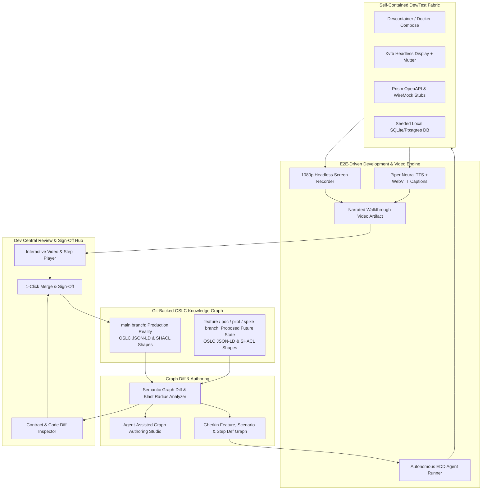

# Dual-State SDLC Knowledge Graph & E2E-Driven Verification Engine

**Status:** Not started
**Priority:** High
**Dependencies:** AI Agent Integration, Code Review & CI/CD, RobOS Desktop Agents, Contract-Driven Project Graph, Dev Central, Agent-First Software Lifecycle OS

Establishes a standardized, open-source-aligned **World State Knowledge Graph** based on **OASIS OSLC Core 3.0** and **W3C JSON-LD + SHACL**, capturing everything developers, architects, project managers, and AI agents need to build and maintain software. Features Git-backed **Dual-State Multi-Branch Versioning** (`main` = current production reality, `feature/*`, `poc/*`, `pilot/*`, `spike/*` = proposed future states) with semantic graph diffing and blast-radius impact analysis. Integrates **Gherkin BDD** features and step definitions into the graph, executes autonomous **End-to-End Driven Development (EDD)** against self-contained local test fabrics, and generates **1080p narrated video walkthroughs** with Piper neural TTS audio and WebVTT captions for seamless human review and 1-click merge approvals in Dev Central.

---

## Stories

| # | Story | Status | Points | Focus Area |
|---|-------|--------|--------|------------|
| 01 | [OSLC Core 3.0 & JSON-LD + SHACL Standard Knowledge Graph Engine](story-01-oslc-jsonld-knowledge-graph-engine.md) | **Done** | 8 | OSS Standard & Graph Storage |
| 02 | [Multi-Branch World State Versioning (`main` vs `feature/poc/pilot`)](story-02-multi-branch-world-state-versioning.md) | **Done** | 8 | Branch State & Lifecycle |
| 03 | [Semantic Graph Diff & Blast Radius Impact Analysis](story-03-semantic-graph-diff-and-impact-analysis.md) | **Done** | 8 | Graph Diffing & Analysis |
| 04 | [Agent-Assisted World Graph Authoring Studio](story-04-agent-assisted-world-graph-authoring-studio.md) | **Done** | 8 | AI Graph Co-Pilot |
| 05 | [Gherkin BDD Feature, Scenario & Step Definition Graph](story-05-gherkin-bdd-feature-and-scenario-graph.md) | **Done** | 8 | Requirements & BDD |
| 06 | [Self-Contained Local Test & Dev Environment Fabric](story-06-self-contained-local-test-fabric.md) | **Done** | 13 | Local Environment Fabric |
| 07 | [Automated E2E-Driven Development (EDD) Agent Runner](story-07-automated-e2e-driven-development-runner.md) | **Done** | 13 | Autonomous Agent Loop |
| 08 | [Multi-Modal Narrated Video Walkthrough Generator](story-08-narrated-video-walkthrough-generator.md) | **Done** | 8 | TTS & Video Generation |
| 09 | [Dev Central Interactive Proof-of-Work Review & Merge Hub](story-09-interactive-review-and-verification-hub.md) | **Done** | 8 | Review Hub & Merge Gate |

---

## Open-Source Standard Mapping ("Re-invent Nothing!")

| Component / Capability | Open Source Standard / Project | How RobOS Reuses & Integrates It |
|------------------------|--------------------------------|----------------------------------|
| **Knowledge Graph Schema** | [OASIS OSLC Core 3.0](https://open-services.net/), [W3C JSON-LD](https://www.w3.org/TR/json-ld11/), [W3C SHACL](https://www.w3.org/TR/shacl/) | The international OASIS standard for software engineering linked data. Uses SHACL shapes to validate graph integrity. |
| **Requirements & Scenarios** | [Cucumber / Gherkin BDD Standard](https://cucumber.io/docs/gherkin/) | First-class `.feature` files, Scenario Outlines, and step definitions connected directly to graph nodes. |
| **Multi-Branch Storage** | [Git](https://git-scm.com/), [libgit2 / Simple-Git](https://github.com/steveukx/git-js) | Dual-state world branching: `main` (Prod) vs `feature/*`, `poc/*`, `pilot/*`, `spike/*` with zero proprietary DB lock-in. |
| **Local Test Fabric** | [Development Containers](https://containers.dev/), [Docker Compose](https://docs.docker.com/compose/), [Prism](https://stoplight.io/open-source/prism), [WireMock](https://wiremock.org/) | Self-contained, offline-first local testing environments with automated mock stubs and seeded databases. |
| **Headless Video Capture** | [Xvfb](https://www.x.org/releases/X11R7.6/doc/man/man1/Xvfb.1.xhtml), [FFmpeg](https://ffmpeg.org/), [Picom Compositor](https://github.com/yshui/picom) | Headless 1080p display rendering and smooth 60fps screen recording. |
| **Neural TTS Narration** | [Piper TTS](https://github.com/rhasspy/piper) (Rhasspy) | Fast, local, neural text-to-speech audio voiceover synchronized with WebVTT subtitle tracks. |
| **Interactive Video Player** | [Video.js](https://videojs.com/) | Integrated Electron video player with interactive step timeline bookmarks and WebVTT caption tracks. |
