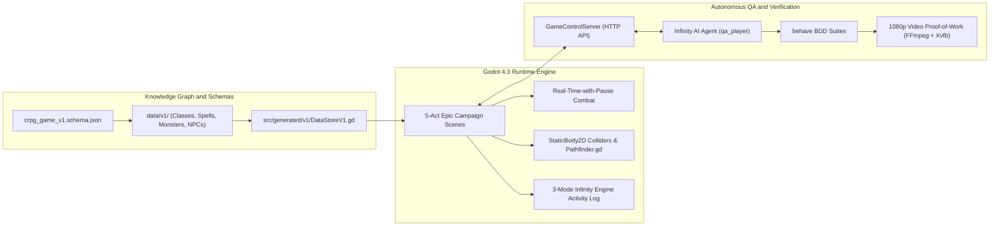

# RobOS Projects: Real-World Applications & Systems
{: .no_toc }

Explore production-grade applications, games, and distributed systems architected, scaffolded, and governed autonomously by RobOS and its AI agents.
{: .fs-6 .fw-300 }

## Table of contents
{: .no_toc .text-delta }

1. TOC
{:toc}

---

## Overview

In traditional software development, autonomous AI coding assistants often produce fragile, disconnected prototypes that break outside simple sandbox scripts. **RobOS transforms AI agents from isolated script writers into Lead System Engineers** governed by formal Knowledge Graph schemas, strict architectural boundaries, and verifiable video proof-of-work.

The **RobOS Projects** portfolio showcases complex, multi-subsystem applications built from scratch using the RobOS AI-First SDLC Platform:
- Polyglot backend microservices and distributed REAPI v2 build clusters.
- Developer tools, database managers, and IDE review bridges.
- **Rich interactive 2D/3D games** featuring Real-Time with Pause (RTwP) combat, collision pathfinding, and autonomous AI playthrough harnesses.

---

---

## Featured Flagship Projects

### 1. The Gig Bandit & Get 'Em Gigs (`getemgigs.com`)

| **Project Name** | **The Gig Bandit & Get 'Em Gigs (`getemgigs.com`)** |
| **Engine / Profile** | Next.js 15 App Router & Vercel Edge Runtime |
| **Language & Stack** | React 19, JavaScript (ESM), TailwindCSS, Vercel Serverless |
| **Ontology & Standard** | Schema.org `schema:WebApplication`, RobOS `robos:FrontEndApp`, C4 `c4:Container` |
| **Core Innovations** | **Buddy Gig Geolocation Escrow** & **Venue Stay-To-Play Reciprocal Booking** |
| **Testing Harness** | Native Node.js Test Runner, Haversine Geofence Verification, Escrow State Engine |
| **Verification Score** | **3 Suites, 6 Tests (100% Passed)** |
| **Live Production** | [https://getemgigs.com](https://getemgigs.com) ([thegigbandit.vercel.app](https://thegigbandit.vercel.app)) · [Deploy to Vercel](https://vercel.com/new/clone?repository-url=https%3A%2F%2Fgithub.com%2Fnddipiazza%2Fthegigbandit) · [GitHub](https://github.com/nddipiazza/thegigbandit) |

  
  
<em>Figure: Reciprocal Buddy Gig attendance agreement, escrow deposit locking, and automated geolocation verification.</em>

---

### 2. Tactical cRPG & Infinity AI Engine

| **Project Name** | **Tactical cRPG Realm (`crpg-realm`)** |
| **Engine / Profile** | Godot 4.3 (GL Compatibility) |
| **Language & Stack** | GDScript (typed), Python 3.12+ (`behave`), FFmpeg |
| **Ontology & Standard** | Schema.org `schema:VideoGame`, RobOS `robos:PCGame`, D&D 5e SRD |
| **Testing Harness** | behave BDD suites for isolated mechanics, spells, and start-to-finish playthroughs |
| **Test Inventory** | Every feature and scenario is recorded to MP4 |

---

## Project Directory

  

    <h3 style="margin-top: 0; color: #58a6ff;"><a href="{{ '/projects/getemgigs/' | relative_url }}">🎸 The Gig Bandit &amp; Get 'Em Gigs</a></h3>
    
A game-changing web platform for the local music scene deployed to <strong>getemgigs.com</strong> on Vercel. Solves empty rooms and predatory pay-to-play with the <strong>Buddy Gig Geolocation Escrow</strong> ("You scratch my back, I'll scratch yours") and <strong>Venue Stay-To-Play</strong> reciprocal ticket economics.

    

      <a href="{{ '/projects/getemgigs/' | relative_url }}" class="btn btn-primary fs-3">Explore Project</a>
      <a href="{{ '/projects/getemgigs/buddy-gig-geolocation-escrow.html' | relative_url }}" class="btn fs-3" style="margin-left: 0.5rem;">Escrow Engine</a>
    

  

  

    <h3 style="margin-top: 0; color: #58a6ff;"><a href="{{ '/projects/crpg-realm/' | relative_url }}">⚔️ Tactical cRPG & Infinity AI Engine</a></h3>
    
A party-based tactical isometric cRPG built in Godot 4 inspired by classic Infinity Engine masterpieces (Baldur's Gate, Icewind Dale). Features D&D 5e SRD rules, 5-Act Epic Campaign, physical building collision, 17 named NPCs with branching dialogue, and a BDD harness that plays the game and records every scenario to video.

    

      <a href="{{ '/projects/crpg-realm/' | relative_url }}" class="btn btn-primary fs-3">Explore Project</a>
      <a href="{{ '/projects/crpg-realm/game-creation-process.html' | relative_url }}" class="btn fs-3" style="margin-left: 0.5rem;">Architecture</a>
    

  

---

## What Makes a RobOS Project Different?

1. **Dual-State Knowledge Graph First**: Every entity (classes, spells, monsters, NPCs, items, maps) is modeled as typed JSON-LD backed by W3C SHACL shape constraints. Changes trigger semantic blast-radius analysis before any code is committed.
2. **Autonomous End-to-End Verification**: Rather than relying on fragile unit assertions or mocked unit tests, RobOS projects are verified in virtual framebuffers (Xvfb) via real user-simulation agents producing 1080p video walkthroughs.
3. **Clean Code Generation**: Engine data stores and data models are auto-generated from JSON Schemas, eliminating hardcoded constants and runtime type errors.
4. **Agent-Agnostic Governance**: The project structure allows Claude Code, Google Antigravity, GitHub Copilot, and OpenAI Codex to collaborate on the exact same codebase without configuration drift.
