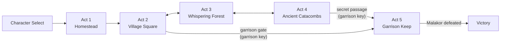

# Tactical cRPG & Infinity AI Engine
{: .no_toc }

*Realm of Heroes: A Night Without Memory* is a party-based, real-time-with-pause cRPG in the style of the Infinity Engine games, built in Godot 4.3 by AI agents working inside RobOS. It ships with an automated test harness that plays the game through a local HTTP API and records every scenario to video.
{: .fs-6 .fw-300 }

[Quick Start]({{ '/projects/crpg-realm/quick-start.html' | relative_url }}){: .btn .btn-primary .mr-2 }
[Build your own game]({{ '/projects/crpg-realm/create-your-own-game.html' | relative_url }}){: .btn .mr-2 }
[Source on GitHub](https://github.com/nddipiazza/robos/tree/main/games/crpg-realm){: .btn }

{: .robos-zoomable-img }
*Oakhaven Village Square, the 2560×1440 hub map, with the party HUD, action toolbar and activity log.*

## Table of contents
{: .no_toc .text-delta }

1. TOC
{:toc}

---

## Find your way

| I want to… | Start with |
|:---|:---|
| Run the game or the tests | [Quick Start]({{ '/projects/crpg-realm/quick-start.html' | relative_url }}) |
| Learn the keys | [Controls]({{ '/projects/crpg-realm/controls.html' | relative_url }}) |
| Add scenes, items, traps, enemies or spells | [Creating Your Own Game]({{ '/projects/crpg-realm/create-your-own-game.html' | relative_url }}), a 12-chapter guide |
| Understand how the test harness drives the game | [Infinity AI Agent & BDD Harness]({{ '/projects/crpg-realm/infinity-ai-agent-harness.html' | relative_url }}) |
| Understand collision, pathfinding, NPCs and fog of war | [World Systems & Pathfinding]({{ '/projects/crpg-realm/world-systems-and-pathfinding.html' | relative_url }}) |
| See the rules math the engine implements | [Engine Specification]({{ '/projects/crpg-realm/elearning-masterclass.html' | relative_url }}) |
| See how the game was generated from the knowledge graph | [Game Creation Process]({{ '/projects/crpg-realm/game-creation-process.html' | relative_url }}) |
| Look up an autoload, data file, endpoint or env var | [Reference]({{ '/projects/crpg-realm/reference.html' | relative_url }}) |
| Learn interactively | [Tactical cRPG Codex]({{ '/projects/crpg-realm/elearning/' | relative_url }}) and [Game Builder Academy]({{ '/projects/crpg-realm/create-your-own-game/elearning/' | relative_url }}) |

---

## At a glance

| | |
|:---|:---|
| **Engine** | Godot 4.3, GL Compatibility renderer, 1920×1080 viewport |
| **Code** | GDScript (`scripts/`, 40 scripts) + JSON content (`data/v1/`) + Python test harness |
| **Characters** | 9 races × 12 classes at Character Select; your hero plus companions who join along the way |
| **Content** | 5 location scenes, 18 NPC records, 46 items, 26 spell entries, 4 trap types |
| **Combat** | Real-time with pause, d20 attack rolls vs AC with advantage/disadvantage, saving throws, area spells, threat-based enemy AI |
| **Tests** | 47 BDD features (17 normal, 24 spells, 6 full playthroughs), each scenario recorded to MP4 |
| **Modding** | Drop-in mod folders in `res://mods/` or `user://mods/`; currently mods can add traps |

---

## The campaign



| Act | Scene | Highlights |
|:---|:---|:---|
| 1 | `Homestead.tscn` | Wake in the manor, loot the guard footlocker (required before you can leave), meet the scout Elora. |
| 2 | `VillageSquare.tscn` | The hub: 11 buildings with solid collision, 12 townsfolk, a shop, ground items, the locked Royal Garrison Gate. |
| 3 | `WhisperingForest.tscn` | River and stone bridge, dire wolves, Goblin Peddler Griknok, Hermit Varis. |
| 4 | `AncientCatacombs.tscn` | Four trap types, skeleton archers, the Spirit of Sir Justin, the grand sarcophagus, the secret passage to the keep. |
| 5 | `GarrisonKeep.tscn` | The showdown with Captain Malakor, then the victory screen. |

The door-by-door graph, with spawn points and lock conditions, is in [Scenes & Door Portals]({{ '/projects/crpg-realm/create-your-own-game/02-scenes-and-portals.html' | relative_url }}).

---

## What it plays like

**Real-time with pause.** Press **Space** at any moment to freeze the action. You can then queue moves (Shift-click), switch the selected party member, change formation or pick a spell. Unpause and everything resolves. [Controls]({{ '/projects/crpg-realm/controls.html' | relative_url }})

**A Baldur's Gate-style activity log.** Combat rolls, dialogue and journal updates all go to one log at the bottom of the screen. It has three sizes (124, 240 and 420 px; press Tab or L to cycle) and grows automatically when a conversation starts. Dialogue replies are numbered in the log; pick one with **1–9** or a click.

{: .robos-zoomable-img }
*Talking to Blacksmith Brand: numbered replies inside the log, no popup.*

**Party and formations.** Six formations (rank, wedge, line, column, square, scatter), rotated to face the direction of travel. Click a portrait to change the leader. [Chapter 9]({{ '/projects/crpg-realm/create-your-own-game/09-party-dynamics-and-formations.html' | relative_url }})

**Enemies that coordinate.** Enemies notice you at 280 px, keep a threat table, switch targets when someone builds more than 15% more threat than the current target, and alert linked packmates up to 950 px away. [Chapter 10]({{ '/projects/crpg-realm/create-your-own-game/10-aggro-tactics-and-pack-ai.html' | relative_url }})

**Traps.** Traps are hidden until a rogue searches or someone casts *Find Traps*. Detected traps can be disarmed with thieves' tools. [Chapter 5]({{ '/projects/crpg-realm/create-your-own-game/05-infinity-engine-traps.html' | relative_url }})

**Spells and area effects.** Fireball is 8d6 in a 180 px radius, DC 14 DEX save for half. There are 24 spell features in the test suite. [Chapter 11]({{ '/projects/crpg-realm/create-your-own-game/11-spells-aoe-and-magic-systems.html' | relative_url }})

<div style="display: grid; grid-template-columns: repeat(auto-fit, minmax(300px, 1fr)); gap: 1rem; margin: 1.5rem 0;" markdown="1">

<div markdown="1">
{: .robos-zoomable-img }
*Real-time-with-pause combat in the tactical arena.*
</div>

<div markdown="1">
{: .robos-zoomable-img }
*The character sheet (C or R, or right-click a portrait).*
</div>

</div>

---

## How it's tested

The tests treat the game as a black box. The game runs windowed inside a virtual X display, and the in-game HTTP server (`GameControlServer`) exposes its state and accepts commands. [behave](https://behave.readthedocs.io/) steps drive it over that API while ffmpeg records the screen.

| Suite | Features | What it covers |
|:---|---:|:---|
| `normal/` | 17 | One mechanic per feature, starting from injected state (`Given the heroes have state "…"`): fog of war, shop, looting, traps, aggro, formations, pathfinding, defeat, invisibility |
| `spells/` | 24 | One feature per spell, from Magic Missile to Stinking Cloud |
| `full_playthroughs/` | 6 | Start-to-finish runs: four race/class builds, a point-A-to-B questing run, and the full five-act campaign |

```bash
cd games/crpg-realm
python3 run_cucumber_tests.py --all
```

Each scenario opens with a splash banner showing its name, so the video explains itself.

{: .robos-zoomable-img }
*The splash banner at the start of each recorded scenario.*

More: [Cucumber BDD & Video Proof]({{ '/projects/crpg-realm/create-your-own-game/08-cucumber-bdd-testing.html' | relative_url }}) · [Infinity AI Agent & BDD Harness]({{ '/projects/crpg-realm/infinity-ai-agent-harness.html' | relative_url }})

---

## Current limitations

This is a vertical slice. If you plan to build on it, these matter most:

- **Much of `data/v1/` is loaded but not read.** Class stats, racial bonuses, spell behaviour and enemy stats are still in GDScript. Changing `spells.json` or `monsters.json` alone changes nothing in play. Items, NPCs, dialogue and traps *are* data-driven.
- **Adding a spell requires code.** Each spell is a branch in `CombatManager.gd`.
- **Mods can only add traps** today. [Chapter 7]({{ '/projects/crpg-realm/create-your-own-game/07-modding-and-custom-content.html' | relative_url }}) shows how to extend the loader.
- **The Malakor fight is a simple duel.** It has no phases or adds, and its HP/AC are hard-coded. [Chapter 6]({{ '/projects/crpg-realm/create-your-own-game/06-boss-fights-and-encounters.html' | relative_url }}) shows how to add a second phase.
- **Not implemented:** initiative, action economy, round timers, death saves.
- **The HTML test report's pass badges are unreliable.** It marks a scenario as passed whenever its video exists; trust behave's exit code.
- **Don't regenerate from `packages/crpg-builder`.** It would overwrite hand-written code in `DataStoreV1.gd`, the data files and `project.godot`.
