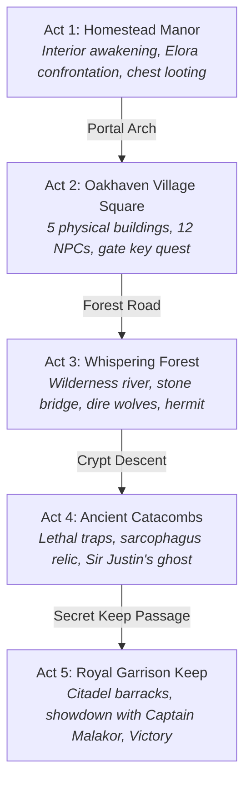

# Tactical cRPG & Infinity AI Engine
{: .no_toc }

A party-based tactical isometric cRPG built in Godot 4.3 with authentic Infinity Engine mechanics, D&D 5e SRD rules, physical collision pathfinding, 18 unique NPCs, and an autonomous AI testing harness.
{: .fs-6 .fw-300 }

## Table of contents
{: .no_toc .text-delta }

1. TOC
{:toc}

---

## Executive Summary

The **Tactical cRPG & Infinity AI Engine** (`crpg-realm`) is RobOS's reference implementation of a complete, production-grade video game built from scratch by AI agents. Inspired by legendary Infinity Engine titles (*Baldur's Gate*, *Icewind Dale*, *Planescape: Torment*), the project combines authentic Real-Time with Pause (RTwP) combat, a 6.0-second combat round timer, multi-branch dialogue, and physical building collision geometry with cutting-edge autonomous AI verification.

Rather than being a static demo, the entire campaign slice is governed by an **autonomous Infinity AI Agent** capable of perceiving the game world, evaluating threat priority, pathfinding around obstacles, conversing with townspeople, and completing the game from start to finish without human intervention.

  
  
<em>Figure 1: Oakhaven Village Square (2560x1440 open world) featuring physical buildings, stone ramparts, animated NPCs, and the Infinity Engine HUD.</em>

---

## Project Specification & Architecture

| **Category** | **Implementation Details** |
|:---|:---|
| **Engine** | Godot 4.3 (GL Compatibility renderer profile) |
| **Viewport & Resolution** | 1920×1080 native display with smooth camera clamping across 2560×1440 world maps |
| **Combat Mechanics** | Real-Time with Pause (RTwP), D&D 5e SRD d20 attack rolls, AC calculations, advantage/disadvantage |
| **Round System** | Strict 6.0-second D&D combat rounds with visual round timer, action economy, and initiative |
| **Activity Log** | 3-mode expandable Activity Log (Small 124px, Medium 240px, Large 420px) with numbered in-log dialogue |
| **Assets & Art** | 100% genuine open-source assets from Flare RPG / OpenGameArt (CC-BY-SA, CC0) |
| **Testing Harness** | Headless Xvfb virtual framebuffer execution, 1080p FFmpeg video proof-of-work, behave BDD |
| **Modding & Traps Engine** | Dynamic mod loader (`res://mods/`, `user://mods/`), Infinity Engine concealed traps, Thief Find Traps mode, Thieves' Tools disarm, and Divination spells |
| **Verification Metrics** | **17 Features, 28 Scenarios, 482 Steps (100% Passed)** |
| **Tactical cRPG Codex & Academy** | [www.rowbose.com/projects/crpg-realm/elearning/](/projects/crpg-realm/elearning/) (5 interactive modules, labs, quizzes, verified certificate) |
| **Game Creator Guide** | [Creating Your Own Game with robos-crpg](/projects/crpg-realm/create-your-own-game.html) (Scenes, maps, items, BDD tests, boss fights, custom mods) |

---

## 5-Act Epic Campaign Overview

The game features an expanded 5-Act campaign journey taking adventurers from solitary awakening to the liberation of the realm:

### 1. Act 1: Homestead (`Homestead.tscn`)
The player character awakens in an expansive manor following the garrison's fall. The act introduces party movement, container looting (guard footlocker with standard issue equipment), and an initial confrontation with rogue scout Elora who joins the party.

### 2. Act 2: Oakhaven Village Square (`VillageSquare.tscn`)
A 2560×1440 open world featuring five distinct physical structures with solid collision footprints, defensive stone ramparts, twelve fully realized town NPCs, ground item pickups, and the locked Royal Garrison Gate.

### 3. Act 3: Whispering Forest (`WhisperingForest.tscn`)
An untamed wilderness featuring a winding river obstacle, stone bridge crossing, ruins, an ancient obelisk, packs of dire wolves, a Goblin peddler, and a hermit scholar.

### 4. Act 4: Ancient Catacombs (`AncientCatacombs.tscn`)
A subterranean crypt filled with lethal Infinity Engine traps (concealed pressure plates, explosive runes, spike pits), the ghost of fallen knight Sir Justin, animated skeleton archers, and the royal sarcophagus hiding the key to the citadel passage.

### 5. Act 5: Garrison Keep (`GarrisonKeep.tscn`)
The fortified citadel overrun by darkness. Heroes breach the barracks, defeat corrupted sentries, and engage in an intense boss battle against Captain Malakor, culminating in the triumphant Victory Screen.

  

    
    
<em>Figure 2: Real-time with pause tactical combat with threat aggro indicators and spell casting.</em>

  

  

    
    
<em>Figure 3: Full campaign completion victory screen reached autonomously by the AI agent.</em>

  

---

## Infinity Engine User Experience & Fidelity

### Authentic RTwP Combat Loop
Pressing the Spacebar instantly pauses or resumes the combat simulation. While paused, players can issue multi-step movement waypoints (via Shift-click), queue attack orders, switch active party members, and cast prepared spells from the action toolbar.

### Three-Mode Expandable Activity Log
Modeled after the classic Baldur's Gate console:
- **Small (124px)**: Compact combat log preserving maximum screen real estate.
- **Medium (240px)**: Default dialogue mode auto-expanded when interacting with NPCs to display numbered response choices.
- **Large (420px)**: Expanded history mode for reviewing intricate combat rolls, attack calculations, and journal notes.

Dialogue choices are rendered directly within the log rather than in intrusive popup modals, allowing keyboard shortcuts (`1`–`9`) or mouse clicks for selection.

  
  
<em>Figure 4: In-log dialogue tree with Blacksmith Brand showing response choices, journal quest advancement, and NPC facing.</em>

---

## Dual Testing Paradigm: Isolated vs. Full Playthroughs

RobOS enforces a strict separation between two types of automated E2E tests:

1. **Normal Isolated Scenarios (11 Features)**:
   - Begin with a branded scenario splash banner displaying the BDD feature metadata.
   - Inject specific game states (`Given the heroes have state "village square"`) to test individual mechanics (shopkeeper trading, fog of war, condition tracking, corpse looting, defeat/wipeout recovery) in isolation.
2. **Start-to-Finish Playthrough Scenarios (6 Features)**:
   - Play isolated game scenarios from start to finish as a player would have to, and can be used in sequence to complete the entire game.
   - Powered by the **Infinity AI Engine**, which perceives enemy proximity, deploys combined-arms combat tactics, talks to NPCs, navigates obstacles, and quests across scenes to achieve victory.

  

    
    
<em>Figure 5: BDD scenario splash banner providing immediate context in video recordings.</em>

  

  

    
    
<em>Figure 6: Full D&D 5e Character Sheet tracking ability scores, saving throws, AC, and status conditions.</em>

  

---

## In-Depth Documentation Sub-Pages

Explore the technical deep-dives into how the cRPG realm and its AI harness are constructed:

1. [**Tactical cRPG Architecture & Engine Codex**]({{ '/projects/crpg-realm/elearning/' | relative_url }})  
   *Hands-on interactive 5-module curriculum, live lab checklists, instant knowledge check quizzes, and verifiable W3C completion credential.*

2. [**Tactical cRPG Architecture Living Specification**]({{ '/projects/crpg-realm/elearning-masterclass.html' | relative_url }})  
   *Comprehensive engineering specification, combat math formulas, colliders, and curriculum architecture.*

3. [**Creating Your Own Game with robos-crpg**]({{ '/projects/crpg-realm/create-your-own-game.html' | relative_url }})  
   *Developer guide to adding scenes, 2.5D maps, custom items, BDD test scenarios (normal & full playthroughs), Godot 4 for coders, and multi-phase boss fights.*

4. [**Autonomous Game Creation Process & Architecture**]({{ '/projects/crpg-realm/game-creation-process.html' | relative_url }})  
   *Ontological modeling, CC-BY-SA asset harvesting, data pipeline, and GDScript code generation.*

5. [**Infinity AI Engine & BDD Verification Harness**]({{ '/projects/crpg-realm/infinity-ai-agent-harness.html' | relative_url }})  
   *Threat radar, combined-arms tactics, human mouse simulation, and containerized video proof-of-work.*

6. [**World Systems, Collision Pathfinding & NPC Dialogue**]({{ '/projects/crpg-realm/world-systems-and-pathfinding.html' | relative_url }})  
   *Building colliders, Pathfinder.gd obstacle avoidance, 18-NPC roster, and dynamic Fog of War shaders.*
