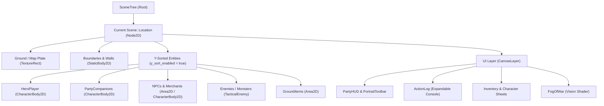
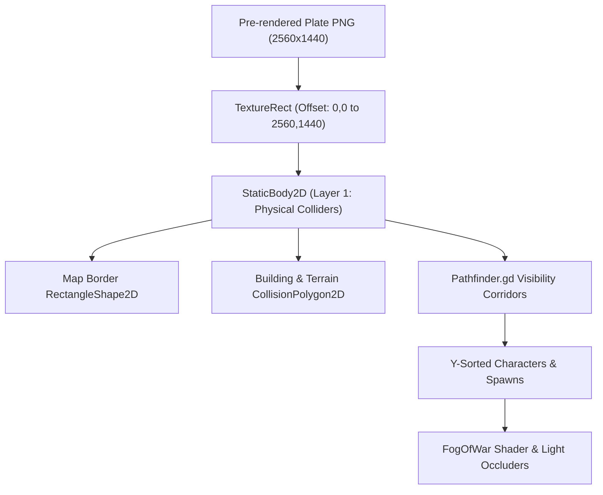
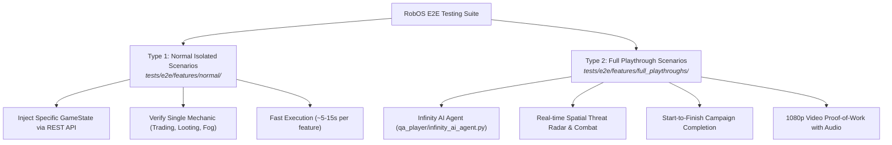
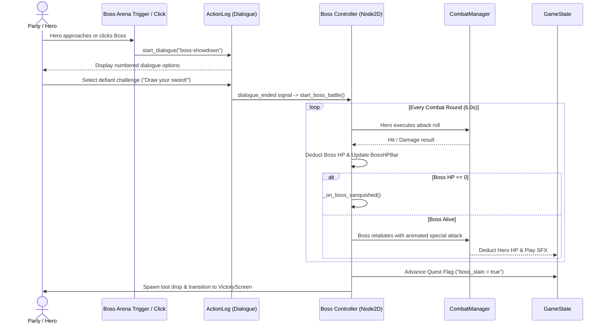

# Creating Your Own Game with robos-crpg
{: .no_toc }

A hands-on engineering guide to building, extending, and testing your own party-based tactical isometric cRPGs using Godot 4.3, D&D 5e SRD mechanics, and the RobOS autonomous verification harness.
{: .fs-6 .fw-300 }

<div style="margin: 1.5rem 0;">
  
  <p style="text-align: center; color: #b8860b; font-size: 0.85rem; margin-top: 0.5rem;"><em>Figure 1: Tactical Isometric RPG Architecture Codex — Game loop, party management, combat resolution, and scene portal flow.</em></p>
</div>

## Table of contents
{: .no_toc .text-delta }

1. TOC
{:toc}

---

## 1. Understanding Godot 4 for Programmers

If you already know how to code (Python, TypeScript, C#, Java, C++), Godot 4 is one of the most intuitive game engines to pick up. You do not need to learn esoteric engine quirks; you just need to understand its core mental model: **The Scene Tree**, **Nodes**, **GDScript essentials**, and **Autoload Singletons**.



### The Node & Scene Tree Hierarchy
Everything in Godot is a **Node**. A collection of nodes saved together as a reusable template is a **Scene** (`.tscn` file).
- `Node2D`: Base 2D node with `position`, `rotation`, and `scale`.
- `CharacterBody2D`: 2D physics body used for characters (heroes, companions, enemies). Provides `move_and_slide()` with automatic wall and obstacle collision.
- `StaticBody2D`: Immovable physics body used for building foundations, rock walls, and map boundaries.
- `Area2D`: Trigger zones with overlapping detection (`body_entered`, `body_exited`). Used for doors, portals, traps, and ground loot pickups.
- `CanvasLayer`: Renders UI independent of camera position and zoom (stays pinned to the player's screen).

### GDScript Crash Course for Coders
GDScript syntax is similar to Python, but supports optional static typing and engine-level optimizations:

```gdscript
# Class declaration and inheritance
class_name CustomEncounter
extends Node2D

# Signals (Observer Pattern / Event Bus)
signal boss_defeated(loot_tier: int)
signal dialogue_triggered(speaker_name: String)

# Exported variables (editable in the Godot Inspector)
@export var encounter_name: String = "Catacomb Ambush"
@export var min_level: int = 3
@export var is_repeatable: bool = false

# Onready node bindings (resolved when the node enters the scene tree)
@onready var hero: CharacterBody2D = $HeroPlayer
@onready var action_log: ActionLog = $CanvasLayer/ActionLog

# Internal typed state
var active_enemies: Array[Node] = []
var combat_round_timer: float = 0.0

# Called when the node enters the scene tree for the first time
func _ready() -> void:
    print("Initializing %s..." % encounter_name)
    connect_signals()

# Called every frame (delta = seconds elapsed since last frame)
func _process(delta: float) -> void:
    if combat_round_timer > 0.0:
        combat_round_timer = max(0.0, combat_round_timer - delta)

func connect_signals() -> void:
    # Lambda signal connection
    boss_defeated.connect(func(tier: int):
        print("Encounter cleared! Tier %d reward granted." % tier)
    )
```

### Singletons (Autoloads)
RobOS cRPG provides global singleton managers accessible from any script without manual passing:
- `GameState`: Central game state storing party members, inventory, quest log flags, active scene name, and gold.
- `CombatManager`: Resolves D&D 5e d20 attack rolls, AC checks, advantage/disadvantage, and damage calculation.
- `AudioManager`: Handles background ambiance, music tracks, and UI/combat sound effects.

---

## 2. How to Add Scenes to the Game

Every distinct location, dungeon level, or interior in your game is its own `.tscn` scene file under `games/crpg-realm/scenes/`.

### Step 1: Create the Scene Root and Structure
Create a new scene file (e.g. `AbandonedCrypt.tscn`) with a companion script (`AbandonedCrypt.gd`):

```gdscript
# AbandonedCrypt.gd
extends Node2D

@onready var hero = $HeroPlayer
@onready var hud = $CanvasLayer/PartyHUD
@onready var action_log = $CanvasLayer/ActionLog

func _ready() -> void:
    # 1. Configure camera boundaries to match map dimensions
    if hero and hero.has_method("set_camera_limits"):
        hero.set_camera_limits(0, 0, 2560, 1440)
    
    # 2. Update HUD Quest Tracker
    if hud:
        hud.update_display("Active Quest: Investigate the Abandoned Crypt")
    
    # 3. Log arrival in Activity Log
    GameState.log_message("story", "🕯️ The heavy stone door grinds shut. Torches flicker along the crypt walls.")
```

### Step 2: Wire Up Door and Portal Transitions
To allow players to travel between your new scene and existing maps, use the standard `DoorPortal.tscn` component.

```gdscript
# DoorPortal provides built-in transition and key checking:
# - door_id: Unique string identifier (used in BDD test scenarios)
# - door_name: Player-facing hover label (e.g. "Crypt Iron Gate")
# - target_scene: File path to destination (e.g. "res://scenes/AbandonedCrypt.tscn")
# - target_spawn: Coordinate where heroes should appear in the new scene
# - is_locked: Set to true if a specific key item is needed
# - required_key: Item ID required to unlock (e.g. "crypt-key")
```

In the Godot scene tree for `VillageSquare.tscn`:
1. Add an instance of `scenes/components/DoorPortal.tscn`.
2. Position it at the crypt entrance coordinates (e.g. `Vector2(2100, 450)`).
3. Set inspector values:
   - `Door Name`: `"Descent to Abandoned Crypt"`
   - `Target Scene`: `"res://scenes/AbandonedCrypt.tscn"`
   - `Target Spawn`: `Vector2(200, 1200)`
   - `Door Id`: `"door-id-crypt"`

Inside `AbandonedCrypt.tscn`, place an exit door pointing back to `VillageSquare.tscn`. When the player clicks the door or walks into its trigger area, `DoorPortal.gd` automatically loads the target scene:

```gdscript
# From DoorPortal.gd
if target_spawn != Vector2.ZERO:
    GameState.spawn_position = target_spawn
if target_scene != "":
    get_tree().change_scene_to_file(target_scene)
```

---

## 3. How to Add New Maps to the Game

Maps in RobOS cRPG use pre-rendered 2.5D background art plates (typically 2560×1440 resolution) combined with physics colliders, Y-sorting, and dynamic fog of war.



### Step 1: Place the Background Art
1. Add a `TextureRect` named `Ground` under the scene root.
2. Set `texture` to your 2560×1440 artwork (e.g. `res://assets/backgrounds/crypt_plate_2560.png`).
3. Set `mouse_filter` to `2` (`MOUSE_FILTER_IGNORE`) so mouse clicks pass through to character movement controls.

### Step 2: Define Physical Collision Boundaries
Add a `StaticBody2D` named `Boundaries` on **Physics Layer 1**:
- **Outer Map Edges**: Add four `CollisionShape2D` nodes with `RectangleShape2D` along the borders (Top, Bottom, Left, Right) to keep heroes inside the map.
- **Solid Obstacles (Walls, Pillars, Tombs)**: Add `CollisionPolygon2D` shapes traced around the **foundation base** of obstacles.

> [!TIP]
> **The 2.5D Foundation Rule**: Never place the collision box over the entire building or tomb. Only outline the footprint where the object touches the ground! Because `y_sort_enabled = true` sorts character depth by their feet Y-coordinate, characters can walk behind pillars, archways, and roofs without clipping into the foundation.

### Step 3: Configure Camera Clamping
Ensure the camera never displays the void outside the map plate. In your scene controller script:

```gdscript
func _ready() -> void:
    # Limits prevent camera panning past (0,0) or (2560, 1440)
    $HeroPlayer.set_camera_limits(0, 0, 2560, 1440)
```

### Step 4: Register Fog of War Actors
If the map uses exploration fog:
1. Instance `scenes/components/FogOfWar.tscn` under the scene root.
2. Register the hero and companions in `_ready()`:
   ```gdscript
   $FogOfWar.register_actor($HeroPlayer)
   ```

---

## 4. How to Add New Items to the Game

RobOS follows a strict **Zero-Hardcoding Data Architecture**. Items are defined once in data schemas and automatically made available to shops, loot tables, inventory, and character sheets.

### Step 1: Define Item in `games/crpg-realm/data/v1/items.json`
Add your new item object to the JSON array:

```json
{
  "id": "shadow-reaper-blade",
  "title": "Shadow Reaper Blade",
  "category": "weapon",
  "weaponType": "melee",
  "equipSlot": "main_hand",
  "damageDice": "2d6",
  "damageType": "slashing",
  "properties": ["finesse", "magical"],
  "weight": 3,
  "acBonus": 0,
  "cost": 150,
  "icon": "assets/icons/weapons/shadow_blade.png",
  "description": "Forged in subterranean shadows, this dark steel greatsword thirsts for corrupted blood."
}
```

#### Item Schema Categories & Equip Slots
| Category | Allowed Equip Slots | Primary Attributes |
|:---|:---|:---|
| `weapon` | `main_hand`, `off_hand`, `two_handed` | `damageDice` ("1d8", "2d6"), `damageType` ("slashing", "piercing", "bludgeoning"), `properties` |
| `armor` | `chest` | `acBonus` (Base AC, e.g. 14 for Chain Shirt), `properties` |
| `shield` | `off_hand` | `acBonus` (typically +2) |
| `potion` | `quickslot_1`, `quickslot_2` | `healAmount` ("2d4+2"), `duration` |
| `quest` | inventory only | `opensQuestStage`, `isKeyItem` |

### Step 2: Spawn Item on the Map Ground
To place an item waiting to be picked up in a scene:
1. Instance `scenes/components/GroundItem.tscn`.
2. Set `item_id = "shadow-reaper-blade"`.
3. Set `item_count = 1`.
4. Position the node at the desired map coordinate (e.g. `Vector2(1420, 880)`).

When a hero approaches within interaction distance and clicks the item, `GroundItem.gd` automatically adds it to `GameState.inventory`, posts a message in the Activity Log, and frees itself.

### Step 3: Put Item in a Loot Container
To place items in a chest or sarcophagus:
1. Instance `scenes/components/TreasureChest.tscn`.
2. In the inspector or script:
   ```gdscript
   chest.loot_items = ["shadow-reaper-blade", "potion-greater-healing"]
   chest.gold_amount = 75
   ```

---

## 5. How to Create E2E Test Scenarios (Both Types)

RobOS enforces a strict dual testing paradigm. Every feature in the game is backed by executable BDD (Behavior-Driven Development) test scenarios using Python's `behave` framework and the RobOS test runner.



### Type 1: Normal Isolated Scenarios (`tests/e2e/features/normal/`)
**Purpose**: Rapidly verify an individual game mechanic in complete isolation without playing through preceding acts.

Create a new file: `tests/e2e/features/normal/12_crypt_altar_puzzle.feature`:

```gherkin
@isolated @crypt
Feature: Crypt Altar Puzzle and Relic Acquisition
  As an adventurer exploring the catacombs
  I want to solve the elemental altar puzzle
  So that the secret vault chamber opens and reveals the ancient relic

  Background:
    Given the cRPG game is running and healthy

  Scenario: Hero solves altar puzzle and claims the Shadow Reaper Blade
    Given the heroes have state "ancient catacombs"
    And the current scene is "AncientCatacombs"
    When the infinity ai agent moves to "altar-puzzle-switch"
    And the infinity ai agent triggers puzzle interaction "ignite-braziers"
    And the infinity ai agent opens container "vault-sarcophagus"
    Then the party has acquired item "shadow-reaper-blade"
    And the quest "Catacomb Mystery" stage is 2
```

**How It Works**:
1. `Given the heroes have state "..."` sends a payload to `POST /api/v1/state` in Godot, instantly setting party health, items, flags, and loading the scene.
2. The scenario executes targeted steps in 10 seconds.
3. Branded visual scenario banners appear in the test recording.

---

### Type 2: Full Playthrough Scenarios (`tests/e2e/features/full_playthroughs/`)
**Purpose**: Validate that the real game can be beaten by a living player (emulated by the autonomous **Infinity AI Agent**) without cheats or state injection.

Create a new file: `tests/e2e/features/full_playthroughs/07_crypt_liberation_campaign.feature`:

```gherkin
@full_playthrough @crypt_campaign
Feature: Crypt Liberation Campaign Full Playthrough
  As an Infinity Engine player
  I want the Infinity AI Agent to autonomously explore the crypt and defeat the Lich
  From crypt entrance through traps and undead guards to boss victory

  Background:
    Given the cRPG game is running and healthy

  Scenario: Autonomous Agent Cleanses Crypt and Vanquishes the Lich Lord
    When the infinity ai agent creates a character with race "elf" and class "wizard" named "Archmage Donald"
    And the current scene is "Homestead"
    And the infinity ai agent enters door "door-id-crypt"
    And the current scene is "AncientCatacombs"
    And the infinity ai engine handles the enemy encounters as they come
    And the infinity ai agent moves to the door "door-id-boss-chamber"
    And the infinity ai agent infiltrates the Crypt Sanctum and defeats Lich Lord Malakor
    Then the victory screen is visible
```

**How to Execute E2E Tests**:
```bash
# Run isolated normal test scenarios headlessly
python3 games/crpg-realm/run_cucumber_tests.py --features normal

# Run full playthroughs with 1080p MP4 proof-of-work video generation
python3 games/crpg-realm/run_cucumber_tests.py --features full_playthroughs

# Run full suite inside the isolated Docker container
./scripts/e2e-container.sh
```

---

## 6. Adding a Custom Boss Interaction

Boss showdowns elevate tactical cRPGs from simple mob grinding to memorable tactical highlights. Here is the step-by-step recipe used in `GarrisonKeep.gd` to construct the Captain Malakor boss fight.



### Step 1: Define Boss Node and Attributes
In your boss arena scene (e.g. `SanctumChamber.tscn`), add an NPC node named `BossLich`:
- Attach a `Sprite2D` with idle and attack textures.
- Add an `Area2D` with a `CollisionShape2D` for click selection.
- Add a `ProgressBar` named `BossHPBar` above the boss's head.

In the arena script (`SanctumChamber.gd`):

```gdscript
extends Node2D

@onready var hero = $HeroPlayer
@onready var action_log: ActionLog = $CanvasLayer/ActionLog
@onready var combat_mgr = $CombatManager
@onready var boss_npc = $BossLich
@onready var boss_sprite: Sprite2D = $BossLich/Sprite
@onready var boss_hp_bar: ProgressBar = $BossLich/BossHPBar

var boss_fight_active: bool = false
var boss_hp: int = 65
var boss_max_hp: int = 65
var boss_phase: int = 1

func _ready() -> void:
    boss_hp_bar.max_value = boss_max_hp
    boss_hp_bar.value = boss_hp
    boss_hp_bar.visible = false
    
    # Click boss to initiate dialogue
    boss_npc.body_clicked.connect(initiate_boss_confrontation)

func initiate_boss_confrontation() -> void:
    if GameState.flags.get("lich_slain", false) or boss_fight_active:
        return
    
    # Turn boss to face hero
    boss_sprite.flip_h = (hero.global_position.x < boss_npc.global_position.x)
    
    # Trigger in-log dialogue
    var dialogue_tree = DataStore.dialogue_trees.get("lich-confrontation", {})
    if action_log and not dialogue_tree.is_empty():
        action_log.start_dialogue(dialogue_tree, "node_lich_start")
        action_log.dialogue_ended.connect(start_boss_battle, CONNECT_ONE_SHOT)
    else:
        start_boss_battle()
```

### Step 2: Combat Round Loop with Phase Shifts
When dialogue ends, trigger the active combat loop:

```gdscript
func start_boss_battle() -> void:
    boss_fight_active = true
    boss_hp_bar.visible = true
    GameState.log_message("combat", "⚔️ [b]BOSS BATTLE INITIATED:[/b] Lich Lord Malakor unleashes necrotic frost!")
    execute_boss_round()

func execute_boss_round() -> void:
    if not boss_fight_active or not is_instance_valid(boss_npc):
        return

    # Check for Phase 2 Transition at 50% HP
    if boss_phase == 1 and boss_hp <= (boss_max_hp / 2):
        boss_phase = 2
        GameState.log_message("combat", "⚡ [b]PHASE 2:[/b] The Lich shatters his phylactery! Frost armor increases AC!")
        spawn_undead_minions()

    # 1. Hero Attacks Boss
    hero.play_attack(boss_npc.global_position, func():
        var res = combat_mgr.execute_attack(GameState.hero_name, 7, 18, 24, "Lich Lord", 15)
        if res.hit:
            boss_hp = max(0, boss_hp - res.damage)
            boss_hp_bar.value = boss_hp
            play_hit_flash(boss_sprite)
            GameState.log_message("combat", "Hero strikes Lich for %d damage!" % res.damage)
        else:
            GameState.log_message("combat", "The Lich's frost barrier deflects the blow!")
        return res
    )

    await get_tree().create_timer(0.7).timeout

    # Check if boss is dead
    if boss_hp <= 0:
        on_boss_vanquished()
        return

    # 2. Boss Retaliates with Special Spell Attack
    play_boss_spell_cast(func():
        var spell_res = combat_mgr.execute_attack("Lich Lord", 6, 3, 8, GameState.hero_name, GameState.hero_ac)
        if spell_res.hit:
            GameState.take_damage(spell_res.damage)
            GameState.log_message("combat", "Necrotic frost chills hero for %d cold damage!" % spell_res.damage)
        return spell_res
    )

    await get_tree().create_timer(1.2).timeout

    # Repeat next round if combat remains active
    if boss_fight_active and boss_hp > 0:
        execute_boss_round()
```

### Step 3: Vanquish Callback, Loot & Victory Transition
When the boss reaches 0 HP, award victory:

```gdscript
func on_boss_vanquished() -> void:
    boss_fight_active = false
    boss_hp_bar.visible = false
    GameState.flags["lich_slain"] = true
    
    # 1. Victory announcement
    GameState.log_message("story", "🏆 [b]VICTORY:[/b] The Lich dissolves into cold ash! The realm is liberated!")
    AudioManager.play_sfx("victory_fanfare")
    
    # 2. Spawn legendary ground loot
    var drop_scene = load("res://scenes/components/GroundItem.tscn")
    if drop_scene:
        var loot = drop_scene.instantiate()
        loot.item_id = "shadow-reaper-blade"
        loot.global_position = boss_npc.global_position
        add_child(loot)
    
    # 3. Transition to victory screen after delay
    await get_tree().create_timer(2.5).timeout
    get_tree().change_scene_to_file("res://scenes/VictoryScreen.tscn")
```

---

## 7. Summary & Best Practices

| Architecture Rule | Implementation Standard | Why It Matters |
|:---|:---|:---|
| **Zero-Hardcoding** | All item, enemy, and dialogue data lives in `data/v1/*.json` | Ensures tests, UI, and Godot stay 100% synchronized without drift. |
| **Layer 1 Colliders** | Place `StaticBody2D` only on physical foundation footprints | Allows natural 2.5D depth sorting with `y_sort_enabled = true`. |
| **Camera Limits** | Call `set_camera_limits()` on map load | Prevents revealing black margins outside 2560×1440 plates. |
| **Dual Testing** | Write Normal tests for fast iteration; Full Playthroughs for CI/CD | Guarantees genuine game completability without sacrificing test speed. |
| **Single Responsibility Singletons** | Route state through `GameState`, rolls through `CombatManager` | Prevents tangled scene coupling and makes state injection trivial. |

Now you have everything required to expand the world of **cRPG Realm** or build your own complete party-based tactical RPG!
