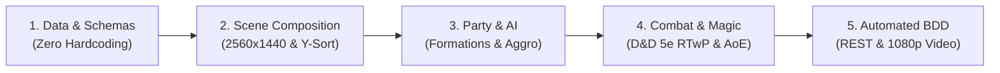

# Creating Your Own Game with robos-crpg
{: .no_toc }

A complete engineering masterclass and living documentation guide on designing, implementing, scripting, modding, and autonomously verifying party-based tactical isometric cRPGs using Godot 4.3, D&D 5e SRD rules, and the RobOS AI governance harness.
{: .fs-6 .fw-300 }

<div style="margin: 1.5rem 0;">
  
  <p style="text-align: center; color: #b8860b; font-size: 0.85rem; margin-top: 0.5rem;"><em>Figure 1: The RobOS Tactical cRPG Game Creation Pipeline — End-to-end flow from data modeling to scene composition, party dynamics, combat & magic, and automated BDD verification.</em></p>
</div>

## Table of contents
{: .no_toc .text-delta }

1. TOC
{:toc}

---

## 1. The RobOS Game Generation Paradigm

Building a tactical, party-based isometric role-playing game is one of the most demanding challenges in software engineering. Between pathfinding around irregular geometry, real-time with pause (RTwP) combat cycles, D&D 5e rules mathematics, spell blast spheres, multi-character party formations, and interactive dialogue trees, amateur game code quickly degenerates into tangled spaghetti.

**RobOS replaces monolithic game development with a 5-phase modular pipeline**:



1. **Phase 1: Ontological Data Modeling**: All classes, races, spells, items, monsters, traps, and dialogue are defined in strictly validated JSON schemas under `data/v1/`. Game code contains zero hardcoded numbers.
2. **Phase 2: Scene & World Composition**: Level plates are painted at 2560×1440 resolution. Physical boundary colliders follow the strict Foundation Footprint standard, and scenes connect through two-way `DoorPortal` triggers.
3. **Phase 3: Symmetrical Party & Pack Dynamics**: Every character shares the same autonomous follow loop. Players switch leaders dynamically, command rank-and-file or wedge formations, and face enemies governed by Infinity Engine proximity aggravation and allied pack assistance.
4. **Phase 4: Tactical Combat & Magic Engine**: Turn-based action economy or Real-Time with Pause (Spacebar). Evocation spells feature authentic multi-dice rolls (such as 8d6 Fireball), 20-foot geometric blast spheres, individual saving throws, and floating combat text.
5. **Phase 5: Automated Verification & Video Proof-of-Work**: The entire game is governed by a built-in HTTP REST API (`GameControlServer.gd` on port 18090). Headless Cucumber BDD tests execute in Xvfb (`:99`) and generate 1080p MP4 recordings with narration.

---

## 2. Complete Chapter Index & Technical Modules

Explore our 12 in-depth architectural chapters covering every layer of the engine:

<div style="display: grid; grid-template-columns: repeat(auto-fit, minmax(320px, 1fr)); gap: 1.25rem; margin: 1.5rem 0;">

  <div style="background: #161b22; border: 1px solid #30363d; border-radius: 8px; padding: 1.25rem; display: flex; flex-direction: column; justify-content: space-between;">
    <div>
      <div style="font-size: 0.8rem; text-transform: uppercase; color: #58a6ff; font-weight: bold; margin-bottom: 0.4rem;">Chapter 1</div>
      <h3 style="margin: 0 0 0.5rem 0; font-size: 1.15rem; color: #00bcd4;"><a href="/projects/crpg-realm/create-your-own-game/01-godot-architecture.html" style="color: #00bcd4; text-decoration: none;">Godot 4 Architecture for Programmers</a></h3>
      <p style="font-size: 0.9rem; color: #8b949e; margin: 0 0 1rem 0;">The mental model for software engineers: SceneTree hierarchy, Node2D, CharacterBody2D, Y-Sort depth pipeline, and persistent autoload singletons.</p>
    </div>
    <a href="/projects/crpg-realm/create-your-own-game/01-godot-architecture.html" class="btn btn-primary" style="align-self: flex-start; font-size: 0.85rem;">Read Chapter 1 →</a>
  </div>

  <div style="background: #161b22; border: 1px solid #30363d; border-radius: 8px; padding: 1.25rem; display: flex; flex-direction: column; justify-content: space-between;">
    <div>
      <div style="font-size: 0.8rem; text-transform: uppercase; color: #58a6ff; font-weight: bold; margin-bottom: 0.4rem;">Chapter 2</div>
      <h3 style="margin: 0 0 0.5rem 0; font-size: 1.15rem; color: #00bcd4;"><a href="/projects/crpg-realm/create-your-own-game/02-scenes-and-portals.html" style="color: #00bcd4; text-decoration: none;">Scenes, Level Transitions & Door Portals</a></h3>
      <p style="font-size: 0.9rem; color: #8b949e; margin: 0 0 1rem 0;">Structuring location scenes, building two-way DoorPortal components with Area2D, coordinate offsets, and dynamic companion spawning.</p>
    </div>
    <a href="/projects/crpg-realm/create-your-own-game/02-scenes-and-portals.html" class="btn btn-primary" style="align-self: flex-start; font-size: 0.85rem;">Read Chapter 2 →</a>
  </div>

  <div style="background: #161b22; border: 1px solid #30363d; border-radius: 8px; padding: 1.25rem; display: flex; flex-direction: column; justify-content: space-between;">
    <div>
      <div style="font-size: 0.8rem; text-transform: uppercase; color: #58a6ff; font-weight: bold; margin-bottom: 0.4rem;">Chapter 3</div>
      <h3 style="margin: 0 0 0.5rem 0; font-size: 1.15rem; color: #00bcd4;"><a href="/projects/crpg-realm/create-your-own-game/03-maps-and-isometric-geometry.html" style="color: #00bcd4; text-decoration: none;">2560×1440 Maps & Isometric World Layers</a></h3>
      <p style="font-size: 0.9rem; color: #8b949e; margin: 0 0 1rem 0;">Rendering 2560×1440 plates, applying the Foundation Footprint rule to colliders, camera limit clamping, and two-tier click-to-move pathfinding.</p>
    </div>
    <a href="/projects/crpg-realm/create-your-own-game/03-maps-and-isometric-geometry.html" class="btn btn-primary" style="align-self: flex-start; font-size: 0.85rem;">Read Chapter 3 →</a>
  </div>

  <div style="background: #161b22; border: 1px solid #30363d; border-radius: 8px; padding: 1.25rem; display: flex; flex-direction: column; justify-content: space-between;">
    <div>
      <div style="font-size: 0.8rem; text-transform: uppercase; color: #58a6ff; font-weight: bold; margin-bottom: 0.4rem;">Chapter 4</div>
      <h3 style="margin: 0 0 0.5rem 0; font-size: 1.15rem; color: #00bcd4;"><a href="/projects/crpg-realm/create-your-own-game/04-items-loot-and-inventory.html" style="color: #00bcd4; text-decoration: none;">Items, Inventory & D&D 5e Equipment</a></h3>
      <p style="font-size: 0.9rem; color: #8b949e; margin: 0 0 1rem 0;">Zero-hardcoding JSON schemas, GroundItem pickup triggers, container footlockers, and D&D 5e Armor Class (AC) and damage calculations.</p>
    </div>
    <a href="/projects/crpg-realm/create-your-own-game/04-items-loot-and-inventory.html" class="btn btn-primary" style="align-self: flex-start; font-size: 0.85rem;">Read Chapter 4 →</a>
  </div>

  <div style="background: #161b22; border: 1px solid #30363d; border-radius: 8px; padding: 1.25rem; display: flex; flex-direction: column; justify-content: space-between;">
    <div>
      <div style="font-size: 0.8rem; text-transform: uppercase; color: #58a6ff; font-weight: bold; margin-bottom: 0.4rem;">Chapter 5</div>
      <h3 style="margin: 0 0 0.5rem 0; font-size: 1.15rem; color: #00bcd4;"><a href="/projects/crpg-realm/create-your-own-game/05-infinity-engine-traps.html" style="color: #00bcd4; text-decoration: none;">Infinity Engine Traps & Hazards System</a></h3>
      <p style="font-size: 0.9rem; color: #8b949e; margin: 0 0 1rem 0;">Concealed traps, Rogue modal Find Traps skill, 2nd-level divination spell sweeps, pulsing red danger outlines, Thieves' Tools disarms, and fumble detonation.</p>
    </div>
    <a href="/projects/crpg-realm/create-your-own-game/05-infinity-engine-traps.html" class="btn btn-primary" style="align-self: flex-start; font-size: 0.85rem;">Read Chapter 5 →</a>
  </div>

  <div style="background: #161b22; border: 1px solid #30363d; border-radius: 8px; padding: 1.25rem; display: flex; flex-direction: column; justify-content: space-between;">
    <div>
      <div style="font-size: 0.8rem; text-transform: uppercase; color: #58a6ff; font-weight: bold; margin-bottom: 0.4rem;">Chapter 6</div>
      <h3 style="margin: 0 0 0.5rem 0; font-size: 1.15rem; color: #00bcd4;"><a href="/projects/crpg-realm/create-your-own-game/06-boss-fights-and-encounters.html" style="color: #00bcd4; text-decoration: none;">Custom Boss Encounters & Multi-Phase Logic</a></h3>
      <p style="font-size: 0.9rem; color: #8b949e; margin: 0 0 1rem 0;">Building multi-phase boss state machines: cutscenes, Phase 1 combat, 50% HP necrotic invulnerability shields, summoned minion waves, and victory fanfares.</p>
    </div>
    <a href="/projects/crpg-realm/create-your-own-game/06-boss-fights-and-encounters.html" class="btn btn-primary" style="align-self: flex-start; font-size: 0.85rem;">Read Chapter 6 →</a>
  </div>

  <div style="background: #161b22; border: 1px solid #30363d; border-radius: 8px; padding: 1.25rem; display: flex; flex-direction: column; justify-content: space-between;">
    <div>
      <div style="font-size: 0.8rem; text-transform: uppercase; color: #58a6ff; font-weight: bold; margin-bottom: 0.4rem;">Chapter 7</div>
      <h3 style="margin: 0 0 0.5rem 0; font-size: 1.15rem; color: #00bcd4;"><a href="/projects/crpg-realm/create-your-own-game/07-modding-and-custom-content.html" style="color: #00bcd4; text-decoration: none;">Modding Engine, Manifests & Data Overrides</a></h3>
      <p style="font-size: 0.9rem; color: #8b949e; margin: 0 0 1rem 0;">Zero-code Mod Loader architecture: mod.json manifests, registering custom traps, spells, items, and monsters without modifying core source files.</p>
    </div>
    <a href="/projects/crpg-realm/create-your-own-game/07-modding-and-custom-content.html" class="btn btn-primary" style="align-self: flex-start; font-size: 0.85rem;">Read Chapter 7 →</a>
  </div>

  <div style="background: #161b22; border: 1px solid #30363d; border-radius: 8px; padding: 1.25rem; display: flex; flex-direction: column; justify-content: space-between;">
    <div>
      <div style="font-size: 0.8rem; text-transform: uppercase; color: #58a6ff; font-weight: bold; margin-bottom: 0.4rem;">Chapter 8</div>
      <h3 style="margin: 0 0 0.5rem 0; font-size: 1.15rem; color: #00bcd4;"><a href="/projects/crpg-realm/create-your-own-game/08-cucumber-bdd-testing.html" style="color: #00bcd4; text-decoration: none;">Automated Cucumber BDD & Xvfb Framebuffers</a></h3>
      <p style="font-size: 0.9rem; color: #8b949e; margin: 0 0 1rem 0;">Headless verification harness: driving Godot via REST (:18090), virtual display :99, 1080p MP4 proof-of-work video recording, and GameState telemetry.</p>
    </div>
    <a href="/projects/crpg-realm/create-your-own-game/08-cucumber-bdd-testing.html" class="btn btn-primary" style="align-self: flex-start; font-size: 0.85rem;">Read Chapter 8 →</a>
  </div>

  <div style="background: #161b22; border: 1px solid #30363d; border-radius: 8px; padding: 1.25rem; display: flex; flex-direction: column; justify-content: space-between;">
    <div>
      <div style="font-size: 0.8rem; text-transform: uppercase; color: #58a6ff; font-weight: bold; margin-bottom: 0.4rem;">Chapter 9</div>
      <h3 style="margin: 0 0 0.5rem 0; font-size: 1.15rem; color: #00bcd4;"><a href="/projects/crpg-realm/create-your-own-game/09-party-dynamics-and-formations.html" style="color: #00bcd4; text-decoration: none;">Party Dynamics, Formations & Symmetrical Follow</a></h3>
      <p style="font-size: 0.9rem; color: #8b949e; margin: 0 0 1rem 0;">Interchangeable party leadership, symmetrical companion scripts, formation mathematics (Rank & File, Column, Shield Wall, Wedge), and HUD integration.</p>
    </div>
    <a href="/projects/crpg-realm/create-your-own-game/09-party-dynamics-and-formations.html" class="btn btn-primary" style="align-self: flex-start; font-size: 0.85rem;">Read Chapter 9 →</a>
  </div>

  <div style="background: #161b22; border: 1px solid #30363d; border-radius: 8px; padding: 1.25rem; display: flex; flex-direction: column; justify-content: space-between;">
    <div>
      <div style="font-size: 0.8rem; text-transform: uppercase; color: #58a6ff; font-weight: bold; margin-bottom: 0.4rem;">Chapter 10</div>
      <h3 style="margin: 0 0 0.5rem 0; font-size: 1.15rem; color: #00bcd4;"><a href="/projects/crpg-realm/create-your-own-game/10-aggro-tactics-and-pack-ai.html" style="color: #00bcd4; text-decoration: none;">Infinity Engine Aggro, Proximity & Pack AI</a></h3>
      <p style="font-size: 0.9rem; color: #8b949e; margin: 0 0 1rem 0;">Threat table algorithms, proximity-based enemy aggravation, allied assistance broadcast radius (pack rally), and tank threat peeling mechanics.</p>
    </div>
    <a href="/projects/crpg-realm/create-your-own-game/10-aggro-tactics-and-pack-ai.html" class="btn btn-primary" style="align-self: flex-start; font-size: 0.85rem;">Read Chapter 10 →</a>
  </div>

  <div style="background: #161b22; border: 1px solid #30363d; border-radius: 8px; padding: 1.25rem; display: flex; flex-direction: column; justify-content: space-between;">
    <div>
      <div style="font-size: 0.8rem; text-transform: uppercase; color: #58a6ff; font-weight: bold; margin-bottom: 0.4rem;">Chapter 11</div>
      <h3 style="margin: 0 0 0.5rem 0; font-size: 1.15rem; color: #00bcd4;"><a href="/projects/crpg-realm/create-your-own-game/11-spells-aoe-and-magic-systems.html" style="color: #00bcd4; text-decoration: none;">Spells, Evocation AoE & Magic Systems</a></h3>
      <p style="font-size: 0.9rem; color: #8b949e; margin: 0 0 1rem 0;">Multi-target AoE evocation magic, authentic 8d6 Fireball dice rolls, 20ft geometric blast spheres, Dexterity saving throws, and simultaneous decimation.</p>
    </div>
    <a href="/projects/crpg-realm/create-your-own-game/11-spells-aoe-and-magic-systems.html" class="btn btn-primary" style="align-self: flex-start; font-size: 0.85rem;">Read Chapter 11 →</a>
  </div>

  <div style="background: #161b22; border: 1px solid #30363d; border-radius: 8px; padding: 1.25rem; display: flex; flex-direction: column; justify-content: space-between;">
    <div>
      <div style="font-size: 0.8rem; text-transform: uppercase; color: #58a6ff; font-weight: bold; margin-bottom: 0.4rem;">Chapter 12</div>
      <h3 style="margin: 0 0 0.5rem 0; font-size: 1.15rem; color: #00bcd4;"><a href="/projects/crpg-realm/create-your-own-game/12-step-by-step-game-creation-recipe.html" style="color: #00bcd4; text-decoration: none;">Complete Dungeon Creation Blueprint</a></h3>
      <p style="font-size: 0.9rem; color: #8b949e; margin: 0 0 1rem 0;">A step-by-step hands-on tutorial: creating The Sunken Vault level from scratch with colliders, sentry packs, concealed traps, chests, and BDD tests.</p>
    </div>
    <a href="/projects/crpg-realm/create-your-own-game/12-step-by-step-game-creation-recipe.html" class="btn btn-primary" style="align-self: flex-start; font-size: 0.85rem;">Read Chapter 12 →</a>
  </div>

</div>

---

## 3. Core Engine Architecture Deep Dive

### 3.1 Data-First Ontological Architecture
All game elements live in `data/v1/` as schema-validated JSON files. When Godot starts, the `DataStore` autoload loads these datasets into memory, exposing typed dictionary lookups:

```gdscript
# Accessing verified JSON datasets via DataStore
var fireball_data = DataStore.spells.get("fireball")
var hound_stats = DataStore.monsters.get("shadow-hound")
var plate_armor = DataStore.items.get("item-plate-armor")
```

### 3.2 2.5D Isometric World & Y-Sort Depth Standard
To prevent visual depth glitches (e.g. characters walking "through" pillars or standing on roofs), the engine enforces two rules:
1. **The Foot Anchor**: Every sprite origin `(0, 0)` is placed at the contact point where feet touch the ground.
2. **The Foundation Footprint**: Colliders are `StaticBody2D` nodes placed **only** over the bottom 25–30% of walls, trees, and buildings. The upper 70% remains transparent to collision, allowing characters to naturally walk behind roofs and overhangs using `y_sort_enabled = true`.

### 3.3 Symmetrical Party Dynamics & Formations
Companions are not passive followers; they operate under symmetrical autonomous follow loops:

<div style="margin: 1.5rem 0;">
  
</div>

- **Rank & File (2×2 Grid)**: Slot offsets `(-60, -35)`, `(-60, +35)`, `(-120, 0)`.
- **Marching Column**: Single-file queue `(-65 * i, 0)`.
- **Shield Wall**: Line abreast `(0, (i - 1.5) * 60)`.
- **Wedge (Spearhead)**: V-shaped vanguard `(-55 * abs(c), c * 45)`.
- **Interchangeable Leader**: Selecting any party member assigns them the golden crown 👑 badge and shifts camera tracking immediately.

### 3.4 Infinity Engine Tactical Aggro & Pack AI
Enemies operate under realistic tactical rules:

<div style="margin: 1.5rem 0;">
  
</div>

- **Proximity Aggravation**: Hostile creatures detect intruders entering `detection_radius` (280px). Neutral creatures remain indifferent until struck.
- **Pack Rally Call**: When an enemy enters combat or suffers damage, it alerts all allies within `pack_assist_radius` (220px), engaging the entire pack.
- **Threat Peeling**: High-damage melee strikes and taunts allow tanks to peel aggro off vulnerable mages.

### 3.5 Evocation AoE Magic & Blast Spheres
High-impact spellcasting mirrors D&D 5e:

<div style="margin: 1.5rem 0;">
  
</div>

- **Un-Mocked 8d6 Rolls**: Generates 8 independent d6 results (min 8, avg 28, max 48).
- **Geometric 20ft Blast Radius**: Queries all living entities within 180px of target point.
- **Individual Saving Throws**: Targets roll `d20 + DEX modifier` vs Spell Save DC. Half damage on success, full damage on fail.
- **Simultaneous Multi-Kill**: Slain entities transition to `State.DEAD`, spawn lootable corpses, and trigger combat victory.

### 3.6 Environmental Hazards & Concealed Traps
Subterranean dungeons feature interactive hazards:

<div style="margin: 1.5rem 0;">
  
</div>

- **Concealed State**: Traps are invisible to players until detected by a Rogue's Find Traps sweep (DC 13) or Cleric divination.
- **Pulsing Danger Rune**: Detected traps illuminate with a pulsing red highlight.
- **Detonation & Vanishing**: Stepping on or fumbling a trap triggers saving throws, spawns an expanding explosion ring VFX, deactivates collision, and **completely vanishes from the tactical map display and active map traps collection**.

---

## 4. GameControlServer REST API Reference (:18090)

The engine exposes a full HTTP REST API allowing autonomous AI agents and Cucumber test suites to inspect and drive the game:

| Endpoint | Method | Payload / Arguments | Description |
|:---|:---|:---|:---|
| `/api/v1/health` | `GET` | — | Returns `{"status": "ok", "game": "robos-crpg"}` |
| `/api/v1/state` | `GET` | — | Returns complete game state: scene, party members, HP, positions, traps, living enemies, inventory |
| `/api/v1/action` | `POST` | `{"action": "move_party", "args": {"x": 500, "y": 600}}` | Moves the party leader to coordinates; companions follow in formation |
| `/api/v1/action` | `POST` | `{"action": "select_party_leader", "args": {"name": "Elora"}}` | Reassigns party leadership, centers camera, updates crown badge |
| `/api/v1/action` | `POST` | `{"action": "set_party_formation", "args": {"formation": "wedge"}}` | Changes active tactical formation matrix |
| `/api/v1/action` | `POST` | `{"action": "cast_spell", "args": {"spell": "fireball", "x": 1150, "y": 520}}` | Casts AoE spell at target coordinates with 8d6 dice roll and saves |
| `/api/v1/action` | `POST` | `{"action": "disarm_trap", "args": {"trap_id": "poison-dart-trap"}}` | Orders rogue to approach and disarm trap with Thieves' Tools |
| `/api/v1/action` | `POST` | `{"action": "set_detect_traps", "args": {"enabled": true}}` | Enables/disables modal Find Traps skill sweep |
| `/api/v1/action` | `POST` | `{"action": "toggle_pause"}` | Toggles Real-Time with Pause (Spacebar simulation) |
| `/api/v1/reset` | `POST` | `{"scene": "AncientCatacombs", "party": "Vance"}` | Hard resets scene and state for isolated test scenario |

---

## 5. Architectural Rules & Best Practices

| Rule | Standard | Why It Matters |
|:---|:---|:---|
| **Zero-Hardcoding** | All item, enemy, trap, and dialogue data lives in `data/v1/*.json` or `mods/` | Ensures tests, UI, and Godot stay 100% synchronized without drift. |
| **Foundation Footprint** | Place `StaticBody2D` only on physical foundation footprints (bottom 30%) | Allows natural 2.5D depth sorting with `y_sort_enabled = true`. |
| **Camera Limits** | Call `set_camera_limits()` on map load | Prevents revealing black margins outside 2560×1440 plates. |
| **Symmetrical Dynamics** | Every companion executes the same follow script targeting the active leader | Eliminates rigid player hacks and makes switching leaders seamless. |
| **Un-Mocked Testing** | BDD tests must test the engine itself via REST, never mock dice or HP | Guarantees genuine game completability and authentic combat feel. |
| **Documentation Visuals** | Include Gemini 3.8 AI-generated schematics alongside Mermaid syntax | Ensures documentation is crystal-clear, developer-friendly, and professional without AI bling. |

---

## 6. Interactive eLearning & Masterclass

Interested in a hands-on, self-paced curriculum with quizzes, interactive code playgrounds, and a verifiable completion certificate?

- 🎓 **[cRPG Game Builder & Tactical Engine Academy (Self-Paced Training Module)](/projects/crpg-realm/create-your-own-game/elearning/)** — 7 modules, practical labs, and interactive knowledge checks covering custom maps, items, traps, boss scripting, and Cucumber BDD.
  ```bash
  electron packages/crpg-game-builder-elearning
  ```
- ⚔️ **[Tactical cRPG Architecture & Masterclass](/projects/crpg-realm/elearning/)** — Full deep-dive into D&D 5e SRD implementation, Infinity Engine systems, and turn-based tactical combat.
  ```bash
  electron packages/robos-crpg-elearning
  ```
