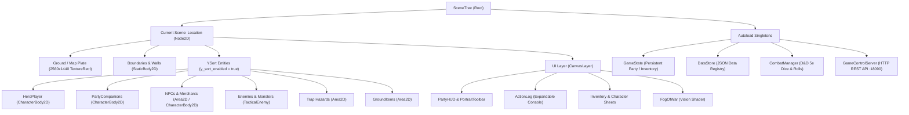

# 1. Godot 4 Architecture for Programmers
{: .no_toc }

A programmer's deep dive into Godot 4's SceneTree, 2.5D Y-sorting depth pipeline, entity node hierarchy, and autoload singleton state machines.
{: .fs-6 .fw-300 }

<div style="margin: 1.5rem 0;">
  
  <p style="text-align: center; color: #b8860b; font-size: 0.85rem; margin-top: 0.5rem;"><em>Figure 1.1: Godot 4 SceneTree Architecture — Root, Location Scene, Y-Sorted Entity Plane, Screen-Pinned CanvasLayer UI, and Autoload Singletons.</em></p>
</div>

## Table of contents
{: .no_toc .text-delta }

1. TOC
{:toc}

---

## The Mental Model for Software Engineers

If you come from backend, frontend, or systems programming (TypeScript, Python, C++, Java, Rust), Godot 4 is one of the most intuitive game engines to master. Unlike monolithic game frameworks with scattered global state, Godot structures everything as a **Tree of Nodes** governed by **Object-Oriented Composition** and **Asynchronous Event Signaling**.



---

## Core Node Types in cRPG Realm

| Node Class | Purpose in cRPG Realm | Key Methods & Properties |
|:---|:---|:---|
| `Node2D` | Base 2D node for transforms, world containers, and grouping | `position`, `global_position`, `rotation`, `scale`, `y_sort_enabled` |
| `CharacterBody2D` | Controllable physical characters with obstacle collision | `velocity`, `move_and_slide()`, `get_last_motion()`, `collision_layer` |
| `StaticBody2D` | Immovable walls, boundary fences, and building foundations | `CollisionShape2D`, `CollisionPolygon2D`, physical layer masking |
| `Area2D` | Trigger volumes with overlap detection (doors, loot, traps) | `body_entered`, `body_exited`, `get_overlapping_bodies()` |
| `CanvasLayer` | Renders UI independently of camera pan, rotation, and zoom | `layer = 1..100`, `follow_viewport_enabled = false` |
| `TextureRect` | Displays background plates and pixel-perfect ground textures | `expand_mode = 1`, `stretch_mode = 5`, `mouse_filter = 2` |

---

## The 2.5D Isometric Y-Sort Rendering Pipeline

In classic top-down and isometric RPGs, whether an actor appears *in front of* or *behind* an object depends entirely on their vertical screen position:

1. **The Foot Anchor Standard**: All character sprites have their local origin `(0, 0)` placed at their feet (where they contact the ground), **not** at the sprite center.
2. **`y_sort_enabled = true`**: When set on the parent `Node2D` (e.g. `AncientCatacombs` or `VillageSquare`), Godot sorts children dynamically every frame: nodes with lower `global_position.y` are rendered underneath nodes with higher `global_position.y`.
3. **Natural Occlusion**: A hero walking north passes *behind* an NPC or pillar; walking south brings the hero *in front*.

```gdscript
# Enabling Y-Sort programmatically on scene startup
extends Node2D

func _ready() -> void:
    y_sort_enabled = true
    print("Y-Sort depth sorting initialized for %s" % name)
```

---

## Autoload Singletons: The Global State Backbone

Godot's `autoload` feature instantiates persistent root nodes that remain active across scene transitions (`get_tree().change_scene_to_file()`):

```ini
; project.godot autoload configuration
[autoload]

DataStore="*res://src/generated/v1/DataStoreV1.gd"
GameState="*res://scripts/GameState.gd"
GameControlServer="*res://scripts/GameControlServer.gd"
AudioManager="*res://scripts/AudioManager.gd"
QAOverlay="*res://scripts/QAOverlay.gd"
FloatingTextManager="*res://scripts/FloatingTextManager.gd"
```

### 1. `GameState.gd`
Maintains persistent party roster, current HP, inventory items, quest stages, dialogue flags, and active status effects.
```gdscript
# Safe singleton access
var current_gold = GameState.gold
GameState.add_item("potion-healing", 2)
GameState.take_damage(6)
```

### 2. `DataStoreV1.gd`
Parses and indexes all declarative JSON definitions (`items.json`, `spells.json`, `traps.json`, `monsters.json`) from `data/v1/` and dynamically loaded community mods from `res://mods/`.

### 3. `CombatManager.gd`
Encapsulates D&D 5e SRD combat mathematics: d20 attack rolls, Advantage/Disadvantage, Armor Class calculations, saving throws, spell DC checks, and trap disarming.

### 4. `GameControlServer.gd`
A lightweight in-engine HTTP REST microservice running on `http://127.0.0.1:18090`. It enables Cucumber BDD and AI agents to query the complete live game state (`/api/v1/state`) and execute simulated player actions (`/api/v1/action`).

---

## GDScript Essentials for Experienced Programmers

### 1. Static Typing
GDScript supports optional static typing that catches structural bugs at parse time:
```gdscript
var hero_hp: int = 12
var inventory: Dictionary = {}
var party_members: Array[Dictionary] = []
const BASE_SPEED: float = 160.0
```

### 2. Signals & Event Decoupling
```gdscript
# Declaring a signal
signal trap_triggered(trap_node: Node2D, victim_name: String)

# Emitting a signal
trap_triggered.emit(self, "Lieutenant Vance")

# Listening with one-line lambdas
trap.trap_triggered.connect(func(_t, victim):
    print("Hazard detonated on %s!" % victim)
)
```

### 3. Asynchronous Execution with `await`
```gdscript
# Non-blocking pause for cutscenes or combat rounds
await get_tree().create_timer(1.5).timeout

# Awaiting custom signals
await sarcophagus.chest_opened
```

---

[Next: 2. Scenes, Level Transitions & Door Portals →](/projects/crpg-realm/create-your-own-game/02-scenes-and-portals.html)
