# 2. Scenes, Level Transitions & Door Portals
{: .no_toc }

A complete engineering guide to scaffolding location scenes, wiring two-way transition portals, spawning party companions dynamically, and managing scene state across the 5 campaign acts.
{: .fs-6 .fw-300 }

<div style="margin: 1.5rem 0;">
  
  <p style="text-align: center; color: #b8860b; font-size: 0.85rem; margin-top: 0.5rem;"><em>Figure 2.1: Scene Transitions & Portal Engine — Act flow progression, Area2D collision triggers, coordinate offset spawning, and companion synchronization.</em></p>
</div>

## Table of contents
{: .no_toc .text-delta }

1. TOC
{:toc}

---

## 5-Act Campaign Scene Flow

Every major zone in `crpg-realm` is an independent Godot 4 scene (`.tscn`) interconnected through two-way transition portals:

```mermaid
graph LR
    Act1["Act 1: Homestead.tscn<br/><i>(Interior awakening)</i>"] -->|East Arch Portal| Act2["Act 2: VillageSquare.tscn<br/><i>(2560x1440 Open Hub)</i>"]
    Act2 -->|Cemetery Gate| Act3["Act 3: WhisperingForest.tscn<br/><i>(Wilderness & River)</i>"]
    Act3 -->|Mausoleum Stairs| Act4["Act 4: AncientCatacombs.tscn<br/><i>(Traps & Royal Crypt)</i>"]
    Act4 -->|Keep Vault Key| Act5["Act 5: GarrisonKeep.tscn<br/><i>(Citadel Boss Fight)</i>"]
    Act5 -->|Vanquish Malakor| Victory["VictoryScreen.tscn<br/><i>(Campaign Summary)</i>"]
    Act2 -.->|Return West| Act1
    Act3 -.->|Return North| Act2
    Act4 -.->|Return Surface| Act3
```



---

## Anatomical Structure of a Location Scene

When constructing a new location scene in Godot, establish this standardized node tree:

```text
LocationName (Node2D, y_sort_enabled = true, script = LocationName.gd)
├── Ground (TextureRect, 2560x1440, expand_mode = 1)
├── CatacombBoundaries (StaticBody2D, collision_layer = 1)
│   ├── NorthWall (CollisionShape2D)
│   ├── SouthWall (CollisionShape2D)
│   ├── EastBorder (CollisionShape2D)
│   └── WestBorder (CollisionShape2D)
├── Portals
│   ├── PortalToNextZone (Area2D, script = DoorPortal.gd)
│   └── PortalToPreviousZone (Area2D, script = DoorPortal.gd)
├── InteractiveProps (Chests, Sarcophagi, Levers)
├── Hazards & Traps (Area2D, script = Trap.gd)
├── Entities (YSorted)
│   ├── HeroPlayer (CharacterBody2D)
│   ├── NPCs (MerchantBrand, SirJustinGhost)
│   └── Enemies (ShadowHound, CryptGuardian)
└── CanvasLayer (Screen-Pinned UI)
    ├── PartyHUD
    ├── ActionToolbar
    └── ActionLog
```

---

## Creating Two-Way `DoorPortal.tscn`

A portal is an `Area2D` trigger zone that transitions the game to a target scene and places the party at specified arrival coordinates.

### 1. `DoorPortal.gd` Implementation
```gdscript
class_name DoorPortal
extends Area2D

@export_file("*.tscn") var target_scene_path: String = ""
@export var spawn_position: Vector2 = Vector2.ZERO
@export var portal_name: String = "Door"
@export var requires_key: String = ""

func _ready() -> void:
    collision_layer = 1
    collision_mask = 1
    body_entered.connect(_on_body_entered)

func _on_body_entered(body: Node2D) -> void:
    if not body is CharacterBody2D or body.name != "HeroPlayer":
        return

    # Check key requirement
    if requires_key != "" and not GameState.has_item(requires_key):
        GameState.log_message("system", "🔒 The %s is barred shut. Requires [%s]." % [portal_name, requires_key])
        AudioManager.play_sfx("door_locked")
        return

    # Teleport party
    GameState.log_message("system", "Entering %s..." % portal_name)
    AudioManager.play_sfx("door_transition")
    GameState.pending_spawn_pos = spawn_position
    get_tree().change_scene_to_file(target_scene_path)
```

---

## Handling Party Companion Spawning on Scene Load

When transitioning between scenes, companion NPCs must follow the hero without having duplicate instances hardcoded into every `.tscn` file:

```gdscript
# Inside LocationScene.gd _ready()
func _ready() -> void:
    # 1. Restore pending spawn coordinates if entering through a portal
    if GameState.pending_spawn_pos != Vector2.ZERO and hero:
        hero.global_position = GameState.pending_spawn_pos
        GameState.pending_spawn_pos = Vector2.ZERO

    # 2. Spawn recruited companions alongside the hero
    if GameState.party_members.size() > 1 and not has_node("PartyCompanion"):
        var comp_scene = load("res://scenes/PartyCompanion.tscn")
        if comp_scene:
            var comp = comp_scene.instantiate()
            comp.global_position = hero.global_position + Vector2(-48, 24)
            add_child(comp)
            
            # Register with vision mask
            if has_node("FogOfWar"):
                $FogOfWar.register_actor(comp)
```

---

[← 1. Godot 4 Architecture](/projects/crpg-realm/create-your-own-game/01-godot-architecture.html) | [Next: 3. Maps & Isometric Geometry →](/projects/crpg-realm/create-your-own-game/03-maps-and-isometric-geometry.html)
