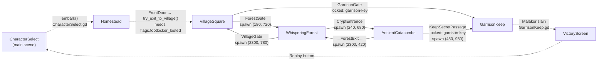

# 2. Scenes, Level Transitions & Door Portals
{: .no_toc }

In this chapter you add a new location, the Sunken Vault, and connect it to the Ancient Catacombs with a pair of doors. Along the way you'll learn how the existing scenes link together, how `DoorPortal` works, and where the hero appears after a transition.
{: .fs-6 .fw-300 }

## Table of contents
{: .no_toc .text-delta }

1. TOC
{:toc}

---

## How it works

### The scene graph

This graph was built from every `target_scene` in `scenes/*.tscn` and every `change_scene_to_file` call in `scripts/`. Solid arrows are `DoorPortal` nodes; dashed arrows are transitions done in a script.



Details worth knowing:

- `Homestead`'s `FrontDoor` uses `DoorPortal.gd` but has no `target_scene`. `Homestead.gd` connects its `door_entered` signal to `try_exit_to_village()`, which refuses to leave until the footlocker has been looted.
- `VillageSquare`'s `GarrisonGate` is locked with `required_key = "garrison-key"` and `opens_quest_stage = 4`. `VillageSquare.gd` also connects its `door_entered` to `try_enter_garrison()`.
- The ten building doors in the village (`DoorInn`, `DoorBlacksmith`, …) have a `door_id` but no `target_scene`, so clicking them does nothing beyond emitting `door_entered`.
- `TacticalBattle.tscn` is not linked from any scene. It is loaded by HTTP actions such as `start_tactical_battle` for tests. Its `DefeatScreen` sends you to `VillageSquare`.

### DoorPortal

`scenes/components/DoorPortal.tscn` is an `Area2D` (layer 1, `input_pickable = true`) with a 90×90 collision box, a `Sprite` and a `Label`. The script:

[scripts/DoorPortal.gd](https://github.com/nddipiazza/robos/blob/main/games/crpg-realm/scripts/DoorPortal.gd)

```gdscript
class_name DoorPortal
extends Area2D

signal door_entered
signal door_unlocked

@export var door_id: String = "door-id-1"
@export var door_name: String = "Door"
@export var target_scene: String = ""
@export var target_spawn: Vector2 = Vector2.ZERO
@export var is_locked: bool = false
@export var required_key: String = ""
@export var opens_quest_stage: int = 0
# ...

func try_enter() -> bool:
	if is_locked:
		if required_key != "" and GameState.has_item(required_key):
			is_locked = false
			door_unlocked.emit()
			# ...
			if opens_quest_stage > 0:
				GameState.advance_quest(opens_quest_stage)
			# ...
		else:
			# ...
			GameState.log_message("system", "* %s is locked! Requires key: %s." % [door_name, required_key])
			return false

	door_entered.emit()
	if target_spawn != Vector2.ZERO:
		GameState.spawn_position = target_spawn
	if target_scene != "":
		get_tree().change_scene_to_file(target_scene)
	return true

func _input_event(_viewport: Viewport, event: InputEvent, _shape_idx: int) -> void:
	if event is InputEventMouseButton and event.button_index == MOUSE_BUTTON_LEFT and event.pressed:
		try_enter()
```

Key points:

- **Doors are click-to-enter.** A left click on the door's collision box calls `try_enter()`. Walking over a door does nothing.
- **Locks use the inventory.** `GameState.has_item()` checks `inventory` and all three equipped slots. The key is not consumed.
- **The door only stores the spawn point.** It writes `GameState.spawn_position` and changes scene.

### Where the hero appears

`HeroPlayer._ready()` reads and clears the stored spawn point:

[scripts/HeroPlayer.gd](https://github.com/nddipiazza/robos/blob/main/games/crpg-realm/scripts/HeroPlayer.gd)

```gdscript
func _ready() -> void:
	if GameState.spawn_position != Vector2.ZERO:
		global_position = GameState.spawn_position
		GameState.spawn_position = Vector2.ZERO
	# ...
```

If no spawn point was set, the hero stays where the `HeroPlayer` instance sits in the target `.tscn` — for example `(500, 1260)` in `VillageSquare.tscn`.

The companion follows because every location script spawns `PartyCompanion.tscn` next to the hero in its own `_ready()` (shown in [chapter 1]({{ '/projects/crpg-realm/create-your-own-game/01-godot-architecture.html' | relative_url }})). The party data itself lives in `GameState.party_members`, which survives the scene change.

---

## Step by step: add the Sunken Vault

### 1. Create the scene

1. In the Godot FileSystem dock, right-click `scenes/AncientCatacombs.tscn` → **Duplicate…** and name it `SunkenVault.tscn`. If you copy the file outside the editor instead, change the `uid="…"` value on its first line so it is unique.
2. Open `SunkenVault.tscn`. Rename the root node to `SunkenVault`. Tests compare against this name.
3. Delete the catacomb-specific children: `KeepSecretPassage`, `GrandSarcophagus`, both `GroundItem_*`, the three traps, `SirJustinGhost`, `SkeletonArcher`, `CryptGuardian`.
4. Keep these, because scripts and the HUD look them up by path: `CombatManager`, `Ground`, the boundary `StaticBody2D`, `HeroPlayer`, `CanvasLayer` with `NoticeLabel`, `PartyHUD` (and its `QuestLabel`, `BtnOptions`, `BtnInventory`, `BtnPause` children), `ActionLog`, `InventoryWindow`, `SettingsModal`, `CharacterStatusWindow`, and `FogOfWar`.
5. Set `Ground.texture` to your own 2560×1440 plate (or leave the catacomb one for now).

### 2. Write the scene script

New code — create `scripts/SunkenVault.gd` and attach it to the `SunkenVault` root (replacing `AncientCatacombs.gd`):

```gdscript
extends Node2D

@onready var hud = $CanvasLayer/PartyHUD
@onready var hero = $HeroPlayer

func _ready() -> void:
	if hero and hero.has_method("set_camera_limits"):
		hero.set_camera_limits(0, 0, 2560, 1440)
	hud.update_display("Active Quest: Explore the Sunken Vault")

	if GameState.party_members.size() > 1 and not has_node("PartyCompanion"):
		var comp_scene = load("res://scenes/PartyCompanion.tscn")
		if comp_scene:
			var comp = comp_scene.instantiate()
			comp.global_position = hero.global_position + Vector2(-48, 24)
			add_child(comp)
			if has_node("FogOfWar"):
				$FogOfWar.register_actor(comp)

func get_nav_points() -> Array[Vector2]:
	return [
		Vector2(400, 720),
		Vector2(1280, 720),
		Vector2(2100, 720)
	]
```

`get_nav_points()` is what lets click-to-move route around walls; [chapter 3]({{ '/projects/crpg-realm/create-your-own-game/03-maps-and-isometric-geometry.html' | relative_url }}) explains how to choose the points. `CombatManager` stays as a child node so combat code you add later can use `$CombatManager`.

### 3. Add the door out of the vault

In `SunkenVault.tscn`, select the kept `ForestExit` door (or instance `scenes/components/DoorPortal.tscn` as a **direct child of the root**) and set:

| Property | Value |
|:---|:---|
| name | `VaultExit` |
| `door_id` | `door-id-vault-exit` |
| `door_name` | `Stairs to the Catacombs` |
| `target_scene` | `res://scenes/AncientCatacombs.tscn` |
| `target_spawn` | `Vector2(260, 780)` |

### 4. Add the door into the vault

Open `scenes/AncientCatacombs.tscn`, instance `DoorPortal.tscn` under the root, and set:

| Property | Value |
|:---|:---|
| name | `SunkenVaultStairs` |
| `position` | `Vector2(260, 880)` — just south of the hero's start, away from the traps |
| `door_id` | `door-id-sunken-vault` |
| `door_name` | `Sunken Vault Stairs` |
| `target_scene` | `res://scenes/SunkenVault.tscn` |
| `target_spawn` | `Vector2(400, 720)` |

To lock it, also set `is_locked = true` and `required_key` to an item id from `data/v1/items.json`.

### 5. Run it

```bash
./debug.sh --scene res://scenes/AncientCatacombs.tscn
```

Click the new stairs. You should arrive in the vault at `(400, 720)`; click `VaultExit` to return.

### 6. Optional: a shortcut for BDD state strings

`/api/v1/setup_state` accepts a free-text `state_spec` and guesses the scene from keywords (`"village"`, `"forest"`, `"catacomb"`, `"keep"`, …) in `GameControlServer._setup_initial_state()`. Your scene has no keyword. You don't need one if your tests pass the scene name directly (see below). If you want `the heroes have state "sunken vault"` to work, add a branch after the `catacomb` one:

New code — add to `_setup_initial_state()` in `scripts/GameControlServer.gd`:

```gdscript
			elif "vault" in s_low:
				if not payload.has("scene"): payload["scene"] = "SunkenVault"
				if not payload.has("quest_stage"): payload["quest_stage"] = 4
```

---

## Verify it

The existing door behaviour is covered by the epic campaign feature, which talks to Blacksmith Brand for the key and then enters the locked `door-id-1` gate:

```bash
python3 run_cucumber_tests.py tests/e2e/features/full_playthroughs/06_expanded_epic_campaign_playthrough.feature
```

For your new doors, create a feature using existing steps. New code — `tests/e2e/features/normal/18_sunken_vault_portals.feature`:

```gherkin
@isolated @portals
Feature: Sunken Vault portals

  Background:
    Given the cRPG game is running and healthy

  Scenario: Travel from the catacombs to the vault and back
    Given an isolated test starting in scene "AncientCatacombs" with party "Lieutenant Vance" the "fighter"
    Then the current scene is "AncientCatacombs"
    When the infinity ai agent enters door "door-id-sunken-vault"
    Then the current scene is "SunkenVault"
    When the infinity ai agent enters door "door-id-vault-exit"
    Then the current scene is "AncientCatacombs"
```

```bash
python3 run_cucumber_tests.py tests/e2e/features/normal/18_sunken_vault_portals.feature
```

The `enters door` step sends the `enter_door` action. The server finds the node whose `door_id` matches, walks the hero to it if it is more than 130 px away, then calls `try_enter()`.

---

## Gotchas

- **Doors must be direct children of the root** if you want tests to find them reliably and keep y-sorting correct.
- **`target_spawn = Vector2(0, 0)` means "no spawn".** The door skips writing `spawn_position`, so the hero appears at the `HeroPlayer` position saved in the target scene.
- **Don't combine `target_scene` with a script handler that also changes scene.** `VillageSquare.gd` connects `ForestGate.door_entered` to a lambda that calls `change_scene_to_file`, and the door then calls it again. It works, but it is easy to end up with two different destinations. Pick one: set `target_scene`, or leave it empty and change scene in your handler (the `Homestead` pattern).
- **Locked doors advance the quest.** `opens_quest_stage` is applied the moment the door unlocks, before `door_entered` fires and before any handler you connected runs.
- **`debug.sh` short names are limited.** `--scene SunkenVault` is passed to Godot unchanged and fails. Use `--scene res://scenes/SunkenVault.tscn`.
- **The isolated test step changes the party.** `an isolated test starting in scene "X"` gives the Elora companion and extra potions only when X is `VillageSquare`. Elsewhere you start alone with one `potion-healing`.

---

[← Previous: 1. Godot 4 architecture]({{ '/projects/crpg-realm/create-your-own-game/01-godot-architecture.html' | relative_url }}) · [Next: 3. Maps and isometric geometry →]({{ '/projects/crpg-realm/create-your-own-game/03-maps-and-isometric-geometry.html' | relative_url }})
