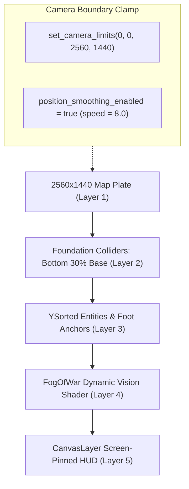

# 3. 2560×1440 Maps & Isometric World Layers
{: .no_toc }

How to render high-resolution 2560×1440 maps, enforce the foundation footprint rule, clamp camera boundaries, and construct two-tier click-to-move pathfinding.
{: .fs-6 .fw-300 }

<div style="margin: 1.5rem 0;">
  
  <p style="text-align: center; color: #b8860b; font-size: 0.85rem; margin-top: 0.5rem;"><em>Figure 3.1: 2.5D Isometric World Layers — Map texture base, foundation colliders, Y-sorted entity depth plane, vision mask, and viewport-pinned UI.</em></p>
</div>

## Table of contents
{: .no_toc .text-delta }

1. TOC
{:toc}

---

## The 2560×1440 Map Standard

cRPG Realm maps are rendered at a native resolution of **2560×1440 pixels**, providing an expansive playable arena while the player's viewport runs at **1920×1080**. This allows the camera to smoothly track party movement across large environments without showing artificial borders or black letterboxes.



---

## The "Foundation Footprint" Rule

One of the most common beginner pitfalls in 2.5D isometric game development is placing collision shapes across the *entire height* of a building or rock wall. Doing so prevents characters from walking behind roofs and breaks the illusion of three-dimensional depth.

```text
WRONG: Full-Height Collider
┌──────────────────┐
│  Roof / Spire    │ <- HERO BLOCKED FROM WALKING BEHIND ROOF!
│  Upper Stories   │ 
│  Base Foundation │ [================== Full StaticBody2D ==================]
└──────────────────┘

CORRECT: Foundation Footprint (RobOS Standard)
┌──────────────────┐
│  Roof / Spire    │ <- NO COLLISION: Hero passes behind roof naturally via Y-sorting
│  Upper Stories   │ 
│  Base Foundation │ [====== CollisionShape2D only on ground footprint ======]
└──────────────────┘
```

### Rule Specification:
1. **Vertical Bounds**: Place `CollisionShape2D` (or `CollisionPolygon2D`) only covering the bottom **25% to 35%** of physical structures.
2. **Y-Sort Alignment**: Set the structure's `Node2D.position.y` at the ground contact line.
3. **Collision Layer**: Set `collision_layer = 1` and `collision_mask = 1` to block characters and missiles while letting vision shaders pass unobstructed.

---

## Camera Clamping & Viewport Tracking

To ensure the camera never pans outside the painted boundaries of the 2560×1440 map plate:

```gdscript
# Inside HeroPlayer.gd or Camera setup
func set_camera_limits(left: int, top: int, right: int, bottom: int) -> void:
    if not camera:
        return
    camera.limit_left = left
    camera.limit_top = top
    camera.limit_right = right
    camera.limit_bottom = bottom
    camera.position_smoothing_enabled = true
    camera.position_smoothing_speed = 8.0
```

On scene load, `LocationScene.gd` issues the clamp command:
```gdscript
func _ready() -> void:
    if hero and hero.has_method("set_camera_limits"):
        hero.set_camera_limits(0, 0, 2560, 1440)
```

---

## Two-Tier Click-to-Move Pathfinding

cRPG Realm employs a hybrid navigation engine combining line-of-sight physics raycasts with waypoint networks:

1. **Tier 1 (Direct Raycast)**: When the player clicks, a physics raycast tests if a direct straight line to the destination is free of `StaticBody2D` colliders. If clear, the party marches straight toward the target.
2. **Tier 2 (Corridor Waypoints)**: If a building or boundary blocks direct line-of-sight, the `Pathfinder.gd` utility calculates the shortest path through registered corner waypoints, moving smoothly around building foundations.

---

[← 2. Scenes & Door Portals](/projects/crpg-realm/create-your-own-game/02-scenes-and-portals.html) | [Next: 4. Items & Equipment System →](/projects/crpg-realm/create-your-own-game/04-items-loot-and-inventory.html)
