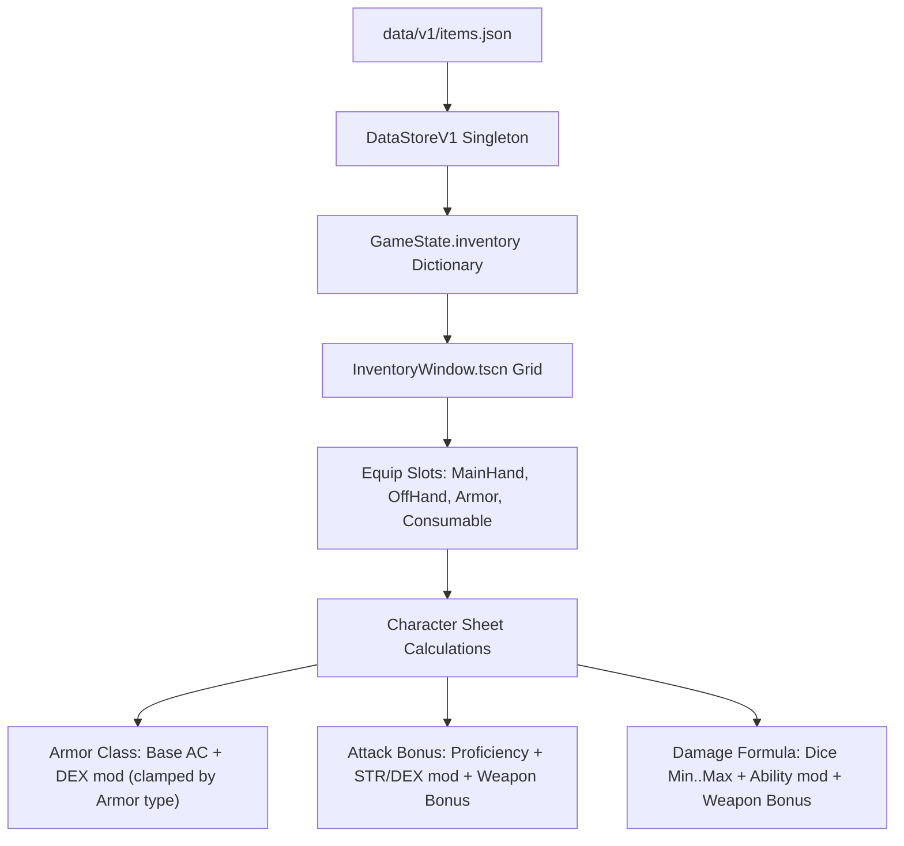

# 4. Items, Inventory & D&D 5e Equipment System
{: .no_toc }

Architecting a data-driven item registry, ground loot pickup triggers, multi-slot party inventory, and D&D 5e Armor Class calculations.
{: .fs-6 .fw-300 }

<div style="margin: 1.5rem 0;">
  
  <p style="text-align: center; color: #b8860b; font-size: 0.85rem; margin-top: 0.5rem;"><em>Figure 4.1: Items & Inventory Data Flow — JSON declarative schemas, DataStore indexing, GroundItem pickups, and Character Sheet AC synchronization.</em></p>
</div>

## Table of contents
{: .no_toc .text-delta }

1. TOC
{:toc}

---

## Zero-Hardcoding JSON Data Store

Every weapon, armor piece, potion, and quest key in `crpg-realm` is defined declaratively in `data/v1/items.json` or loaded through community packages in `mods/`. Godot scripts never hardcode item names, stats, or values:

```json
{
  "shadow-reaper-blade": {
    "id": "shadow-reaper-blade",
    "title": "Shadow Reaper Greatsword +2",
    "slot": "main_hand",
    "twoHanded": true,
    "damageMin": 4,
    "damageMax": 16,
    "damageType": "slashing",
    "bonusAttack": 2,
    "bonusDamage": 2,
    "value": 450,
    "icon": "res://assets/icons/weapons/greatsword_necrotic.png",
    "description": "A wicked blackened blade humming with necrotic runes. Forged to cleave through plate armor."
  },
  "plate-armor-royal": {
    "id": "plate-armor-royal",
    "title": "Royal Garrison Full Plate",
    "slot": "armor",
    "baseAC": 18,
    "maxDexBonus": 0,
    "stealthDisadvantage": true,
    "strengthRequired": 15,
    "value": 1500,
    "icon": "res://assets/icons/armor/full_plate.png",
    "description": "Heavy interlocking steel plates offering impenetrable protection against physical strikes."
  }
}
```

---

## Equipment Slots & Stat Derivations



### D&D 5e Armor Class (AC) Calculation:
```gdscript
func get_calculated_ac(character: Dictionary) -> int:
    var equipped_armor_id = character.get("equipment", {}).get("armor", "")
    var base_ac = 10
    var max_dex = 99
    
    if equipped_armor_id != "" and DataStore.items.has(equipped_armor_id):
        var armor_data = DataStore.items[equipped_armor_id]
        base_ac = int(armor_data.get("baseAC", 10))
        max_dex = int(armor_data.get("maxDexBonus", 99))
    
    var dex_mod = GameState.get_stat_modifier(int(character.get("stats", {}).get("DEX", 10)))
    var effective_dex = mini(dex_mod, max_dex)
    
    # Shield bonus (+2 AC)
    var off_hand_id = character.get("equipment", {}).get("off_hand", "")
    var shield_bonus = 0
    if off_hand_id != "" and DataStore.items.has(off_hand_id):
        if DataStore.items[off_hand_id].get("type") == "shield":
            shield_bonus = 2
            
    return base_ac + effective_dex + shield_bonus
```

---

## Placing Ground Loot: `GroundItem.tscn`

To place items directly onto the dungeon floor for players to inspect and loot:

```gdscript
# GroundItem.gd
class_name GroundItem
extends Area2D

@export var item_id: String = ""
@onready var sprite: Sprite2D = $Sprite2D

func _ready() -> void:
    body_entered.connect(_on_body_entered)
    _sync_visuals()

func _sync_visuals() -> void:
    if DataStore.items.has(item_id):
        var data = DataStore.items[item_id]
        var icon_path = data.get("icon", "")
        if icon_path != "" and ResourceLoader.exists(icon_path):
            sprite.texture = load(icon_path)

func _on_body_entered(body: Node2D) -> void:
    if body is CharacterBody2D and body.name == "HeroPlayer":
        GameState.add_item(item_id)
        GameState.log_message("item", "Picked up: %s" % DataStore.items[item_id].get("title", item_id))
        AudioManager.play_sfx("item_pickup")
        queue_free()
```

---

[← 3. Maps & Isometric Geometry](/projects/crpg-realm/create-your-own-game/03-maps-and-isometric-geometry.html) | [Next: 5. Infinity Engine Traps →](/projects/crpg-realm/create-your-own-game/05-infinity-engine-traps.html)
