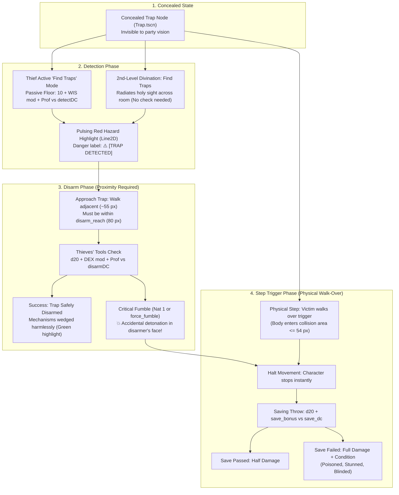

# 5. Infinity Engine Traps & Hazards System
{: .no_toc }

A comprehensive architectural guide to concealed floor pressure plates, explosive glyphs, modal thief sweeps, Thieves' Tools disarms, and D&D 5e saving throw triggers.
{: .fs-6 .fw-300 }

<div style="margin: 1.5rem 0;">
  
  <p style="text-align: center; color: #b8860b; font-size: 0.85rem; margin-top: 0.5rem;"><em>Figure 5.1: Infinity Engine Traps & Hazard Engine — Modal thief detection, divination spell sweeps, pulsing red danger runes, and Thieves' Tools disarm resolution.</em></p>
</div>

## Table of contents
{: .no_toc .text-delta }

1. TOC
{:toc}

---

## Tactical Philosophy of Infinity Engine Traps

In classic Infinity Engine titles (*Baldur's Gate*, *Icewind Dale*), traps are not mere damage numbers—they are tactical pacing mechanisms that force players to respect ancient crypts, scout dangerous corridors, and deploy specialized party roles:

- **Thief Utility**: Rogues aren't just backstabbers; they are essential survival specialists whose modal search skills save the party from lethal ambushes.
- **Divination Value**: Divine spellcasters can expend spell slots (*Find Traps*) to reveal hazardous corridors when moving through territory too dangerous for foot scouting.
- **Visual Tension**: The iconic **pulsing red danger outline** gives players an unmistakable warning to stop and think before advancing.



---

## Declarative Trap Schema (`data/v1/traps.json`)

All traps are defined declaratively without hardcoding:

```json
{
  "poison-dart-trap": {
    "id": "poison-dart-trap",
    "title": "Concealed Poison Dart Trap",
    "type": "floor",
    "detectDC": 13,
    "disarmDC": 14,
    "saveStat": "CON",
    "saveDC": 13,
    "damageMin": 2,
    "damageMax": 12,
    "damageType": "poison",
    "statusEffect": "poisoned",
    "statusDuration": 3,
    "description": "Pressure-sensitive stone flagstone triggering concealed wall darts coated in wyvern venom."
  },
  "glyph-of-warding": {
    "id": "glyph-of-warding",
    "title": "Glyph of Warding (Explosive Runes)",
    "type": "glyph",
    "detectDC": 15,
    "disarmDC": 15,
    "saveStat": "DEX",
    "saveDC": 14,
    "damageMin": 3,
    "damageMax": 24,
    "damageType": "fire",
    "statusEffect": "",
    "statusDuration": 0,
    "description": "Ancient glowing runes inscribed upon the crypt dais. Detonates in a roaring burst of flame when disturbed."
  }
}
```

---

## `Trap.gd`: The Hazard Component

The `Trap` class inherits from `Area2D` and handles the full state lifecycle:

```gdscript
class_name Trap
extends Area2D

signal trap_detected(trap_node: Node2D, by_actor: String)
signal trap_disarmed(trap_node: Node2D, by_actor: String)
signal trap_triggered(trap_node: Node2D, victim_name: String)

@export var trap_id: String = "poison-dart-trap"
@export var detection_radius: float = 650.0

@export var is_detected: bool = false
@export var is_disarmed: bool = false
@export var is_triggered: bool = false

var pulse_tween: Tween = null

func _ready() -> void:
    collision_layer = 1
    collision_mask = 1
    body_entered.connect(_on_body_entered)
    _sync_data_store()
    _update_visual_state()

func reveal_trap(by_actor: String = "Divine Divination") -> void:
    if is_disarmed or is_triggered:
        return
    is_detected = true
    _update_visual_state()
    GameState.trap_detected.emit(trap_id, by_actor)
    trap_detected.emit(self, by_actor)
    FloatingTextManager.spawn_status(global_position, "TRAP DETECTED!")

func _start_pulse() -> void:
    _stop_pulse()
    pulse_tween = create_tween().set_loops()
    pulse_tween.tween_property(self, "modulate:a", 0.35, 0.6).set_trans(Tween.TRANS_SINE)
    pulse_tween.tween_property(self, "modulate:a", 1.0, 0.6).set_trans(Tween.TRANS_SINE)
```

---

## Proximity Requirements & Physical Walk-Over Triggers

Infinity Engine traps require physical proximity to interact with: characters cannot disarm mechanisms from across the dungeon, and floor hazards only detonate when an actor physically walks over them.

### 1. Disarming Requires Walking Adjacent (`disarm_reach = 80.0 px`)

When an actor is commanded to disarm a detected trap, the engine verifies that the actor is standing adjacent to the hazard (within `disarm_reach: float = 80.0`, typically ~55 px away). If an actor attempts to disarm from afar without approaching first, the action is rejected:

```gdscript
func disarm_trap(disarmer_name: String, force_fumble: bool = false) -> Dictionary:
    if is_disarmed:
        return {"success": true, "already_disarmed": true}
    if is_triggered:
        return {"success": false, "already_triggered": true}

    # Proximity check: Must walk next to the trap first
    var actor = _get_actor_node(disarmer_name)
    if actor != null:
        var dist = global_position.distance_to(actor.global_position)
        if dist > disarm_reach:
            push_warning("Actor '%s' is too far (%.1f px) to disarm trap (reach: %.1f px)" % [disarmer_name, dist, disarm_reach])
            return {"success": false, "error": "Too far from trap to disarm (must walk next to it first)", "too_far": true, "distance": dist}

    var cm = _get_combat_manager()
    var tools_bonus = 5
    if disarmer_name == GameState.hero_name:
        var dex_mod = GameState.get_stat_modifier(int(GameState.ability_scores.get("DEX", 14)))
        var prof = 4 if GameState.character_class.to_lower() == "rogue" else 2
        tools_bonus = max(5, dex_mod + prof)
    elif disarmer_name == "Bramble Ironheart":
        var dex_mod = GameState.get_stat_modifier(int(GameState.companion_stats.get("Bramble Ironheart", {}).get("DEX", 16)))
        tools_bonus = max(5, dex_mod + 4) # Rogue Expertise

    var res = cm.resolve_trap_disarm(disarmer_name, tools_bonus, disarm_dc, trap_name, force_fumble)

    if res.get("success", false):
        is_disarmed = true
        _update_visual_state()
        GameState.trap_disarmed.emit(trap_id, disarmer_name)
        trap_disarmed.emit(self, disarmer_name)
        FloatingTextManager.spawn_status(global_position, "TRAP DISARMED")
        return {"success": true, "disarmed": true}
    elif res.get("fumble", false):
        # Detonates in disarmer's face because they are standing right next to it!
        var trig_res = force_trigger(disarmer_name, false, true)
        return {"success": false, "fumble": true, "triggered": true, "trigger_result": trig_res}
```

### 2. Triggering Requires Walking Over the Trap

Floor traps and concealed glyphs only detonate when an actor physically walks into the collision shape (`_on_body_entered`) or steps directly over the bounding box (`dist <= 54.0 px`):

- **Movement Halting**: Upon stepping onto the trap, the victim's velocity and pathfinding are immediately terminated (`is_moving = false`, `velocity = Vector2.ZERO`).
- **Saving Throw Resolution**: The victim immediately rolls a d20 saving throw matching the trap's `saveStat` (e.g., CON for poison darts, DEX for explosive fire glyphs).
- **Damage & Status Effects**: A successful save halves incoming damage; a failed save inflicts full damage and applies debilitating conditions (such as `poisoned` or `stunned`).
- **Remote Rejection**: Any attempt to trigger the hazard remotely without an actor stepping over it is strictly rejected by the engine.

### 3. Mouse Interaction & Navigation Flow

In Godot, player input on the trap's `CollisionShape2D` automatically routes through `_input_event`:

- **Clicking a Detected Trap**: Commands the party's rogue or selected hero to pathfind to an adjacent position (`global_position + direction * 55.0 px`), await arrival, turn to face the mechanism, and begin disarming.
- **Clicking an Undetected Trap**: Registers as standard terrain movement. The party member moves directly toward the clicked position, and if their movement path crosses the concealed hazard's trigger radius, the trap immediately trips!

---

[← 4. Items & Equipment System](/projects/crpg-realm/create-your-own-game/04-items-loot-and-inventory.html) | [Next: 6. Custom Boss Encounters →](/projects/crpg-realm/create-your-own-game/06-boss-fights-and-encounters.html)

