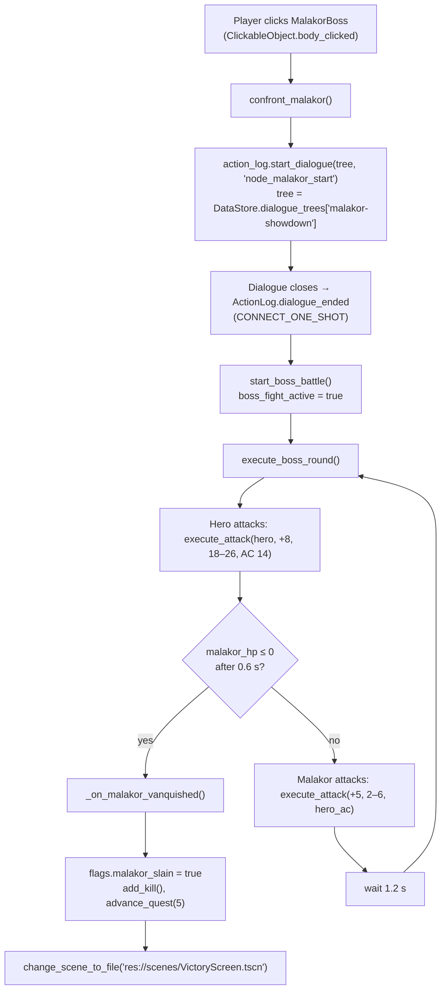

# 6. Boss Fights: The Captain Malakor Encounter
{: .no_toc }

The game has one scripted boss fight: Captain Malakor in the Garrison Keep. This chapter walks through that script from the click that starts it to the Victory screen. Then it shows how to make the fight read its stats from `monsters.json` and how to add a second phase yourself.
{: .fs-6 .fw-300 }

{: .robos-zoomable-img }
*The end of the Malakor fight, recorded during an Infinity AI playthrough test. The activity log shows the hero's +8 attack against AC 14, "Journal updated (Stage 5)", and the vanquish message logged twice (see [Gotchas](#gotchas)).*

## Table of contents
{: .no_toc .text-delta }

1. TOC
{:toc}

---

## How it works

The whole encounter lives in [scripts/GarrisonKeep.gd](https://github.com/nddipiazza/robos/blob/main/games/crpg-realm/scripts/GarrisonKeep.gd), the root script of `scenes/GarrisonKeep.tscn`. Malakor is not a `TacticalEnemy`. He is a `MalakorBoss` node: an `Area2D` running `scripts/ClickableObject.gd`, with `SelectionCircle`, `Sprite`, `Label`, `BossHPBar`, `BossHPText` and `CollisionShape2D` children. His HP, AC and attacks are plain variables and literals in the scene script.

{: .note }
Not implemented: boss phases, shields or invulnerability, summoned minions, proximity-triggered cutscenes, initiative and turn order. The fight is a simple alternating attack loop. The [recipe below](#extending-it-add-a-second-phase) shows how to add a phase yourself.

The sequence:



### 1. Clicking starts it

`ClickableObject` emits `body_clicked` on a left click (or when something calls its `interact()`). `GarrisonKeep._ready()` connects that to `confront_malakor`:

[scripts/GarrisonKeep.gd](https://github.com/nddipiazza/robos/blob/main/games/crpg-realm/scripts/GarrisonKeep.gd)
```gdscript
@onready var combat_mgr = $CombatManager
@onready var malakor_npc = $MalakorBoss
@onready var malakor_sprite: Sprite2D = $MalakorBoss/Sprite
@onready var malakor_hp_bar: ProgressBar = $MalakorBoss/BossHPBar
@onready var malakor_hp_text: Label = get_node_or_null("MalakorBoss/BossHPText")
@onready var hero = $HeroPlayer

var boss_fight_active: bool = false
var malakor_hp: int = 48
var malakor_max_hp: int = 48
# ...
func _ready() -> void:
    # ...
    malakor_npc.body_clicked.connect(confront_malakor)
```

There is no range check. A click from anywhere on the map starts the confrontation.

### 2. The showdown dialogue

[scripts/GarrisonKeep.gd](https://github.com/nddipiazza/robos/blob/main/games/crpg-realm/scripts/GarrisonKeep.gd) — `confront_malakor()`
```gdscript
func confront_malakor() -> void:
    if GameState.flags.get("malakor_slain", false): return

    # Turn Malakor to face hero
    if malakor_sprite and hero:
        malakor_sprite.flip_h = (hero.global_position.x < malakor_npc.global_position.x)

    var dial = DataStore.dialogue_trees.get("malakor-showdown", {})
    if action_log:
        action_log.start_dialogue(dial, "node_malakor_start")
        action_log.dialogue_ended.connect(start_boss_battle, CONNECT_ONE_SHOT)
    else:
        start_boss_battle()
```

The tree is the `malakor-showdown` entry in `data/v1/dialogue.json`. Its nodes are `node_malakor_start` → (`node_defiance` or `node_lore`) → `node_fight`. `node_fight` has an empty `choices` array. For a node like that, `ActionLog.show_dialogue_node()` shows a single "[Continue / End Dialogue]" button that calls `close_dialogue()`, which emits `dialogue_ended`.

[data/v1/dialogue.json](https://github.com/nddipiazza/robos/blob/main/games/crpg-realm/data/v1/dialogue.json)
```json
{
  "id": "malakor-showdown",
  "title": "Captain Malakor Showdown",
  "rootNode": "node_malakor_start",
  "nodes": {
    "node_malakor_start": {
      "speaker": "Captain Malakor",
      "text": "Ah... my faithful Lieutenant returns. ...",
      "choices": [
        { "text": "You've been corrupted by the vault, Captain. Stand down!", "nextNode": "node_defiance" },
        { "text": "What was inside that sarcophagus?!", "nextNode": "node_lore" }
      ]
    },
    "node_fight": {
      "speaker": "Captain Malakor",
      "text": "Death to all who defy the Void!",
      "choices": []
    }
  }
}
```

### 3. The attack loop

`start_boss_battle()` sets `boss_fight_active = true`, logs and shows a notice, then calls `execute_boss_round()`. Each round:

[scripts/GarrisonKeep.gd](https://github.com/nddipiazza/robos/blob/main/games/crpg-realm/scripts/GarrisonKeep.gd) — `execute_boss_round()`
```gdscript
func execute_boss_round() -> void:
    if not boss_fight_active or not is_instance_valid(malakor_npc): return

    # 1. Hero attacks Malakor with animated sword swing
    hero.play_attack(malakor_npc.global_position, func():
        var res = combat_mgr.execute_attack(GameState.hero_name, 8, 18, 26, "Captain Malakor", 14)
        if res.hit:
            malakor_hp -= res.damage
            if malakor_hp_bar:
                malakor_hp_bar.value = malakor_hp
            _update_health_bar_visibility()
            _play_malakor_hit_flash()
            show_notice("Hero strikes Malakor for %d damage!" % res.damage)
        else:
            show_notice("Malakor parries the hero's strike!")
        return res
    )

    await get_tree().create_timer(0.6).timeout

    if malakor_hp <= 0:
        _on_malakor_vanquished()
        return

    # 2. Malakor retaliates with animated crimson strike against hero
    _play_malakor_attack(func():
        var boss_res = combat_mgr.execute_attack("Captain Malakor", 5, 2, 6, GameState.hero_name, GameState.hero_ac)
        if boss_res.hit:
            GameState.take_damage(boss_res.damage)
            # ...
        return boss_res
    )

    await get_tree().create_timer(1.2).timeout

    if boss_fight_active and malakor_hp > 0:
        execute_boss_round()
```

`CombatManager.execute_attack(attacker_name, attack_bonus, damage_dice_min, damage_dice_max, target_name, target_ac, target_pos)` rolls the d20 and applies advantage or disadvantage from status effects. It logs the result, plays the hit/miss SFX and returns `{d20, total_attack, hit, crit, damage}`. The numbers are literals in this script:

| | Attack bonus | Damage | vs AC |
|:--|:--|:--|:--|
| Hero → Malakor | +8 | 18–26 (doubled range on a crit) | 14 |
| Malakor → Hero | +5 | 2–6 | `GameState.hero_ac` |

With 48 HP, Malakor usually falls in two or three hero hits, whatever the hero's class or weapon.

`_play_malakor_attack()` swaps through `captain_malakor_attack_0..3.png` (if they exist under `assets/sprites/characters/`), lunges the sprite 14 px, and plays the `melee_swing` SFX. The strike callback runs on frame 2. `_play_malakor_hit_flash()` tweens `modulate` red and back. The boss music needs no code: `AudioManager._update_scene_music()` plays the `boss` track whenever the current scene is named `GarrisonKeep`.

### 4. Victory

[scripts/GarrisonKeep.gd](https://github.com/nddipiazza/robos/blob/main/games/crpg-realm/scripts/GarrisonKeep.gd) — `_on_malakor_vanquished()`
```gdscript
func _on_malakor_vanquished() -> void:
    boss_fight_active = false
    GameState.flags.malakor_slain = true
    GameState.add_kill()
    GameState.advance_quest(5)
    GameState.log_message("quest", "★ Captain Malakor is vanquished! The dark crypt breach is sealed! ★")
    # ...hides HP bar and selection circle, disables the collision shape,
    # tips the sprite over with a tween...
    await tw.finished
    await get_tree().create_timer(1.8).timeout
    get_tree().change_scene_to_file("res://scenes/VictoryScreen.tscn")
```

`VictoryScreen.gd` reads `GameState.hero_name`, `hero_class`, `stats.kills`, `stats.chests` and `gold` for its summary, and offers Replay (back to `CharacterSelect.tscn`) and Quit.

### HTTP control actions

`GameControlServer.gd` exposes three actions for the fight. Send them to `POST /api/v1/action` as `{"action": "<name>", "args": {}}`.

| Action | What it does |
|:--|:--|
| `confront_malakor` | Calls `current_scene.confront_malakor()` if the scene has it. |
| `attack_malakor` | Calls `current_scene.execute_boss_round()`. |
| `defeat_malakor` | Shortcut: sets `flags.malakor_slain`, `add_kill()`, `advance_quest(5)` and loads `VictoryScreen.tscn`, without running the fight. |

All three first look for a node named `CaptainMalakor` or `MalakorNPC` so the QA overlay can animate the mouse to it. The real node is called `MalakorBoss`, so that animation is skipped, but the scene calls still run. To click the real node through the API, use `POST /api/v1/user_input/click_object` with `{"name": "MalakorBoss"}`, which calls `ClickableObject.interact()`. That is what the Infinity AI agent does in `qa_player/infinity_ai_agent.py`.

---

## Step by step: read Malakor's stats from monsters.json

`data/v1/monsters.json` has a `captain-malakor-boss` entry with `"hitPoints": 58` and `"armorClass": 16`. The script ignores it and uses 48 HP and AC 14. Here is how to make the JSON the source of truth.

1. **Add an AC variable** next to `malakor_hp` in `scripts/GarrisonKeep.gd`:
   ```gdscript
   # New code
   var malakor_ac: int = 14
   ```

2. **Add a loader function.** `DataStore.monsters` maps ids to `MonsterData` objects (`src/generated/v1/MonsterData.gd`), which have typed fields `hit_points` and `armor_class`:
   ```gdscript
   # New code — add to GarrisonKeep.gd
   func _load_malakor_stats() -> void:
   	var m: MonsterData = DataStore.monsters.get("captain-malakor-boss")
   	if m:
   		malakor_max_hp = m.hit_points
   		malakor_hp = m.hit_points
   		malakor_ac = m.armor_class
   	if malakor_hp_bar:
   		malakor_hp_bar.max_value = malakor_max_hp
   		malakor_hp_bar.value = malakor_hp
   ```
   The bar needs updating because `GarrisonKeep.tscn` hard-codes `max_value = 48.0` and `value = 48.0` on `BossHPBar`.

3. **Call it in `_ready()`**, before `_update_health_bar_visibility()`:
   ```gdscript
   _load_malakor_textures()
   _load_malakor_stats()          # new line
   _update_health_bar_visibility()
   ```

4. **Use the AC in the hero's attack.** In `execute_boss_round()`, replace the literal `14`:
   ```gdscript
   var res = combat_mgr.execute_attack(GameState.hero_name, 8, 18, 26, "Captain Malakor", malakor_ac)
   ```

With 58 HP and AC 16 the fight takes about one more round. The Infinity AI agent sends `attack_malakor` up to 9 times, which is still plenty.

---

## Extending it: add a second phase

{: .important }
This is new code. The game does not do this today. It only uses variables and functions that already exist in `GarrisonKeep.gd`, `CombatManager.gd`, `GameState.gd` and `AudioManager.gd`.

The goal: when Malakor drops to half HP, he enters a rage. His attacks hit harder, his sprite turns red, and a sound plays. The recipe also fixes the two loop problems described in [Gotchas](#gotchas).

1. **Add phase state** near the other variables in `scripts/GarrisonKeep.gd`:
   ```gdscript
   # New code
   var malakor_phase: int = 1
   var malakor_attack_bonus: int = 5
   var malakor_dmg_min: int = 2
   var malakor_dmg_max: int = 6
   ```

2. **Add the transition function.** It tints `self_modulate`, not `modulate`, because `_play_malakor_hit_flash()` tweens `modulate` back to white after every hit. `spell_cast` is a real key in `AudioManager.sound_effects`. An unknown key would silently do nothing.
   ```gdscript
   # New code — add to GarrisonKeep.gd
   func _check_phase_transition() -> void:
   	if malakor_phase != 1 or malakor_hp <= 0:
   		return
   	if malakor_hp * 2 > malakor_max_hp:
   		return
   	malakor_phase = 2
   	malakor_attack_bonus = 7
   	malakor_dmg_min = 4
   	malakor_dmg_max = 10
   	malakor_sprite.self_modulate = Color(1.4, 0.6, 0.6, 1.0)
   	GameState.log_message("combat", "Captain Malakor flies into a rage! (Phase 2)")
   	show_notice("Malakor flies into a rage!")
   	if AudioManager:
   		AudioManager.play_sfx("spell_cast")
   ```

3. **Replace `execute_boss_round()`** with this version. Compared to the original it adds three things: a party-defeat check at the top, a call to `_check_phase_transition()` once Malakor survives the hero's swing, and phase-aware numbers for his attack.
   ```gdscript
   # New code — replaces execute_boss_round() in GarrisonKeep.gd
   func execute_boss_round() -> void:
   	if not boss_fight_active or not is_instance_valid(malakor_npc): return
   	if GameState.is_party_defeated:
   		boss_fight_active = false
   		return

   	hero.play_attack(malakor_npc.global_position, func():
   		var res = combat_mgr.execute_attack(GameState.hero_name, 8, 18, 26, "Captain Malakor", 14)
   		if res.hit:
   			malakor_hp -= res.damage
   			if malakor_hp_bar:
   				malakor_hp_bar.value = malakor_hp
   			_update_health_bar_visibility()
   			_play_malakor_hit_flash()
   			show_notice("Hero strikes Malakor for %d damage!" % res.damage)
   		else:
   			show_notice("Malakor parries the hero's strike!")
   		return res
   	)

   	await get_tree().create_timer(0.6).timeout

   	if malakor_hp <= 0:
   		_on_malakor_vanquished()
   		return

   	_check_phase_transition()

   	_play_malakor_attack(func():
   		var boss_res = combat_mgr.execute_attack("Captain Malakor", malakor_attack_bonus, malakor_dmg_min, malakor_dmg_max, GameState.hero_name, GameState.hero_ac)
   		if boss_res.hit:
   			GameState.take_damage(boss_res.damage)
   			show_notice("Malakor strikes hero for %d damage!" % boss_res.damage)
   		else:
   			show_notice("Hero dodges Malakor's strike!")
   		return boss_res
   	)

   	await get_tree().create_timer(1.2).timeout

   	if boss_fight_active and malakor_hp > 0:
   		execute_boss_round()
   ```
   If you did the monsters.json steps above, use `malakor_ac` in place of `14`.

4. **Make victory run only once.** Add a guard as the first line of `_on_malakor_vanquished()`:
   ```gdscript
   # New code — first line of _on_malakor_vanquished()
   if not boss_fight_active: return
   ```
   `boss_fight_active` is set to `false` on the very next line of the real function, so a second call returns straight away.

5. **Try it.** Start the game, walk to the keep and click Malakor. Once his HP falls to 24 or lower, which usually takes one or two hits at 18–26 damage each, the log shows "flies into a rage! (Phase 2)" and his sprite turns red. If you want a phase 2 that lasts longer, lower the hero's damage or load the 58 HP from `monsters.json` as shown above.

---

## Verify it

No normal-suite feature targets the keep. All six full-playthrough features end there:

| Feature | How it finishes the fight |
|:--|:--|
| `full_playthroughs/01_human_fighter_full_playthrough.feature` | `the player confronts Captain Malakor` (moves, `confront_malakor`, dialog choice, `close_dialogue`), then `the combat rounds against Captain Malakor are executed until victory`: one `attack_malakor`, then the `defeat_malakor` shortcut. |
| `02_elf_wizard…`, `03_dwarf_cleric…`, `04_halfling_rogue…` | Same two steps as 01. |
| `05_infinity_ai_point_a_to_point_b_questing.feature` | `quest_through_garrison_keep()` clicks `MalakorBoss`, clicks through the dialogue, then sends `attack_malakor` until `flags.malakor_slain` is true. **This runs the real loop.** |
| `06_expanded_epic_campaign_playthrough.feature` | Same agent method as 05. |

Features 01–04 pass even if your loop never kills Malakor, because they finish with `defeat_malakor`. Use 05 to test changes to the fight:

```bash
cd games/crpg-realm
python3 run_cucumber_tests.py tests/e2e/features/full_playthroughs/05_infinity_ai_point_a_to_point_b_questing.feature
```

It ends with `Then the victory screen is visible`, which accepts either `VictoryScreen` as the scene or `flags.malakor_slain == true`.

For a quick manual check, start the game with `./play.sh`. The control server listens on 127.0.0.1:8080 by default, or the next free port up to 8089. Jump straight to the keep:

```bash
curl -s -X POST localhost:8080/api/v1/setup_state -H 'Content-Type: application/json' \
     -d '{"state_spec": "garrison keep"}'
curl -s -X POST localhost:8080/api/v1/user_input/click_object -H 'Content-Type: application/json' \
     -d '{"name": "MalakorBoss"}'
```

The `"garrison keep"` spec makes `_setup_initial_state()` load `GarrisonKeep` with quest stage 4, Elora and a `garrison-key`. Then click through the dialogue in the activity log and watch the fight.

---

## Gotchas

- **Stats are hardcoded.** 48 HP / AC 14 in the script against 58 / 16 in `monsters.json`. Hero damage (+8, 18–26) ignores class, weapon and ability scores. `TacticalEnemy` doesn't read `monsters.json` either.
- **Two loops can run at once.** Closing the dialogue starts the loop. The `attack_malakor` API action calls `execute_boss_round()` again, which starts a second loop alongside the first. The hero's extra swing is dropped (`play_attack` returns early while `is_attacking`), but Malakor's retaliation isn't guarded. With two loops, `_on_malakor_vanquished()` can also run twice: the screenshot above shows the "vanquished" log line twice. Step 4 of the recipe prevents the double victory.
- **The loop ignores party defeat.** Original `execute_boss_round()` keeps going after `GameState.take_damage()` drops the hero to 0 HP and `check_party_defeat()` fires `party_defeated`. The recipe adds the `GameState.is_party_defeated` check.
- **No range check.** `confront_malakor()` runs on any click, and the hero attacks from wherever they stand.
- **The dialogue tree must exist and must close.** `confront_malakor()` connects `dialogue_ended` *after* calling `start_dialogue()`. If the `malakor-showdown` id or its root node is missing, `show_dialogue_node()` calls `close_dialogue()` synchronously. `dialogue_ended` then fires before anything is connected, so the fight doesn't start. Worse, the pending one-shot connection fires at the end of the next dialogue in the scene. If you rename the tree in `dialogue.json`, update the id in `confront_malakor()` too.
- **Don't rename `MalakorBoss`** without updating the `$MalakorBoss/...` paths in `GarrisonKeep.gd` and the `click_world_object("MalakorBoss")` call in `qa_player/infinity_ai_agent.py`.
- **Keep scene nodes flat.** `MalakorBoss`, `HeroPlayer` and `CombatManager` are direct children of the `GarrisonKeep` root, and the `$` paths in the script assume that. Companions, enemies and traps you add must also be direct children. See [chapter 5]({{ '/projects/crpg-realm/create-your-own-game/05-infinity-engine-traps.html' | relative_url }}#gotchas).

---

[← Previous: 5. Traps]({{ '/projects/crpg-realm/create-your-own-game/05-infinity-engine-traps.html' | relative_url }}) · [Next: 7. Modding →]({{ '/projects/crpg-realm/create-your-own-game/07-modding-and-custom-content.html' | relative_url }})
