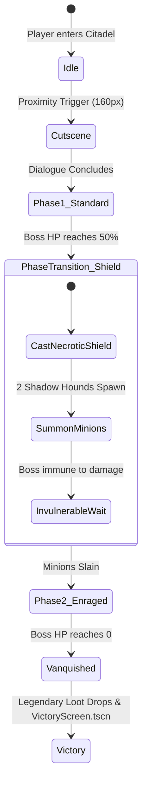

# 6. Custom Boss Encounters & Multi-Phase Logic
{: .no_toc }

How to script cinematic multi-phase boss encounters, implement invulnerability shields, summon minion waves, and trigger victory rewards.
{: .fs-6 .fw-300 }

<div style="margin: 1.5rem 0;">
  
  <p style="text-align: center; color: #b8860b; font-size: 0.85rem; margin-top: 0.5rem;"><em>Figure 6.1: Boss Encounter State Machine — Cutscene proximity trigger, Phase 1 combat, 50% HP shield transition, summoned adds, and victory resolution.</em></p>
</div>

## Table of contents
{: .no_toc .text-delta }

1. TOC
{:toc}

---

## Multi-Phase Boss Architecture

A memorable cRPG boss fight is more than a bag of hit points. It requires narrative confrontation, distinct tactical phases that disrupt player habits, and dynamic battlefield changes:



---

## Step 1: Cinematic Dialogue Initiation

When the party approaches the boss dais, trigger a dramatic cutscene before combat begins:

```gdscript
# Inside GarrisonKeep.gd
func _on_boss_proximity_entered(body: Node2D) -> void:
    if body.name != "HeroPlayer" or boss_confronted:
        return
    boss_confronted = true
    
    # 1. Halt movement and lock controls
    hero.set_physics_process(false)
    
    # 2. Trigger narrative exchange in ActionLog
    action_log.display_dialogue(
        "Captain Malakor",
        "res://assets/portraits/portrait_fighter.png",
        "Turn back, Lieutenant! The darkness beneath this keep is far older than the crown! You cannot undo what has awakened!",
        [
            {"text": "You betrayed your oath, Malakor! Draw your blade!", "action": "start_boss_combat"},
            {"text": "Is there no other way? Stand down and face the tribunal!", "action": "boss_parley_refused"}
        ]
    )
```

---

## Step 2: The Phase 2 Transition at 50% HP

When the boss's HP drops below 50%, disrupt the encounter by introducing invulnerability and minion adds:

```gdscript
func on_boss_damaged(current_hp: int, max_hp: int) -> void:
    if current_hp <= (max_hp / 2) and not phase_two_triggered:
        trigger_phase_two()

func trigger_phase_two() -> void:
    phase_two_triggered = true
    boss_invulnerable = true
    
    # Visual shield effect
    boss_sprite.modulate = Color(0.4, 0.2, 0.9, 1.0) # Violet necrotic barrier
    FloatingTextManager.spawn_status(boss_npc.global_position, "NECROTIC SHIELD ACTIVE")
    GameState.log_message("combat", "⚠️ [BOSS ENRAGE] Malakor raises a necrotic shield and summons corrupted hounds!")
    AudioManager.play_sfx("boss_shield_up")
    
    # Summon minion adds
    for i in range(2):
        var minion_scene = load("res://scenes/ShadowHound.tscn")
        var minion = minion_scene.instantiate()
        minion.global_position = boss_npc.global_position + Vector2(-120 + (i * 240), 80)
        minion.enemy_died.connect(_on_minion_slain)
        add_child(minion)
        minions_alive += 1

func _on_minion_slain() -> void:
    minions_alive -= 1
    if minions_alive <= 0:
        boss_invulnerable = false
        boss_sprite.modulate = Color(1.0, 1.0, 1.0, 1.0)
        GameState.log_message("combat", "🛡️ Malakor's shield shatters! He is vulnerable again!")
```

---

## Step 3: Vanquish Callback, Loot & Victory Transition

When the boss reaches 0 HP, award victory:

```gdscript
func on_boss_vanquished() -> void:
    boss_fight_active = false
    boss_hp_bar.visible = false
    GameState.flags["malakor_slain"] = true
    GameState.advance_quest(5)
    
    # 1. Victory announcement & fanfare
    GameState.log_message("story", "🏆 [VICTORY] Captain Malakor is vanquished! The garrison citadel is liberated!")
    AudioManager.play_sfx("victory_fanfare")
    
    # 2. Spawn legendary ground loot
    var drop_scene = load("res://scenes/components/GroundItem.tscn")
    if drop_scene:
        var loot = drop_scene.instantiate()
        loot.item_id = "shadow-reaper-blade"
        loot.global_position = boss_npc.global_position
        add_child(loot)
    
    # 3. Transition to victory screen after cinematic delay
    await get_tree().create_timer(3.0).timeout
    get_tree().change_scene_to_file("res://scenes/VictoryScreen.tscn")
```

---

[← 5. Infinity Engine Traps](/projects/crpg-realm/create-your-own-game/05-infinity-engine-traps.html) | [Next: 7. Modding Engine & Overrides →](/projects/crpg-realm/create-your-own-game/07-modding-and-custom-content.html)
