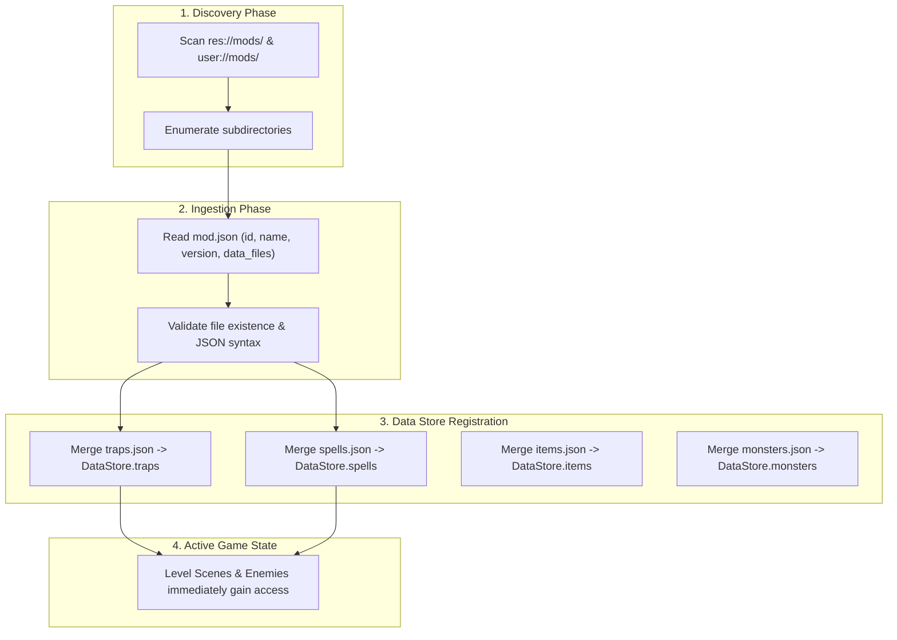

# 7. Modding Engine, Manifests & Data Overrides
{: .no_toc }

How to build modular community content packages, author custom traps and spells, override core game data, and distribute mods without compiling GDScript.
{: .fs-6 .fw-300 }

<div style="margin: 1.5rem 0;">
  
  <p style="text-align: center; color: #b8860b; font-size: 0.85rem; margin-top: 0.5rem;"><em>Figure 7.1: Modding Architecture & Discovery Flow — Directory discovery, manifest parsing, data dictionary merging, and live hazard registration.</em></p>
</div>

## Table of contents
{: .no_toc .text-delta }

1. TOC
{:toc}

---

## Zero-Code Mod Loader Architecture

The cRPG engine includes an automated **Mod Loader** (`DataStoreV1.gd`) that discovers and registers user packages from two standardized search roots:
1. `res://mods/`: Project-bundled expansion packs and developer mods.
2. `user://mods/`: Player-installed community packages located in the OS user data directory (e.g. `~/.local/share/godot/app_userdata/crpg-realm/mods/`).



---

## Step 1: Mod Directory & Manifest (`mod.json`)

Create a directory named after your mod slug (e.g. `mods/catacomb-traps-mod/`) and place a `mod.json` descriptor:

```json
{
  "id": "catacomb-traps-mod",
  "name": "Catacomb Traps & Dungeon Hazards Mod",
  "version": "1.0.0",
  "author": "RobOS Community Modder",
  "description": "Adds lethal Infinity Engine dungeon traps, tripwires, and alchemical hazards.",
  "data_files": {
    "traps": "traps.json",
    "spells": "spells.json",
    "items": "items.json"
  }
}
```

---

## Step 2: Defining Custom Hazards (`traps.json`)

Inside your mod folder, define custom hazard entries adhering to the D&D 5e SRD trap specification:

```json
{
  "thunder-tripwire": {
    "id": "thunder-tripwire",
    "title": "Acoustic Thunderstone Tripwire",
    "type": "floor",
    "detectDC": 14,
    "disarmDC": 13,
    "saveStat": "CON",
    "saveDC": 14,
    "damageMin": 4,
    "damageMax": 16,
    "damageType": "thunder",
    "statusEffect": "stunned",
    "statusDuration": 2,
    "description": "Taut catgut wire connected to acoustic resonating crystals. Deals thunder damage and stuns on a failed Constitution save."
  }
}
```

---

## Step 3: Defining Custom Spells (`spells.json`)

Register custom spells that interact with the combat and hazard systems:

```json
{
  "find-traps": {
    "id": "find-traps",
    "title": "Find Traps",
    "level": 2,
    "school": "Divination",
    "range": "120 feet",
    "castingTime": "1 action",
    "duration": "Instantaneous",
    "description": "You sense the presence of any trap within range. Traps are immediately illuminated in pulsing red danger runes."
  }
}
```

---

## How `DataStoreV1.gd` Loads Mods

```gdscript
func _load_mods() -> void:
    var mod_paths = ["res://mods", "user://mods"]
    for base_dir in mod_paths:
        if not DirAccess.dir_exists_absolute(base_dir):
            continue
        var dir = DirAccess.open(base_dir)
        if not dir:
            continue
        dir.list_dir_begin()
        var folder = dir.get_next()
        while folder != "":
            if dir.current_is_dir() and not folder.begins_with("."):
                _ingest_mod_folder(base_dir + "/" + folder)
            folder = dir.get_next()
        dir.list_dir_end()
```

---

[← 6. Custom Boss Encounters](/projects/crpg-realm/create-your-own-game/06-boss-fights-and-encounters.html) | [Next: 8. Cucumber BDD & Video Proof →](/projects/crpg-realm/create-your-own-game/08-cucumber-bdd-testing.html)
