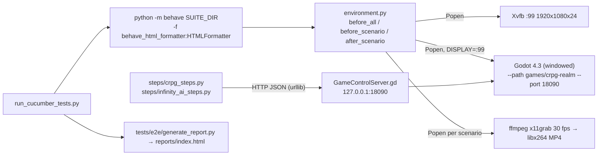

# 8. Cucumber BDD Tests and Video Recording
{: .no_toc }

The game's end-to-end tests are Gherkin feature files run by Python `behave`. The tests drive a real, windowed Godot instance over its HTTP control API, and each scenario is recorded to an MP4. This chapter covers setup, running the three suites, how the harness works, and how to write a new scenario and step definition.
{: .fs-6 .fw-300 }

{: .robos-zoomable-img }
*A frame from a recorded scenario. The green "BDD STEP" banner and the "INPUT EVENT STREAM" panel are drawn by the `QAOverlay` autoload during test runs.*

## Table of contents
{: .no_toc .text-delta }

1. TOC
{:toc}

---

## Prerequisites

The harness is written for Linux with an X server available (`Xvfb` + `ffmpeg x11grab`).

| Need | Why | How the harness finds it |
|:--|:--|:--|
| Godot **4.3** binary | Runs the game (`project.godot` declares `"4.3"`, GL Compatibility). | `$GODOT_BIN`, then `~/apps/godot4`, `~/.local/bin/godot4`, `~/.local/bin/godot`, `/usr/bin/godot4`, `/usr/bin/godot`, `/usr/local/bin/godot4`, `/usr/local/bin/godot`, then `godot4`/`godot` on `PATH` |
| Xvfb | Virtual 1920×1080×24 display for Godot to render into | `$XVFB_BIN`, then `Xvfb` on `PATH`, `/usr/bin/Xvfb`, `/usr/local/bin/Xvfb`, `~/.local/bin/Xvfb` |
| ffmpeg with `x11grab` and `libx264` | Screen recording | `$FFMPEG_BIN`, then `ffmpeg` on `PATH`, else `/usr/bin/ffmpeg` |
| Python 3 + `behave`, `behave-html-formatter` | Test runner and HTML formatter | `pip install behave behave-html-formatter` |

The step code and `qa_player/` use only the standard library (`urllib.request`, `json`, `subprocess`), so nothing else needs installing. For installing Godot itself, see the [Quick Start]({{ '/projects/crpg-realm/quick-start.html' | relative_url }}).

On Debian/Ubuntu, for example:

```bash
sudo apt install xvfb ffmpeg
pip install behave behave-html-formatter
export GODOT_BIN=/path/to/Godot_v4.3-stable_linux.x86_64
```

---

## Running the tests

Run everything from `games/crpg-realm`:

```bash
cd games/crpg-realm
python3 run_cucumber_tests.py                  # normal suite (default)
python3 run_cucumber_tests.py --spells         # spells suite
python3 run_cucumber_tests.py --playthrough    # full playthroughs
python3 run_cucumber_tests.py --all            # all three
python3 run_cucumber_tests.py tests/e2e/features/normal/12_infinity_engine_traps_detection_and_disarm.feature
```

| Suite | Flag (aliases) | Folder | Features | Scenarios |
|:--|:--|:--|:--|:--|
| Normal isolated tests | `--normal` (`--isolated`), or no flag | `tests/e2e/features/normal/` | 17 | 41 |
| Spells | `--spells` (`--spell`, `--magic`) | `tests/e2e/features/spells/` | 24 | 27 |
| Full playthroughs | `--playthrough` (`--playthroughs`, `--full`) | `tests/e2e/features/full_playthroughs/` | 6 | 7 |
| All | `--all` (`--both`) | `tests/e2e/features/` | 47 | 75 |

Scenario counts are `Scenario:`/`Scenario Outline:` definitions. The one outline in `normal/04_shopkeeper_trading_economy_and_inventory.feature` expands to more runs.

The runner passes every argument it doesn't recognize straight to `behave`. If any argument is a `.feature` file or an existing path, the suite folder is dropped and only that path runs. Standard behave options also work, for example:

```bash
python3 run_cucumber_tests.py --spells --tags=@find_traps
python3 run_cucumber_tests.py --normal -n "Thief uses Thieves' Tools"
```

A full run takes a while: each scenario shows a 3-second splash card, and the steps include deliberate `time.sleep()` pauses so the video is watchable.

### Environment variables

| Variable | Default | Effect |
|:--|:--|:--|
| `GODOT_BIN` | search list above | Godot executable |
| `XVFB_BIN` | search list above | Xvfb executable |
| `FFMPEG_BIN` | search list above | ffmpeg executable |
| `USE_XVFB` | `1` | `0`/`false`/`no` skips starting Xvfb |
| `CRPG_DISPLAY` (or `XVFB_DISPLAY`) | `:99` | X display that Godot uses and ffmpeg records |
| `CRPG_WEB_SERVICE_PORT` | `18090` | Port for the game's control server during tests (passed as env and as `--port`) |
| `REPORTS_DIR` | `tests/e2e/reports` | Where `environment.py` writes videos, JSON and logs (see [Gotchas](#gotchas)) |

To watch a run on your own desktop, don't start Xvfb and point the harness at your display: `USE_XVFB=0 CRPG_DISPLAY=:0 python3 run_cucumber_tests.py ...`. `environment.py` always sets `DISPLAY` from `CRPG_DISPLAY`, so `USE_XVFB=0` alone would still aim Godot at `:99`.

### Output

| File | Written by |
|:--|:--|
| `tests/e2e/reports/index.html` | HTML report (see below) |
| `tests/e2e/reports/videos/<scenario_key>.mp4` | one per scenario, from ffmpeg |
| `tests/e2e/reports/gamestate_<scenario_key>.json` | `GET /api/v1/state` saved after each scenario |
| `tests/e2e/reports/godot_output.log` | Godot's stdout/stderr (look here for GDScript errors and mod load lines) |
| `tests/e2e/reports/ffmpeg.log` | ffmpeg output, appended per scenario |

`tests/e2e/reports/` is in `.gitignore`.

---

## How it works



### Runner: `run_cucumber_tests.py`

[run_cucumber_tests.py](https://github.com/nddipiazza/robos/blob/main/games/crpg-realm/run_cucumber_tests.py) builds and runs one behave command:

```python
behave_cmd = [
    sys.executable, "-m", "behave",
]
if not has_custom_path:
    behave_cmd.append(str(target_dir))
behave_cmd.extend([
    "-f", "behave_html_formatter:HTMLFormatter",
    "-o", str(HTML_REPORT),
    *resolved_args
])
# ...
result = subprocess.run(behave_cmd, cwd=PROJECT_DIR, env=env, check=False)
# then runs tests/e2e/generate_report.py
```

It puts the game folder on `PYTHONPATH` so the steps can `import qa_player`. Its exit code is behave's exit code.

### Hooks: `tests/e2e/features/environment.py`

[tests/e2e/features/environment.py](https://github.com/nddipiazza/robos/blob/main/games/crpg-realm/tests/e2e/features/environment.py)

- **`before_all`** starts Xvfb with `[xvfb, ":99", "-screen", "0", "1920x1080x24", "-ac"]`, after deleting a stale `/tmp/.X99-lock`. It then starts **one** Godot process for the whole run, `[godot, "--path", PROJECT_DIR, "--port", "18090"]`, with `DISPLAY=:99`. There is no `--headless` flag: Godot renders a real window on the virtual display, which is what ffmpeg records. The hook waits up to 12 s for `GET /api/v1/health` and stores the port in `context.web_port`.
- **`before_scenario`** puts the game into a known state:
  - **Playthroughs** (path contains `full_playthroughs`, or tags like `@full_playthrough`), and scenarios with character-creation steps, get `POST /api/v1/reset`, which goes back to CharacterSelect.
  - **Everything else** gets `POST /api/v1/setup_state` with a scene picked from an `@scene:<SceneName>` tag, or else guessed from the feature filename and step text (TacticalBattle, VillageSquare, or Homestead as the default). Most isolated scenarios then call `setup_state` again in their first `Given` step with the exact scene they need.
  - It then starts ffmpeg (`-f x11grab -framerate 30 -video_size 1920x1080 -draw_mouse 0 ... -c:v libx264 -preset fast -crf 22 -pix_fmt yuv420p`) and posts a 3-second splash card to `/api/v1/qa/scenario_splash`.
- **`before_step`** posts the step text and a description to `/api/v1/qa/set_step`. That is the banner in the screenshot. The description comes from the step's docstring if it has one, else from a regex match in `tests/e2e/step_descriptions.py` (`STEP_PATTERNS`), else a generic "Executing ... verification" line.
- **`after_scenario`** saves `GET /api/v1/state` to `gamestate_<key>.json` and stops ffmpeg by writing `q` to its stdin.
- **`after_all`** terminates Godot and Xvfb.

### Steps talk HTTP

Both step files use `urllib.request`, not a browser or a Godot plugin. [tests/e2e/features/steps/crpg_steps.py](https://github.com/nddipiazza/robos/blob/main/games/crpg-realm/tests/e2e/features/steps/crpg_steps.py) defines two helpers that retry 10 times, 0.3 s apart:

```python
def api_get(port, endpoint):
    url = f"http://127.0.0.1:{port}{endpoint}"
    for attempt in range(10):
        try:
            req = urllib.request.Request(url, method="GET")
            with urllib.request.urlopen(req, timeout=3.0) as resp:
                return json.loads(resp.read().decode("utf-8"))
        except Exception:
            time.sleep(0.3)
    raise RuntimeError(f"Failed to GET {url}")

def api_post(port, endpoint, payload):
    # same, with a JSON body and an 18 s timeout
```

Most steps are either an action (`POST /api/v1/action` with `{"action": ..., "args": {...}}`) or an assertion on `GET /api/v1/state`. The Background step used by most normal-suite features is simply:

```python
@given('the cRPG game is running and healthy')
def step_game_healthy(context):
    state = api_get(context.web_port, "/api/v1/health")
    assert state.get("status") == "ok", f"Expected ok, got: {state}"
```

[tests/e2e/features/steps/infinity_ai_steps.py](https://github.com/nddipiazza/robos/blob/main/games/crpg-realm/tests/e2e/features/steps/infinity_ai_steps.py) wraps `qa_player/infinity_ai_agent.py` (`InfinityAIAgent`), which plays whole zones through the same HTTP API. The playthrough features 05 and 06 use it. For the full endpoint list, see the [Reference]({{ '/projects/crpg-realm/reference.html' | relative_url }}).

### State injection: `/api/v1/setup_state`

Tests don't play through earlier zones to reach a situation. They inject it. `GameControlServer._setup_initial_state()` accepts:

| Key | Effect |
|:--|:--|
| `name`, `class`, `race` | `GameState.init_hero(name, class, {}, race)`. Defaults: "Lieutenant Vance", fighter, human. |
| `gold`, `inventory` (array of item ids), `quest_stage`, `flags` (object) | Written straight into `GameState` |
| `companions` | Array; `"elora"` (half-elf rogue) and `"thrumbar"` (dwarf cleric) are recognized |
| `scene` | Scene name (loads `res://scenes/<name>.tscn`) or a full `res://` path |
| `state_spec` | A JSON object string that is merged into the payload, or keywords: `village`/`square` (add `garrison-key`/`ready for keep` to also get the key), `forest`/`wilderness`, `catacomb`/`crypt`, `keep`/`garrison`/`malakor`, `arena`/`tactical`/`battle`, `homestead` |

Two steps expose this. `crpg_steps.py` has:

```python
@given('an isolated test starting in scene "{scene_name}" with party "{hero_name}" the "{hero_class}"')
def step_isolated_scene_start(context, scene_name, hero_name, hero_class):
    # ...
    api_post(context.web_port, "/api/v1/setup_state", {
        "name": hero_name,
        "class": hero_class.lower(),
        "scene": scene_name,
        "companions": comps,
        "gold": 150,
        "inventory": inv,
        "quest_stage": q_stage,
        "flags": flags
    })
```

`infinity_ai_steps.py` has `Given the heroes have state "<spec>"`, which sends `{"state_spec": spec}` through `InfinityAIAgent.setup_heroes_state()`. It is used as `Given the heroes have state "village square"` in `normal/10_house_wall_collision_pathfinding.feature` and `normal/11_dozens_npc_dialogue_and_trading.feature`.

### Videos and the report

The scenario key used for file names is built the same way in `environment.py` and `generate_report.py`:

```python
raw_name = scenario.name.lower().replace(" ", "_").replace("-", "_")
context.scenario_name = "".join([c for c in raw_name if c.isalnum() or c == "_"])
```

So "Thief uses Thieves' Tools to successfully disarm a detected trap" is recorded to `videos/thief_uses_thieves_tools_to_successfully_disarm_a_detected_trap.mp4`.

After behave finishes, `run_cucumber_tests.py` runs [tests/e2e/generate_report.py](https://github.com/nddipiazza/robos/blob/main/games/crpg-realm/tests/e2e/generate_report.py). That script **overwrites** the behave HTML output at `reports/index.html` with its own page. It parses every `.feature` file under `tests/e2e/features/` and embeds each scenario's video and JSON, matching by exact key first and then by shared words in the name.

{: .warning }
The PASSED/FAILED badges in `index.html` only show whether a video file exists for that scenario (`"passed": (v_path is not None ...)`). A scenario that failed still records a video and shows as PASSED. Scenarios you didn't run in this session can also show PASSED from old videos. Use behave's console summary and the runner's exit code for real results.

---

## Step by step: add a scenario and a step

This example asserts a trap's disarm DC, a check you would want after writing a mod ([chapter 7]({{ '/projects/crpg-realm/create-your-own-game/07-modding-and-custom-content.html' | relative_url }})).

1. **Write the scenario.** Add it to `tests/e2e/features/normal/12_infinity_engine_traps_detection_and_disarm.feature`, or create a new `normal/18_<name>.feature`. Scenario names must be unique across all features, because the video file name comes from the name.
   ```gherkin
   Feature: Trap data overrides
     Background:
       Given the cRPG game is running and healthy

     Scenario: Glyph of Warding uses the modded disarm DC
       Given an isolated test starting in scene "AncientCatacombs" with party "Bramble" the "rogue"
       Then the scene contains concealed traps
       And the trap "glyph-of-warding" has disarm DC 17
   ```

2. **Add the step definition** to `tests/e2e/features/steps/crpg_steps.py`. Follow the file's pattern: behave's default `parse` matcher, `context.web_port`, and `api_get`/`api_post`. The `traps` entries in `/api/v1/state` come from `Trap.get_trap_info()` and include `disarm_dc`.
   ```python
   # New code — add to crpg_steps.py
   @then('the trap "{trap_id}" has disarm DC {dc:d}')
   def step_trap_has_disarm_dc(context, trap_id, dc):
       state = api_get(context.web_port, "/api/v1/state")
       traps = state.get("traps", [])
       found = next((t for t in traps if t.get("id") == trap_id), None)
       assert found is not None, f"Trap '{trap_id}' not found in scene traps: {traps}"
       assert found.get("disarm_dc") == dc, f"Expected disarm DC {dc}, got: {found}"
   ```
   If you put a step after a `use_step_matcher("re")` block, make sure the file switches back with `use_step_matcher("parse")`, as `crpg_steps.py` does after its regex steps. Step text must not match any existing step in either step file, or behave raises an ambiguous-step error.

3. **Optional: add an overlay description.** Add a `(regex, template)` tuple to `STEP_PATTERNS` in `tests/e2e/step_descriptions.py` so the video banner shows a readable sentence:
   ```python
   (r'the trap "([^"]+)" has disarm DC (\d+)',
    'Checking that trap {0} has a Thieves\' Tools disarm DC of {1}.'),
   ```

4. **If the step needs a new game action,** add a branch to the `match` on the action name in `GameControlServer._execute_game_action()` and return a Dictionary. The step can then `api_post(context.web_port, "/api/v1/action", {"action": "<name>", "args": {...}})`.

5. **Run just that file:**
   ```bash
   python3 run_cucumber_tests.py tests/e2e/features/normal/18_trap_data_overrides.feature
   ```

---

## Verify it

Check that the harness itself works before you debug your own features:

```bash
cd games/crpg-realm
python3 run_cucumber_tests.py tests/e2e/features/spells/spell_18_find_traps.feature
```

This is one short scenario. You should get a passing scenario, exit code 0, and `tests/e2e/reports/videos/divination_pulse_sweeps_the_arena_revealing_concealed_hazards_in_glowing_runic_aura.mp4`. If the health check times out, read `tests/e2e/reports/godot_output.log`.

---

## Gotchas

- **Not headless.** Godot needs a display. Without Xvfb, and with `USE_XVFB=0`, Godot tries `DISPLAY=:99` and fails to open a window.
- **One game process per run.** State carries over between scenarios except for what `/reset` or `/setup_state` overwrite. If a scenario depends on a flag or item, set it in its `Given` step.
- **Port conflicts.** If 18090 is busy, `GameControlServer` binds the next free port (up to +9), but the tests keep calling 18090. Free the port or set `CRPG_WEB_SERVICE_PORT`.
- **`REPORTS_DIR` is only half-supported.** `environment.py` honours it, but `run_cucumber_tests.py` and `generate_report.py` always use `tests/e2e/reports/`. With a custom `REPORTS_DIR` the videos go elsewhere and the report can't find them.
- **Report badges aren't results.** See the warning above. Also, `generate_report.py` labels spells features "Normal Isolated", because it only checks for `full_playthroughs` in the path.
- **`embed_artifacts()` in `run_cucumber_tests.py` is never called.** The report comes from `generate_report.py` alone.
- **Background is not universal.** 13 features use `Background: Given the cRPG game is running and healthy`. The spells features and several others go straight to their `Given` steps.
- **Some playthroughs take shortcuts.** Playthroughs 01–04 finish the boss with the `defeat_malakor` action (see [chapter 6]({{ '/projects/crpg-realm/create-your-own-game/06-boss-fights-and-encounters.html' | relative_url }})). A passing run proves the path to the keep, not the boss loop.
- **Fixed sleeps.** Steps wait with `time.sleep()` instead of polling. On a slow machine, an assertion can run before an animation-driven callback lands. Poll `/api/v1/state` in new steps where timing matters.

---

[← Previous: 7. Modding]({{ '/projects/crpg-realm/create-your-own-game/07-modding-and-custom-content.html' | relative_url }}) · [Next: 9. Party leader and formations →]({{ '/projects/crpg-realm/create-your-own-game/09-party-dynamics-and-formations.html' | relative_url }})
