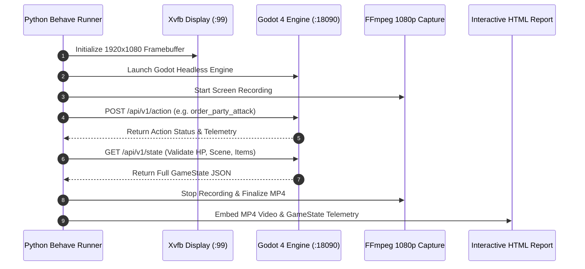

# 8. Automated Cucumber BDD Verification & Xvfb Framebuffers
{: .no_toc }

How to author Behavior-Driven Development (BDD) Cucumber tests, drive Godot through an in-engine HTTP REST API, execute headless in Xvfb, and capture 1080p video proof-of-work.
{: .fs-6 .fw-300 }

<div style="margin: 1.5rem 0;">
  
  <p style="text-align: center; color: #b8860b; font-size: 0.85rem; margin-top: 0.5rem;"><em>Figure 8.1: Cucumber BDD Test Verification Harness — Dual test suites, Python Behave runner, GameControlServer REST bridge, Xvfb virtual framebuffer, and FFmpeg 1080p MP4 capture.</em></p>
</div>

## Table of contents
{: .no_toc .text-delta }

1. TOC
{:toc}

---

## The Philosophy of Autonomous Proof-of-Work

In the RobOS SDLC, human engineers do not blindly trust AI diffs or assume that passing static checks means a complex game plays correctly. Every user feature, combat formula, and dialogue tree is accompanied by **Automated Proof-of-Work**:
1. **Behavior-Driven Gherkin Grammar**: Human-readable test specifications (`Given / When / Then`).
2. **Headless Execution in Xvfb**: Running the genuine game binary inside a 1920×1080 virtual display buffer (`:99`).
3. **1080p MP4 Narrated Walkthroughs**: Autonomous video recordings showing exactly how the player, party, and enemies interact.
4. **GameState JSON Snapshots**: Cryptographically verifiable state dumps attached directly into an interactive HTML test report.



---

## Dual Test Suite Architecture

| Test Suite | Purpose | Execution Speed | Video Proof | Command |
|:---|:---|:---|:---|:---|
| **Type A: Normal Isolated Tests** | Verify individual features in isolation (inventory equip, dialogue branching, trap detection, single combat rounds) | 1–3 seconds per scenario | Per-scenario MP4 | `python3 games/crpg-realm/run_cucumber_tests.py --normal` |
| **Type B: Full Playthroughs** | An autonomous AI agent plays the entire 5-act campaign from solitary awakening to the final boss victory | 45–90 seconds complete run | Full campaign MP4 | `python3 games/crpg-realm/run_cucumber_tests.py --playthrough` |

---

## Writing a Cucumber Feature File

Create a `.feature` file under `tests/e2e/features/normal/`:

```gherkin
Feature: Infinity Engine Traps Detection and Disarm
  As an adventurer exploring subterranean catacombs
  I want thieves and divine spellcasters to detect concealed traps and disarm them
  So that dungeon exploration delivers authentic tactical danger

  Scenario: Thief active Find Traps skill detects a concealed floor trap
    Given an isolated test starting in scene "AncientCatacombs" with party "Bramble" the "rogue"
    Then the current scene is "AncientCatacombs"
    And the scene contains concealed traps
    When the player enables Find Traps mode
    Then the trap "poison-dart-trap" is detected and highlighted in red
    And the activity log contains message "spotted Concealed Poison Dart Trap"
```

---

## Step Definitions with Python & REST

Implement the step definitions in `tests/e2e/features/steps/crpg_steps.py`:

```python
import time
import requests
from behave import given, when, then

def api_post(port, endpoint, payload):
    return requests.post(f"http://127.0.0.1:{port}{endpoint}", json=payload, timeout=5).json()

def api_get(port, endpoint):
    return requests.get(f"http://127.0.0.1:{port}{endpoint}", timeout=5).json()

@when('the player enables Find Traps mode')
def step_enable_find_traps_mode(context):
    api_post(context.web_port, "/api/v1/action", {
        "action": "set_detect_traps",
        "args": {"enabled": True}
    })
    time.sleep(0.6)

@then('the trap "{trap_id}" is detected and highlighted in red')
def step_trap_detected(context, trap_id):
    state = api_get(context.web_port, "/api/v1/state")
    traps = state.get("traps", [])
    found = next((t for t in traps if t.get("id") == trap_id), None)
    assert found is not None, f"Trap '{trap_id}' not found in scene: {traps}"
    assert found.get("is_detected") is True, f"Expected trap to be detected, got: {found}"
```

---

## Running Verification

```bash
# Run isolated normal tests
python3 games/crpg-realm/run_cucumber_tests.py --normal

# Run specific feature
python3 games/crpg-realm/run_cucumber_tests.py tests/e2e/features/normal/12_infinity_engine_traps_detection_and_disarm.feature

# View interactive HTML report
open games/crpg-realm/tests/e2e/reports/index.html
```

---

[← 7. Modding Engine & Overrides](/projects/crpg-realm/create-your-own-game/07-modding-and-custom-content.html) | [Back to Creator Hub Overview](/projects/crpg-realm/create-your-own-game.html)
