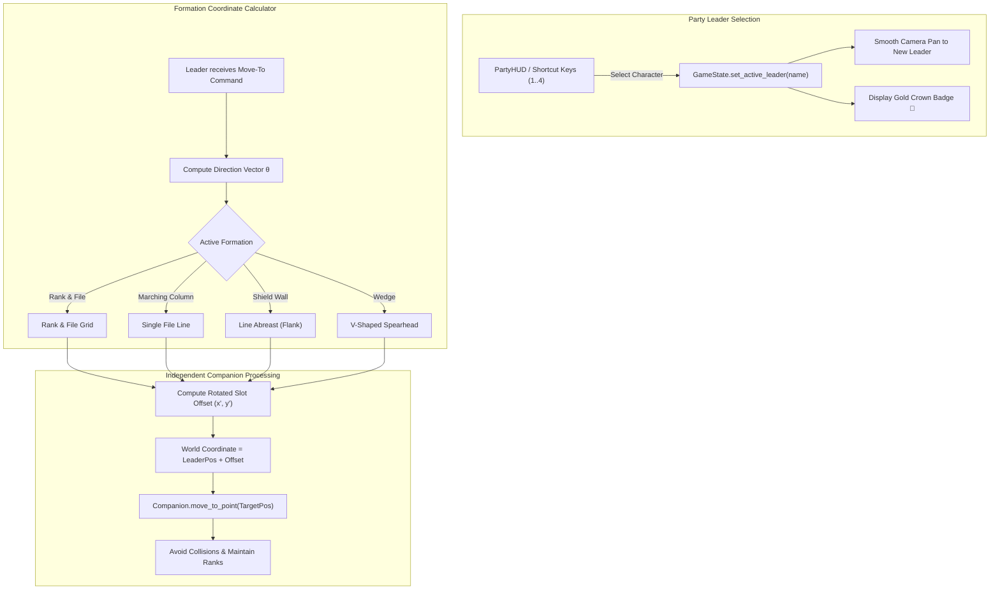

# 9. Party Dynamics, Formations & Symmetrical Follow Mechanics
{: .no_toc }

An in-depth engineering guide on implementing authentic party dynamics, interchangeable leader mechanics, symmetrical autonomous follow loops, and tactical formation geometry in Godot 4.
{: .fs-6 .fw-300 }

<div style="margin: 1.5rem 0;">
  
  <p style="text-align: center; color: #b8860b; font-size: 0.85rem; margin-top: 0.5rem;"><em>Figure 9.1: Symmetrical Party Dynamics Architecture — Interchangeable party leader, formation offset calculation, autonomous follow loops, and HUD selection toolbar.</em></p>
</div>

## Table of contents
{: .no_toc .text-delta }

1. TOC
{:toc}

---

## 1. The Symmetrical Follow Philosophy

In amateur RPG implementations, games frequently suffer from **"Main Character Syndrome"**: the engine hardcodes a special "player" class while companions use rigid, secondary "pet" logic. When the player dies or switches characters, the entire camera and movement framework collapses.

In RobOS and classic Infinity Engine titles (*Baldur's Gate*, *Icewind Dale*, *Pillars of Eternity*), **all characters are created equal**:

1. **Symmetrical Architecture**: Every party member (Vance, Bramble, Thrumbar, Aeloria) is an instance of the exact same `CharacterBody2D` entity class (`HeroPlayer.gd`).
2. **Dynamic Leadership**: Any character can become the active party leader at any time via menu selection, hotkey (`1`-`6`), or HUD click.
3. **Autonomous Follow Loops**: Non-leader party members continuously evaluate the leader's position, heading vector, and active formation matrix, independently computing pathfinding waypoints.



---

## 2. Tactical Formation Geometries

When a movement command is issued, each follower is assigned a slot index based on their order in the party. The local formation offsets `(lx, ly)` are calculated relative to the leader's position and rotated according to the leader's forward motion vector:

$$\begin{pmatrix} x_{world} \\ y_{world} \end{pmatrix} = \begin{pmatrix} x_{leader} \\ y_{leader} \end{pmatrix} + \begin{pmatrix} \cos\theta & -\sin\theta \\ \sin\theta & \cos\theta \end{pmatrix} \begin{pmatrix} l_x \\ l_y \end{pmatrix}$$

### Formation Offset Matrix

| Formation | Tactical Purpose | Offset Formula (Slot Index $i \ge 1$) |
|:---|:---|:---|
| **Rank & File (Standard 2×2)** | Balanced general dungeon crawling; tanks front, casters back. | Slot 1: `(-60, -35)`<br/>Slot 2: `(-60, +35)`<br/>Slot 3: `(-120, 0)` |
| **Marching Column** | Narrow corridors, catacomb tunnels, crossing bridges. | Slot $i$: `(-60 * i, 0)` (strict single file) |
| **Shield Wall (Line Abreast)** | Blocking enemy advance, guarding choke points. | Slot $i$: `(0, (i - 1.5) * 60)` (perpendicular spread) |
| **Wedge (Spearhead)** | Offensive charge; vanguard leader with flanking wings. | Slot $i$: `(-50 * abs(c_i), c_i * 55)` where $c = [-1, +1, -2]$ |

---

## 3. GDScript Implementation

### Formation Coordinate Generator (`GameState.gd`)

```gdscript
# GameState.gd — Tactical Formation Mathematics
enum Formation { RANK_AND_FILE, MARCHING_COLUMN, SHIELD_WALL, WEDGE }
var current_formation: Formation = Formation.RANK_AND_FILE
var party_leader_name: String = "Lieutenant Vance"

func get_formation_offsets() -> Array[Vector2]:
	match current_formation:
		Formation.RANK_AND_FILE:
			return [Vector2(0, 0), Vector2(-60, -35), Vector2(-60, 35), Vector2(-120, 0)]
		Formation.MARCHING_COLUMN:
			return [Vector2(0, 0), Vector2(-65, 0), Vector2(-130, 0), Vector2(-195, 0)]
		Formation.SHIELD_WALL:
			return [Vector2(0, 0), Vector2(0, -60), Vector2(0, 60), Vector2(0, 120)]
		Formation.WEDGE:
			return [Vector2(0, 0), Vector2(-55, -45), Vector2(-55, 45), Vector2(-110, -90)]
		_:
			return [Vector2(0, 0), Vector2(-60, -35), Vector2(-60, 35), Vector2(-120, 0)]

func get_companion_slot_position(companion_name: String, leader_pos: Vector2, heading: Vector2) -> Vector2:
	var offsets = get_formation_offsets()
	var idx = 0
	var current_idx = 1
	for member in party_members:
		if member.name == party_leader_name:
			continue
		if member.name == companion_name:
			idx = current_idx
			break
		current_idx += 1

	if idx >= offsets.size():
		return leader_pos - heading * 80.0

	var local_offset = offsets[idx]
	# Rotate offset by heading angle if moving, or default facing
	var angle = heading.angle() if heading.length_squared() > 0.01 else 0.0
	var rotated_offset = local_offset.rotated(angle)
	return leader_pos + rotated_offset
```

### Symmetrical Autonomous Follow Controller (`HeroPlayer.gd`)

```gdscript
# HeroPlayer.gd — Autonomous Follow & Leader Dynamics
@export var character_name: String = "Lieutenant Vance"
var is_leader: bool = false
var follow_target_pos: Vector2 = Vector2.ZERO
var min_follow_distance: float = 35.0

func _physics_process(delta: float) -> void:
	is_leader = (GameState.party_leader_name == character_name)
	
	if is_leader:
		_process_leader_movement(delta)
	else:
		_process_autonomous_follow(delta)

func _process_autonomous_follow(delta: float) -> void:
	var leader_node = _get_leader_node()
	if not leader_node:
		return

	var heading = leader_node.velocity.normalized()
	if heading.length_squared() < 0.01:
		heading = Vector2(cos(leader_node.rotation), sin(leader_node.rotation))

	var desired_pos = GameState.get_companion_slot_position(character_name, leader_node.global_position, heading)
	var dist = global_position.distance_to(desired_pos)

	if dist > min_follow_distance:
		var dir = (desired_pos - global_position).normalized()
		var speed = move_speed * (1.2 if dist > 150.0 else 1.0) # Catch-up acceleration
		velocity = dir * speed
		move_and_slide()
	else:
		velocity = Vector2.ZERO
```

---

## 4. Leader Reassignment & HUD Synchronization

When the player selects a new leader, the engine emits `leader_changed`, triggering:
1. **Camera Retargeting**: The camera lerps its focus to the new leader's `global_position`.
2. **Visual Crown Badge**: A golden crown icon (`res://assets/ui/icon_crown.png`) renders on the leader's portrait.
3. **Formation Recalculation**: Followers gracefully pivot and navigate to their newly calculated positions in the formation.

```gdscript
func set_party_leader(new_leader_name: String) -> void:
	party_leader_name = new_leader_name
	leader_changed.emit(party_leader_name)
	GameState.add_log_entry("👑 %s assumes party leadership." % party_leader_name)
```

---

## 5. Automated BDD Verification

The formation system is rigorously verified through Behave E2E feature specifications (`07_party_formations_and_independent_dynamics.feature`):

```gherkin
Scenario: Switching leader to Thrumbar makes him lead in defensive square
  Given an isolated test starting in scene "VillageSquare" with full 4-hero party
  When the player selects party leader "Thrumbar"
  Then "Thrumbar" is marked as the active party leader
  And the camera centers on "Thrumbar"
  When the player orders the party to move to (800, 600)
  Then "Thrumbar" arrives at the front rank coordinate
  And companion "Vance" follows into the designated formation slot
```
