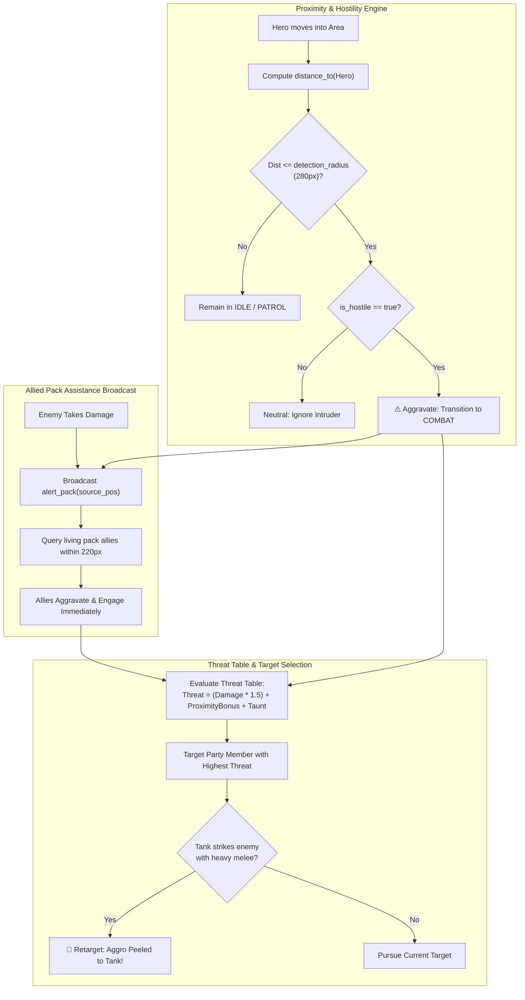

# 10. Infinity Engine Aggro, Proximity Aggravation & Pack AI
{: .no_toc }

Architectural blueprint for implementing classic Infinity Engine threat tables, proximity-based enemy aggravation, allied pack rally calls, and tank peeling mechanics in Godot 4.
{: .fs-6 .fw-300 }

<div style="margin: 1.5rem 0;">
  
  <p style="text-align: center; color: #b8860b; font-size: 0.85rem; margin-top: 0.5rem;"><em>Figure 10.1: Infinity Engine Aggro Architecture — Proximity evaluation, allied assistance broadcast, threat weight computation, and tank peeling loop.</em></p>
</div>

## Table of contents
{: .no_toc .text-delta }

1. TOC
{:toc}

---

## 1. How Classic Infinity Engine Aggro Works

In legendary RPGs like *Baldur's Gate II* and *Icewind Dale*, enemy encounters feel genuinely dangerous because creatures operate under realistic tactical rules rather than omniscient wall-hacks:

1. **Hostility States**:
   - **Hostile (`is_hostile = true`)**: Actively hunts intruders within visual line of sight and proximity radius (`detection_radius = 280.0`).
   - **Neutral / Non-Hostile (`is_hostile = false`)**: Ignores party members walking past unless physically attacked or provoked.
2. **Allied Pack Assistance (`pack_assist_radius = 220.0`)**: Wolves, goblins, and corrupted soldiers rarely fight alone. When an enemy enters combat or suffers damage, it broadcasts a shout to all nearby allies within 220px, pulling the entire pack into battle.
3. **Dynamic Threat & Peeling**: Enemies don't mindlessly focus on the closest entity; they evaluate a weighted threat table considering damage inflicted, proximity, and active taunt actions. Tanks can step in and peel aggro off vulnerable spellcasters.



---

## 2. GDScript Tactical Enemy Controller

Below is the production implementation of `TacticalEnemy.gd` demonstrating proximity aggravation and pack rallying:

```gdscript
# TacticalEnemy.gd — Infinity Engine Proximity & Pack Aggro
class_name TacticalEnemy
extends CharacterBody2D

enum State { IDLE, PATROL, COMBAT, RETREAT, DEAD }
@export var current_state: State = State.IDLE
@export var is_hostile: bool = true
@export var detection_radius: float = 280.0
@export var pack_assist_radius: float = 220.0
@export var pack_id: String = "goblin-scouts"

var current_target: Node2D = null
var threat_table: Dictionary = {} # { "Lieutenant Vance": 45, "Aeloria": 10 }

func _physics_process(delta: float) -> void:
	if current_state == State.DEAD:
		return

	if current_state == State.COMBAT:
		_process_combat_behavior(delta)
	else:
		_check_proximity_aggro()

func _check_proximity_aggro() -> void:
	if not is_hostile:
		return

	var potential_targets = GameState.get_living_party_nodes()
	for hero in potential_targets:
		var dist = global_position.distance_to(hero.global_position)
		if dist <= detection_radius:
			aggravate_on_target(hero, true)
			break

func aggravate_on_target(target: Node2D, alert_allies: bool = true) -> void:
	if current_state == State.DEAD:
		return

	var was_in_combat = (current_state == State.COMBAT)
	current_state = State.COMBAT
	current_target = target
	_add_threat(target.name, 20)

	GameState.add_log_entry("⚔️ %s aggravates and engages %s!" % [name, target.name])

	if alert_allies and not was_in_combat:
		_alert_nearby_pack_allies()

func _alert_nearby_pack_allies() -> void:
	var tree = get_tree()
	if not tree:
		return
	var enemies = tree.get_nodes_in_group("enemies")
	for ally in enemies:
		if ally == self or ally.current_state == State.DEAD:
			continue
		if ally.has_method("aggravate_on_target"):
			var dist = global_position.distance_to(ally.global_position)
			if dist <= pack_assist_radius:
				ally.aggravate_on_target(current_target, false)
				GameState.add_log_entry("📣 %s rallies to assist allied %s!" % [ally.name, name])

func take_damage(amount: int, attacker: Node2D) -> void:
	hp -= amount
	if hp <= 0:
		die()
		return

	# Attacking an enemy immediately aggravates it, even if previously neutral
	_add_threat(attacker.name, amount * 2)
	aggravate_on_target(attacker, true)

func _add_threat(target_name: String, amount: int) -> void:
	threat_table[target_name] = threat_table.get(target_name, 0) + amount
	_reevaluate_highest_threat_target()
```

---

## 3. Threat Peeling Mechanics

To implement authentic D&D 5e / MMO-style **threat peeling**, when the party tank (e.g. Fighter with Shield) strikes the enemy with a melee attack or uses a taunt ability:
1. The tank's threat value in `threat_table` exceeds the ranged companion's threat score.
2. The enemy reevaluates targets and turns away from the spellcaster to engage the tank.

```gdscript
func _reevaluate_highest_threat_target() -> void:
	var highest_name = ""
	var highest_score = -1
	for target_name in threat_table:
		var score = threat_table[target_name]
		if score > highest_score:
			highest_score = score
			highest_name = target_name

	if highest_name != "" and (not current_target or current_target.name != highest_name):
		var new_node = get_node_or_null("../" + highest_name)
		if new_node:
			current_target = new_node
			GameState.add_log_entry("🔄 %s switches focus to peel threat onto %s!" % [name, highest_name])
```

---

## 4. Automated Cucumber BDD Verification

The aggro and pack dynamics are verified through automated feature specifications (`11_infinity_engine_enemy_aggro_dynamics.feature`):

```gherkin
Scenario: Pack enemies aggravate and rally to attack when their ally is struck
  Given an isolated test starting in scene "AncientCrypt" with party "Lieutenant Vance" the "fighter"
  When the player orders "Lieutenant Vance" to strike enemy "Goblin Sentry"
  Then enemy "Goblin Sentry" enters combat state
  And nearby allied enemy "Goblin Skirmisher" within 220px alerts and joins the battle
  And the activity log contains message "rallies to assist allied Goblin Sentry"
```
