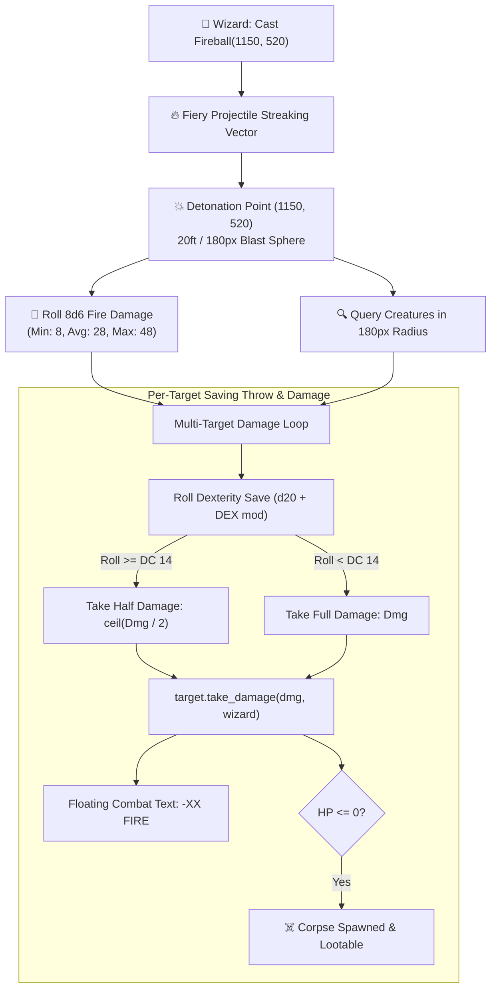

# 11. Spells, Evocation AoE & Tactical Magic Systems
{: .no_toc }

A complete engineering guide on building authentic D&D 5e Area-of-Effect (AoE) spells, geometric blast spheres, authentic multi-dice rolling pipelines, and multi-target saving throw resolution in Godot 4.
{: .fs-6 .fw-300 }

<div style="margin: 1.5rem 0;">
  
  <p style="text-align: center; color: #b8860b; font-size: 0.85rem; margin-top: 0.5rem;"><em>Figure 11.1: Evocation AoE Magic Engine — Projectile streaking, geometric blast sphere query, 8d6 dice roll, individual Dexterity saving throws, and simultaneous multi-kill resolution.</em></p>
</div>

## Table of contents
{: .no_toc .text-delta }

1. TOC
{:toc}

---

## 1. The D&D 5e Evocation Magic Pipeline

Area-of-Effect spells like **Fireball**, **Cone of Cold**, and **Lightning Bolt** are the hallmark of classic tabletop RPGs and tactical video games. Unlike single-target attacks, an AoE spell involves a coordinated multi-entity resolution pipeline:

1. **Targeting & Range**: The caster selects ground coordinates within cast range (up to 150 feet / 1200px).
2. **Projectile Streaking**: A fiery orb travels along a linear path toward the detonation point.
3. **Geometric Blast Sphere**: Upon impact, an explosion detonates across a 20-foot radius (180 screen pixels).
4. **Authentic Multi-Dice Roll**: The spell rolls authentic dice (e.g. $8d6$, rolling 8 individual six-sided dice, producing scores from 8 to 48) without mocked constants.
5. **Independent Saving Throws**: Every creature caught inside the radius rolls a D&D 5e saving throw (e.g. Dexterity vs Spell Save DC 14).
6. **Damage Scaling**:
   - **Failed Save**: Target suffers full damage ($8d6$).
   - **Successful Save**: Target suffers half damage ($\lceil \frac{8d6}{2} \rceil$).
7. **Simultaneous Multi-Target Application**: Floating combat indicators appear over every victim, damage is applied to health pools, and slain creatures transition to `State.DEAD`, spawning lootable corpses.



---

## 2. GDScript CombatManager AoE Engine

The spell pipeline lives inside the autoload singleton `CombatManager.gd`:

```gdscript
# CombatManager.gd — Multi-Target AoE Evocation Resolution
func execute_aoe_spell(caster_name: String, spell_id: String, target_center: Vector2, radius: float, save_dc: int, save_stat: String, caster_node: Node2D = null) -> Dictionary:
	var total_dmg: int = 0
	var dice_rolls: Array[int] = []

	# Authentic 8d6 fire damage roll
	if spell_id == "fireball":
		for i in range(8):
			var roll = (randi() % 6) + 1
			dice_rolls.append(roll)
			total_dmg += roll
	else:
		total_dmg = 20

	var hit_targets: Array[Dictionary] = []
	var slain_count = 0
	var tree = Engine.get_main_loop() as SceneTree
	if not tree or not tree.current_scene:
		return {"success": false, "error": "No active scene"}

	# Query all living enemy nodes within blast radius
	var enemies = tree.current_scene.get_tree().get_nodes_in_group("enemies")
	for enemy in enemies:
		if not is_instance_valid(enemy) or enemy.get("current_state") == 4: # State.DEAD
			continue

		var dist = target_center.distance_to(enemy.global_position)
		if dist <= radius:
			# D&D 5e Dexterity saving throw: d20 + stat modifier
			var d20 = (randi() % 20) + 1
			var dex_mod = int(enemy.get("dex_mod")) if "dex_mod" in enemy else 2
			var save_total = d20 + dex_mod
			var saved = (save_total >= save_dc)

			# Half damage on successful save
			var final_dmg = int(ceil(total_dmg / 2.0)) if saved else total_dmg

			# Apply authentic damage
			if enemy.has_method("take_damage"):
				enemy.take_damage(final_dmg, caster_node)
			elif "hp" in enemy:
				enemy.hp -= final_dmg

			var is_slain = (int(enemy.get("hp")) <= 0)
			if is_slain:
				slain_count += 1

			hit_targets.append({
				"name": enemy.name,
				"distance": dist,
				"save_roll": d20,
				"save_total": save_total,
				"saved": saved,
				"damage_taken": final_dmg,
				"slain": is_slain
			})

	GameState.add_log_entry("💥 %s casts %s! Blast deals %d fire damage across %d targets (%d slain)." % [
		caster_name, spell_id.capitalize(), total_dmg, hit_targets.size(), slain_count
	])

	return {
		"success": true,
		"spell_id": spell_id,
		"center": [target_center.x, target_center.y],
		"radius": radius,
		"total_damage_rolled": total_dmg,
		"dice_rolls": dice_rolls,
		"targets_hit": hit_targets,
		"slain_count": slain_count
	}
```

---

## 3. Visual Shockwaves & Explosion VFX

In addition to mathematical damage calculation, creating high-impact tactile feedback requires procedural VFX rings and sparks:

```gdscript
# HeroPlayer.gd — Procedural Fireball Blast Shockwave
func _spawn_fireball_explosion_vfx(hit_pos: Vector2, radius: float) -> void:
	var vfx = Node2D.new()
	vfx.top_level = true
	vfx.global_position = hit_pos

	# Expanding Shockwave Ring
	var ring = Line2D.new()
	ring.width = 6.0
	ring.default_color = Color(2.0, 0.6, 0.1, 0.95) # High-dynamic range orange
	var pts: PackedVector2Array = []
	for i in range(32):
		var a = i * (PI * 2.0 / 32.0)
		pts.append(Vector2(cos(a), sin(a)) * (radius * 0.15))
	pts.append(pts[0])
	ring.points = pts
	vfx.add_child(ring)

	get_parent().add_child(vfx)

	# Procedural Tween Expansion & Fade
	var tw = create_tween()
	tw.parallel().tween_property(ring, "scale", Vector2(6.5, 6.5), 0.45).set_trans(Tween.TRANS_QUAD).set_ease(Tween.EASE_OUT)
	tw.parallel().tween_property(vfx, "modulate:a", 0.0, 0.45)
	tw.tween_callback(vfx.queue_free)
```

---

## 4. Automated Cucumber BDD Verification

The AoE spell pipeline is verified through automated feature specifications (`14_infinity_engine_fireball_aoe_spell.feature`):

```gherkin
Scenario: Wizard casts Fireball on goblin crowd, rolling 8d6 fire damage and decimating the horde
  Given an isolated test starting in scene "BattleArena" with party "Ignis the Evoker" the "wizard"
  And the arena contains a dense cluster of 6 hostile goblins with 7 HP each at (1150, 520)
  When the wizard casts spell "fireball" at target coordinates (1150, 520)
  Then a fiery projectile streaks to the target point and detonates in a 20ft radius explosion
  And the spell rolls authentic 8d6 fire damage with minimum 8 damage
  And each goblin within the 180px blast radius rolls a Dexterity saving throw vs DC 14
  And all 6 goblins take lethal fire damage exceeding their 7 HP
  And all 6 goblins are slain simultaneously by the fire blast
  And the tactical battle signals total victory over the goblin horde
```
