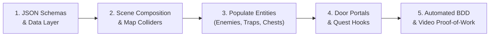

# 12. Complete Dungeon Creation Blueprint & Hands-On Recipe
{: .no_toc }

A step-by-step developer tutorial walking through creating a complete, fully playable custom dungeon from scratch in Godot 4 — from data schemas and map colliders to enemy packs, traps, quests, and automated Cucumber BDD verification.
{: .fs-6 .fw-300 }

<div style="margin: 1.5rem 0;">
  
  <p style="text-align: center; color: #b8860b; font-size: 0.85rem; margin-top: 0.5rem;"><em>Figure 12.1: The 5-Step Game Creation Pipeline — Data Modeling &rarr; Scene Composition &rarr; Party &amp; AI Dynamics &rarr; Combat &amp; Magic &rarr; Automated BDD Verification.</em></p>
</div>

## Table of contents
{: .no_toc .text-delta }

1. TOC
{:toc}

---

## Overview: Building "The Sunken Vault" in 60 Minutes

In this comprehensive hands-on blueprint, we will build a brand new subterranean level: **The Sunken Vault** (`scenes/SunkenVault.tscn`). By the end of this guide, your dungeon will have:
- A 2560×1440 background plate with clamped camera navigation.
- Physical boundary colliders adhering to the Foundation Footprint standard.
- Two-way transition portals connecting to the Village Square.
- An enemy pack of Corrupted Sentries with Infinity Engine proximity aggro and pack rally calls.
- A concealed Poison Dart Trap with DC 13 perception sweeps, disarming, and detonation VFX.
- A quest item chest with lock picking and inventory rewards.
- An automated Cucumber BDD test suite generating 1080p MP4 video proof-of-work.



---

## Step 1: Define Schemas & Data Entries

RobOS strictly enforces zero hardcoding. Before writing any scene or script code, define the new items, monsters, and traps in your data layer.

### 1.1 Custom Monster (`data/v1/monsters.json` or `mods/sunken_vault/monsters.json`)

```json
{
  "monster_id": "corrupted-sentry",
  "name": "Corrupted Sentry",
  "max_hp": 24,
  "ac": 14,
  "str": 15,
  "dex": 12,
  "con": 14,
  "attack_bonus": 4,
  "damage_dice": "1d8+2",
  "damage_type": "slashing",
  "xp_reward": 100,
  "detection_radius": 280.0,
  "pack_assist_radius": 220.0,
  "pack_id": "vault-guards",
  "sprite": "res://assets/sprites/enemies/corrupted_sentry.png"
}
```

### 1.2 Custom Hazard (`data/v1/traps.json`)

```json
{
  "trap_id": "vault-poison-trap",
  "title": "Sunken Vault Poison Jet",
  "type": "floor",
  "detectDC": 13,
  "disarmDC": 14,
  "saveStat": "CON",
  "saveDC": 13,
  "damageMin": 2,
  "damageMax": 12,
  "damageType": "poison",
  "statusEffect": "poisoned",
  "statusDuration": 3
}
```

---

## Step 2: Scene Composition & Map Colliders

Create a new Godot scene: `scenes/SunkenVault.tscn` inheriting from `Node2D`.

### 2.1 Scene Tree Structure

```text
SunkenVault (Node2D, y_sort_enabled = true, script = SunkenVault.gd)
├── BackgroundPlate (TextureRect, texture = sunken_vault_plate.png)
├── WorldColliders (StaticBody2D, collision_layer = 1)
│   ├── OuterWallNorth (CollisionPolygon2D)
│   ├── OuterWallSouth (CollisionPolygon2D)
│   └── PillarColliders (CollisionShape2D, bottom 30% only!)
├── DoorToVillage (Area2D, script = DoorPortal.gd)
│   └── CollisionShape2D
├── YSortEntities (Node2D, y_sort_enabled = true)
│   ├── HeroPlayer (ExtResource HeroPlayer.tscn)
│   ├── CorruptedSentry_1 (ExtResource TacticalEnemy.tscn)
│   ├── CorruptedSentry_2 (ExtResource TacticalEnemy.tscn)
│   ├── VaultPoisonTrap (ExtResource Trap.tscn)
│   └── VaultChest (ExtResource GroundItem.tscn)
├── CanvasLayer (CanvasLayer)
│   ├── PartyHUD (ExtResource PartyHUD.tscn)
│   └── ActionLog (ExtResource ActionLog.tscn)
└── FogOfWar (ExtResource FogOfWar.tscn)
```

### 2.2 Scene Controller Script (`SunkenVault.gd`)

```gdscript
# SunkenVault.gd — Scene Lifecycle & Camera Limits
extends Node2D

func _ready() -> void:
	GameState.current_scene_name = "SunkenVault"
	_setup_camera_bounds()
	_spawn_party_at_entrance()

func _setup_camera_bounds() -> void:
	var camera = find_child("MainCamera", true, false)
	if camera and camera.has_method("set_camera_limits"):
		# Clamp camera to exact 2560x1440 image dimensions
		camera.set_camera_limits(0, 0, 2560, 1440)

func _spawn_party_at_entrance() -> void:
	var hero = find_child("HeroPlayer", true, false)
	if hero:
		hero.global_position = Vector2(280, 720) # Vault entry threshold
```

---

## Step 3: Populate Entities with AI & Hazards

### 3.1 Adding Sentry Enemies with Pack Aggro

Attach the `TacticalEnemy.gd` script to enemy nodes. Configure their exports:
- `is_hostile = true`
- `detection_radius = 280.0`
- `pack_assist_radius = 220.0`
- `pack_id = "vault-guards"`

When the party approaches `CorruptedSentry_1`, it detects them at 280px and calls `_alert_nearby_pack_allies()`, pulling `CorruptedSentry_2` into the fight!

### 3.2 Placing the Concealed Trap

Place an instance of `Trap.tscn` at corridor coordinates `(850, 720)`:
- `trap_id = "vault-poison-trap"`
- `detect_dc = 13`
- `disarm_dc = 14`

The trap starts in the **Concealed** state (`modulate.a = 0.0`). When Rogues sweep Find Traps, it illuminates in red runes. When stepped on, it triggers poison saving throws and completely disappears from the map!

---

## Step 4: Connecting Portals & Quests

Configure the `DoorToVillage` portal:
- `target_scene_path = "res://scenes/VillageSquare.tscn"`
- `target_spawn_position = Vector2(1920, 1100)`
- `required_key_id = ""` (or require `"iron-crypt-key"`)

---

## Step 5: Author Automated Cucumber BDD Tests

Create `tests/e2e/features/normal/15_sunken_vault_exploration.feature`:

```gherkin
Feature: Sunken Vault Exploration, Pack Aggro & Hazard Resolution
  As an adventurer exploring the Sunken Vault
  I want to detect traps, battle coordinated sentry packs, and claim vault loot
  So that dungeon progression is thoroughly verified without manual clicking

  Background:
    Given the cRPG game is running and healthy

  Scenario: Infiltrating the Sunken Vault, bypassing poison jet, and defeating sentries
    Given an isolated test starting in scene "SunkenVault" with party "Lieutenant Vance" the "fighter"
    Then the current scene is "SunkenVault"
    And the scene contains concealed traps
    When the party member steps onto trap "vault-poison-trap"
    Then the trap "vault-poison-trap" is triggered
    And the trap "vault-poison-trap" is no longer appearing on the map
    When the player orders "Lieutenant Vance" to strike enemy "Corrupted Sentry"
    Then enemy "Corrupted Sentry" enters combat state
    And all enemies in pack "vault-guards" rally to attack
    When the tactical battle signals total victory over the sentries
    Then the activity log contains message "VICTORY"
```

Execute the test in headless Xvfb with instant video proof:
```bash
python3 games/crpg-realm/run_cucumber_tests.py games/crpg-realm/tests/e2e/features/normal/15_sunken_vault_exploration.feature
```
