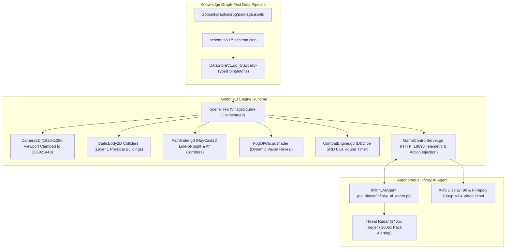
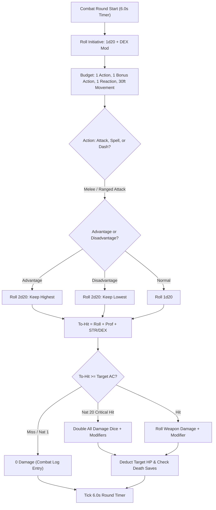
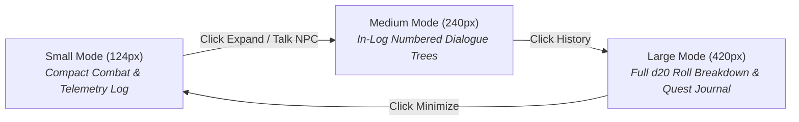
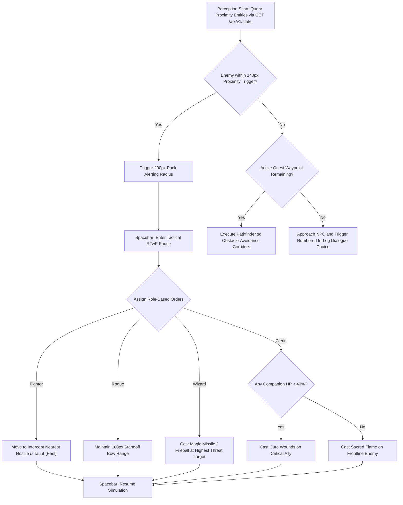
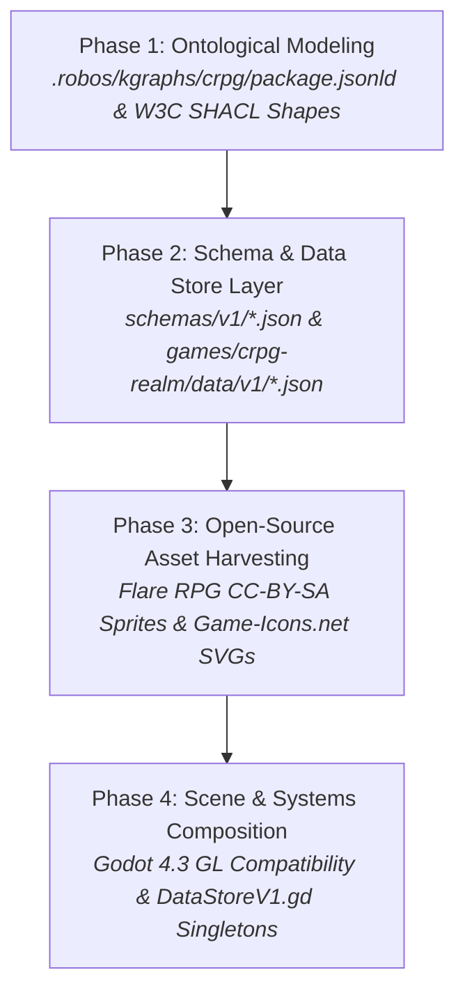

# Tactical cRPG Architecture: D&D 5e SRD & Godot 4 Infinity Engine Codex
{: .no_toc }

The definitive architectural deep-dive into party-based tactical isometric cRPGs for video game nerds and D&D dungeon masters. Covers D&D 5e SRD mathematical action economy, Godot 4.3 GL Compatibility 2.5D isometric rendering, physical collision pathfinding, Flare RPG CC-BY-SA paperdoll asset pipelines, 3-mode expandable Activity Log, and autonomous Infinity AI Agent verification with 1080p video proof-of-work.
{: .fs-6 .fw-300 }

<div style="background: rgba(0, 188, 212, 0.12); border: 1px solid #00bcd4; border-radius: 8px; padding: 14px 20px; margin: 1.5rem 0; display: flex; align-items: center; justify-content: space-between; flex-wrap: wrap; gap: 12px;">
  <div>
    <strong style="color: #38bdf8; font-size: 1.05rem;">📜 Interactive Web Codex Available</strong><br>
    <span style="color: #c9d1d9; font-size: 0.9rem;">Explore this codex directly in your browser with interactive lab checklists, instant quiz checks, and verifiable Knowledge Graph completion certificates.</span>
  </div>
  <a href="/projects/crpg-realm/elearning/" class="btn btn-primary" style="background: #00bcd4; color: #0d1117; font-weight: 700; padding: 8px 18px; border-radius: 6px; text-decoration: none;">Launch Web Codex &rarr;</a>
</div>

## Table of contents
{: .no_toc .text-delta }

1. TOC
{:toc}

---

## 1. Executive Architecture & Engine Topology

The **Tactical cRPG & Infinity AI Engine** (`crpg-realm`) is RobOS's reference implementation of a complete, production-grade video game built from scratch by AI agents adhering to Knowledge Graph-First standards. Inspired by legendary Infinity Engine classics (*Baldur's Gate*, *Icewind Dale*, *Planescape: Torment*), the project combines authentic Real-Time with Pause (RTwP) combat, a 6.0-second combat round timer, multi-branch dialogue, and physical building collision geometry with cutting-edge autonomous AI verification.



<div style="margin: 2rem 0;">
  
  <p style="text-align: center; color: #8b949e; font-size: 0.85rem; margin-top: 0.5rem;"><em>Figure 1: Oakhaven Village Square (2560x1440 pre-rendered plate) featuring 11 physical buildings, stone ramparts, animated NPCs, and the Infinity Engine HUD.</em></p>
</div>

---

## 2. Module 1: D&D 5e Ruleset & Mathematical Action Economy

At the heart of the combat simulation is a strict mathematical implementation of the **D&D 5th Edition System Reference Document (SRD 5.1)** ruleset.



### Mathematical Combat Formulas

1. **Ability Modifier Calculation**:
   $$\text{Modifier} = \left\lfloor \frac{\text{Ability Score} - 10}{2} \right\rfloor$$
   *(e.g., Strength 16 $\rightarrow +3$, Dexterity 14 $\rightarrow +2$, Constitution 8 $\rightarrow -1$)*

2. **Armor Class (AC) Equations**:
   $$\text{Unarmored AC} = 10 + \text{DEX Modifier}$$
   $$\text{Light Armor AC} = \text{Base Armor AC} + \text{DEX Modifier}$$
   $$\text{Medium Armor AC} = \text{Base Armor AC} + \min(\text{DEX Modifier}, 2)$$
   $$\text{Heavy Armor AC} = \text{Base Armor AC}$$
   $$\text{Total AC} = \text{Armor AC} + \text{Shield (+2)} + \text{Magic/Cover Bonuses}$$

3. **d20 Attack Roll Resolution**:
   $$\text{Attack Roll} = 1d20 + \text{Proficiency Bonus} + \text{STR/DEX Modifier} \ge \text{Target AC}$$
   - **Natural 20 (Critical Hit)**: Always hits regardless of AC; doubles all damage dice rolled before adding flat ability modifiers.
   - **Natural 1 (Critical Miss)**: Always misses regardless of modifiers.

4. **Advantage & Disadvantage Probability Shift**:
   When rolling with **Advantage** ($\max(d20_1, d20_2)$), the expected roll increases from $10.50$ to $13.825$ (+3.325 equivalent bonus). When rolling with **Disadvantage** ($\min(d20_1, d20_2)$), the expected roll drops to $7.175$ (-3.325 penalty).

5. **Spell Save DC & Spell Attack Bonus**:
   $$\text{Spell Attack Modifier} = \text{Proficiency Bonus} + \text{Spellcasting Ability Modifier}$$
   $$\text{Spell Save DC} = 8 + \text{Proficiency Bonus} + \text{Spellcasting Ability Modifier}$$

<div style="display: grid; grid-template-columns: repeat(auto-fit, minmax(360px, 1fr)); gap: 1.5rem; margin: 2rem 0;">
  <div>
    
    <p style="text-align: center; color: #8b949e; font-size: 0.85rem; margin-top: 0.5rem;"><em>Figure 2: Complete D&D 5e Character Sheet tracking ability scores, modifiers, AC, saving throws, and status conditions.</em></p>
  </div>
  <div>
    
    <p style="text-align: center; color: #8b949e; font-size: 0.85rem; margin-top: 0.5rem;"><em>Figure 3: Tactical combat battlefield showing active threat aggro indicators, round progress timers, and spell targeting.</em></p>
  </div>
</div>

---

## 3. Module 2: Godot 4.3 Engine Runtime & 2.5D Isometric World

### Why Godot 4.3 GL Compatibility Profile?
The engine uses Godot's **GL Compatibility (OpenGL 3.3 / ES 3.0 / WebGL 2.0)** renderer rather than Vulkan Forward+:
- **Zero Shader Stutter**: OpenGL eliminates the infamous pipeline compilation freeze present in modern Vulkan pipelines.
- **Headless Virtual Framebuffer Stability**: Runs flawlessly inside Docker containers and headless Xvfb displays (`:99`) without requiring expensive hardware GPUs.
- **Cross-Platform Parity**: Identical rendering across Linux, macOS, Windows, and lightweight dev machines.

### 2560×1440 Pre-Rendered Plates & 1920×1080 Viewport Clamping
Maps are constructed using ultra-detailed 2560×1440 pre-rendered background plates (`village_open_world_2560.png`, `Homestead.tscn`, `WhisperingForest.tscn`). The player camera viewport runs at **1920×1080** native resolution, smoothly interpolating and clamping to map boundaries:

```gdscript
# Camera2D Boundary Clamping in Godot 4
func _process(delta: float) -> void:
    if target_hero:
        var target_pos = target_hero.global_position
        global_position = global_position.lerp(target_pos, delta * 5.0)
        global_position.x = clamp(global_position.x, 960, 2560 - 960)
        global_position.y = clamp(global_position.y, 540, 1440 - 540)
```

### 2.5D Isometric World Layers & Y-Sorting
Isometric games render 2D sprites to give the illusion of 3D depth. To ensure characters realistically step behind buildings, trees, and other party members, Godot relies on **Y-Sorting**:
- **`y_sort_enabled = true`**: Nodes placed under a Y-Sort parent have their draw order dynamically sorted by their `global_position.y`. Entities higher on the screen ($y < y_{\text{hero}}$) render behind the hero; entities lower ($y > y_{\text{hero}}$) render in front.
- **Sprite Anchoring**: Isometric building and character sprites set their origin point (pivot) at their physical base (feet/foundation), guaranteeing seamless depth sorting.

### Physical Colliders & The Foundation Footprint Rule
In classical 2.5D isometric RPGs (Baldur's Gate, Pillars of Eternity), buildings are not blocked across their entire visual roof area. Characters must be able to walk *behind* the roof while being blocked by the *foundation*:
- **Foundation Footprints**: Static colliders (`StaticBody2D` + `CollisionShape2D` on Layer 1) cover only the bottom 25–35% of the building sprite where the walls meet the ground.
- **Occlusion Transparency**: When the player walks behind upper walls or eaves, an `Area2D` triggers a tween lowering the roof opacity to `0.4` so party members remain visible.
- **Corridor Clearance**: Walkways between structures must maintain a minimum clear width of 48–64 pixels to allow 4-character party formations to navigate without jamming.

### Pathfinding & Click-to-Move
Player navigation uses `Pathfinder.gd` combining RayCast line-of-sight checks with `NavigationServer2D`:
- Direct line-of-sight clicks generate a straight-line vector.
- Obstructed paths query the navigation polygon mesh, routing around building foundation colliders.

<div style="display: grid; grid-template-columns: repeat(auto-fit, minmax(360px, 1fr)); gap: 1.5rem; margin: 2rem 0;">
  <div>
    
    <p style="text-align: center; color: #8b949e; font-size: 0.85rem; margin-top: 0.5rem;"><em>Figure 4: Physical house footprints blocking movement; party routes through safe street corridors.</em></p>
  </div>
  <div>
    
    <p style="text-align: center; color: #8b949e; font-size: 0.85rem; margin-top: 0.5rem;"><em>Figure 5: Custom dynamic Fog of War shader revealing shrouded terrain as heroes advance.</em></p>
  </div>
</div>

---

## 4. Module 3: Open-Source Asset Harvesting & Infinity Engine HUD Replica

### 100% Genuine Open-Source Creative Commons Pipeline
No copyrighted Bioware or Wizards of the Coast assets are used. RobOS sources all visual assets from:
1. **Flare RPG (`flareteam/flare-game`)**: CC-BY-SA 3.0 animated 8-directional isometric characters (walk, attack, take damage, death animations) and modular paperdoll items (armor, robes, swords, shields, bows).
2. **Game-Icons.net**: Over 4,000 CC-BY 3.0 vector SVG icons for abilities, spellbooks, inventory, and status buffs.
3. **OpenGameArt.org**: CC0/CC-BY sound effects for sword impacts, spell chanting, and UI clicks.

### Three-Mode Expandable Activity Log
The game replicates the iconic Infinity Engine console at the bottom of the screen with three reactive expansion tiers:



Dialogue choices are presented directly inside the activity log, allowing keyboard selection (`1`–`9`) or direct mouse clicks without intrusive full-screen popups:

<div style="margin: 2rem 0;">
  
  <p style="text-align: center; color: #8b949e; font-size: 0.85rem; margin-top: 0.5rem;"><em>Figure 6: Multi-branch dialogue with Blacksmith Brand inside the 240px Activity Log showing numbered options and NPC facing.</em></p>
</div>

---

## 5. Module 4: Autonomous Infinity AI Agent & Headless BDD Verification

### The Infinity AI Agent (`qa_player/infinity_ai_agent.py`)
Rather than relying on human clickers or brittle hardcoded input recordings, RobOS features an **autonomous decision-making agent** capable of playing through the entire 5-Act campaign from character creation to defeating Captain Malakor.



<div style="display: grid; grid-template-columns: repeat(auto-fit, minmax(360px, 1fr)); gap: 1.5rem; margin: 2rem 0;">
  <div>
    
    <p style="text-align: center; color: #8b949e; font-size: 0.85rem; margin-top: 0.5rem;"><em>Figure 7: BDD scenario verifying enemy pack aggro alerting and frontline fighter peeling.</em></p>
  </div>
  <div>
    
    <p style="text-align: center; color: #8b949e; font-size: 0.85rem; margin-top: 0.5rem;"><em>Figure 8: Autonomous campaign completion reached with 100% test pass rate across 482 steps.</em></p>
  </div>
</div>

---

## 6. Module 5: Knowledge Graph-First Game Architecture (`.robos/kgraphs/crpg`)

### The 4-Phase Generation Pipeline



<div style="margin: 2rem 0;">
  
  <p style="text-align: center; color: #8b949e; font-size: 0.85rem; margin-top: 0.5rem;"><em>Figure 9: The 4-Phase RobOS Knowledge Graph-First Game Generation Paradigm.</em></p>
</div>

### Strict Zero-Hardcoding Rule
In RobOS, no game stats, monster health values, spell formulas, or dialogue trees may be hardcoded into engine scripts. Everything is defined in `.robos/kgraphs/crpg/package.jsonld` and JSON Schemas under `schemas/v1/`, which compile directly to typed GDScript singletons under `src/generated/v1/DataStoreV1.gd`:

```gdscript
# Auto-generated statically-typed DataStoreV1.gd
class_name DataStoreV1
extends Node

static func get_class_data(class_id: String) -> Dictionary:
    match class_id:
        "fighter":
            return {
                "hit_die": 10,
                "primary_ability": "STR",
                "saving_throws": ["STR", "CON"],
                "base_hp": 12
            }
        "wizard":
            return {
                "hit_die": 6,
                "primary_ability": "INT",
                "saving_throws": ["INT", "WIS"],
                "base_hp": 7
            }
    return {}
```

---

## 7. Interactive Hands-On Labs & Certification

You can launch and complete this full course interactively inside the **RobOS eLearning Hub** or online via GitHub Pages:

- 🌐 **Interactive Web Edition**: [www.rowbose.com/projects/crpg-realm/elearning/](https://www.rowbose.com/projects/crpg-realm/elearning/)
- 🖥️ **Desktop Player**:
```bash
# Launch central eLearning player loaded to the cRPG Codex
electron packages/robos-elearning --course=robos-crpg

# Or launch the dedicated standalone desktop app
electron packages/robos-crpg-elearning
```

Upon completing all 5 module labs and passing each module's knowledge check with $\ge 80\%$, the system automatically issues a cryptographically verified **RobOS Knowledge Graph Certificate of Completion** conforming to `schema:EducationalOccupationalCredential`.
