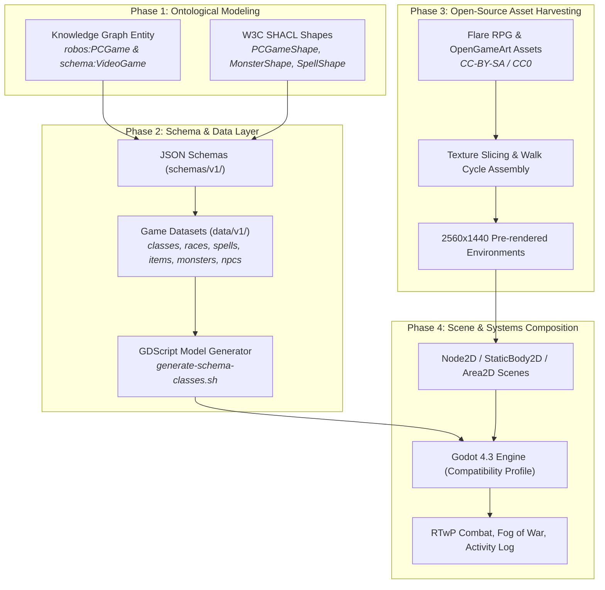

# Autonomous Game Creation Process & Architecture
{: .no_toc }

A technical guide explaining how RobOS autonomously models, scaffolds, ingests assets, and generates a complete tactical cRPG using Godot 4.3 and Knowledge Graph-First standards.
{: .fs-6 .fw-300 }

## Table of contents
{: .no_toc .text-delta }

1. TOC
{:toc}

---

## 1. The RobOS Game Generation Paradigm

Creating a complex video game from scratch is notoriously prone to hallucination, spaghetti code, and asset mismatches when driven by raw LLM prompts. **RobOS replaces naive prompting with a 4-phase Knowledge Graph-First generation pipeline**:



---

## 2. Ontological Modeling in the SDLC Knowledge Graph

Every game built in RobOS begins as a formal node in the **Modular SDLC Knowledge Graph** (`.robos/kgraphs/crpg/package.jsonld` and aggregated `.robos/knowledge-graph.jsonld`). 

The cRPG game conforms to `urn:robos:shape:PCGameShape` and integrates standards from Schema.org (`schema:VideoGame`), OASIS OSLC Architecture Management (`oslc_am:Resource`), and C4 Model (`c4:Container`):

```json
{
  "@id": "urn:robos:crpg:pc-game:tactical-crpg-realm",
  "@type": [
    "robos:PCGame",
    "schema:VideoGame",
    "oslc_am:Resource",
    "c4:Container"
  ],
  "dcterms:title": "Tactical cRPG Realm & Infinity AI Engine",
  "dcterms:description": "Party-based tactical isometric cRPG in Godot 4 with D&D 5e SRD rules, RTwP combat, and autonomous BDD verification.",
  "robos:repository": "github.com/nddipiazza/robos",
  "robos:technology": "Godot 4.3 / GDScript / Python 3.12 behave",
  "robos:gameEngine": "Godot",
  "robos:targetPlatform": ["Linux", "Windows", "macOS"],
  "robos:graphicsApi": "OpenGL Compatibility",
  "schema:gamePlatform": "PC",
  "schema:playMode": "SinglePlayer",
  "robos:hasGameData": [
    "urn:robos:crpg:dataset:classes",
    "urn:robos:crpg:dataset:races",
    "urn:robos:crpg:dataset:spells",
    "urn:robos:crpg:dataset:items",
    "urn:robos:crpg:dataset:monsters",
    "urn:robos:crpg:dataset:npcs",
    "urn:robos:crpg:dataset:dialogue"
  ]
}
```

---

## 3. Schema-First Data Pipeline & Code Generation

RobOS prohibits hardcoding stats, spells, monsters, or dialogue inside script logic. All game balance is defined in strictly validated JSON files under `games/crpg-realm/data/v1/`:

| Dataset | Schema Location | Description |
|:---|:---|:---|
| `classes.json` | `schemas/v1/classes.schema.json` | Fighter, Wizard, Cleric, Rogue hit dice, armor/weapon proficiencies, spell slots. |
| `races.json` | `schemas/v1/races.schema.json` | Human, Elf, Dwarf, Halfling ability score bonuses, base speeds, traits. |
| `spells.json` | `schemas/v1/spells.schema.json` | Magic Missile, Cure Wounds, Shield, Fireball targeting, damage dice, saving throws. |
| `items.json` | `schemas/v1/items.schema.json` | Weapons, armor, consumables, keys, values, and stat modifiers. |
| `monsters.json` | `schemas/v1/monsters.schema.json` | Shadow Hound, Corrupted Sentry, Skeleton Archer, Captain Malakor stats & actions. |
| `npcs.json` | `schemas/v1/npcs.schema.json` | 18 Realm NPCs, sprite assignments, and dialogue tree links. |
| `dialogue.json` | `schemas/v1/dialogue.schema.json` | Multi-node branching dialogue trees, quest triggers, and item rewards. |

### Generated GDScript Data Store (`DataStoreV1.gd`)
The build process compiles these schemas into typed GDScript singletons under `src/generated/v1/DataStoreV1.gd`, ensuring 100% type safety and zero runtime KeyError crashes.

---

## 4. Open-Source Asset Harvesting & Pipeline

To avoid placeholder art and copyright violations, RobOS ingests authentic open-source creative assets from **Flare RPG** and **OpenGameArt** (licensed under CC-BY-SA 3.0 and CC0):

<div style="display: grid; grid-template-columns: repeat(auto-fit, minmax(320px, 1fr)); gap: 1rem; margin: 1.5rem 0;">
  <div>
    
    <p style="text-align: center; color: #8b949e; font-size: 0.85rem; margin-top: 0.5rem;"><em>Figure 1: Tactical combat arena showing open-source character sprites, directional facing, and circle selection rings.</em></p>
  </div>
  <div>
    
    <p style="text-align: center; color: #8b949e; font-size: 0.85rem; margin-top: 0.5rem;"><em>Figure 2: Elf Wizard Aeloria casting Magic Missile with pre-rendered open world backdrop and Fog of War.</em></p>
  </div>
</div>

### Asset Processing Steps:
1. **Isometric Building Structures**: Sliced from Flare tilesets into standalone PNGs (`building_inn.png`, `building_blacksmith.png`, `building_apothecary.png`, `building_townhall.png`, `building_cottage1.png`, `stone_arch_gate.png`, `stone_wall_section.png`).
2. **Animated Walk Cycles**: Sliced 4-frame directional walk animations (`_walk_0.png` through `_walk_3.png`) and idle stances for all heroes and NPCs.
3. **Pre-rendered 2560×1440 Environments**: Generated high-resolution backgrounds with realistic depth, dirt trails, waterways, stone crypts, and manor interiors.
4. **Icons & Portals**: 48×48 authentic potion, weapon, armor, and spell scroll icons integrated into inventory grids.

---

## 5. Scene Architecture in Godot 4.3

The scene tree uses Godot's built-in 2D engine with `y_sort_enabled = true` on the root map node, ensuring heroes, NPCs, monsters, and structures render in accurate perspective depth:

```
VillageSquare (Node2D, y_sort_enabled = true)
├── Ground (TextureRect, 2560x1440, mouse_filter = MOUSE_FILTER_IGNORE)
├── VillageBoundaries (StaticBody2D - Outer boundary colliders)
├── HouseInn (StaticBody2D, layer 1)
│   ├── Sprite (Sprite2D)
│   └── CollisionShape2D (RectangleShape2D 400x160)
├── GarrisonGate (Area2D, DoorPortal.gd)
│   ├── Sprite (Sprite2D)
│   ├── CollisionShape2D (RectangleShape2D 90x90)
│   └── Label (Label)
├── GroundItem_Potion (Area2D, GroundItem.gd)
├── BlacksmithBrand (Area2D, ClickableObject.gd)
├── HeroPlayer (CharacterBody2D, HeroPlayer.gd)
│   ├── Sprite (Sprite2D)
│   ├── Camera2D (1920x1080 viewport, limits 0,0,2560,1440)
│   └── PathVisualizer (Node2D, waypoint trail rendering)
├── FogOfWar (SubViewportContainer, fog_of_war.gdshader)
└── CanvasLayer (UI Layer)
    ├── PartyHUD (PartyHUD.gd)
    ├── ActionLog (ActionLog.gd, 3-mode console)
    └── SettingsModal (SettingsModal.gd)
```

<div style="display: grid; grid-template-columns: repeat(auto-fit, minmax(320px, 1fr)); gap: 1rem; margin: 1.5rem 0;">
  <div>
    
    <p style="text-align: center; color: #8b949e; font-size: 0.85rem; margin-top: 0.5rem;"><em>Figure 3: Dwarf Cleric Thrumbar executing divine healing and warhammer combat.</em></p>
  </div>
  <div>
    
    <p style="text-align: center; color: #8b949e; font-size: 0.85rem; margin-top: 0.5rem;"><em>Figure 4: Halfling Rogue Bramble engaging corrupted sentries with ranged hunting bow tactics.</em></p>
  </div>
</div>
