# Infinity AI Engine & BDD Verification Harness
{: .no_toc }

An in-depth analysis of RobOS's autonomous game-playing agent, spatial threat radar, Real-Time with Pause decision tree, and headless video proof-of-work test runner.
{: .fs-6 .fw-300 }

## Table of contents
{: .no_toc .text-delta }

1. TOC
{:toc}

---

## 1. Why Traditional Game Testing Fails

Video games represent the most complex frontier in automated testing:
- **Spatial Interactions**: A hero must physically route around buildings, doors, and fences rather than clicking through them.
- **Dynamic Timing & Aggro**: Hostile enemies detect proximity, alert nearby allies, and peel off toward vulnerable companions.
- **Visual Feedback**: Unit tests cannot verify if a dialogue box obscured an action button or if a sprite rendered behind a wall.
- **Manual QA Burnout**: Human testers spend hundreds of hours replaying early levels to verify late-game changes.

**RobOS solves this with the Infinity AI Engine**: an autonomous QA agent that perceives the game world in real-time, plans tactical maneuvers, and plays through full campaigns while recording 1080p video proof-of-work.

---

## 2. The Dual-Suite Architecture

To balance rapid developer iteration with realistic gameplay verification, RobOS separates tests into two distinct suites:

```mermaid
graph TD
    subgraph "Normal Isolated Tests (11 Features / 330 Steps)"
        ISO_RUN["Run: python3 run_cucumber_tests.py --normal"]
        STATE_INJ["State Injection<br/><i>Given the heroes have state 'village square'</i>"]
        SPLASH["Feature Splash Banner Displayed"]
        FOCUSED["Targeted Verification<br/><i>Trading, Fog of War, Aggro Peeling, Defeat Recovery</i>"]
    end

    subgraph "Playthrough Scenarios (6 Features / 152 Steps)"
        FULL_RUN["Run: python3 run_cucumber_tests.py --playthrough"]
        SCENARIO["Play isolated game scenarios from start to finish as a player would"]
        SEQUENCE["When used in sequence, they complete the entire game"]
        CHAR_CREAT["Class Journeys (Human, Elf, Dwarf, Halfling)"]
        QUESTING["Point A to Point B Autonomous Questing"]
        EPIC["Expanded Epic Campaign Journey"]
    end

    ISO_RUN --> STATE_INJ --> SPLASH --> FOCUSED
    FULL_RUN --> SCENARIO --> SEQUENCE --> CHAR_CREAT --> QUESTING --> EPIC
```



---

## 3. The Infinity AI Agent Architecture

The AI agent (`qa_player/infinity_ai_agent.py`) operates as a top-level decision engine orchestrating high-level tactical choices:

<div style="margin: 1.5rem 0;">
  
  <p style="text-align: center; color: #8b949e; font-size: 0.85rem; margin-top: 0.5rem;"><em>Figure 1: Isolated E2E scenario testing enemy pack proximity aggro, ally alerting, and frontline tank peeling.</em></p>
</div>

### Core Decision Systems:
1. **Spatial Threat Radar**: Queries active scene nodes within perception range (140px proximity trigger). When a hostile enters range, the AI assesses threat levels and alerts companion actors.
2. **Pack Alerting & Aggro Mechanics**: When an enemy is struck, all pack allies within 200px instantly enter combat mode and engage the attacker.
3. **Combined-Arms Combat Logic**:
   - **Fighters**: Issue move orders to intercept hostiles, taunting enemies to peel them off vulnerable party members.
   - **Rogues**: Maintain standoff distance using bows; switch targets if threatened in melee.
   - **Wizards**: Prepare and launch *Magic Missile* or *Arcane Blast* spells targeting high-HP threats.
   - **Clerics**: Monitor party health thresholds, casting *Cure Wounds* when any companion drops below 40% HP.

<div style="display: grid; grid-template-columns: repeat(auto-fit, minmax(360px, 1fr)); gap: 1rem; margin: 1.5rem 0;">
  <div>
    
    <p style="text-align: center; color: #8b949e; font-size: 0.85rem; margin-top: 0.5rem;"><em>Figure 2: Full party defeat screen testing death state handling, red portrait indicators, and clean state retry.</em></p>
  </div>
  <div>
    
    <p style="text-align: center; color: #8b949e; font-size: 0.85rem; margin-top: 0.5rem;"><em>Figure 3: Post-combat corpse searching verifying inventory accumulation and gold increment assertions.</em></p>
  </div>
</div>

---

## 4. In-Game IPC Bridge: `GameControlServer.gd`

The game engine embeds a lightweight HTTP REST server (`scripts/GameControlServer.gd`) listening on `http://127.0.0.1:18090`:

### Key Endpoints:
- **`GET /state`**: Returns complete game state (party members, HP, AC, inventory, quest stage, flags, combat status).
- **`GET /screen_state`**: Dumps all interactive nodes, buttons, NPCs, doors, and enemies with screen coordinates.
- **`POST /action`**: Dispatches high-level actions (`talk_npc`, `pickup_item`, `enter_door`, `handle_encounters`, `move_to`).
- **`POST /setup_state`**: Injects initial presets for isolated testing (`village square`, `forest wilderness`, `catacombs crypt`, `garrison keep`).

### Real Human Mouse Movement Simulation (`QAOverlay.gd`)
To ensure genuine UI fidelity, the server does not simulate fake memory state. Instead, it dispatches events to `QAOverlay.gd`, which renders an animated virtual cursor using cubic bezier curves, click ripple effects, and visual log toasts.

---

## 5. Declarative Cucumber Step Reference

Developers and agents author tests using high-level, human-readable Gherkin steps:

```gherkin
Scenario: Autonomous Infinity AI Agent Vanquishes Malakor in Epic Campaign
  When the infinity ai agent creates a character with race "human" and class "fighter" named "Sir Donald"
  And the current scene is "Homestead"
  And the infinity ai agent quests through Homestead from awakening to the village portal
  And the current scene is "VillageSquare"
  And the infinity ai engine handles the enemy encounters as they come
  And the infinity ai agent talks to NPC "npc-id-1"
  And the infinity ai agent picks up item "item-id-1"
  And the infinity ai agent moves to the door "door-id-1"
  And the infinity ai agent enters door "door-id-1"
  And the current scene is "GarrisonKeep"
  And the infinity ai agent infiltrates the Garrison Keep and defeats Captain Malakor
  Then the victory screen is visible
```

<div style="margin: 1.5rem 0;">
  
  <p style="text-align: center; color: #8b949e; font-size: 0.85rem; margin-top: 0.5rem;"><em>Figure 4: Citadel Keep showdown: Captain Malakor is vanquished by combined-arms party tactics, triggering quest completion.</em></p>
</div>

---

## 6. Headless Containerized Execution & Video Proof

When executed in CI/CD or headless environments:
1. `Xvfb` boots a virtual 1920×1080 display on `:99`.
2. Godot 4.3 launches in headed mode attached to `:99`.
3. `FFmpeg` records the entire scenario at 30fps H.264.
4. If a scenario fails, an interactive HTML report embeds the video recording, exact Gherkin failure step, and complete GameState JSON dump.
