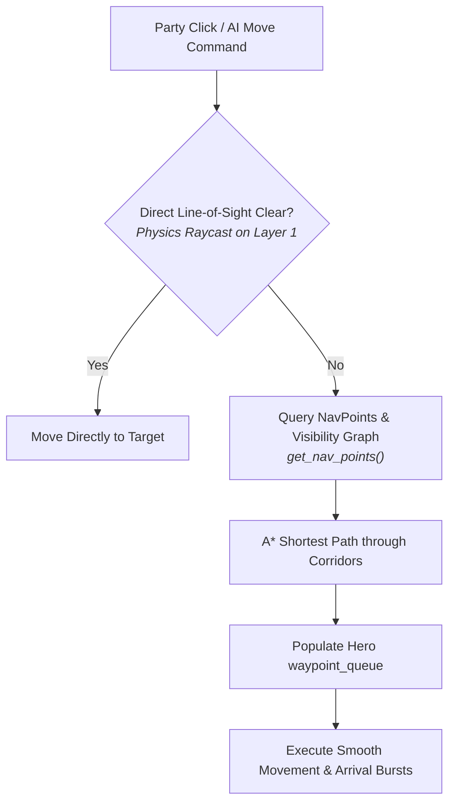

# World Systems, Collision Pathfinding & NPC Dialogue
{: .no_toc }

Deep dive into physical obstacle colliders, navigation pathfinding around buildings, multi-branch dialogue trees, and dynamic Fog of War shaders.
{: .fs-6 .fw-300 }

## Table of contents
{: .no_toc .text-delta }

1. TOC
{:toc}

---

## 1. Physical Buildings & Collision Geometry

In earlier 2D RPG implementations, buildings were often simple background drawings where players could walk through walls or clip into rooftops. In **Tactical cRPG Realm**, every structure is a genuine physical entity with collision boundaries on Layer 1:

  
  
<em>Figure 1: Party navigating through safe street corridors between Farmer Giles' Cottage, Miller Hob's post, and stone ramparts with waypoint line telemetry.</em>

### Building Structures in Oakhaven Village (2560×1440 Pre-Rendered Plate):
- **`The Rusty Dragon Inn` (`HouseInn`, `door-id-inn`)**: `360×180` two-story Tudor timber tavern footprint at `Vector2(410, 640)`.
- **`Oakhaven Town Hall & Guildhouse` (`HouseTownHall`, `door-id-townhall`)**: `320×260` stone clock-tower civic hall at `Vector2(1090, 330)`.
- **`Brand's Forge & Armory` (`HouseBlacksmith`, `door-id-blacksmith`)**: `220×140` stone forge with outdoor glowing furnace & anvil at `Vector2(1520, 460)`.
- **`Maybelle's Remedies & Garden` (`HouseApothecary`, `door-id-apothecary`)**: `280×140` thatched apothecary with flower garden fence at `Vector2(1810, 600)`.
- **`Farmer Giles' Thatched Cottage` (`HouseCottage`, `door-id-farmhouse`)**: `240×190` rustic farm cottage at `Vector2(140, 1120)`.
- **`Elder Martha's Cottage` (`HouseElderCottage`, `door-id-elder`)**: `280×180` thatched cottage at `Vector2(670, 1340)`.
- **`Royal Guard Barracks` (`HouseBarracks`, `door-id-barracks`)**: `340×220` garrison quarters at `Vector2(1620, 1250)`.
- **`Ranger Kaelen's Lodge` (`HouseRangerLodge`, `door-id-ranger`)**: `320×200` woodland outpost lodge at `Vector2(1990, 990)`.
- **`Sister Althea's Shrine of Light` (`HouseShrine`, `door-id-shrine`)**: `240×200` stone chapel with stained-glass rose window at `Vector2(2310, 340)`.
- **`Miller Hob's Windmill & Granary` (`HouseMill`, `door-id-mill`)**: Hilltop windmill and granary silo at `Vector2(2330, 130)`.
- **`Royal Garrison Gate & Northern Ramparts` (`GarrisonGate`, `door-id-1`)**: Massive stone gatehouse with iron portcullis at `Vector2(1280, 220)`.
- **`Central Fountain & Market Plaza`**: Stone fountain pool (`radius 50.0` at `Vector2(1150, 660)`) flanked by 5 active market stalls.

All structures use `StaticBody2D` with `collision_layer = 1` and `collision_mask = 1`, physically blocking character movement vectors.

---

## 2. Obstacle-Avoidance Pathfinding (`Pathfinder.gd`)

To prevent party members from getting stuck against solid walls, the navigation system employs a dual-tier pathfinding algorithm:

### Safe Village Corridor Waypoints
`VillageSquare.gd:get_nav_points()` provides guaranteed traversable waypoints through the town:
- **Southern Plaza Trail**: `(240, 1210)` through `(1280, 1180)` connecting cottages and southern gate
- **Central Thoroughfare & Fountain Ring**: `(950, 660)` to `(1280, 850)` circling the fountain and market stalls
- **West Tavern / Inn Approach**: `(470, 750)` to `(750, 750)`
- **Apothecary & Eastern Road**: `(1450, 820)` through `(2420, 780)` to Whispering Forest
- **Citadel Ramparts & Garrison Gate**: `(1280, 480)` to `(1280, 240)`

When the player or AI issues a movement order across town, `Pathfinder.gd` calculates intermediate waypoints avoiding all house bounding boxes.

---

## 3. 18-NPC Roster & Branching Dialogue Trees

The realm features 18 fully scripted NPCs with branching dialogue trees defined in `data/v1/dialogue.json`:

| NPC ID | Name | Role / Location | Key Interaction & Lore |
|:---|:---|:---|:---|
| `npc-id-1` | Blacksmith Brand | Village Forge | Provides the side-gate key unlocking the citadel keep. |
| `npc-id-innkeeper` | Barkeep Corwin | The Rusty Dragon | Shares rumors of corrupted hounds and shadows. |
| `npc-id-guildmaster` | Guildmaster Aldous | Town Hall | Represents the merchant guild; updates quest objectives. |
| `npc-id-herbalist` | Maybelle | Apothecary | Sells healing draughts and antidote poultices. |
| `npc-id-guard` | Captain Kenneth | Village Ramparts | Warns travelers of closed northern passes. |
| `npc-id-farmer` | Farmer Giles | South Farm | Reports strange howling in the night. |
| `npc-id-priestess` | Sister Althea | Shrine of Light | Offers blessings and divine lore. |
| `npc-id-peddler` | Goblin Sneak | Whispering Forest | Sells rare contraband and lockpicks in the woods. |
| `npc-id-fallen` | Torin | Forest Ruins | Dying adventurer warning of the crypt's guardian. |
| `npc-id-hermit` | Hermit Odo | Forest Clearing | Ancient scholar possessing knowledge of Malakor's curse. |
| `npc-id-crypt-ghost` | Sir Justin | Ancient Catacombs | Ghost of the royal knight guarding the sarcophagus key. |

  
  
<em>Figure 2: In-log dialogue tree with numbered responses, journal quest updates, and auto-facing.</em>

### Dynamic NPC Facing Behavior
When the hero approaches and clicks an NPC, `NPCCharacter.set_conversing()` dynamically flips the NPC's sprite (`sprite.flip_h = hero.global_position.x > npc.global_position.x`) so characters face each other naturally during dialogue.

---

## 4. Dynamic Fog of War Shader (`fog_of_war.gdshader`)

Unexplored areas of the map are shrouded in darkness using a hardware-accelerated canvas item shader:

  

    
    
<em>Figure 3: Fog of War revealing terrain around the party hero and companion light sources.</em>

  

  

    
    
<em>Figure 4: Shopkeeper economy window with dual party/merchant inventory grids and gold balances.</em>

  

### Shader Characteristics:
- **Radial Sight Mask**: Each registered party member and light source punches a smooth circular gradient through the darkness texture.
- **Ambient Darkness**: Unrevealed areas remain darkened (`rgba(0.02, 0.03, 0.05, 0.94)`), hiding ambush monsters and loot chests until approached.
- **Persistent Exploration**: Revealed terrain remains dimly visible on the minimap while hiding dynamic monster movements outside line-of-sight.

---

## 5. Interactive Pickups & Doorway Portals

- **`GroundItem.gd`**: Ground items (`item-id-1`, `item-id-scroll`, `item-id-iron-sword`) feature pulsing hover circles and floating titles. Approaching within range adds the item to the party inventory, updates the Activity Log, and emits arrival particle effects.
- **`DoorPortal.gd`**: Doorways (`door-id-1`, `door-id-forest`, `door-id-inn`) verify lock conditions against party inventory (`garrison-key`). When unlocked, they transition the scene and position heroes at designated entry coordinates (`target_spawn`).

  
  
<em>Figure 5: The climax of the epic campaign: Captain Malakor is vanquished, the crypt is sealed, and the realm is saved.</em>

