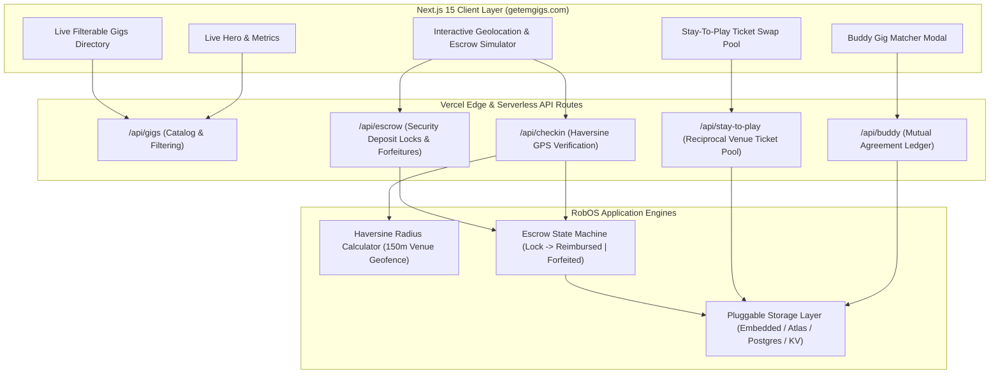

# The Gig Bandit & Get 'Em Gigs (`getemgigs.com`)
{: .no_toc }

A game-changing web platform for the local music scene powered by reciprocal attendance contracts, geolocation-verified security deposit escrow, and Stay-To-Play venue economics.
{: .fs-6 .fw-300 }

## Table of contents
{: .no_toc .text-delta }

1. TOC
{:toc}

---

## Executive Summary

The **Gig Bandit** (`getemgigs.com`) is a production-grade RobOS web application engineered to solve the two deepest systemic crises plaguing the local independent music scene:
1. **Empty Rooms and Flaked Commitments**: Local bands constantly struggle to draw attendees. Friends and fellow musicians promise to attend, only to bail at the last minute.
2. **Predatory Pay-To-Play Models**: Unscrupulous venues exploit indie bands by forcing them to pre-purchase tickets to their own gig and resell them, shifting all financial risk onto emerging artists.

**The Gig Bandit replaces blind trust and predatory booking with game-theory incentives, automated escrow, and cryptographic geolocation verification.**

  <h3 style="margin-top: 0; color: #58a6ff;">🚀 Live Production Deployment</h3>
  

    <strong>Production Domain:</strong> <a href="https://getemgigs.com" target="_blank" rel="noopener noreferrer">https://getemgigs.com</a> 
    <strong>Vercel 1-Click Template:</strong> <a href="https://vercel.com/new/clone?repository-url=https%3A%2F%2Fgithub.com%2Fnddipiazza%2Fgetemgigs" target="_blank" rel="noopener noreferrer">Deploy with Vercel</a> 
    <strong>GitHub Repository:</strong> <a href="https://github.com/nddipiazza/getemgigs" target="_blank" rel="noopener noreferrer">github.com/nddipiazza/getemgigs</a> 
    <strong>SDLC Knowledge Graph Node:</strong> <code>urn:robos:app:getemgigs</code> conforming to <code>schema:WebApplication</code> &amp; <code>robos:FrontEndApp</code>
  

---

## Project Specification & Architecture

| **Category** | **Implementation Details** |
|:---|:---|
| **Framework** | Next.js 15 (App Router, Server Components, Edge & Serverless API Routes) |
| **User Interface** | React 19, TailwindCSS, Dark Neon Aesthetic, Lucide-style SVG graphics |
| **Hosting & CDN** | Vercel Edge Network with Automated Global Anycast DNS (`getemgigs.com`) |
| **Verification Engine** | Haversine Great-Circle Geofencing (Strict 150m venue radius boundary) |
| **Escrow Engine** | Multi-party refundable security deposit lock (`$25`–`$100`), automated next-day payout |
| **Data Persistence** | Zero-config embedded JSON/Memory store + pluggable MongoDB Atlas / Vercel KV / Postgres |
| **CI/CD Pipeline** | GitHub Actions (`.github/workflows/ci.yml`) with automated build, test, and Vercel CD |
| **Testing Harness** | Native Node.js Test Runner: 3 Suites, 6 Tests (100% Passed) |

---

## 1. The Buddy Gig Feature (Beta)

### “You scratch my back, I’ll scratch yours.”

Local bands constantly struggle to get people to attend their shows. They don't have massive social followings yet, they are works in progress, and building an audience is hard.

The **Buddy Gig** feature allows two groups to link their gigs together. Each group agrees to attend the other group's gig:
> *"I'll go to your gig if you go to my gig."*

```mermaid
sequenceDiagram
    autonumber
    actor BandA as Group A (e.g. The Neon Vipers)
    actor BandB as Group B (e.g. Velvet Riot)
    participant Platform as The Gig Bandit (getemgigs.com)
    participant Escrow as Escrow Smart Ledger
    participant GPS as Geolocation Verification (150m)

    BandA->>Platform: Register Gig (Oct 2, The Subterranean Lounge)
    BandB->>Platform: Register Gig (Oct 10, The Subterranean Lounge)
    BandA->>BandB: Send Buddy Gig Request ("You scratch my back, I'll scratch yours")
    BandB->>Platform: Accept Buddy Gig Request
    BandA->>Escrow: Lock $50 Refundable Security Deposit
    BandB->>Escrow: Lock $50 Refundable Security Deposit
    Note over Escrow: Status: ESCROW_LOCKED ($100 Total)

    rect rgb(20, 30, 50)
        Note over BandB,GPS: GIG 1 DAY (Oct 2): Does Velvet Riot Attend?
        alt Velvet Riot Attends Show
            BandB->>GPS: Check-In via Mobile Browser (GPS Fix)
            GPS->>Platform: Coordinate Verified: 24m from Venue (<= 150m)
            Platform->>Escrow: Unlock $50 Deposit -> REIMBURSED to Velvet Riot
            Platform->>BandB: Reputation Score +2
            Note over BandA: WIN: The Neon Vipers got a packed crowd!
        else Velvet Riot Bails (No-Show)
            Note over Platform: 6:00 AM Next Morning Reconciliation
            Platform->>Escrow: Forfeit Velvet Riot's $50 Deposit
            Escrow->>BandA: Transfer $50 Payout to The Neon Vipers
            Platform->>BandB: Reputation Score -8 (Bailed)
            Note over BandA: WIN: The Neon Vipers received $50 compensation!
        end
    end
```

### The Security Deposit Escrow: Eliminating the Bail Factor
If you think through mutual attendance agreements, the fatal flaw is obvious: **How do you keep a band from bailing and flaking out?**

The Gig Bandit solves this with an escrow gate:
1. Upon buddying a gig, each group provides a **refundable security deposit** (`$25`–`$100`).
2. The funds are held in secure escrow.
3. When the gig occurs:
   - **If Yes (Attended)**: The app registers them using Geolocation within a 150-meter radius, and the security deposit is **instantly reimbursed**.
   - **If Not (Bailed)**: At 6:00 AM the following morning, the escrow transfers the security deposit directly to the host band whose show was bailed on!
4. **Guaranteed Win-Win**: Either the host band got attendees at their show, or they got paid!

---

## 2. The Venue Stay-To-Play Feature (Beta)

### Abolishing Predatory "Pay-to-Play"

Anyone who has ever played in a band knows traditional **pay-to-play** is an exploitative nightmare. Venues guarantee they make money by pre-selling 30–50 tickets to the performing band. If the band can't sell them, the band is forced to pay out-of-pocket for their own performance.

**The Gig Bandit introduces the "Stay-to-Play" model:**
- Instead of forcing bands to sell tickets to their own gig, bands purchase a small ticket allotment (e.g. 4 tickets at `$12`) to **another gig at the same venue** and attend it!
- Instead of paying to play at your own gig which is ridiculous, you pay to attend another band's gig—which is awesome, builds scene solidarity, and is something artists should be doing anyway!
- Venues still guarantee bar and door revenue, but bands are invested in the mutual success of other acts rather than competing against them.

```mermaid
flowchart TD
    subgraph OLD_PAY_TO_PLAY ["Traditional Predatory Pay-To-Play"]
        V1["Venue Pre-sells 30 Tickets to Band ($360)"] --> B1["Band Begs Friends / Family to Buy Tickets"]
        B1 --> F1["Unsold Tickets Paid Out of Band's Pocket"]
        F1 --> R1["Result: Band Broke, Room Half-Empty, Resentment High"]
    end

    subgraph NEW_STAY_TO_PLAY ["The Gig Bandit: Stay-To-Play Model"]
        V2["Venue Partners with Stay-To-Play Network"] --> B2["Band Buys 4 Tickets ($48) to Sister Band's Show"]
        B2 --> A2["Band Attends Sister Band's Show (Support & Camaraderie)"]
        A2 --> R2["Sister Band Attends Your Show on Reciprocal Slot"]
        R2 --> W2["Result: Both Shows Packed, Bar Profits, Zero Exploitation!"]
    end
```

---

## 3. Mathematical Geolocation Verification

The verification engine uses the **Haversine Great-Circle Formula** to calculate the distance between the attendee's mobile GPS device and the venue's physical coordinates:

$$d = 2R \arcsin\left(\sqrt{\sin^2\left(\frac{\Delta\phi}{2}\right) + \cos(\phi_1)\cos(\phi_2)\sin^2\left(\frac{\Delta\lambda}{2}\right)}\right)$$

Where:
- $R = 6,371,000\text{ meters}$ (Earth mean radius)
- $\phi_1, \phi_2$ are the latitudes in radians
- $\Delta\phi = \phi_2 - \phi_1$
- $\Delta\lambda = \lambda_2 - \lambda_1$

If $d \le 150\text{ meters}$ during the gig window (from doors time until 1 hour after show end), the check-in is cryptographically verified, unlocking the escrow refund immediately.

---

## In-Depth Documentation Sub-Pages

Explore the detailed architecture and implementation breakdowns:

1. [**Buddy Gig Geolocation & Escrow Engine**]({{ '/projects/getemgigs/buddy-gig-geolocation-escrow.html' | relative_url }})  
   *Deep dive into Haversine formulas, escrow finite state machines, fraud prevention, and next-day automated payouts.*

2. [**Venue Stay-To-Play Economics**]({{ '/projects/getemgigs/venue-stay-to-play-economics.html' | relative_url }})  
   *Economic analysis of reciprocal attendee pools vs. predatory pay-to-play, band retention, and venue booking incentives.*

3. [**Vercel Serverless & Edge Architecture**]({{ '/projects/getemgigs/vercel-serverless-architecture.html' | relative_url }})  
   *Edge routing, zero-cost storage strategies (embedded JSON, MongoDB Atlas, Vercel KV), and automated GitHub Actions CI/CD.*
