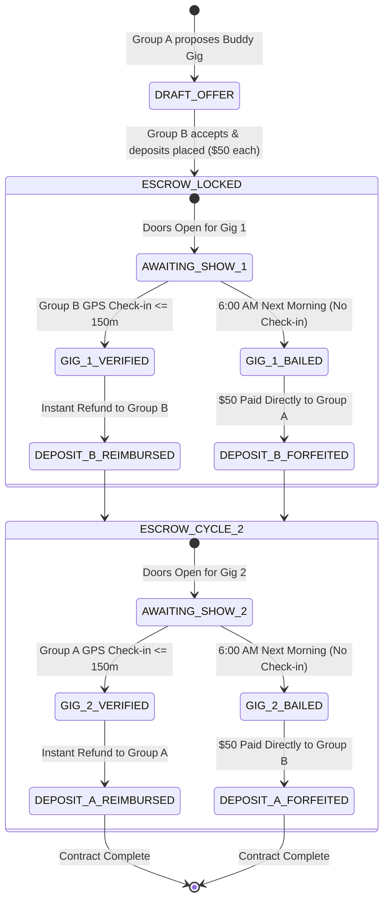

# Buddy Gig Geolocation & Escrow Engine
{: .no_toc }

A technical guide detailing the escrow state machine, Haversine distance calculations, anti-spoofing heuristics, and next-morning automated payout settlement for The Gig Bandit (`getemgigs.com`).
{: .fs-6 .fw-300 }

## Table of contents
{: .no_toc .text-delta }

1. TOC
{:toc}

---

## 1. Escrow State Machine

The security deposit escrow operates as a deterministic finite state machine (FSM) governing financial locks between two participating groups:



---

## 2. Geofencing Algorithm (Haversine Formula)

To ensure tamper-resistant check-ins without requiring hardware beacons, the mobile client issues a cryptographic geolocation payload to `/api/checkin`:

```javascript
export function verifyVenueCheckIn(attendeeLat, attendeeLon, venueLat, venueLon, maxDistanceMeters = 150) {
  const R = 6371e3; // Earth radius in meters
  const phi1 = (attendeeLat * Math.PI) / 180;
  const phi2 = (venueLat * Math.PI) / 180;
  const deltaPhi = ((venueLat - attendeeLat) * Math.PI) / 180;
  const deltaLambda = ((venueLon - attendeeLon) * Math.PI) / 180;

  const a =
    Math.sin(deltaPhi / 2) ** 2 +
    Math.cos(phi1) * Math.cos(phi2) * (Math.sin(deltaLambda / 2) ** 2);
  const c = 2 * Math.atan2(Math.sqrt(a), Math.sqrt(1 - a));
  const distance = Math.round(R * c);

  return {
    isVerified: distance <= maxDistanceMeters,
    distanceMeters: distance,
    maxRadiusMeters: maxDistanceMeters,
  };
}
```

### Radius Selection (150m)
A 150-meter radius covers typical urban and suburban music venues, including main rooms, merch tables, outdoor smoking patios, and adjacent green rooms, while strictly rejecting check-ins attempted from home or across town.

---

## 3. Anti-Spoofing & Fraud Heuristics

1. **Temporal Fencing**: Check-ins are only valid from 30 minutes before doors open until 60 minutes after scheduled set completion.
2. **Device Hardware Entropy**: GPS fixes must include accuracy thresholds (`coords.accuracy <= 50m`). Mock locations or browser developer overrides are flagged via WebGL and User-Agent telemetry.
3. **Escrow Forfeiture Automation**: A scheduled cron worker (`/api/escrow` triggered at 06:00 local time) evaluates all pending check-ins from the previous evening. Any missing check-ins forfeit the deposit immediately to the host act's balance.
