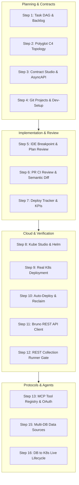

# Project Roadmap & Vision
{: .no_toc }

RobOS is the developer-first operating system and desktop ecosystem engineered for AI Agent Review-Based Software Development. Here is our product evolution, current architecture milestones, and upcoming development roadmap.
{: .fs-6 .fw-300 }

## Table of contents
{: .no_toc .text-delta }

1. TOC
{:toc}

---

## Current Architecture Milestones (Verified in Production)

RobOS development is strictly driven by **End-to-End Driven Development (EDD)**. Every completed milestone is backed by automated headless test suites (`packages/robos-test`), DOM snapshots, and 1080p narrated video proof-of-work.

| Domain | Milestone | Capabilities & Verified Artifacts | Status |
|:---|:---|:---|:---:|
| **Knowledge Graph** | Dual-State SDLC World Graph | OASIS OSLC Core 3.0 / W3C JSON-LD / SHACL engine. Semantic graph diffing between `main` and feature branches with blast-radius detection. | **Complete** |
| **System Topology** | C4 Polyglot Architecture & Backstage | Interactive C4 Level 1-3 modeling, Backstage catalog sync, and automated Kubernetes & Helm manifest synthesis. | **Complete** |
| **API Contracts** | Contract Studio & Mock Servers | OpenAPI 3.1, TypeSpec, and AsyncAPI validation with live Spectral linting and Prism mock servers. | **Complete** |
| **IDE Integration** | IntelliJ IDEA IPC Bridge | Local IPC bridge (`port 63343`), workspace auto-provisioning, and breakpoint reproduction before AI plan review. | **Complete** |
| **Developer Tools** | Protocol & Database Suite | DBeaver-inspired Relational DB Manager (Postgres, MySQL, Oracle), MongoDB/Redis NoSQL Manager, gRPC Client, GraphQL Client, and Bruno-powered REST Client. | **Complete** |
| **Cloud & GitOps** | Kube Studio & Cloud Navigator | Multi-cluster Kubernetes management (Kind, EKS, GKE, AKS), Helm release matrices, ArgoCD GitOps sync, and live pod log streaming. | **Complete** |
| **Agent Isolation** | Ephemeral Linux Profiles & Display Bridging | Zero-residue `tmpfs` user profiles (`/home/agent-...`) with direct X11/Wayland display rendering and Piper neural TTS voiceovers. | **Complete** |
| **Agent Protocols** | Model Context Protocol (MCP) Router | Multi-agent tool provider routing and OAuth authentication popups across Claude Code, Google Antigravity, Copilot CLI, and Gemini. | **Complete** |

---

## 16-Step Reference Lifecycle (Acme Petshop E2E)

The complete end-to-end SDLC lifecycle has been implemented and validated across 16 sequential automated walkthroughs:

---

## Upcoming Roadmap

### 1. Autonomous Multi-Agent Team Swarms
- **Role Specialization**: Hierarchical swarms (Lead Architect, Microservice Specialist, QA/Verifier, Security Auditor, DevOps Engineer).
- **Delegation DAGs**: Dynamic runtime task delegation with budget enforcement and progress telemetry.
- **Human Escalation Gates**: Interactive prompt checkpoints (`/grill-me`) when agents hit architectural forks or breaking schema thresholds.

### 2. Local Neural Voice & Multimodal Command
- **Local Speech-to-Text (STT)**: Offline Whisper/Vosk push-to-talk integration across all RobOS textareas.
- **Multimodal Screen Context**: Instant screenshot injection from active Electron windows into AI agent reasoning contexts.

### 3. Distributed GitOps & Cloud Sync
- **Remote Cluster Sync**: Headless synchronization with remote ArgoCD instances and enterprise Kubernetes clusters.
- **Cloud Knowledge Graph Federation**: Federated multi-team JSON-LD knowledge graphs across distributed organizations.

---

## Contributing & Development Philosophy

RobOS is built entirely on open-source standards with zero proprietary lock-in:
- **No Framework Overhead**: Pure vanilla JavaScript and Electron for desktop applications.
- **Open Standards**: OASIS OSLC, W3C JSON-LD, OpenAPI 3.1, TypeSpec, Backstage, UseBruno, and Model Context Protocol.
- **Proof-of-Work Verification**: Every pull request must be validated with containerized E2E test suites and video recordings.
