# RobOS Project Plan & Engineering Roadmap
{: .no_toc }

The phased engineering architecture, dependency waves, and delivery roadmap for RobOS — the AI-First Software Development Operating System.
{: .fs-6 .fw-300 }

## Table of contents
{: .no_toc .text-delta }

1. TOC
{:toc}

---

## The End-to-End Driven Development (EDD) Standard

In RobOS, every architectural phase is validated through containerized headless E2E test fabrics before milestone signoff:
- **Isolated Headless Compositor**: Automated testing on headless `Xvfb` with `Picom/Mutter` compositors.
- **Fast Deterministic Feedback**: Direct DOM tree hierarchy and snapshot inspection via `packages/robos-lib/snapshot-cli.js`.
- **Proof-of-Work Verification**: Every completed capability generates timestamped DOM snapshots, contract verification reports, and 1080p narrated video walkthroughs with neural Piper TTS voiceovers.

---

## 6-Phase Dependency Roadmap

```mermaid
graph TD
    subgraph Phase0 [Phase 0: Bootstrapped Foundation & Setup]
        DF[Desktop Foundation]
        AF[App Framework & Shared Libraries]
        DT[Software Center & Dev Tools]
        SA[Security Setup & GPG Secrets]
        SU[Unified Onboarding Wizard]
    end

    subgraph Phase1 [Phase 1: Agent Identity, Isolation & System Services]
        SS[System Services & Notification Engine]
        EP[Ephemeral Agent User Profiles & tmpfs]
        DA[Desktop Agent Sessions & Tunneling]
        MCP[First-Class Model Context Protocol Servers]
    end

    subgraph Phase2 [Phase 2: World State Modeling & GitOps Schema]
        KG[Dual-State SDLC Knowledge Graph]
        SLOS[8-Pillar Declarative SDLC Engine]
        PG[Contract-Driven Project Graph]
        EK[Engineering Knowledge Graph]
    end

    subgraph Phase3 [Phase 3: Work Items, Multi-Repo Workspaces & Review Hub]
        TM[Task & Issue Management DAGs]
        WM[Multi-Repo Workspace Orchestrator]
        EE[Event Engine & Agent Scheduler]
        DC[Dev Central — AI Agent Review Hub]
    end

    subgraph Phase4 [Phase 4: Autonomous E2E-Driven Dev & Verification]
        EDD[App Test Framework & Test Fabric]
        REV[Interactive Reviewer & Video Proof]
        AI[AI Agent Integration & Questionnaire]
        CR[PR Review Board & CI Monitor]
    end

    subgraph Phase5 [Phase 5: Extended Experience & Distribution]
        WJ[Work Journal & Activity Feed]
        VI[Voice Dictation & Local STT]
        MR[Management Dashboards & DORA KPIs]
        RP[Release Packaging & VM Distribution]
    end

    Phase0 --> Phase1
    Phase1 --> Phase2
    Phase2 --> Phase3
    Phase3 --> Phase4
    Phase4 --> Phase5
```

---

## Phase Breakdown & Architecture Milestones

### Phase 0: Bootstrapped Foundation & Setup
*Virtual machine environment, dark desktop shell, app scaffolding, and initial onboarding.*

| Subsystem | Core Capabilities |
|:---|:---|
| **Desktop Foundation** | QEMU/KVM VM build system, cloud-init automated provisioning, GNOME dark navy/cyan theme, Tilix terminal, LightDM auto-login. |
| **App Framework** | App launcher, `robos-lib` desktop parsers, `robos-icons` central SVG registry, snapshot debug server (ports 19100–19182). |
| **Software Center** | One-click installation and management for JetBrains IDEs, VS Code, CLI utilities, and language runtimes. |
| **Security & Auth** | GPG-encrypted password vault (`pass-manager`), SSH key initialization, and Git credential safety net. |
| **Unified Setup Wizard** | First-boot onboarding wizard (`packages/robos-onboarding`), missing credential checks, and automated project provisioner. |

---

### Phase 1: Agent Identity, Isolation & System Services
*Multi-user Linux session isolation, direct host display bridging, and MCP tool servers.*

| Subsystem | Core Capabilities |
|:---|:---|
| **System Services** | Desktop Manager IPC hub, toast notification daemon, notification history center, and background workers. |
| **Ephemeral Agent Profiles** | Dynamic ephemeral Linux user accounts (`/home/agent-...`), `tmpfs` RAM-backed home filesystems with zero residue, and direct host X11 display rendering. |
| **Desktop Agents** | Multi-agent session management, socket tunneling, terminal multiplexing, and proof-of-work capture. |
| **MCP Tool Servers** | High-performance Model Context Protocol routing across Claude Code, Google Antigravity, Copilot CLI, and Gemini with OAuth authentication popups. |

---

### Phase 2: World State Modeling & GitOps Schema
*Standardized OSLC/JSON-LD knowledge graph, dual-state world branching (Prod vs Future), and declarative `.robos/` storage.*

| Subsystem | Core Capabilities |
|:---|:---|
| **Dual-State Knowledge Graph** | OASIS OSLC Core 3.0 & W3C JSON-LD + SHACL knowledge graph engine. Multi-branch world states (`main` = Prod, `feature/*` = Future) with semantic graph diffing and blast radius calculation. |
| **8-Pillar SDLC Engine** | Declarative GitOps schema covering System Topology, HR/Agents, Entity Schemas (TypeSpec/Buf), API Contracts (OpenAPI/Pact), Packages, Projects, Tasks, and `.robos/` Git storage. |
| **Contract-Driven Project Graph** | Interactive C4 architecture modeling (Level 1 Context to Level 3 Components), Backstage software catalog sync, and automated Kubernetes/Helm manifest synthesis. |
| **Developer Protocol Suite** | Relational DB Manager (Postgres, MySQL, Oracle), NoSQL DB Manager (MongoDB, Redis), gRPC Client, GraphQL Client, and Bruno REST Client. |

---

### Phase 3: Work Items, Multi-Repo Workspaces & Review Hub
*DAG task dependency graphs, Git worktree workspace isolation, and Dev Central review hub.*

| Subsystem | Core Capabilities |
|:---|:---|
| **Task & Issue Management** | Natural language task breakdown into directed acyclic graphs (DAG), bi-directional Gitea/Jira synchronization, and automated status transitions. |
| **Workspace Orchestrator** | Multi-repository Git worktree workspace isolation sharing underlying object storage, automated dev server startup, and IntelliJ IDEA IPC bridge (port 63343). |
| **Event Engine** | System-wide event bus, rule engine, action registry, and background AI agent cron scheduler. |
| **Dev Central Review Hub** | Central daily developer command center, sprint board, PR health radar, calendar, and AI standup. |

---

### Phase 4: Autonomous E2E-Driven Dev & Verification
*Self-contained local test fabrics, autonomous Red-Green-Refactor agent loops, and narrated video walkthrough verifications.*

| Subsystem | Core Capabilities |
|:---|:---|
| **App Test Framework** | Scenario-based Electron application testing with headless virtual framebuffers (`Xvfb + Picom`). |
| **Interactive Reviewer & Video Studio** | Multi-modal video generation, timestamped DOM state assertions, and synchronized neural voiceovers via offline Piper TTS. |
| **AI Agent Integration** | Context Manager token curation, AI planning interviews (`/grill-me`), breakpoint reproduction, and draft PR generation. |
| **PR Review Board & CI Monitor** | AI-assisted code review, semantic file diffs, risk assessment, automated CI failure root-cause diagnosis, and 1-click merge approvals. |

---

### Phase 5: Extended Experience & Distribution
*Activity journaling, voice dictation, management telemetry, and distribution packaging.*

| Subsystem | Core Capabilities |
|:---|:---|
| **Work Journal** | Git-backed developer activity journal with AI daily summaries and time tracking. |
| **Voice & Multimodal Input** | Local offline speech-to-text (Whisper/Vosk) in `<robos-ai-textarea>` widgets with push-to-talk. |
| **Management & DORA KPIs** | Deploy Tracker with progressive canary rollouts, deployment frequency, MTTR, and change failure rate KPIs. |
| **Release Packaging & Distribution** | Automated full VM build (`infra/desktop/build.sh`), QEMU/KVM images, and flashable installer USB builds. |

---

## 16-Step Reference Lifecycle (Acme Petshop E2E)

Every phase is validated against the complete multi-tier Acme Petshop microservice reference application:

1. **Step 1: Tasks DAG** — Natural language backlog planning & Gitea sync.
2. **Step 2: Topology C4** — Polyglot architecture modeling & Backstage catalog.
3. **Step 3: Contracts** — Contract Studio, TypeSpec & AsyncAPI governance.
4. **Step 4: Git Projects** — Multi-repo sync & AI `dev-setup.sh` runner.
5. **Step 5: AI Implementation** — Autonomous code implementation, tests, and optional breakpoint debugging.
6. **Step 6: PR Review & IDE Hub** — Agent Code Review Platform with optional IntelliJ / VS Code PR review.
7. **Step 7: Deploy Tracker** — Staging/Prod pipeline filtering & DORA KPIs.
8. **Step 8: Kube Studio** — Multi-cluster Kubernetes & Helm release catalog.
9. **Step 9: Real K8s** — Live Kind cluster deployment & container logs.
10. **Step 10: Auto-Deploy** — Continuous deployment upon PR merge & ephemeral reclamation.
11. **Step 11: Bruno REST Client** — Git-backed `.bru` collections & OpenAPI synthesis.
12. **Step 12: Runner Gate** — Automated REST test suite execution & PR quality gates.
13. **Step 13: MCP OAuth** — Model Context Protocol tool registry & OAuth popups.
14. **Step 15: Data Sources** — Knowledge Graph multi-database explorer (SQL, NoSQL, S3, Kafka).
15. **Step 16: DB to K8s Lifecycle** — Analytics Postgres addition, auto-synthesizing K8s manifests, SQL data seeding, and live API verification.
