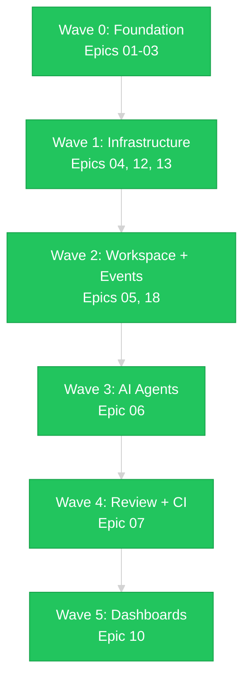

# Project Roadmap
{: .no_toc }

21 epics organized by dependency wave. The MVP delivers the Model Problem end-to-end.
{: .fs-6 .fw-300 }

## Table of contents
{: .no_toc .text-delta }

1. TOC
{:toc}

---

## MVP — Model Problem End-to-End

The MVP goal: a developer picks up a story and drives it from backlog to deployed, with every status transition, notification, and dashboard update happening automatically. Validated against the **buildbarn-forms** project — a React component library for editing [Buildbarn](https://github.com/buildbarn) remote execution configurations.

### Wave 0: Foundation (Complete)

| # | Epic | Stories | Status |
|:--|:-----|:--------|:-------|
| 01 | Desktop Foundation | 8 | **Complete** |
| 02 | App Framework | 7 | **Complete** |
| 03 | Dev Tools | 5 | **Complete** |

VM build system, cloud-init provisioning, GNOME theme, Electron runtime, app launcher, shared libraries, icon registry, Claude Code slash commands, and deploy pipeline.

### Wave 1: Core Infrastructure (Complete)

| # | Epic | Stories | Status |
|:--|:-----|:--------|:-------|
| 13 | Security & Auth | 4 | **Complete** |
| 04 | Task Management | 8 | **Complete** |
| 12 | System Services | 7 | **Complete** |

Security Setup (GPG/SSH keys), Pass Manager, Task Servers (Jira/GitHub), Workflow Studio, Task Board, Desktop Manager, Toast Daemon, Notifications, CLI tools.

### Wave 2: Workspace & Events (Complete)

| # | Epic | Stories | Status |
|:--|:-----|:--------|:-------|
| 05 | Workspace Management | 6 | **Complete** |
| 18 | Event Engine | 6 | **Complete** |

Workspace auto-provisioning, Event Bus, Rule Engine, Action Registry, Agent Scheduler.

### Wave 3: AI Agents (Complete)

| # | Epic | Stories | Status |
|:--|:-----|:--------|:-------|
| 06 | AI Agent Integration | 8 | **Complete** |

Agent session manager, Claude Code integration, Context Manager, AI Questionnaire, Draft, Quiz, and Review-Fix stages.

### Wave 4: Code Review & CI (Complete)

| # | Epic | Stories | Status |
|:--|:-----|:--------|:-------|
| 07 | Code Review & CI/CD | 6 | **Complete** |

PR Review Board (AI summary, breakpoint review), CI Monitor, Stage Demo Viewer.

### Wave 5: Dashboards & Reporting (Complete)

| # | Epic | Stories | Status |
|:--|:-----|:--------|:-------|
| 10 | Management & Reporting | 4 | **Complete** |

Dev Central, Manager Dashboard, Report Builder, Deploy Tracker.

---

## Infrastructure Epics (Complete)

| # | Epic | Stories | Status |
|:--|:-----|:--------|:-------|
| 15 | MCP Servers | 11 | **Complete** |
| 16 | Test Framework | 8 | **Complete** |
| 17 | Work Journal | 9 | **Complete** |
| 20 | Deep Test Coverage | 8 | **In Progress** |

---

## Post-MVP Epics

| # | Epic | Stories | Status | Description |
|:--|:-----|:--------|:-------|:------------|
| 08 | EKGraph | 6 | Not started | Enterprise knowledge graph with AI indexing |
| 09 | Voice Input | 4 | Not started | Local STT engine, push-to-talk |
| 11 | Release Packaging | 5 | Not started | Automated VM build, OVA export, update mechanism |
| 14 | Developer Experience | 5 | Not started | Shared UI components, IntelliJ plugin |
| 19 | OAuth Providers | — | Not started | OAuth provider support |
| 21 | GitHub Pages Docs | 6 | **In Progress** | This documentation site |
| 22 | Desktop Customizer | 10 | Not started | Prompt-driven desktop customization with on-the-fly app builder |

---

## Dependency Graph

All MVP waves are **complete**. Post-MVP epics (EKGraph, Voice, Release Packaging) add depth but are not required for the core workflow.
