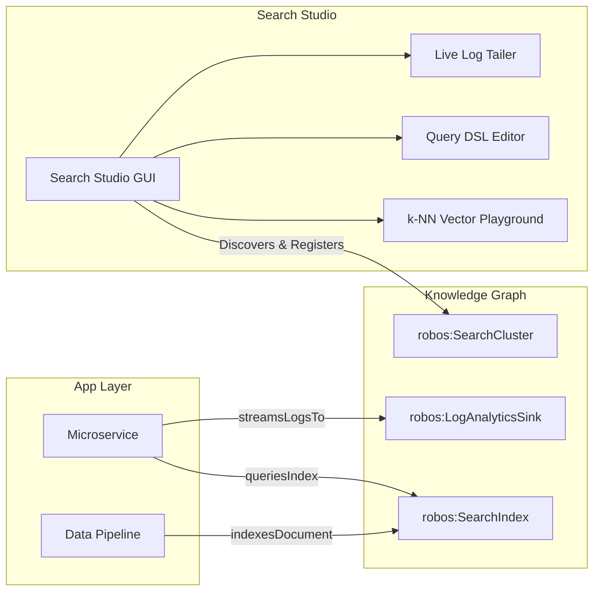
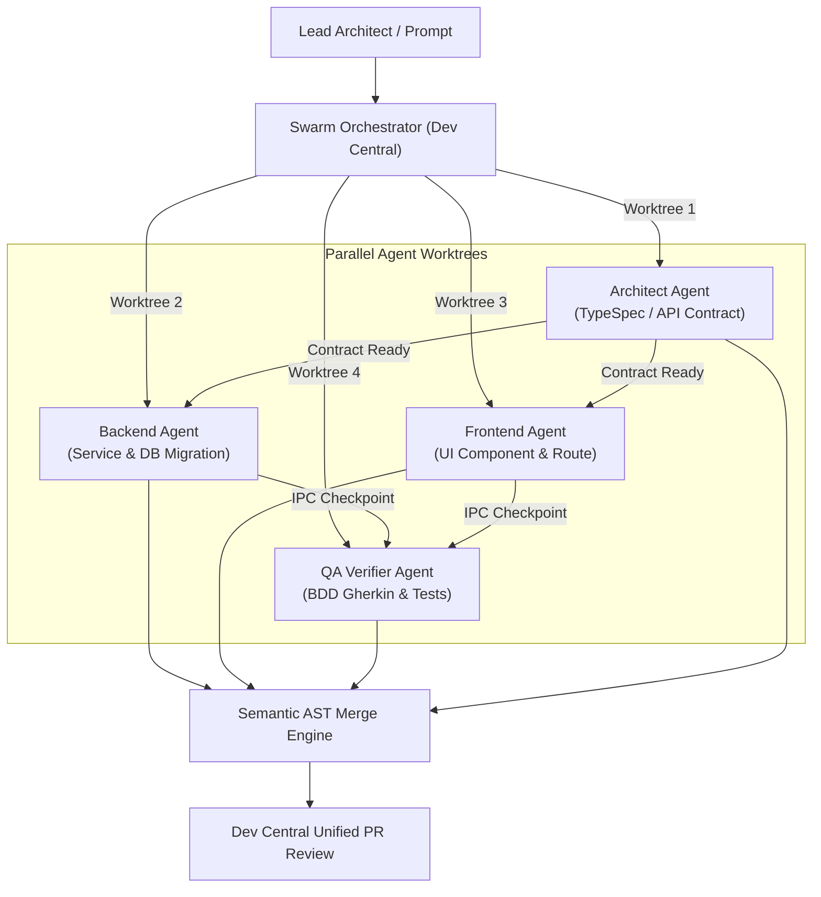
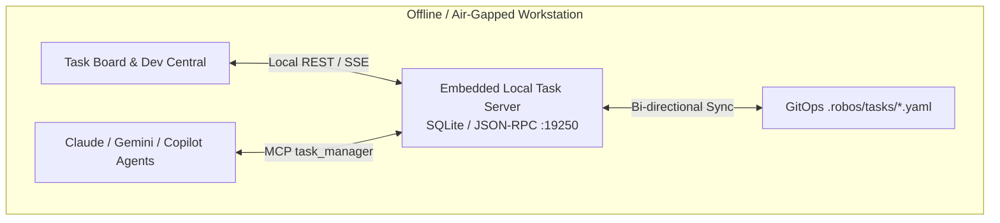
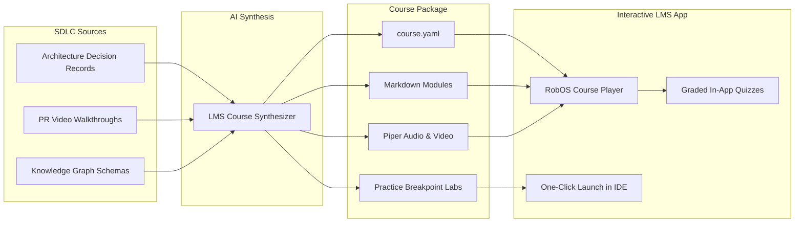

# RobOS Product Roadmap: Future Vision & Unimplemented Ideas
{: .no_toc }

A curated, strategic catalog of our favorite transformative concepts, pending specifications, and ambitious capabilities planned for the RobOS ecosystem.
{: .fs-6 .fw-300 }

<div style="margin: 1.5rem 0 2rem; padding: 1.25rem; background: #161b22; border: 1px solid #30363d; border-radius: 8px; display: flex; flex-wrap: wrap; align-items: center; justify-content: space-between; gap: 1rem;">
  <div>
    <h3 style="margin: 0 0 0.5rem; color: #58a6ff; font-size: 1.15rem;">Have an Idea to Add to the Roadmap?</h3>
    <p style="margin: 0; color: #8b949e; font-size: 0.92rem;">Explore raw brainstorms in the Ideas Inbox, inspect formal feature specs, or submit your own proposals directly in the Git repository.</p>
  </div>
  <a href="https://github.com/nddipiazza/robos/tree/main/docs/ideas" class="btn btn-primary" target="_blank" rel="noopener">Browse Ideas Store on GitHub ↗</a>
</div>

## Table of contents
{: .no_toc .text-delta }

1. TOC
{:toc}

---

## The Next Frontier: From Foundation to Autonomous Mastery

RobOS has successfully established its baseline developer workstation environment:
- **30+ Native Electron Applications** spanning the entire SDLC (Dev Central, App Wizard, Task Planner, Schema Studio, Kube Studio, Protocol Clients, and Pass Manager).
- **Dual-State SDLC Knowledge Graph Engine** powered by OASIS OSLC Core 3.0 and W3C JSON-LD + SHACL validation.
- **Containerized Headless E2E Verification Fabric** using virtual framebuffers (`Xvfb + Picom`), DOM snapshot inspection, and neural Piper TTS video proofs.
- **Bi-Directional IDE Review Bridges** integrating JetBrains IntelliJ IDEA (IPC port 63343) and VS Code for native pull request reviews.

With the operational foundation proven, the previous historical phase milestones have been retired. The RobOS engineering roadmap is now driven by **our favorite high-impact, unimplemented ideas** — groundbreaking initiatives designed to make RobOS the ultimate autonomous, air-gapped, and collaborative AI-first SDLC platform and agent governance ecosystem.

---

## Roadmap Priority Matrix

The table below summarizes our top unimplemented ideas, categorized across 5 strategic architectural pillars:

| Strategic Pillar | Feature Initiative | Target Subsystems | Status | Impact / Complexity |
|:---|:---|:---|:---:|:---:|
| **1. Cloud & Data Systems** | [Search Studio & Vector Analytics](#1-search-studio--vector-analytics) | `packages/search-studio`, KGraph, `data-sources` | [Spec Ready](https://github.com/nddipiazza/robos/blob/main/docs/ideas/specs/search-engine-and-log-analytics-studio.md) | High / Medium |
| **1. Cloud & Data Systems** | [OpenTofu & Terraform Cloud IaC Studio](#2-opentofu--terraform-cloud-iac-studio) | `packages/iac-studio`, `devops`, `.robos/terraform/` | [Spec Ready](https://github.com/nddipiazza/robos/blob/main/docs/ideas/specs/terraform-opentofu-iac-synthesis.md) | Very High / High |
| **1. Cloud & Data Systems** | [Unified Cloud File Storage & MCP Asset Sharing](#3-unified-cloud-file-storage--mcp-asset-sharing) | `packages/file-storage`, `robos-file-storage-mcp` | [Spec Ready](https://github.com/nddipiazza/robos/blob/main/docs/ideas/specs/robos-file-storage-and-agent-sharing.md) | High / Medium |
| **2. Multi-Agent Swarms** | [Agent Swarm Orchestrator & Semantic Merge](#4-autonomous-agent-swarm-orchestrator--semantic-merge) | `packages/desktop-agents`, `dev-central`, Worktrees | In Design | Very High / High |
| **2. Multi-Agent Swarms** | [First-Class Prompt & SDLC Run Lineage](#5-first-class-prompt--sdlc-run-lineage) | `packages/ai-prompt`, `robos-graph`, Tilix Shell | [Spec Ready](https://github.com/nddipiazza/robos/blob/main/docs/ideas/specs/prompt-knowledge-graph-logging.md) | High / Medium |
| **3. Hermetic Workflows** | [Local Air-Gapped Task Server](#6-local-air-gapped-task-server) | `packages/task-servers`, `task-board`, SQLite | [Spec Ready](https://github.com/nddipiazza/robos/blob/main/docs/ideas/specs/local-open-source-task-server.md) | High / Low |
| **3. Hermetic Workflows** | [Hermetic Local Gitea Git Forge](#7-hermetic-local-gitea-git-forge--gitops-mirror) | `packages/gitea-browser`, Test Harness, Docker | [Spec Ready](https://github.com/nddipiazza/robos/blob/main/docs/ideas/specs/e2e-gitea-support.md) | High / Medium |
| **4. Quality & Resilience** | [Deterministic Time-Travel Debugger](#8-deterministic-time-travel-debugger--memory-replay) | `packages/robos-reviewer`, `rr` Replay Engine | In Design | Very High / High |
| **4. Quality & Resilience** | [Chaos Engineering & Contract Resilience Simulator](#9-chaos-engineering--contract-resilience-simulator) | `packages/chaos-studio`, `dev-central`, Proxies | Proposed | High / Medium |
| **5. Education & Voice** | [SDLC Learning Management System (LMS)](#10-sdlc-learning-management-system-lms--practice-labs) | `packages/robos-lms`, `workspace-manager` | [Spec Ready](https://github.com/nddipiazza/robos/blob/main/docs/ideas/specs/robos-learning-management-system.md) | High / Medium |
| **5. Education & Voice** | [System Voice HUD & Natural Language Assistant](#11-system-voice-hud--natural-language-assistant) | Desktop Top Bar, Whisper.cpp, Piper TTS | Proposed | Medium / Medium |

---

## Pillar 1: Cloud Infrastructure & Advanced Data Systems

### 1. Search Studio & Vector Analytics

> **Status**: Spec Ready ([View Specification](https://github.com/nddipiazza/robos/blob/main/docs/ideas/specs/search-engine-and-log-analytics-studio.md))  
> **Target Subsystem**: `packages/search-studio`, `packages/robos-graph`, `packages/data-sources`, `.robos/` Git Store



#### The Gap
Modern enterprise backends rely heavily on inverted-index search engines (**OpenSearch**, **Elasticsearch**, **Apache Solr**) for business search and log ingestion, as well as dense vector databases (**OpenSearch k-NN**, **Qdrant**, **Milvus**, **pgvector**) for AI/RAG embeddings. While RobOS provides first-class managers for SQL and NoSQL databases, developers currently lack an integrated environment to tail async application logs, inspect index mappings, or test vector embeddings.

#### The Solution
**Search Studio (`packages/search-studio`)** delivers a native dark-mode desktop console tailored specifically for search engines, log aggregation, and vector stores:
- **Live Asynchronous Log Tailing**: Tail real-time structured logs streamed from microservices with regex filtering, severity toggles (`ERROR`, `WARN`), and correlation by distributed `traceId`.
- **Monaco Query DSL & Lucene Editor**: Author complex queries with JSON syntax highlighting, auto-formatting, instant execution, and sub-millisecond round-trip latency telemetry.
- **k-NN Vector Similarity Playground**: Test high-dimensional embeddings side-by-side with full-text queries, inspecting cosine similarity and Euclidean distance scores visually.
- **Knowledge Graph Registration**: Automatically discovers live indices and registers validated `robos:SearchCluster`, `robos:SearchIndex`, and `robos:LogAnalyticsSink` nodes in Modular KGraph Packages with zero manual boilerplate.

---

### 2. OpenTofu & Terraform Cloud IaC Studio

> **Status**: Spec Ready ([View Specification](https://github.com/nddipiazza/robos/blob/main/docs/ideas/specs/terraform-opentofu-iac-synthesis.md))  
> **Target Subsystem**: `packages/iac-studio` (or `packages/kube-studio`), `packages/devops`, `.robos/terraform/`

#### The Gap
Kubernetes clusters do not exist in isolation. Real-world systems require infrastructure *around* and *underneath* the cluster: Virtual Private Clouds (VPCs), subnets, managed RDS Aurora databases, S3 object storage buckets, IAM least-privilege roles, and KMS encryption keys. Today, developers must jump outside RobOS to write and execute Terraform scripts, fragmenting the single-source-of-truth model.

#### The Solution
Integrate **first-class Infrastructure as Code (IaC) synthesis and execution** using **OpenTofu** (MPL-2.0 open-source Terraform engine):
- **First-Class Cloud Ontologies**: Model cloud resources (`robos:VPC`, `robos:ManagedDatabase`, `robos:ObjectStorageBucket`, `robos:IAMRole`, `robos:KMSKey`) directly in the SDLC Knowledge Graph.
- **Automated Modular HCL Synthesis**: RobOS synthesizes clean, production-hardened OpenTofu/Terraform HCL manifests into `.robos/terraform/environments/<env>/`.
- **In-Memory Ephemeral Sandbox Execution**: AI agents run `tofu plan` and `tofu apply` inside isolated RAM sandboxes (`tmpfs`), avoiding host clutter and preventing state locking issues.
- **Visual Cloud Blast Radius in Dev Central**: Dev Central renders an interactive visual diff of proposed cloud infrastructure modifications (Resources to Add, Modify, or Destroy) before the human lead architect signs off on merge.
- **Zero Plaintext Secrets**: Cloud credentials and remote state backend access tokens are retrieved on-demand via the local UNIX password store (`pass`) with GPG encryption.

---

### 3. Unified Cloud File Storage & MCP Asset Sharing

> **Status**: Spec Ready ([View Specification](https://github.com/nddipiazza/robos/blob/main/docs/ideas/specs/robos-file-storage-and-agent-sharing.md))  
> **Target Subsystem**: `packages/file-storage`, `robos-file-storage-mcp`, `packages/people-directory`, `packages/group-manager`

#### The Gap
Engineering teams produce non-code artifacts constantly: benchmark datasets, architecture diagrams, compliance audits, video walkthroughs, and client deliverables. These assets end up scattered across AWS S3, Google Cloud Storage, Azure Blob, and Google Drive, requiring disjointed web consoles and manual link creation.

#### The Solution
A unified desktop application and AI agent MCP toolset for multi-cloud object storage:
- **Universal Cloud Storage Explorer**: Native dark-themed browser supporting AWS S3, Cloudflare R2, MinIO, Google Cloud Storage, Azure Blob, and Google Drive.
- **Agent-Driven File Sharing via MCP**: Allows AI agents to interact with storage naturally:
  > *"Upload the benchmark results to our team S3 bucket and grant read access to @sarah and the @qa-team."*
- **Directory-Aware Permissions**: Integrates with RobOS People & Groups to resolve user identities, generate signed temporary URLs, and post desktop toast notifications to recipients.

---

## Pillar 2: Autonomous Agent Swarms & Intelligence Lineage

### 4. Autonomous Agent Swarm Orchestrator & Semantic Merge

> **Status**: In Design  
> **Target Subsystem**: `packages/desktop-agents`, `packages/dev-central`, `packages/robos-agent-session`, Git Worktrees



#### The Gap
Most AI developer workflows treat agents as single serial workers. When a developer asks an agent to build a multi-tier feature, the agent must sequentially write OpenAPI contracts, write backend code, update database schemas, write frontend components, and author tests. This is slow and prone to context window exhaustion.

#### The Solution
The **Agent Swarm Orchestrator** coordinates multi-agent specialized swarms working in parallel:
- **Role-Specialized Personas**: Automatically provisions dedicated ephemeral agent profiles:
  - *Architect Agent*: Synthesizes TypeSpec models, OpenAPI 3.1 contracts, and SHACL shapes.
  - *Backend Agent*: Implements endpoints, service logic, and database migrations.
  - *Frontend Agent*: Builds UI views and state management.
  - *Security Agent*: Runs static analysis, OWASP vulnerability scanning, and secret leak checks.
  - *QA Agent*: Implements Gherkin BDD features and runs headless containerized tests.
- **Isolated Git Worktrees**: Each agent operates in its own isolated worktree (`/tmp/worktrees/agent-<id>`) sharing underlying Git object storage.
- **Inter-Agent Communication Bus**: Agents publish milestones over the local RobOS IPC bus (`robos-agent-bus`). For example, when the Architect Agent commits the OpenAPI contract, the Backend and Frontend agents immediately resume code generation against that verified contract.
- **Semantic AST-Aware Merge**: Dev Central automatically combines branch worktrees using abstract syntax tree (AST) merge algorithms, resolving conflicts semantically rather than relying on blunt line-based git merges.

---

### 5. First-Class Prompt & SDLC Run Lineage

> **Status**: Spec Ready ([View Specification](https://github.com/nddipiazza/robos/blob/main/docs/ideas/specs/prompt-knowledge-graph-logging.md))  
> **Target Subsystem**: `packages/ai-prompt`, `packages/robos-graph`, `packages/dev-central`, Tilix Hooks, `.robos/prompts/`

#### The Gap
The prompt is the atomic driving action of AI-first software engineering. Yet in existing workflows, prompts vanish into terminal scrollbacks or proprietary SaaS dashboards. Code reviewers cannot determine whether a PR was crafted by human-guided prompts, a scheduled background cron job, or an unmonitored CLI session. Furthermore, token expenditures and model latencies cannot be audited systematically.

#### The Solution
Introduce `robos:Prompt` and `robos:PromptExecution` as first-class linked-data entities in the SDLC Knowledge Graph:
- **Universal Multi-Surface Interception**: Intercepts and records prompts executed from:
  - `<robos-ai-textarea>` interactive UI controls (`OriginRobOSUserInteractive`)
  - Autonomous background scheduler jobs and PR monitors (`OriginRobOSAutonomous`)
  - Standalone terminal sessions in Tilix (`claude`, `gemini`, `gh copilot`) via lightweight shell wrappers (`OriginExternalTerminal`)
- **End-to-End Lineage**: Connects code diffs, Git commits, implementation plans, and test executions directly back to their originating prompts in the Knowledge Graph.
- **DSPy & Prompt Optimizer Tracking**: Measures prompt token counts, latency, and success rates, preserving iterations generated by automated prompt optimization engines (DSPy, Caveman).
- **GitOps Persistence**: Stores prompt histories declaratively under `.robos/prompts/` with full Git audit trails.

---

## Pillar 3: Hermetic & Air-Gapped Developer Workflows

### 6. Local Air-Gapped Task Server

> **Status**: Spec Ready ([View Specification](https://github.com/nddipiazza/robos/blob/main/docs/ideas/specs/local-open-source-task-server.md))  
> **Target Subsystem**: `packages/task-servers`, `packages/task-board`, `packages/robos-task-client`, Embedded SQLite



#### The Gap
Developers working offline, on airplanes, in secure air-gapped environments, or on personal side projects are currently forced to depend on external SaaS task managers (Jira, GitHub Issues, Linear). If internet connectivity drops, task tracking and agent planning grind to a halt.

#### The Solution
An **Embedded Open-Source Task Server** running locally inside RobOS:
- **Zero Configuration**: Single-process SQLite-backed daemon running locally on `localhost:19250` with instant start and less than 30 MB memory consumption.
- **Full Agile Parity**: Manages projects, epics, user stories, tasks, subtasks, Kanban boards, story points, and sprint milestones.
- **MCP Agent Tooling**: Exposes `task_create`, `task_query`, and `task_transition` tools to AI agents via `task-manager-mcp` for hermetic autonomous planning.
- **GitOps Mirroring**: Syncs tasks to declarative YAML files under `.robos/tasks/` so work items can be committed directly into Git alongside application source code.

---

### 7. Hermetic Local Gitea Git Forge & GitOps Mirror

> **Status**: Spec Ready ([View Specification](https://github.com/nddipiazza/robos/blob/main/docs/ideas/specs/e2e-gitea-support.md))  
> **Target Subsystem**: `packages/gitea-browser`, `packages/robos-test`, Container Test Harness

#### The Gap
Testing git pull request review flows, CI/CD webhook triggers, and automated branch protection rules in automated test suites currently requires mocked network requests or fragile fake git directories. Developers cannot easily test full remote forge interactions hermetically.

#### The Solution
A **Hermetic Gitea Git Forge** spun up instantly in an isolated local container:
- **On-Demand Local Forge**: Launches a lightweight, pre-configured Gitea instance inside the RobOS test container or local Docker daemon in under 3 seconds.
- **Real Webhooks & PR Workflows**: Test genuine pull request creations, branch protections, inline comment threads, and CI status checks completely offline.
- **GitOps Mirroring**: Mirror external GitHub/GitLab repositories locally for offline development, allowing agents to push branches, open PRs, and merge code with zero external network connectivity.

---

## Pillar 4: Observability, Quality & Resilience

### 8. Deterministic Time-Travel Debugger & Memory Replay

> **Status**: In Design  
> **Target Subsystem**: `packages/robos-reviewer`, `packages/dev-central`, `rr` Replay Engine, Breakpoint Debugger

#### The Gap
Intermittent concurrency race conditions, subtle memory corruptions, and UI state synchronization glitches are notoriously difficult for AI agents to diagnose from static stack traces or log files. Agents often guess at solutions because they cannot observe the system's exact state right before the failure occurred.

#### The Solution
Integrate **deterministic record-and-replay execution** (leveraging `rr` on Linux and Chromium DevTools CDP recording):
- **Deterministic Recording**: Capture entire test runs and reproduction scripts down to individual CPU instructions and memory writes.
- **Bidirectional Stepping**: Agents and developers can step backwards and forwards in time through code execution (`step-back`, `reverse-continue`).
- **Correlated Memory & DOM Snapshots**: Scrub through a visual timeline in Dev Central linking the exact DOM state of an Electron app with the backend process's heap state and variable values.
- **Agent Root-Cause Pinpointing**: Autonomous agents inspect memory states at the precise microsecond an invariant failed, producing provably correct bug fixes without trial-and-error guessing.

---

### 9. Chaos Engineering & Contract Resilience Simulator

> **Status**: Proposed  
> **Target Subsystem**: `packages/chaos-studio` (new), `packages/dev-central`, Envoy/Toxiproxy sidecars

#### The Gap
Microservices frequently fail in production due to degraded network conditions, slow database queries, intermittent socket timeouts, and third-party API outages. While contract testing verifies happy paths, resilience against partial system failure is rarely tested before deployment.

#### The Solution
**Chaos Studio (`packages/chaos-studio`)** brings accessible chaos engineering and fault injection directly to local development environments:
- **Interactive Fault Injection**: Inject configurable network latency (e.g. `+250ms`), packet drops (e.g. `5%`), connection resets, and HTTP 503 errors into local services via lightweight Toxiproxy or Envoy sidecars.
- **Broker & Database Partitioning**: Simulate Kafka message broker disconnects or Redis cluster failovers with a single toggle in Dev Central.
- **Autonomous Agent Resilience Auditing**: Autonomous agents trigger chaos experiments while running test suites, asserting that circuit breakers trip correctly, fallback caches respond gracefully, and consumer contract SLAs remain unviolated.

---

## Pillar 5: Knowledge Transfer & Multimodal Interaction

### 10. SDLC Learning Management System (LMS) & Practice Labs

> **Status**: Spec Ready ([View Specification](https://github.com/nddipiazza/robos/blob/main/docs/ideas/specs/robos-learning-management-system.md))  
> **Target Subsystem**: `packages/robos-lms`, `packages/context-manager`, `packages/workspace-manager`, `.robos/courses/`



#### The Gap
Engineering knowledge is constantly produced during the SDLC (Architecture Decision Records, PR video walkthroughs, system diagrams, post-mortems), but it quickly becomes stale and buried in documentation wikis. Onboarding a new developer onto a complex codebase remains a high-friction, multi-week ordeal.

#### The Solution
**RobOS LMS & SDLC Course Player (`packages/robos-lms`)** turns engineering knowledge into interactive, verifiable training courses:
- **Declarative Course Packages**: Stored in Git under `.robos/courses/<slug>/` with structured lessons, multimedia walkthroughs, and inline knowledge checks.
- **Interactive Course Player**: Clean desktop interface with synchronized WebVTT transcript highlighting, variable playback speeds (0.75x–2x), and code snippet copy-paste.
- **Hands-On Practice Breakpoint Labs**: Learners click *"Launch Practice Lab"* to spin up an isolated Git branch with a pre-configured reproduction test and seeded breakpoint in IntelliJ IDEA or VS Code. The learner solves the problem, steps through the code, and verifies their understanding interactively.
- **Automated Course Synthesis**: AI agents synthesize complete onboarding courses directly from committed ADRs, OpenAPI specs, and Knowledge Graph packages whenever major system features are delivered.

---

### 11. System Voice HUD & Natural Language Assistant

> **Status**: Proposed  
> **Target Subsystem**: GNOME Desktop Top Bar, Tilix Terminal Integration, Local Whisper.cpp, Piper TTS

#### The Gap
Switching between keyboard, mouse, and terminal windows to monitor agent progress or issue instructions introduces unnecessary context switching. Developers often want to delegate tasks or receive status updates without leaving their current IDE window.

#### The Solution
A 100% private, offline, system-wide **Voice HUD**:
- **Local Speech-to-Text**: Low-latency voice transcription powered by embedded **Whisper.cpp** using local CPU/GPU acceleration (zero audio data leaves the developer's workstation).
- **Push-to-Talk Desktop Shortcut**: Press `Super + Space` from any application to speak:
  > *"RobOS, kick off the reproduction test for issue #88 and notify me if the breakpoint triggers."*
- **Audio Telemetry HUD**: Discrete neural voice feedback via **Piper TTS** notifying the developer when an agent completes a task, an E2E test fails, or a PR is ready for architectural review.

---

## How to Propose & Build Roadmap Features

Every feature in RobOS progresses through an open, transparent 4-stage lifecycle:

<div style="margin: 2rem 0; border: 1px solid #1e293b; border-radius: 12px; overflow: hidden; background: #0b101b; box-shadow: 0 10px 40px rgba(0,0,0,0.6);">
  
  <div style="padding: 0.75rem 1.25rem; font-size: 0.85rem; color: #94a3b8; border-top: 1px solid #1e293b; background: #0d1424; text-align: center;">
    <strong>RobOS Ideas & Specs Pipeline</strong>: 4-stage automated progression from raw notes in inbox to structured specs, approved project epics, and verified software implementations. <em>(Click image to zoom full screen)</em>
  </div>
</div>

1. **Step 1: Raw Idea Drop ([`docs/ideas/inbox/`](https://github.com/nddipiazza/robos/tree/main/docs/ideas/inbox))**:
   Create a simple `.txt` file with raw thoughts, audio transcripts, or customer feature requests:
   ```bash
   echo "Add Redis cluster failover simulation to Chaos Studio" > docs/ideas/inbox/redis-chaos.txt
   ```
2. **Step 2: Formal Specification ([`docs/ideas/specs/`](https://github.com/nddipiazza/robos/tree/main/docs/ideas/specs))**:
   AI agents use the `create-feature-spec` skill to transform raw notes into structured specifications with SHACL ontology models, user stories, and architecture diagrams.
3. **Step 3: Implementation & Verification**:
   Agents execute inside isolated containerized sandboxes, writing code, generating consumer contract tests, and producing 1080p narrated video proofs.
4. **Step 4: Architectural Review**:
   Human lead architects review the semantic diffs, inspect test proofs, and merge changes via Dev Central or their preferred IDE.

---

## Next Steps

- **[The Future of Software Development]({{ site.baseurl }})**: Explore our long-term vision for standardized Turing skills, machine-code leaf skills, and local edge assembly without data centers.
- **[RobOS Main Wins]({{ site.baseurl }})**: Discover core architectural innovations and strategic advantages.
- **[Real-World E2E Walkthroughs]({{ site.baseurl }})**: Watch all 20 reference lifecycle steps executed live.
- **[💡 Explore the Ideas Store on GitHub](https://github.com/nddipiazza/robos/tree/main/docs/ideas)**: View raw idea dumps, community feature proposals, and structured architecture specs.

